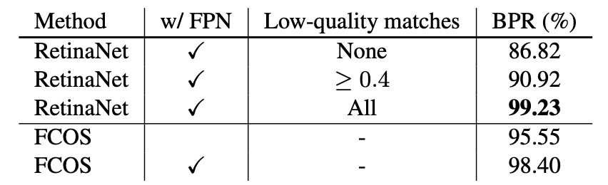
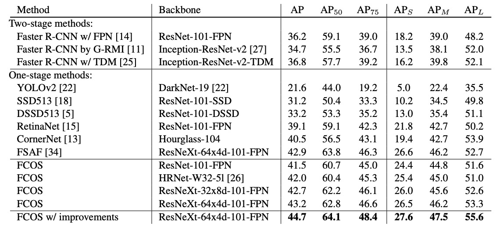

## A World Without Anchors

[**FCOS: Fully Convolutional One-Stage Object Detection**](https://arxiv.org/abs/1904.01355)

---

This paper has been cited more than seven thousand times.

A classic paper that we must take a look at.

## Problem Definition

For a long time, mainstream object detection methods have been dominated by **anchor-based** designs.

From Faster R-CNN, SSD to YOLOv2/v3, everyone has centered their designs around anchors: laying out a huge number of candidate boxes and then deciding which are positive and which are negative samples.

While practical, this design brings several concerns:

1. **Numerous hyperparameters**: The size, aspect ratio, and number of anchors, as well as IoU thresholds, all need to be manually tuned. Any change can cause mAP to fluctuate by more than 4%.
2. **Poor generalization**: Anchor shapes are fixed. Performance drops significantly when encountering objects with large scale differences or unusual shapes, and adapting to a new task requires redesigning anchors.
3. **Imbalance of positive and negative samples**: To ensure recall, thousands of anchors must be tiled across the image. The vast majority become negative samples, leading to extremely imbalanced training.
4. **Complex computation**: From IoU calculations to matching rules, anchors introduce additional computation and complexity.

Although anchor-free is not a new concept, previous methods each had obvious flaws.

For example, YOLOv1 tried to predict bounding boxes directly from the object center, but relying only on the center point led to low recall; CornerNet assembled objects from corner points, but post-processing was too complex; DenseBox used pixel-wise regression, but struggled with overlapping boxes and was only barely usable in niche areas like text or face detection.

There are many more examples.

Anchor-free architectures have always been a step behind in overall performance—in the field already ruled by anchor-based methods, they had no real foothold.

**Does object detection really depend on anchors?**

The authors of this paper aimed to break this deadlock, hoping that models could, like semantic segmentation, allow every pixel to participate in prediction—no anchors, no extra matching rules.

Object detection, in their view, should return to the clean paradigm of **fully convolutional per-pixel prediction**.

## Solution

The core idea of FCOS is to completely reframe object detection as a **per-pixel prediction** problem. Instead of laying out numerous anchors as “candidates” to match with ground truth, FCOS simply treats every pixel location as a training sample.

Suppose at the $i$-th layer of the backbone, we obtain a feature map $F_i \in \mathbb{R}^{H \times W \times C}$ with stride $s$.

The ground-truth bounding box for an input image is denoted as

$$
B_i = (x^{(i)}_0, y^{(i)}_0, x^{(i)}_1, y^{(i)}_1, c^{(i)}) \in \mathbb{R}^4 \times \{1,2,\dots,C\},
$$

where $(x^{(i)}_0, y^{(i)}_0)$ and $(x^{(i)}_1, y^{(i)}_1)$ are the coordinates of the top-left and bottom-right corners, and $c^{(i)}$ is the class label.

For a location $(x, y)$ on the feature map, it can be mapped back to input image coordinates as:

$$
(\lfloor \tfrac{s}{2} \rfloor + xs, \; \lfloor \tfrac{s}{2} \rfloor + ys).
$$

If this position falls within a ground-truth box $B_i$, it is considered a positive sample and assigned the class label $c^* = c^{(i)}$; otherwise, it is background ($c^* = 0$).

Besides classification, each location must regress a 4D vector:

$$
t^* = (l^*, t^*, r^*, b^*),
$$

which represents the distances from that position to the left, top, right, and bottom edges of the box, as illustrated below:

<figure style={{ "width": "70%"}}>

</figure>

$$
l^* = x - x^{(i)}_0, \quad
t^* = y - y^{(i)}_0, \quad
r^* = x^{(i)}_1 - x, \quad
b^* = y^{(i)}_1 - y
$$

If a position falls within multiple boxes, the box with the smallest area is chosen as the regression target to reduce ambiguity.

In this way, **each pixel directly outputs "what is here" and "where is the box,"** without relying on anchors.

At the network output, the last layer outputs both a classification branch $p \in \mathbb{R}^C$ and a regression branch $t = (l, t, r, b)$.

Since the regression values must be positive, the authors use $\exp(x)$ at the output to map any real number to $(0, \infty)$.

This design not only simplifies the structure, but also reduces the number of output variables by a factor of nine compared to anchor-based detectors.

The overall loss is defined as:

$$
L(\{p_{x,y}\}, \{t_{x,y}\}) =
\frac{1}{N_{\text{pos}}} \sum_{x,y} L_{\text{cls}}(p_{x,y}, c^*_{x,y}) \; + \;
\frac{\lambda}{N_{\text{pos}}} \sum_{x,y} \mathbf{1}_{\{c^*_{x,y}>0\}} \, L_{\text{reg}}(t_{x,y}, t^*_{x,y})
$$

where $L_{\text{cls}}$ uses **Focal Loss** to balance positive and negative samples, $L_{\text{reg}}$ is the **IoU loss**, $N_{\text{pos}}$ is the number of positive samples, and $\lambda = 1$.

During inference, for each location $(x, y)$, we obtain its classification score $p_{x,y}$ and regression result $t_{x,y}$. As long as $p_{x,y} > 0.05$, it is treated as a candidate box and mapped back to image coordinates by inverse transformation.

At this point, the core idea of FCOS is clear: remove anchors and let every pixel predict directly.

However, this design immediately faces two challenges:

1. The stride of the feature map may be too large, causing small objects to be missed and recall to drop;
2. Overlapping boxes cause ambiguity—which box should a pixel regress to?

The authors' solution is **multi-level prediction via FPN**, as shown below:

<figure style={{ "width": "90%"}}>

</figure>

The authors use five levels (${P3, P4, P5, P6, P7}$) with strides of 8, 16, 32, 64, and 128.

Objects of different sizes are assigned to different levels for regression, and by setting the maximum regression range for each level (e.g., $P3$ handles objects $\leq 64$, $P4$ handles $[64,128]$), the ambiguity from overlaps is greatly reduced.

Even so, there remains a final issue: pixels far from the center often produce low-quality boxes.

To address this, the authors introduce a lightweight **center-ness branch** to measure how far a location deviates from the object center.

For position $(x, y)$, the target is defined as:

$$
\text{centerness}^* = \sqrt{\frac{\min(l^*, r^*)}{\max(l^*, r^*)} \times \frac{\min(t^*, b^*)}{\max(t^*, b^*)}}
$$

This value lies in $[0, 1]$, approaching 1 near the object center.

BCE loss is used for training; during inference, centerness is multiplied with the classification score to suppress low-quality boxes, filtering out many “corner predictions” even before NMS.

Ultimately, FCOS, with its simplest per-pixel design, together with multi-level assignment via FPN and centerness for quality control, completely abandons anchors—yet demonstrates performance comparable to, and even surpassing, mainstream anchor-based methods.

## Discussion

The authors validate FCOS on the **MS COCO** benchmark, following standard practice: **trainval35k (115K)** is used for training, **minival (5K)** for ablation, and main results are submitted to **test-dev (20K)**.

Unless otherwise specified, the backbone is **ResNet-50**, and the optimizer and hyperparameters follow the **RetinaNet** settings: SGD, 90K iterations, batch size 16, initial learning rate 0.01, which drops by a factor of 10 at both 60K and 80K iterations, weight decay 0.0001, momentum 0.9, input image short side 800, and long side no more than 1333.

Inference also adopts RetinaNet's post-processing and hyperparameters, with candidate location threshold $p_{x,y}>0.05$; further performance gains are possible if parameters are specifically tuned for FCOS.

Before delving into further analysis, let's clarify the exact definition of **Best Possible Recall (BPR)** for easier reading of the tables:

$$
\text{BPR} \;=\; \frac{\#\{\text{GT boxes assigned to at least one sample during training}\}}{\#\{\text{all GT boxes}\}} .
$$

### Multi-Level FPN and Recall Upper Bound

<figure style={{ "width": "70%"}}>

</figure>

First, the authors consider that FCN-style detectors may suffer from insufficient recall due to larger stride, so they test with a single **P4 (stride 16)** layer: with only this layer, FCOS still achieves **BPR = 95.55%**, which is significantly higher than the official Detectron version of **RetinaNet** (low-quality matching, IoU≥0.4), which achieves **90.92%**.

Next, after introducing **FPN (P3–P7)**, FCOS’s BPR further improves to **98.40%**, approaching the upper limit of anchor-based methods stacked with various low-quality matches to boost recall.

Given that real-world detectors' final recall on COCO is much lower than 90%, this less-than-1% BPR gap is not a bottleneck; in fact, in the main results that follow, FCOS’s **AR** is also superior to its competitors.

### Ambiguous Samples Caused by Overlaps

<figure style={{ "width": "70%"}}>

</figure>

When multiple GT boxes overlap in space, per-pixel assignment may cause ambiguity as to "which box a given location should regress to."

With only **P4**, ambiguous samples on minival account for **23.16%** of all positive samples; after introducing **FPN**, because objects of different sizes are assigned to different levels, ambiguity drops sharply to **7.14%**. Excluding "same-class overlaps" (which do not affect classification accuracy), the cross-class ambiguity rate drops from **17.84%** to **3.75%**.

At inference time, only **2.3%** of detected boxes originate from ambiguous locations, and for cross-class ambiguities, this drops to **1.5%**.

Therefore, through **multi-level assignment + the smallest-area rule**, the effect of ambiguity on final performance is negligible.

### The Necessity and Effectiveness of Center-ness

<figure style={{ "width": "70%"}}>

</figure>

Even with FPN, pixels far from the object center still easily generate low-quality boxes.

To address this, FCOS adds a single-layer **center-ness** branch alongside the classification branch, predicting the normalized offset from center:

$$
\text{centerness}^* \;=\; \sqrt{\frac{\min(l^*,r^*)}{\max(l^*,r^*)}\cdot\frac{\min(t^*,b^*)}{\max(t^*,b^*)}}
$$

This is supervised with **BCE** during training; during inference, $\text{score}=\text{cls}\times\text{centerness}$ is used to suppress corner predictions, filtering out large numbers of low-quality candidates even before NMS.

Ablation results show, as in the table, that **AP jumps from 33.5% to 37.1%**; if only "center-ness derived from regression" is used, without a separate branch, this improvement does not occur, proving the necessity of an independent branch.

### Fair Comparison With Anchor-based Methods

<figure style={{ "width": "90%"}}>

</figure>

To rule out implementation differences, the authors adjust FCOS to settings nearly identical to **RetinaNet**: removing **GroupNorm** (using gradient clipping for stability instead), generating **P6/P7** from **C5** rather than **P5**.

Even so, FCOS still slightly outperforms RetinaNet (**36.3% vs 35.9% AP**). In this comparison, learning rate, NMS threshold, and other hyperparameters are copied directly from RetinaNet (with no special tuning for anchor-free), demonstrating that the simple architecture and assignment strategy are key. The authors also point out that FCOS has further room to improve if hyperparameters are tuned specifically for it.

### Overall Comparison With Contemporary SOTA

<figure style={{ "width": "90%"}}>

</figure>

Experimental results show that with **ResNet-101-FPN**, FCOS achieves **+2.4 AP** over RetinaNet; with **ResNeXt-101-64×4d-FPN** as backbone, FCOS reaches **AP 43.2%**, significantly outperforming the anchor-free **CornerNet**, with a much simpler system (CornerNet requires paired corner learning and embedding aggregation).

After integrating several nearly zero-cost improvements from the above table, single-model, single-scale testing achieves **AP 44.7%**. This is the **first time** that anchor-free methods significantly surpass anchor-based ones without any "tricks."

## Conclusion

FCOS brings object detection back to the **per-pixel** paradigm: no proposals, no anchors. Each location learns both "what it is" and "where to box," and FPN’s multi-level assignment resolves ambiguities in scale and overlap, with a near-zero-cost **center-ness** to calibrate quality.

The influence of FCOS is reflected on three main levels.

First, the concept of **task alignment and sample assignment** has been greatly magnified: from ATSS’s statistical assignment, to dynamic/global optimization in PAA/OTA/SimOTA, to classification-localization alignment in TOOD, all advance the "pixel (or location) = sample" mindset.

Second, **quality-aware classification heads** have branched out: centerness has been absorbed into more general "IoU/quality-aware classification" (like QFL/Varifocal), and box regression has evolved from pure continuous values to **distributional regression** (like DFL)—all essentially injecting localization quality into classification scores in a smoother way.

Third, the **Transformer series** (DETR, Deformable-DETR, DINO, RT-DETR, etc.) has redefined detection with set-based matching, removing NMS and anchors to establish another strong paradigm; yet, for **real-time and edge deployment**, convolution-based, lightweight-head designs like FCOS remain robust and easy-to-tune baselines, and have inspired anchor-free YOLO family models (v8/10/11) in their task alignment and quality modeling details.

In summary, FCOS's contribution is not just "removing anchors," but reframing the detection problem: **let each location make its own decision, and use correct assignment and scoring so that good boxes naturally emerge**.

From then on, anchor design fades away, leaving a clearer problem definition and a more universal design language.
