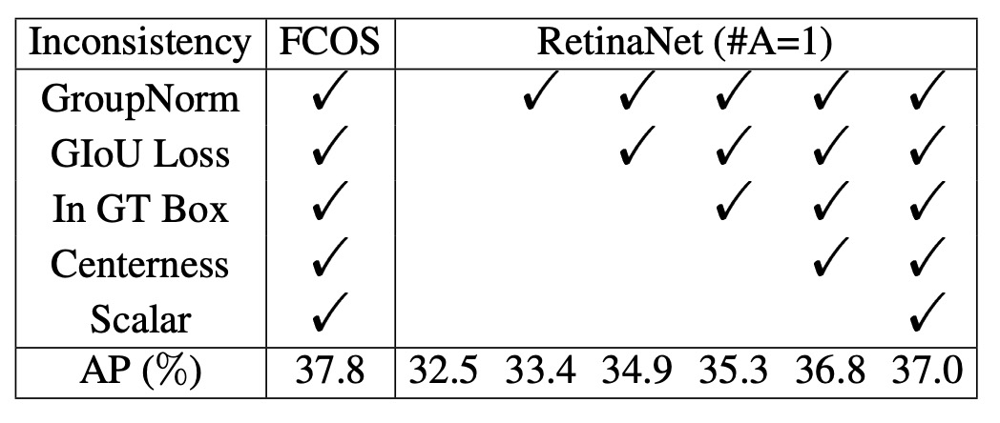
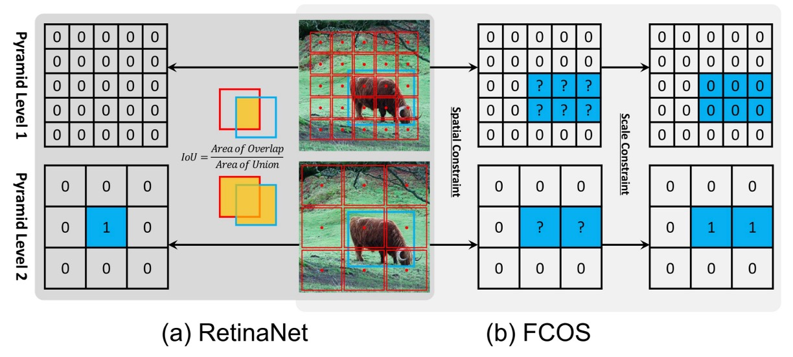
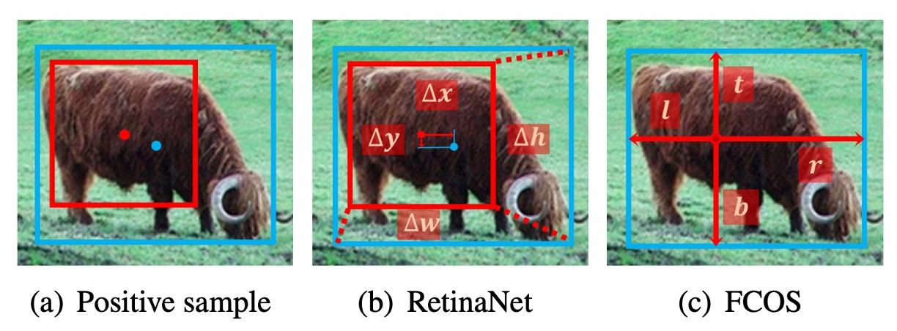

## The Death of Anchors

[**Bridging the Gap Between Anchor-based and Anchor-free Detection via Adaptive Training Sample Selection**](https://arxiv.org/abs/1912.02424)

---

In recent years, the development of object detection has split into two major factions: **Anchor-based** and **Anchor-free**.

**Anchor-based Methods**

- **Two-stage detectors** (e.g., Faster R-CNN) use **RPN proposal regions + R-CNN refinement**, maintaining a lead in accuracy over time through multiple iterations of regression.
- **One-stage detectors** (e.g., SSD, RetinaNet) lay anchors across multiple feature maps, directly performing classification and regression. This approach is extremely efficient and has gradually caught up with two-stage performance.

**Anchor-free Methods**

- **Keypoint-based**: Reformulate detection as a keypoint localization problem. For example, CornerNet determines boxes by "top-left + bottom-right" corners, while ExtremeNet directly locates four extreme points and the center.
- **Center-based**: Use the object’s center or region as the positive sample, then regress to the boundaries (e.g., YOLO, FCOS, FoveaBox).

## Problem Definition

Though these two schools appear divergent, they are essentially answering the same question:

> **Which locations should be considered "positive samples," and which as "negative samples"?**

Take **RetinaNet (anchor-based)** and **FCOS (anchor-free, center-based)** as examples. Their main differences lie in three areas:

1. **Sampling Unit**: RetinaNet places multiple anchors at each location; FCOS places only a single point per location.
2. **Sample Definition**: RetinaNet uses IoU thresholds to distinguish positives and negatives; FCOS relies on spatial and scale rules.
3. **Regression Origin**: RetinaNet starts from anchor boxes; FCOS predicts outward from a single point.

However, through rigorous alignment experiments, the authors found:

> **What truly determines performance differences is not "box vs. point," but how positive and negative samples are defined.**

If both methods use the same sample selection strategy during training, the final results are actually quite similar! In other words, the divide between anchor-based and anchor-free isn't about architecture—it's about assignment: **the sample allocation strategy is the key!**

Thus, a few crucial questions remain at the heart of object detection:

- Why rely on hand-crafted IoU thresholds or manually designed rules to divide positives and negatives?
- Is it possible for the model to automatically select the right samples based on each object's statistical properties?

And then, you can't help but ask: "What about anchors?"

Oh, they're already dead.

As witnesses to history, let's frame them and put them in a museum.

## Problem Solving

The authors selected two representative methods for comparison: **RetinaNet** (anchor-based) and **FCOS** (anchor-free, center-based). On the surface, they have many structural differences, but to make a fair comparison, all "unnecessary distractions" must be eliminated one by one.

### Removing Unfair Factors

To focus on the core difference, the authors modified RetinaNet so that each location has **only one square anchor** (referred to as RetinaNet #A=1), making its structure as close as possible to FCOS.

Even so, there was still a clear performance gap on COCO: RetinaNet (#A=1) achieved **32.5% AP**, while FCOS had **37.1% AP**.

At this point, the authors noticed that FCOS introduced many "general improvements":

- GroupNorm normalization
- GIoU loss
- Centerness branch
- Stride normalization for regression targets
- A learnable scalar for each feature pyramid layer

These techniques are not exclusive to anchor-free approaches and can also be applied to RetinaNet.

<figure style={{ "width": "60%"}}>

</figure>

After adding these improvements, RetinaNet (#A=1) improved to **37.0% AP**, nearly catching up with FCOS at **37.8% AP**.

This alignment process demonstrates that **structural differences (anchor box vs. point) are not the key factor**.

### Pinpointing the True Difference

After eliminating all "external advantages," only two differences remained:

1. **Sample Definition** (classification)
2. **Regression Origin** (regression)

Let's first look at the **sample definition** aspect.

<figure style={{ "width": "90%"}}>

<figurecaption>Blue cells are positive regions, gray cells are negative regions.</figurecaption>
</figure>

---

- RetinaNet selects positives and negatives via an **IoU threshold**: anchors with IoU > $θ_p$ are positives, IoU < $θ_n$ are negatives, and the intermediate region is ignored.
- FCOS uses **spatial + scale conditions**: points inside the box are candidate positives, then filtered by scale range at each layer, with the final survivors as positive samples.

Experimental results show:

- When RetinaNet (#A=1) switches to the "spatial + scale" rules of FCOS, AP increases from **37.0% → 37.8%**.
- Conversely, when FCOS adopts the IoU threshold, AP drops from **37.8% → 36.9%**.

This proves that **the definition of positives and negatives is the essential difference between anchor-based and anchor-free methods**.

---

Next is the **regression origin** aspect.

<figure style={{ "width": "90%"}}>

</figure>

- RetinaNet predicts offsets from the anchor box.
- FCOS predicts four distances outward from a single point.

However, when both use the same sample assignment strategy, this difference becomes irrelevant:

- RetinaNet (#A=1) vs. FCOS perform nearly identically under the same conditions.

Thus, the authors conclude:

- **The regression origin (box or point) is not the key; what truly affects performance is how positives and negatives are defined.**

### Adaptive Training Sample Selection

Before introducing ATSS, let's define some notation:

- $\mathcal{G}$: the set of all ground-truth (GT) boxes in the image.
- $\mathcal{A}$: the set of all anchors; $L$ is the number of FPN layers, and anchors on each layer are $\mathcal{A}_i$.
- $k$: the only hyperparameter, representing the **$k$ anchors closest to the GT center** selected per layer as candidates.
- $C_g$: for a GT $g$, the collected candidate anchors ($k \times L$ in total).
- $D_g$: the IoU distribution between candidates and the GT.
- $m_g$, $v_g$: the mean and standard deviation of $D_g$.
- $t_g$: the adaptive IoU threshold for GT $g$ set by ATSS, defined as

  $$
  t_g = m_g + v_g
  $$

---

To address the aforementioned issues, ATSS proposed a new idea:

> **Let each ground-truth object decide the boundary between positives and negatives for itself, instead of relying on manual settings.**

The procedure is as follows:

1. **Select Candidates**: For each GT $g$, pick $k$ anchors per layer that are closest to its center, forming the candidate set $C_g$.
2. **Compute Statistics**: Calculate the IoU distribution $D_g$ among the candidates, and obtain $m_g$ and $v_g$.
3. **Adaptive Threshold**: Set $t_g = m_g + v_g$.
4. **Select Positives**: Any anchor with IoU ≥ $t_g$ and center inside the box is added to the positive set $\mathcal{P}_g$. If an anchor is chosen by multiple GTs, it is assigned to the GT with the highest IoU.
5. All other anchors are negatives $\mathcal{N}$.

---

This design brings many benefits:

- **Center-based candidate selection**: Whether anchor-based or anchor-free, candidates closer to the center are usually higher quality.

- **Using $m_g+v_g$ as the threshold**:

  - High $m_g$ → overall candidate quality is good → threshold should be high.
  - Low $m_g$ → overall candidate quality is poor → threshold should be low to avoid missing GTs.
  - High $v_g$ → only certain layers are suitable → raise the threshold, keeping only samples from those layers.
  - Low $v_g$ → multiple layers are suitable → lower threshold, allowing more layers to participate.

- **Maintaining fairness**: Statistically, each GT will have about $0.2 \times kL$ positive samples, independent of object size, aspect ratio, or position, avoiding the "large objects have more positives, small objects have fewer" problem.

- **Almost parameter-free**: The only $k$ has been shown experimentally to be robust; a range of $7 \sim 17$ performs well, so ATSS can be regarded as a "parameter-free" method.

---

To verify the effectiveness of ATSS **on anchor-based detectors**, the authors replaced the traditional sample assignment in **RetinaNet (#A=1)** with ATSS.

All evaluation metrics improved, as shown in the table below:

<figure style={{ "width": "70%"}}>

</figure>

The authors attribute these improvements to each GT being able to adaptively select suitable positive samples based on its own statistical properties.

Since ATSS **only changes the definition of positives and negatives** and incurs **no extra computational cost**, it can be seen as "**free performance gain**."

Next, the authors applied ATSS to the **anchor-free detector** FCOS, leading to two versions:

1. **Lite Version (Center Sampling)**

   - In original FCOS, all points inside the box are candidates, which introduces many low-quality positives.
   - ATSS Lite: Select only $k=9$ candidates per layer closest to the center as positives.
   - This method has been integrated into official FCOS code as **center sampling**.
   - Experimental results: AP improved **37.8 → 38.6** (as shown above).
   - Downside: Still retains the scale range hyperparameter, not fully eliminated.

2. **Full Version (Complete ATSS)**

   - Temporarily treat FCOS points as square anchors with side length $8S$ ($S$ is the layer stride), then assign positives using the ATSS method.
   - During regression, prediction is still from the point to the four boundaries, same as original FCOS.
   - Experimental results:

     | AP   | $AP_{50}$ | $AP_{75}$ | $AP_S$ | $AP_M$ | $AP_L$ |
     | ---- | --------- | --------- | ------ | ------ | ------ |
     | +1.4 | +1.7      | +1.7      | +0.6   | +1.3   | +2.7   |

The results show that although **Lite and Full** versions have similar spatial candidate selection, their handling of the **scale dimension** differs. The Full version uses adaptive thresholds to select samples, which leads to significantly better results. Therefore, the authors believe that instead of relying on fixed scale ranges, letting ATSS automatically decide the sample allocation brings more stable and comprehensive improvements.

## Discussion

To verify the final effectiveness of ATSS, the authors compared it with other mainstream detectors on **MS COCO test-dev**.

The experimental setup was as follows:

- Used **multi-scale training** (randomly scaling the short side of images to between $640$ and $800$).
- Doubled the total training steps to **180K**, with learning rate reductions at **120K / 160K**.
- All other settings were consistent with previous experiments.

### Comparison with Existing Methods

<figure style={{ "width": "90%"}}>

</figure>

- With **ResNet-101** as the backbone, ATSS achieved **43.6% AP**, surpassing all other detectors using the same backbone:

  - Cascade R-CNN: 42.8%
  - C-Mask R-CNN: 42.0%
  - RetinaNet: 39.1%
  - RefineDet: 36.4%

- With larger backbones:

  - ResNeXt-32x8d-101 → **45.1%**
  - ResNeXt-64x4d-101 → **45.6%**

- ATSS almost matches **SNIP (45.7%)**, with only a 0.1% difference, despite SNIP using a more complex multi-scale train/test strategy.
- With **DCN (Deformable Convolutional Networks)**:

  - ResNet-101 → **46.3%**
  - ResNeXt-32x8d-101 → **47.7%**
  - ResNeXt-64x4d-101 → **47.7%**

With a single model and single-scale test, ATSS already achieved **47.7% AP**, surpassing all contemporaneous methods. With multi-scale testing, it ultimately broke through **50.7% AP**.

Essentially, ATSS only changes the “positive/negative sample definition”, yet it brings consistent gains regardless of backbone and is complementary with DCN and multi-scale strategies.

### Discussion on Number of Anchors

<figure style={{ "width": "70%"}}>

</figure>

Most experiments above were based on **RetinaNet (#A=1)**, but traditional RetinaNet places **9 anchors per location (3 scales × 3 aspect ratios)**.

- With the traditional IoU-based assignment:

  - RetinaNet (#A=9) → **36.3% AP**
  - With general improvements (GroupNorm, GIoU loss, etc.) → **38.4% AP**
  - For comparison, RetinaNet (#A=1) achieves **37.0% AP**.
  - **Conclusion**: Under the traditional strategy, using more anchors does improve performance.

- But after applying **ATSS**:

  - RetinaNet (#A=9) → **+0.8% AP** (limited improvement)
  - Results are nearly identical to RetinaNet (#A=1).
  - Even if the number of scales or aspect ratios is reduced from 3 to 1, the performance hardly changes.

With ATSS, no matter how many anchors are placed at each location, high-quality positives can still be selected. In other words, **the advantage of multiple anchors vanishes under ATSS**, and this redundancy is worth investigating further in future work.

## Conclusion

The greatest contribution of ATSS is refocusing the core issue of object detection on **the definition of positives and negatives**. Through a simple statistical rule, each GT can automatically determine its own sample boundary, eliminating reliance on IoU thresholds or scale ranges.

At the same time, ATSS ended years of debate between anchor-based and anchor-free methods and brought steady, comprehensive performance improvement without increasing inference cost.

This insight has inspired a wave of follow-up work:

- **PAA, OTA/SimOTA**: make sample assignment learnable or globally optimal.
- **TOOD / TAL**: emphasize alignment between classification and localization.
- **VFL, GFLv2**: explicitly inject quality information into classification scores.

As of today (2025), more models in practice have moved toward **globalized (OTA)** and **task-aligned (TAL)** designs. In Transformer-based architectures like DETR and DINO, sample assignment is reformulated as Hungarian matching, but the essence remains the same:

> **How can we ensure the model learns from the right samples?**

We identify the problem, then solve the problem.

ATSS is undoubtedly a classic work worth reading.
