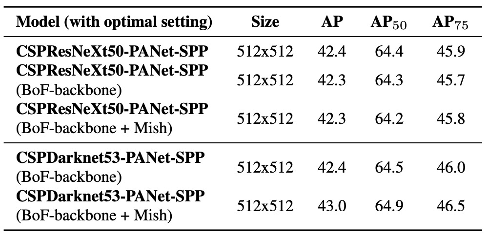

## Model Design Overview

[**YOLOv4: Optimal Speed and Accuracy of Object Detection**](https://arxiv.org/abs/2004.10934)

---

This paper adopts an industrial style, reading like a user manual for an object detection model.

Let's start from the overall design and learn how to build a good object detection model.

:::tip
The original YOLO model author only developed up to v3; subsequent versions are inherited by other branches. Therefore, the later version numbers are not necessarily related, nor are their publication years strictly chronological.

YOLOv4 comes from a development team in Taiwan.
:::

## Model Architecture Overview

<figure style={{ "width": "90%"}}>

</figure>

An object detector typically consists of four main modules: `Input`, `Backbone`, `Neck`, and `Head`.

Each module has its own role, connecting with others while allowing flexible combinations, like stacking building blocks.

- **Input**

  Besides simple image input, it may include various enhancement signals such as multi-scale image pyramids, data augmentation, image patching, or resolution changes. The goal is to strengthen the model’s ability to recognize targets starting from the input stage.

- **Backbone**

  The main feature extraction module, mostly adapted from classic image classification architectures like VGG, ResNet, DenseNet, as well as detection-tailored variants such as CSPDarknet and DetNet. Its purpose is to convert input images into deep feature maps containing semantic and visual information.

- **Neck**

  Attempts to integrate feature maps from different levels, balancing shallow localization information with deep semantic features. From FPN to PAN, then BiFPN and NAS-FPN, each generation aims for better fusion of information flow and transmission efficiency.

- **Head**

  The final classification and bounding box regression module, divided into dense prediction (e.g., YOLO, SSD) and sparse prediction (e.g., R-CNN series). This is the main battlefield for performance and accuracy.

## Two Design Paradigms

Object detection architectures have gradually diverged into two mainstream strategies: two-stage and one-stage.

- **Two-stage architectures**, such as Faster R-CNN and Libra R-CNN, first generate region proposals, then perform classification and bounding box regression. This approach provides higher accuracy and stronger region modeling ability, suitable for tasks requiring precise detection. Anchor-free versions like RepPoints have appeared later to alleviate anchor design limitations.

- **One-stage architectures**, like YOLO, SSD, and RetinaNet, perform dense predictions directly on the whole image without generating region proposals, trading for higher efficiency and faster inference. With the emergence of anchor-free designs (e.g., CenterNet, FCOS, CornerNet), these methods have begun challenging the accuracy advantage traditionally held by two-stage architectures.

The divergence between these two routes essentially reflects the trade-off between "speed" and "accuracy," and YOLOv4’s design attempts to find the best balance on this spectrum.

## Neck for Feature Fusion

With the increasing depth and breadth of the Backbone, effectively integrating multi-level features becomes critical for subsequent predictions.

This is the original purpose of the Neck module: to complement semantic information and localization cues, providing the Head with input rich in semantics and spatial details. Common approaches include:

- **FPN** (Feature Pyramid Network) pioneered the top-down fusion structure, progressively upsampling and merging high-level semantic signals.
- **PAN** (Path Aggregation Network) adds a bottom-up path to enhance shallow feature feedback.
- **BiFPN / NAS-FPN** further pursue efficiency and performance extremes, using learnable weights for bidirectional fusion and neural architecture search (NAS) for optimal configurations.
- **ASPP / RFB / SAM** modules strengthen feature representation through spatial pyramids, receptive field design, or attention mechanisms.

The core challenge behind these designs is how to improve multi-scale understanding and feature expressiveness without excessively sacrificing speed.

## Backbones Designed for Detection

As model design moves towards modularity and interchangeability, some researchers revisit the backbone itself, redesigning feature extractors specifically tailored for detection tasks.

- **DetNet** and **DetNAS** shift the backbone from classification-oriented to detection-oriented, emphasizing maintaining high resolution and detection-awareness.
- **SpineNet** highlights diverse data flows and flexible feature combinations, integrating NAS to find the best network configuration.
- **HitDetector** designs the entire pipeline from input to prediction based on task requirements, allowing modules to synergize effectively.

This direction signifies that task demands have shifted from image classification to localization and bounding box regression, and simply applying classification backbones no longer meets detection complexity. Therefore, redesigning the backbone may be a more efficient solution.

## Training Optimization Techniques

In object detection training, a class of techniques collectively called "Bag of Freebies" is widely used.

These refer to techniques that **only increase training cost but do not affect inference efficiency**. In other words, their purpose is to improve model accuracy and generalization without compromising inference speed.

These techniques can be categorized into three main types: data augmentation, label processing, and loss function optimization.

### Data Augmentation

The generalization ability of object detection models largely depends on the diversity of input data. To enable the model to adapt to images in different environments, data augmentation is the most common and effective strategy.

- **Pixel-level transformations**: including brightness, contrast, saturation, hue, noise distortions, as well as geometric transformations like random scaling, cropping, flipping, and rotation. These methods preserve original pixel information but change their arrangement and visual presentation.
- **Occlusion-based augmentation**: to simulate occlusion scenarios, methods like Random Erase, CutOut, Hide-and-Seek, and GridMask randomly mask image regions, training the model to recognize targets under occlusion.
- **Feature masking**: similar concepts apply on feature maps, such as DropOut, DropConnect, and DropBlock, enhancing the model’s robustness and stability on intermediate representations.
- **Mixing multiple images**: strategies like MixUp and CutMix blend or concatenate two images and adjust labels with weighted or area-based assignments, further improving model understanding of complex scenes.
- **Style transfer**: Style Transfer GANs are used to generate images with different styles to reduce CNN over-reliance on specific materials and textures.

### Label Smoothing and Knowledge Distillation

Beyond input image processing, label manipulation is also part of the free optimization techniques.

In classification tasks, labels are usually presented in a one-hot format. Although these "hard labels" are clear, they lack semantic-level soft flexibility. To address this, Label Smoothing was introduced to convert original labels into "soft labels," preventing the model from being overconfident in any one class and improving its stability on unseen data.

A further approach involves knowledge distillation, where a higher-performing Teacher model provides more refined output distributions. Through a Label Refinement Network, the student model is guided to learn the relative relationships between classes.

### Loss Function Optimization

Finally, for the crucial bounding box regression problem in object detection, the traditional approach uses MSE or L1/L2 Loss to directly regress coordinate values (e.g., center points or diagonals). However, such methods neglect the geometric structure of the entire box and are easily affected by object scale variations.

Therefore, IoU Loss has become the mainstream choice in recent years, using the overlap area between predicted and ground-truth boxes as the core of the loss function. It offers scale invariance and semantic consistency advantages.

Several improved versions have since emerged:

- **GIoU (Generalized IoU)**: incorporates the smallest enclosing box to solve the no-gradient issue when boxes do not overlap.
- **DIoU (Distance IoU)**: adds center point distance to enhance localization accuracy.
- **CIoU (Complete IoU)**: considers overlap, center distance, and aspect ratio simultaneously, achieving the best overall performance and faster convergence.

These improvements in regression losses not only stabilize convergence but also elevate localization precision, becoming indispensable for high-performance detectors.

## Sophisticated Module Design

In contrast to Bag of Freebies, another accuracy-boosting strategy is called **Bag of Specials**.

These methods typically slightly increase inference cost but **the accuracy gains far outweigh the additional computational expense**, making them highly cost-effective techniques in object detection.

These techniques can be categorized into four aspects: **receptive field expansion, attention mechanisms, feature integration modules, and non-maximum suppression (NMS) post-processing**, plus one often overlooked but highly influential aspect: **activation function design**.

### Receptive Field Expansion

To help the model perceive contextual information earlier and improve spatial understanding, many modules are designed to expand the receptive field:

- **SPP (Spatial Pyramid Pooling)** module originates from the classical SPM concept, initially used in image classification to build multi-scale region representations. YOLOv3 integrated it into the convolutional network as multi-scale MaxPooling (e.g., k = 1, 5, 9, 13) concatenations, greatly expanding the receptive field without changing spatial dimensions. On YOLOv3-608, it only adds 0.5% computation but improves AP50 by 2.7%.
- **ASPP (Atrous Spatial Pyramid Pooling)** uses multiple 3×3 atrous convolutions with different dilation rates, achieving multi-scale receptive field spatial awareness.
- **RFB (Receptive Field Block)** goes further by parallel computation of multiple convolution groups with varying dilation rates, achieving denser and wider spatial coverage. On the SSD architecture, it adds only 7% inference time but brings a 5.7% AP50 improvement.

### Attention Mechanisms

Attention modules help the model dynamically adjust the importance of signals and have become core techniques widely applied in visual tasks:

- **SE (Squeeze-and-Excitation)** module focuses on channel-level reweighting, helping the model concentrate more on discriminative feature dimensions but has relatively higher inference overhead on GPUs.
- **SAM (Spatial Attention Module)** introduces attention at the spatial level, performing spatial weighting on input feature maps with very low cost and almost no effect on GPU inference speed.

### Cross-Scale Integration

Traditionally, skip connections or hypercolumns concatenate shallow and deep features. With the rise of multi-scale fusion architectures like FPN, more efficient fusion modules have been proposed:

- **SFAM**: strengthens channel attention based on the SE module.
- **ASFF (Adaptive Spatial Feature Fusion)**: determines fusion weights of different scales through point-wise softmax.
- **BiFPN**: proposes multi-input weighted residual connections, achieving learned fusion across scales, balancing accuracy and efficiency well.

### Activation Function Evolution

A good activation function enables more stable gradient propagation without additional burden:

- **ReLU** solved the gradient vanishing problem of early sigmoid/tanh.
- **LReLU / PReLU** addressed the zero-gradient issue in negative ranges.
- **ReLU6 / hard-Swish** were tailored for quantized networks.
- **SELU** supports self-normalization.
- **Swish / Mish** are smooth, differentiable functions improving convergence and accuracy in deep networks.

Though these activation functions are micro-designs, they often accumulate significant performance gains in large networks.

### NMS Post-processing

Non-maximum suppression (NMS) filters redundant predicted boxes and is the final step in object detection:

- **Traditional NMS** keeps the best box based on IoU and confidence score ranking but cannot handle confidence degradation in occluded objects well.
- **Soft-NMS** attempts to reduce the overly harsh suppression by penalizing scores instead of outright removal.
- **DIoU-NMS** incorporates center distance information, making the selection more geometrically intuitive.

However, with the rise of anchor-free architectures, some models (e.g., FCOS) have removed NMS entirely, relying on loss design or post-processing conditions to finalize predictions.

## Solving the Problem

Now, we finally get to look at YOLOv4 itself.

With the introduction of all the above methods, it is clear the authors aimed to find an architecture that is both fast and effective.

### Architecture Choice

When designing the Backbone, the authors started from the core concept that "classification models ≠ detection models," re-evaluating various architectures’ performance across different tasks.

They found that although **CSPResNeXt50** performs excellently on ImageNet, **CSPDarknet53** outperforms it on the MS COCO detection task. This is because detection tasks demand more rigor than classification:

- **Higher input resolution:** To recognize small objects.
- **Deeper layers and larger receptive fields:** To cover broader contextual relationships.
- **More parameter capacity:** To handle multi-object, multi-scale scenarios simultaneously.

For example, CSPResNeXt50 has only 16 layers of 3×3 convolutions with a receptive field of 425×425; CSPDarknet53 has 29 layers and a receptive field of 725×725, combined with a larger parameter count (27.6M), making it better suited for complex detection scenes.

Therefore, YOLOv4 selects **CSPDarknet53** as the backbone, enhances the receptive field with an **SPP module**, aggregates multi-level features through **PANet**, and finally connects to the **YOLOv3 Head** to complete predictions.

The core configuration of this architecture is:

- **Backbone:** CSPDarknet53
- **Neck:** SPP + PANet
- **Head:** YOLOv3 (anchor-based)

### Training Strategy Choice

YOLOv4’s training strategy builds on two classic concepts:

- **Bag of Freebies (BoF):** Adds training cost without inference overhead
- **Bag of Specials (BoS):** Slightly increases inference cost but significantly boosts accuracy

In training, YOLOv4 discards activations hard to converge on (e.g., PReLU, SELU) and quantization-tailored ReLU6, opting instead for a balanced-effect **Mish activation**; for normalization, it replaces SyncBN, which requires multi-GPU, with a design better suited for single-GPU training called **Cross mini-Batch Normalization (CmBN)**.

<figure style={{ "width": "80%"}}>

</figure>

In deep learning, Batch Normalization (BN) is a critical technique for stable training.

However, BN implicitly assumes each mini-batch is large enough to obtain representative mean and variance statistics. When model size grows, GPU memory limits, or single-GPU setups are used, mini-batch sizes often become small, drastically reducing BN’s effectiveness and causing unstable convergence.

Previously, SyncBN (Cross-GPU BN) was proposed to share statistics across GPUs to improve stability, but it requires multi-GPU hardware, unsuitable for single-GPU training.

CmBN introduces a "cross mini-batch" statistical aggregation mechanism:

Suppose a data augmentation method like Mosaic is used, composing four images into one training image. CmBN treats this batch, made from different source images, as an "expanded sample set." When calculating BN statistics, it separately aggregates stats from these sub-samples and then averages them.

In other words, a batch contains multiple mini-batch statistical cues, making BN less dependent on the data bias of a single sub-sample. This strategy resembles a data-level "aggregation correction" for small batch sizes, improving BN’s generalization stability without multi-GPU synchronization.

Additionally, DropBlock is selected as the main regularization method, combined with CutMix, MixUp, Label Smoothing, and other augmentation strategies, forming a representative free enhancement toolkit during training.

### Additional Enhancement Designs

YOLOv4 incorporates three key optimizations in training:

1. **Mosaic Data Augmentation:**

   Mixes four images into one to increase scene diversity and lets BatchNorm process more image information simultaneously, improving stability under small batches.

   

   <figure style={{ "width": "80%"}}>
   
   </figure>
   

2. **SAT (Self-Adversarial Training):**

   At training start, the model adversarially modifies its own images and learns to recognize these disguised images, enhancing robustness against occlusion and camouflage attacks.

3. **Module Improvements:**

   - SAM changed to point-wise attention, increasing focus on fine detail.

       

       <figure style={{ "width": "60%"}}>
       
       </figure>
       

   - PANet’s shortcut connection changed to concatenation, strengthening feature fusion integrity.

       

       <figure style={{ "width": "60%"}}>
       
       </figure>
       

These designs, from enhancing data representativeness and expanding model recognition boundaries to reshaping training stability, form a comprehensive optimization strategy adapted to single-GPU training and inference environments.

### Component Overview and Technology Choices

Integrating the above designs, YOLOv4’s final module selection is:

**Architecture Components:**

- **Backbone:** CSPDarknet53
- **Neck:** SPP, PAN
- **Head:** YOLOv3 Head

**Training Techniques (BoF for Backbone & Detector):**

- CutMix / Mosaic data augmentation
- DropBlock regularization
- Label smoothing
- CIoU Loss
- CmBN
- SAT
- Grid sensitivity elimination strategy
- Multiple anchors assigned to a single ground truth
- Cosine annealing scheduler
- Random training resolution
- Optimized parameter combinations (via genetic algorithm)

**Inference Techniques (BoS for Backbone & Detector):**

- Mish activation
- CSP module
- Multi-input weighted residual connections
- SPP module
- Improved SAM
- PAN path aggregation
- DIoU-NMS post-processing strategy

### Experimental Setup

To verify the actual impact of various training strategies on model performance, the authors conducted large-scale experiments on two standard datasets, training and evaluating separately for classification and detection tasks.

For the **ImageNet (ILSVRC 2012 val)** image classification experiments, the following default training settings were used:

- **Training steps:** 8,000,000 steps
- **Batch size / mini-batch size:** 128 / 32
- **Learning rate schedule:** Polynomial decay, initial learning rate 0.1
- **Warm-up steps:** 1,000
- **Momentum / Weight decay:** 0.9 / 0.005

For the **Bag of Freebies (BoF)** settings, the authors validated the following strategies:

- MixUp
- CutMix
- Mosaic
- Blurring
- Label smoothing regularization

For the **MS COCO (test-dev 2017)** object detection experiments, the default training settings were:

- **Training steps:** 500,500 steps
- **Learning rate schedule:** Step decay

  - Initial learning rate: 0.01
  - Multiply by 0.1 at steps 400,000 and 450,000

- **Momentum / Weight decay:** 0.9 / 0.0005
- **Batch size / mini-batch size:** 64 / 8 or 4 (adjusted according to model and memory capacity)

Except for some hyperparameter search experiments using genetic algorithms, all other experiments used the same default settings.

In the hyperparameter search, the authors used the YOLOv3-SPP architecture with GIoU loss, searching over 300 epochs on a min-val 5k subset. The final best combination adopted was:

- **Learning rate:** 0.00261
- **Momentum:** 0.949
- **IoU assignment threshold:** 0.213
- **Loss normalization coefficient:** 0.07

All experiments were conducted on a **single GPU**, without using multi-GPU optimizations such as SyncBN.

## Discussion

### Impact of Different Features During Classifier Training

<figure style={{ "width": "80%"}}>

</figure>

The authors first investigated how different training strategies affect final accuracy during classifier training, focusing on common enhancement techniques: **class label smoothing**, various data augmentation methods (such as **blurring, MixUp, CutMix, Mosaic**), and different types of activation functions (**Leaky ReLU, Swish, Mish**).

As shown in the above table, the following features significantly improved model accuracy during classifier training:

- **CutMix data augmentation**
- **Mosaic data augmentation**
- **Class label smoothing regularization**
- **Mish activation function**

Therefore, in YOLOv4’s classifier training strategy, the chosen **BoF-backbone (Bag of Freebies for classifier)** includes:

- **CutMix**
- **Mosaic**
- **Class label smoothing**

Meanwhile, according to experimental results, **Mish activation** was incorporated as a supplementary activation function option, working synergistically with the above strategies to further improve classification accuracy.

### Impact of Different Features During Detector Training

<figure style={{ "width": "80%"}}>

</figure>

The authors further evaluated the impact of different training strategies on detector accuracy, particularly systematic experiments on the **Bag of Freebies for detector (BoF-detector)** as shown above.

YOLOv4 greatly expanded the BoF list, focusing on training techniques that **improve accuracy without sacrificing inference speed (FPS)**.

Verified BoF-detector items include:

- **S: Grid Sensitivity Elimination**

  In YOLOv3, target coordinates are defined by $b_x = \sigma(t_x) + c_x$, where $c_x$ is an integer. When $t_x$ is extremely large or small, $b_x$ approaches the grid boundary ($c_x$ or $c_x + 1$), causing detection difficulty near grid edges.

  To address this, the authors multiply the sigmoid output by a factor greater than 1, effectively removing grid constraints on detection feasibility.

- **M: Mosaic Data Augmentation**
  Combines four images into one training input, allowing the model to learn targets in varied scenes and scales, enhancing generalization.

- **IT: IoU Threshold**
  Assigns multiple anchors to each ground truth where IoU(anchor, truth) > threshold to increase sample usage.

- **GA: Genetic Algorithms**
  Uses genetic algorithms in early training (first 10%) to search optimal hyperparameters, improving convergence stability and model performance.

- **LS: Class Label Smoothing**
  Applies label smoothing to classification to reduce model overconfidence and improve discrimination on fuzzy class boundaries.

- **CBN: Cross mini-Batch Normalization (CmBN)**
  Aggregates statistics across entire batches instead of single mini-batches, boosting stability under small batch training.

- **CA: Cosine Annealing Scheduler**
  Dynamically adjusts learning rate using a cosine function for smoother training curves and convergence.

- **DM: Dynamic mini-batch Size**
  Dynamically increases mini-batch size during low-resolution training stages, aligned with random input size training.

- **OA: Optimized Anchors**
  Optimizes anchor locations and sizes based on input resolution (e.g., 512×512) to improve anchor assignment efficiency.

- **BBox Regression Loss**
  Compares multiple bounding box loss functions, including GIoU, CIoU, DIoU, and traditional MSE, validating regression quality in different scenarios.

---

Additionally, the authors validated designs for the **Bag of Specials for detector**, shown below:

<figure style={{ "width": "80%"}}>

</figure>

Experimented items include:

- **PAN:** Enhances parameter aggregation and feature flow
- **RFB:** Multi-scale dilated convolutions for receptive field expansion
- **SAM:** Spatial attention mechanism
- **Gaussian YOLO (G):** Predicts bounding boxes as Gaussian distributions instead of point estimates
- **ASFF:** Cross-scale attention-based fusion strategy

According to results, combining **SPP, PAN, and SAM** achieves the best overall performance.

### Impact of Different Backbones

<figure style={{ "width": "80%"}}>

</figure>

The authors explored the impact of different backbones on detector accuracy, as shown above.

Results indicate that **the best-performing classifier model does not necessarily excel in object detection tasks**.

Specifically, although **CSPResNeXt50** achieves higher classification accuracy than **CSPDarknet53** after various training enhancements, using these pretrained weights as detector backbones results in worse detection performance for CSPResNeXt50.

Conversely, **CSPDarknet53**, when trained with the same BoF and Mish activation, not only improves classifier accuracy but also yields better detection performance when used as a backbone.

This finding reveals a fundamental difference in feature learning requirements between classification and detection tasks.

The structural characteristics and receptive field design of CSPDarknet53 make it more suitable as a feature extractor for object detection.

### Impact of Different Mini-Batch Sizes

<figure style={{ "width": "80%"}}>

</figure>

Finally, the authors analyzed the effects of varying mini-batch sizes during training; results are shown above.

It is clear that **after introducing BoF and BoS training strategies, mini-batch size barely affects the final detector performance**.

This finding has significant practical implications.

Previously, improving training stability and model performance often required large GPU memory to support big batch sizes. This study shows that by combining Mosaic, CmBN, DropBlock, Label smoothing, SPP, PAN, and other training and architectural optimizations in YOLOv4, **stable and excellent learning can be maintained even with small mini-batches**.

### Benchmark

<figure style={{ "width": "90%"}}>

</figure>

YOLOv4’s final results, compared to other state-of-the-art object detectors, lie on the Pareto optimal curve between speed and accuracy, demonstrating the ability to balance efficiency and precision.

Compared to popular fast and high-accuracy models, YOLOv4 **outperforms both**, achieving high inference speed while matching or surpassing previous high-accuracy benchmarks.

Considering differences in GPU architectures used for inference time testing, the authors tested YOLOv4 on common GPUs across three major architectures:

- **Maxwell architecture:** GTX Titan X (Maxwell), Tesla M40
- **Pascal architecture:** Titan X (Pascal), Titan Xp, GTX 1080 Ti, Tesla P100
- **Volta architecture:** Titan Volta, Tesla V100

These experiments further confirm YOLOv4’s scalability and general applicability.

Whether on older or latest hardware, YOLOv4 maintains good computational efficiency and stable performance, reflecting its hardware-friendly design.

## Conclusion

YOLOv4 surpasses all existing mainstream models on the MS COCO AP50 metric while maintaining leading inference speed (FPS). More importantly, YOLOv4 can be trained and deployed on consumer-grade GPUs with only 8–16GB VRAM, significantly lowering technical barriers and enabling widespread applicability.

Every developer interested in object detection should definitely study this paper—it’s well worth the read.
