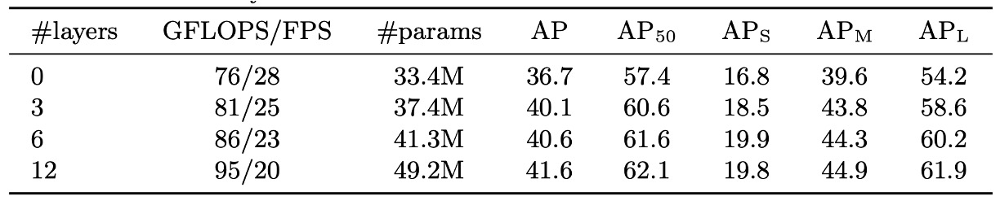
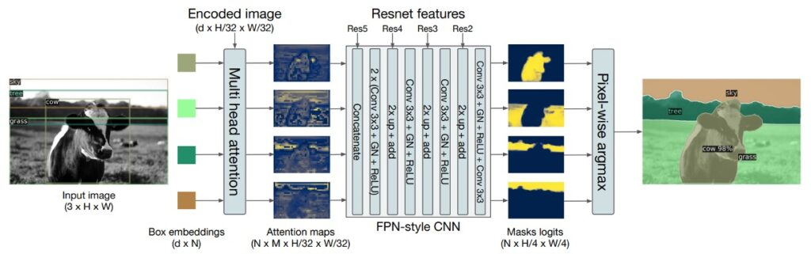
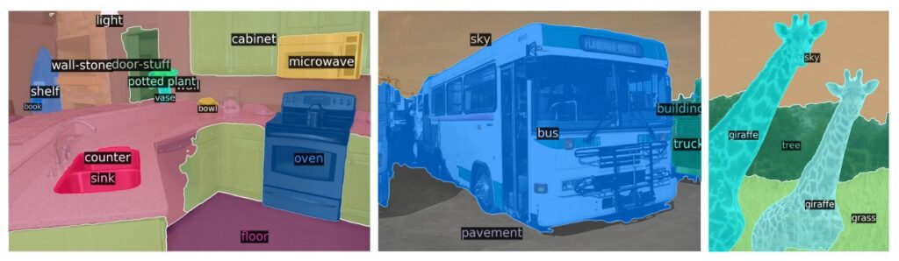

## A Foundation Across Domains

**[End-to-End Object Detection with Transformers](https://arxiv.org/abs/2005.12872)**

---

Object detection has always been a core task in computer vision.

Anchor-based methods like Faster R-CNN, SSD, and YOLOv2 use predefined bounding boxes (anchors) to predict the locations of objects. These anchors are manually selected for their size and aspect ratios, aiming to cover all possible object shapes. Anchor-based methods have inherent advantages, especially in detecting objects of various scales and shapes, as they generalize well to objects with different scales and aspect ratios.

However, choosing appropriate anchor sizes and ratios often requires prior knowledge and manual tuning, which may not be suitable for all applications or datasets. Additionally, using multiple anchors at each position can lead to numerous redundant predictions, particularly in background regions without objects, necessitating additional non-maximum suppression (NMS) steps to clean up.

Meanwhile, in the NLP domain, the development of Transformer architecture has advanced rapidly, yielding significant breakthroughs. These factors led the authors of this paper to decide:

- **Why not apply Transformers in object detection too?**

## Problem Definition

The authors define several current issues in the paper:

### Anchor-based Methods are Complicated

Anchor-based methods have become popular for object detection. These methods use predefined anchors to predict bounding boxes and categories. These anchors are typically predefined bounding boxes of various sizes and aspect ratios, uniformly placed across the image.

However, anchor-based methods pose several challenges:

1. **Redundant Predictions**

   Due to the numerous anchors covering the image, a single object may be detected multiple times, resulting in multiple overlapping bounding boxes for the same object.

2. **Complex Post-processing**

   To address the redundant prediction problem, post-processing techniques such as non-maximum suppression (NMS) are required. NMS removes overlapping bounding boxes, keeping only the best prediction for each object, adding computational and parameter adjustment complexity.

3. **Anchor Design and Matching**

   Designing the size and aspect ratios of anchors is critical for model performance. Inappropriate anchor design can lead to inaccurate detections. Additionally, matching new predictions with the closest anchors involves extra computation.

If anchor-based methods are complex, can we avoid using anchors?

### Anchor-free Methods Lack Accuracy

Accuracy remains paramount in practical scenarios. Users may tolerate slower speeds or complex systems, but:

- **Inaccurate models will lead to complaints.**

Direct prediction has been an attractive concept in object detection. Unlike anchor-based strategies, direct prediction aims to predict object bounding boxes and category labels directly from image pixels without intermediate anchors.

Despite the theoretical appeal, previous attempts at direct prediction often fell short in performance. These methods might not perform well on common object detection benchmarks compared to leading methods.

Although direct prediction methods offer theoretical advantages with simplified model structures and fewer manual priors, their practical performance and competitiveness need improvement. Researchers continue to seek ways to improve these strategies to achieve true end-to-end object detection.

## Solution

### DETR Model Design

1. **Backbone**

   The backbone extracts features from the input image using a convolutional neural network (CNN). The input image produces a set of feature maps that capture various details and contextual information, albeit at a reduced resolution.

2. **Transformer Encoder**

   The Transformer Encoder receives the output feature maps from the backbone. To help the Transformer understand the relative positions of each feature, positional encodings are added. Unlike CNNs, Transformers are not inherently sensitive to input order, and positional encodings provide a way to input positional information, allowing the Transformer to consider the relative positions of features.

3. **Transformer Decoder**

   The Decoder input consists of fixed-size vectors called "object queries," representing general expectations for detected objects. Through multiple layers of the decoder, these queries attend to the encoder outputs, identifying features corresponding to specific objects.

4. **Feed-Forward Network (FFN)**

   Each output from the decoder goes through the FFN, converting the decoder outputs into specific predictions, including object center coordinates (x, y), height (H), and width (W). The number of predictions is fixed at N, typically much larger than the actual number of objects in the image. If no object is found, it can output a special "no object" category.

   The overall architecture is illustrated below:

   

   :::tip
   I was curious about how the spatial positional encoding in the paper differs from the typical Transformer, so I looked into the implementation. It turns out it's based on learnable parameters for rows and columns.

   
   :::

### Loss Function Design

1. **Set Prediction Loss**

   This enforces a unique matching loss between predicted boxes and ground truth boxes.

   - **Matching Loss (L_match)**

     DETR outputs a fixed-size set of N predictions. Here, N is set to be significantly larger than the typical number of objects in an image. The loss produces the best bipartite matching between predicted and ground truth objects. If an image has 5 ground truth objects but the model predicts 8, we still need to find the best match between these 5 ground truths and 8 predictions.

   - **Hungarian Algorithm**

     The Hungarian algorithm finds the best match, considering class predictions and similarity between predicted and ground truth boxes.

     The Hungarian algorithm solves the bipartite matching problem, commonly used in assignment problems. It finds the optimal assignment minimizing the total cost of assigning n tasks to n workers.

     Additionally, the log probability term for the "no object" class is down-weighted by a factor of 10 to avoid excessive background or non-object region interference during training.

2. **Bounding Box Loss**

   In object detection, the model predicts the location and extent of objects, usually represented as a "bounding box." Bounding boxes are typically described by four coordinates (e.g., top-left and bottom-right x, y coordinates) or a center point and width-height.

   - **Bounding Box Loss (L_box)**

     Unlike traditional methods that adjust candidate boxes (anchors or proposals), DETR directly predicts object bounding boxes.

     Using common losses like L1 loss may yield different values for objects of varying sizes even with the same relative position deviation.

     :::tip
     If a model predicts a small and a large object, both deviating 10 pixels from their true positions, the 10-pixel deviation might be significant for the small object but negligible for the large one. Using L1 loss, these cases might have significantly different loss values.
     :::

   - **Problem Solving**

     To address this, DETR combines L1 loss with Generalized IoU (Intersection over Union) loss. Generalized IoU loss mitigates the impact of object size by considering the overlap between predicted and ground truth boxes, aiming to maximize their intersection. Combining these losses provides a consistent loss scale across different object sizes, aiding the model in learning bounding boxes for objects of various sizes more uniformly.

### Dataset

- **Dataset Used**: The COCO 2017 detection and panoptic segmentation datasets were used for experiments.
- **Dataset Size**: The dataset contains 118,000 training images and 5,000 validation images.
- **Data Annotation**: Each image is annotated with bounding boxes and panoptic segmentation information.
- **Image Details**: On average, each image contains 7 object instances, with a maximum of 63 instances in the training set, ranging from small to large objects.
- **Evaluation Metric**: Average Precision (AP) was used as the evaluation metric, with AP based on bounding boxes by default. To compare with Faster R-CNN, the paper reports validation AP of the final training epoch.

### Technical Details

- **Training Optimizer**: AdamW was used to train the DETR model.
- **Learning Rate Settings**:
  - Transformer initial learning rate: 1e-4
  - Backbone network learning rate: 1e-5
  - Weight decay: 1e-4.
- **Weight Initialization**: Transformer weights were initialized using Xavier init. The backbone network used an ImageNet pre-trained ResNet model with frozen BatchNorm layers.
- **Model Architecture**: The paper reports results for two backbone networks: ResNet50 and ResNet-101, named DETR and DETR-R101, respectively. A modified version, DETR-DC5 and DETR-DC5-R101, was also tested to improve small object detection at the cost of increased computation.
- **Image Preprocessing**: Images were resized with scale augmentation, ensuring the shortest side was between 480 and 800 pixels, with a maximum longest side of 1333 pixels. Random cropping augmentation during training improved performance by about 1 AP.
- **Other Details**: Dropout of 0.1 was used for training. During inference, some predictions were empty, and confidence scores were used to cover these empty predictions, increasing AP by 2.

## Discussion

### Is It Effective?

Small object detection performance drops significantly (AP 27.2 -> AP 23.7), but overall, it looks promising!

When comparing DETR to Faster R-CNN, several key points emerge:

1. **Differences in Training Methods**

   - DETR uses a Transformer architecture, typically with Adam or Adagrad optimizers. Longer training schedules and dropout are often employed to allow the model to learn more in-depth representations.
   - Faster R-CNN mainly uses SGD for training, with relatively fewer data augmentations.

2. **Enhancing the Faster R-CNN Baseline**

   - To make Faster R-CNN more comparable to DETR, researchers added generalized IoU to its loss function, applied the same random crop augmentation, and adopted longer training schedules.
   - These adjustments improved Faster R-CNN's performance on the COCO detection task by 1-2 AP.

3. **Model Comparison**

   - The authors reported results for Faster R-CNN trained with a 3x schedule and enhanced with augmentations and a 9x schedule.
   - For DETR, models with similar parameter counts were considered, meaning DETR and Faster R-CNN had similar model complexity.

4. **Performance Comparison**

   - DETR achieved 42 AP on the COCO val subset with the same number of parameters as Faster R-CNN, demonstrating competitive performance.
   - DETR improved its overall performance mainly through better large object detection (APL). However, it still lagged in small object detection (APS).
   - DETR-DC5, despite higher overall AP, still underperformed Faster R-CNN in small object detection.
   - Faster R-CNN and DETR showed similar trends when using ResNet-101 as the backbone.

### Component Analysis

The authors delved into the importance of various components in the DETR architecture:

1. **Encoder Layers**

   - Increasing encoder layers affects global image-level self-attention.
   - Removing encoder layers entirely causes a 3.9 AP drop, particularly impacting large objects (6.0 AP).
   - Encoders are crucial for object unmixing, providing global scene reasoning.
   - Encoders can separate instances, benefiting object extraction and localization in decoders.

2. **Decoder Layers**

   - Increasing decoder layers improves AP and AP50.
   - Due to set-based loss, DETR does not require NMS.
   - Running NMS after the first decoder layer improves performance.
   - With more layers, NMS's improvement diminishes.
   - Decoder attention is local, focusing on object extremities like heads or limbs.

3. **Importance of FFN**

   - FFN acts as a 1x1 convolution layer.
   - Removing FFN entirely reduces performance by 2.3 AP, indicating its significance for good results.

4. **Importance of Positional Encoding**

   - There are two types of positional encodings in the model: spatial and output positional encodings.
   - Removing spatial positional encoding entirely leads to a 7.8 AP drop.
   - Using sinusoidal or learnable encoding results in only a slight 1.3 AP drop.
   - Positional encoding significantly impacts model performance.

5. **Importance of Loss Components**

   - Classification Loss is indispensable.
   - GIoU Loss significantly contributes to model performance, with its absence causing a 0.7 AP drop.
   - Using L1 Loss alone degrades results.

### Application to Panoptic Segmentation

Panoptic segmentation has garnered significant attention recently. This section is not the main focus of the paper, but the authors briefly explain its application, highlighting its future importance.

- **Experimental Setup**

  DETR was tested on the COCO dataset for panoptic segmentation. This dataset includes 80 object categories and 53 stuff categories. During DETR training, the model must predict bounding boxes around objects and stuff classes. Bounding box prediction is essential for training as the Hungarian matching algorithm relies on box distance calculations.

- **New Mask Head**

  

  Besides the basic DETR architecture, a new mask head was added to predict a binary mask for each predicted box. This mask head takes the Transformer decoder output for each object and computes multi-headed attention scores on encoder outputs, generating attention heatmaps for each object. To get final predictions and increase resolution, an FPN-like structure was used.

  During training, DETR was first trained to predict bounding boxes, followed by 25 epochs of mask head training. This could be done end-to-end or with separate training stages, with similar results. For final panoptic segmentation, the model uses argmax on mask scores for each pixel and assigns corresponding classes to the resulting masks, ensuring no overlap between final masks.

- **Results**

  

  DETR showed strong performance in panoptic segmentation, especially for stuff classes, likely due to the encoder's global reasoning ability. Despite a performance gap in stuff class mask prediction, DETR achieved competitive PQ scores, reaching 46 PQ on the COCO test set.

  

## Conclusion

No technology is perfect.

DETR's primary challenge is detecting small objects, where it still has significant room for improvement.

Moreover, compared to Faster R-CNN, which has undergone years of refinement, DETR only achieves comparable results in some scenarios, indicating it may not always be the best choice.

However, this does not diminish the significance and importance of this paper. DETR is not just a new technology but a new way of thinking. By combining advanced Transformer architecture with bipartite matching loss, it offers a novel, direct set prediction approach.

DETR's simplicity and intuitiveness are major selling points. In many object detection methods, we need to go through complex annotation and specific anchor selection processes, but DETR eliminates these constraints, making the entire process simpler. Furthermore, its application range is broad, extending beyond object detection to panoptic segmentation, achieving notable results in this area. Most impressively, when dealing with large objects, its self-attention mechanism effectively captures global information in the image, surpassing other traditional methods in this aspect.
