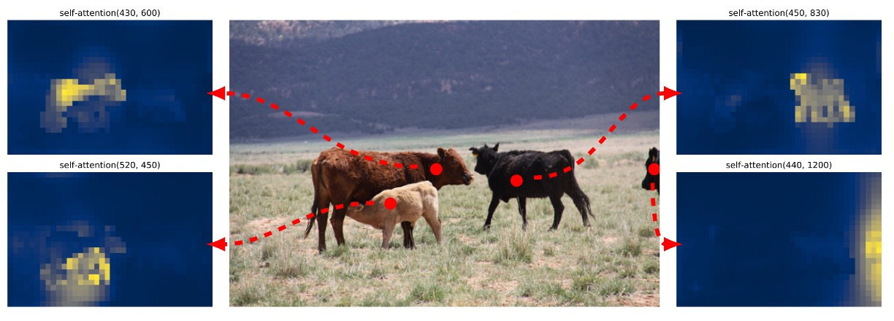
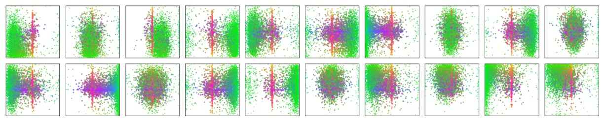
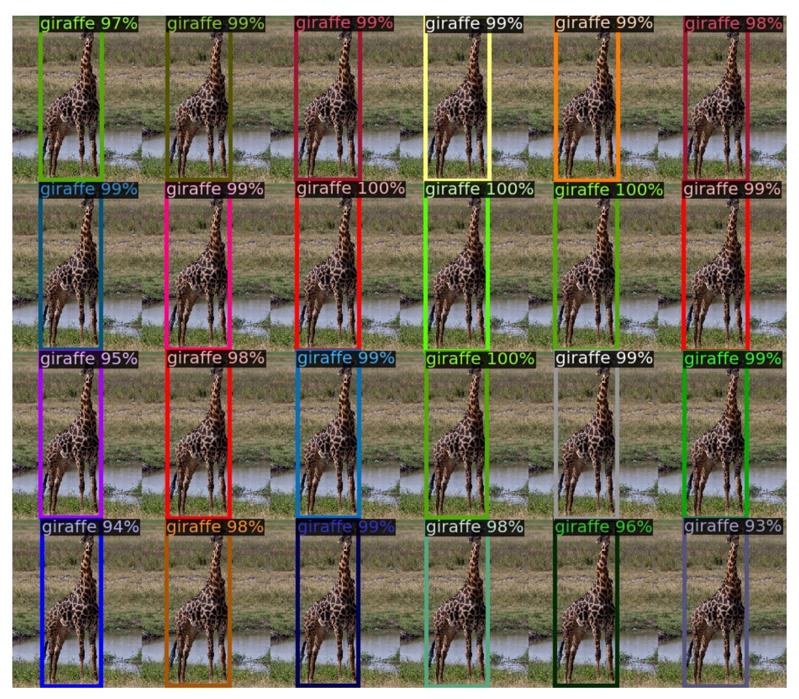

## A Cross-Domain Pioneer

[**End-to-End Object Detection with Transformers**](https://arxiv.org/abs/2005.12872)

---

Object detection has always been a core task in the field of computer vision.

## Problem Definition

In the domain of object detection, anchor-based methods have been quite popular in recent years. Architectures like Faster R-CNN, SSD, or YOLO predefine a set of anchor boxes on the image and then perform classification and box regression for each anchor.

Although effective, this design introduces several problems:

- The sizes and aspect ratios of anchors need to be manually designed based on the dataset characteristics, limiting generalization.
- Multiple anchors correspond to each location, causing many redundant predictions that require Non-Maximum Suppression (NMS) to filter.
- The alignment process between predicted boxes and ground truth is cumbersome, making the training pipeline highly coupled.

Not user-friendly?

What if we do not use anchors?

That is possible — anchor-free architectures have been developed for this purpose.

However, in practical scenarios, people want accuracy above all else! Users can tolerate a little delay (just a few seconds), and systems can be somewhat complex (after all, engineers handle that).

**But if the model is inaccurate, I will complain!**

Generally speaking, anchor-free architectures do not deliver satisfactory accuracy and fail to shine on standard object detection benchmarks.

Meanwhile, on the very same timeline, the neighboring field (NLP) has been vigorously advancing the latest Transformer architectures and achieving remarkable breakthroughs.

The authors of this paper propose:

> **Why don’t we discard these complicated mechanisms and try using Transformers together?**

## Solution

The overall architecture, as shown in the paper’s figure above, consists of three main modules:

1. **CNN Backbone**: Extracts feature maps from the input image.
2. **Transformer Encoder-Decoder**: Models the global context of the image and relationships between objects.
3. **Prediction Head (FFN)**: Outputs bounding boxes and classes.

### Model Architecture

First, let’s look at the Backbone.

The Backbone takes an input image $x_{img} \in \mathbb{R}^{3 \times H_0 \times W_0}$ and outputs features $f \in \mathbb{R}^{C \times H \times W}$ via a CNN backbone (e.g., ResNet50, typically with $C=2048$, $H=W=H_0/32$).

A $1 \times 1$ convolution is applied to reduce the channel dimension to $d$ (e.g., $d=256$), producing a feature map $z_0 \in \mathbb{R}^{d \times H \times W}$. This is then flattened into a sequence of length $HW$ and fed into the Transformer encoder.

<figure style={{ "width": "60%"}}>

</figure>

The Transformer Encoder is a standard architecture with each layer containing Multi-Head Self-Attention (MHSA) and a Feed-Forward Network (FFN). Because transformer tokens lack explicit positional relationships, fixed positional encodings (such as sine/cosine) are added at the input stage.

Next is the Transformer Decoder. The output simultaneously produces $N$ object predictions. Note this is not an autoregressive process since objects do not have strong dependency relations, allowing parallel output.

Each output position corresponds to a learnable **object query** ($\in \mathbb{R}^d$). The multiple decoder layers use self-attention and encoder-decoder attention to allow object queries to communicate with each other and align with image features. This enables the model to perform global reasoning across objects (e.g., considering relative object relations and overall distribution).

Finally, the prediction head attaches a 3-layer feed-forward network to each of the $N$ decoder outputs, producing:

- Class probabilities (softmax over $K+1$, where +1 denotes the "no object" class)
- Bounding box coordinates (normalized center coordinates, width, and height)

Here, the model predicts a fixed-length set of candidate boxes, unlike traditional dense grids or anchor boxes. This design allows training via a set-based loss.

### Loss Design

In past object detection training pipelines, the problem of **"which ground truth should a predicted box align with?"** is almost unavoidable.

For example, Faster R-CNN considers proposals with IoU > 0.5 as positive samples, and YOLO series assign predictions to the closest anchor box. These are all **heuristic assignment rules**, aiming to align predictions with ground truth to enable classification and regression training.

DETR, however, treats this as an optimization problem directly: it uses the **Hungarian Algorithm** for optimal matching, enforcing each prediction to correspond to a unique ground truth, thus avoiding duplicate predictions, overlapping boxes, and complicated post-processing rules.

- **Step 1: Optimal Matching (Bipartite Matching)**

  :::tip
  An introduction to the Hungarian algorithm could fill an entire article, so we will not elaborate here. Readers unfamiliar with this algorithm are encouraged to refer to the following link:

  - [**Hungarian algorithm**](https://en.wikipedia.org/wiki/Hungarian_algorithm)
    :::

  Suppose:

  - $y = \{ y_1, y_2, \dots, y_M \}$ is the set of ground truth objects, where each $y_i = (c_i, b_i)$ includes class and bounding box.
  - $\hat{y} = \{ \hat{y}_1, \hat{y}_2, \dots, \hat{y}_N \}$ is the set of predictions from the decoder, where $N \gg M$, and $\hat{y}_j = (\hat{p}_j, \hat{b}_j)$.

  To perform set matching, the authors pad $y$ with $N - M$ "no object" entries (denoted as $\varnothing$) to equalize set lengths, then define a **matching cost function $L_{\text{match}}$** to compute errors between predictions and ground truth:

  $$
  \hat{\sigma} = \arg\min_{\sigma \in S_N} \sum_{i=1}^N L_{\text{match}}(y_i, \hat{y}_{\sigma(i)})
  $$

  Here, $\sigma$ is a permutation of the $N$ predictions, searching for the best one-to-one alignment.

- **Step 2: Define Matching Cost**

  The cost between a pair $y_i = (c_i, b_i)$ and prediction $\hat{y}_j = (\hat{p}_j(c), \hat{b}_j)$ consists of two parts:

  - Classification cost: the smaller the predicted class probability $\hat{p}_j(c_i)$, the higher the cost.
  - Box cost: the larger the discrepancy between predicted box $\hat{b}_j$ and ground truth box $b_i$, the higher the cost.

  Note: **These losses apply only when $c_i \neq \varnothing$**, i.e., for actual object matches.

  Formally:

  $$
  L_{\text{match}}(y_i, \hat{y}_j) = -1_{\{c_i \neq \varnothing\}} \cdot \hat{p}_j(c_i) + 1_{\{c_i \neq \varnothing\}} \cdot L_{\text{box}}(b_i, \hat{b}_j)
  $$

  Log probabilities are not used here because the authors want the matching cost scale to be consistent with the box loss, avoiding domination by either term during optimization.

- **Step 3: Calculate Final Loss (Hungarian Loss)**

  After matching, the loss is computed as:

  $$
  L_{\text{Hungarian}}(y, \hat{y}) = \sum_{i=1}^N \left[ -\log \hat{p}_{\hat{\sigma}(i)}(c_i) + 1_{\{c_i \neq \varnothing\}} L_{\text{box}}(b_i, \hat{b}_{\hat{\sigma}(i)}) \right]
  $$

  - The first term is the classification loss: lower predicted class probabilities for objects result in higher loss.
  - The second term is the box loss (explained below).
  - For $c_i = \varnothing$ (background), the classification loss is down-weighted by a factor of 0.1 to prevent background samples from overwhelming object signals (similar to subsampling in Faster R-CNN).

- **Step 4: Box Loss Design ($L_{\text{box}}$)**

  Unlike YOLO or Faster R-CNN, DETR predicts **absolute normalized bounding box coordinates directly** rather than relative offsets. While simple, this causes a problem:

  > **$\ell_1$ loss scale differs between small and large boxes, even if relative errors are the same.**

  To address this, the authors combine two losses:

  - $\ell_1$ loss: directly measures coordinate difference, encouraging positional accuracy.
  - **Generalized IoU (GIoU) loss**: measures overlap quality between boxes, invariant to scale.

  The combined formula is:

  $$
  L_{\text{box}}(b_i, \hat{b}_j) = \lambda_{\text{IoU}} \cdot L_{\text{GIoU}}(b_i, \hat{b}_j) + \lambda_{\ell_1} \cdot \| b_i - \hat{b}_j \|_1
  $$

  - $\lambda_{\text{IoU}}$ and $\lambda_{\ell_1}$ are weight hyperparameters that require tuning.
  - All losses are normalized by the total number of objects per batch.

  ***

  :::tip
  For details on GIoU, please refer to the following paper:

  - [**[19.02] Generalized Intersection over Union: A Metric and A Loss for Bounding Box Regression**](https://arxiv.org/abs/1902.09630)
    :::

To summarize the key points of this loss design:

- **One-to-one matching**: each object predicted once, no duplicates or overlaps, fully eliminating post-processing.
- **Simple background handling**: background treated as $\varnothing$ class, no dense negative sampling required.
- Combination of **GIoU + $\ell_1$** balances location and overlap learning.

This is the core reason why, despite its simple architecture, DETR can truly realize end-to-end object detection in training.

### Dataset

Experiments were conducted on the COCO 2017 dataset, covering object detection and panoptic segmentation tasks. The dataset contains 118,000 training images and 5,000 validation images, each annotated with bounding boxes and panoptic segmentation. On average, each image contains 7 object instances, with up to 63 in some cases. Object sizes vary widely, with a mix of small and large objects, posing a challenging setting.

Model performance is mainly evaluated by Average Precision (AP) on bounding boxes. When comparing with Faster R-CNN, the authors use validation results from the last training epoch; for ablation studies, median results over the last 10 epochs are reported.

### Technical Details

The model is trained using the AdamW optimizer with an initial learning rate of $1 \times 10^{-4}$ for the Transformer and $1 \times 10^{-5}$ for the backbone, and weight decay set to $1 \times 10^{-4}$. Transformer weights are initialized with Xavier initialization, and the backbone uses ImageNet-pretrained ResNet models with frozen BatchNorm layers.

The authors evaluate several backbone variants, including standard ResNet-50 (DETR) and ResNet-101 (DETR-R101), as well as DC5 variants (DETR-DC5 and DETR-DC5-R101) that add dilation in the last layer to increase feature resolution. The DC5 design improves small object detection but increases self-attention computation in the encoder by 16 times, roughly doubling overall FLOPs.

Multi-scale augmentation is used during training by resizing the shorter image side between 480 and 800 pixels, while limiting the longer side to 1333 pixels. To enhance global relational learning, random cropping augmentation is applied with a 0.5 probability, cropping random patches then resizing back to original scale, yielding roughly +1 AP improvement.

Additionally, a simple but effective inference strategy is employed: for "no object" prediction slots, if the second-highest scoring class has reasonable confidence, it replaces the original prediction, improving AP by about 2 points. Dropout of 0.1 is used during training, with other hyperparameters detailed in the paper’s Appendix A.4.

## Discussion

### How does it perform this time?

<figure style={{ "width": "80%"}}>

</figure>

Small object detection suffers significantly (AP$_S$: 27.2 → 23.7), but overall performance still appears reasonable.

---

Carefully comparing DETR and Faster R-CNN training conditions and model performances reveals several key points:

1. **Fundamental Differences in Training Strategies**

   DETR employs a Transformer architecture naturally paired with optimizers like AdamW or Adagrad, which suit sparse updates, and relies on longer training schedules with dropout for stable learning.

   In contrast, traditional Faster R-CNN typically uses SGD with more conservative data augmentation. Conceptually, their design philosophies diverge significantly.

2. **Adjustments for Fair Comparison**

   To ensure Faster R-CNN competes fairly, the authors applied enhancements including:

   - Adding generalized IoU to the box loss;
   - Applying the same random cropping data augmentation as DETR;
   - Extending training cycles to 9× (109 epochs).

   These modifications yield about 1–2 AP improvement, establishing a more balanced baseline against DETR.

3. **Model Design and Parameter Alignment**

   DETR’s configuration uses 6 encoder + 6 decoder layers, model dimension 256, and 8 attention heads, resulting in roughly 41.3M parameters—comparable to Faster R-CNN + FPN (23.5M in ResNet-50 backbone and 17.8M in Transformer). This ensures fair comparison in terms of model capacity.

4. **Experimental Results and Key Observations**

- **Overall performance**: DETR reaches 42 AP on COCO validation, on par with the tuned Faster R-CNN.
- **Large object detection (AP$_L$)**: DETR shows clear advantage (+7.8), the main reason for catching up overall.
- **Small object detection (AP$_S$)**: DETR lags behind significantly (-5.5), forming the primary bottleneck.
- **Higher-resolution variant (DETR-DC5)**: Despite improved total AP, it still fails to surpass Faster R-CNN on small objects.
- **Backbone variations**: Using ResNet-101 backbone, the trends remain consistent across both models, indicating robustness of comparison.

Overall, DETR, under long training and high-resolution settings, can truly compete with Faster R-CNN at similar parameter counts.

However, its small object recognition is limited by the global attention’s resolution bottleneck, leaving room for improvements in subsequent architectures (e.g., Deformable DETR).

### Component Analysis of the Model

The authors thoroughly investigate the importance of each DETR component:

1. **Effect of Encoder Layers**

   

   <figure style={{ "width": "90%"}}>
   
   </figure>
   

   Removing the encoder eliminates image-level global self-attention, causing a 3.9 AP drop overall, with the largest impact on large objects (6.0 AP loss).

   This suggests the encoder does more than filtering features; it segments potential objects in the scene globally. Visualizations of the last encoder layer’s attention weights confirm its ability to roughly separate instances, crucial for decoder recognition and localization.

   

   <figure style={{ "width": "90%"}}>
   
   </figure>
   

2. **Decoder Layers and NMS Relationship**

   

   <figure style={{ "width": "60%"}}>
   
   </figure>
   

   The DETR decoder has auxiliary supervision at every layer, with each layer trained to produce independent object predictions. Experiments show AP steadily improves with layer depth; the gap between first and last layer reaches +8.2 (AP) / +9.5 (AP$_{50}$).

   Early layers suffer from duplicated predictions due to lack of context interaction. Applying traditional NMS after the first layer significantly reduces duplicates. However, as layers deepen, the model learns to suppress duplicates internally, making NMS benefit diminish, and even cause true positive removals in the final layer, reducing AP.

   Attention visualizations show decoder attention is relatively local, often focusing on object extremities (e.g., heads, feet). This aligns with encoder-driven global instance separation, indicating the decoder refines classification and localization on detailed contours.

   

   <figure style={{ "width": "90%"}}>
   
   </figure>
   

3. **Role of FFN in Transformer**

   The feed-forward network (FFN) inside each Transformer block acts like a channel-wise 1×1 convolution. Removing FFNs reduces Transformer parameters from 17.8M to 4.8M, and total model size from 41.3M to 28.7M.

   However, this causes a 2.3 AP drop, indicating FFNs, despite structural simplicity, contribute substantially to semantic separation and feature transformation.

4. **Positional Encoding Design and Alternatives**

   

   <figure style={{ "width": "90%"}}>
   
   </figure>
   

   DETR uses two positional encodings:

   - Spatial positional encoding: input image position information.
   - Output positional encoding: embedded vectors for object queries.

   Output encoding is essential and cannot be removed. For spatial encoding, several variants were tested:

   - Removing spatial encoding entirely drops AP by 7.8 but still achieves over 32, showing some robustness.
   - Using sinusoidal or learned encodings injected into attention layers yields only minor AP drops (\~1.3–1.4).
   - Removing spatial encoding only in encoder causes just 1.3 AP loss, suggesting positional encoding is mostly critical in the decoder.

   These results confirm that although Transformers naturally model sequences, explicit spatial cues remain indispensable for learning object positions and boundaries in vision tasks.

5. **Decomposing Loss Contributions**

   

   <figure style={{ "width": "90%"}}>
   
   </figure>
   

   DETR’s training loss consists of three parts:

   - Classification loss
   - Bounding box L1 loss
   - Generalized IoU (GIoU) loss

   Classification loss is indispensable. The authors tested ablations turning off L1 or GIoU losses:

   - Using only GIoU still yields reasonable accuracy, highlighting its key contribution to localization.
   - Using only L1 leads to significant performance drops.

   The combined design remains the most stable configuration.

   This validates DETR’s core loss design philosophy: rather than relying on complex post-processing, incorporate spatial and semantic metrics directly into cost calculation and loss backpropagation.

### Model Behavior Analysis

In the figure above, the authors visualize prediction results on the entire COCO 2017 validation set. They randomly sample 20 object query slots and analyze the distribution of all bounding boxes predicted by these slots in terms of position and size.

Each predicted box is represented by its normalized center coordinates in the \[0, 1] × \[0, 1] space, and color-coded according to its shape: green denotes small boxes, red indicates large horizontal boxes, and blue represents large vertical boxes.

The results show that each slot does not operate indistinctly, but naturally develops several preference patterns:

- Some slots focus on specific spatial regions (e.g., top-left corner, center),
- Some tend to predict boxes of particular scales or shapes,
- Almost all slots have a pattern of predicting a “full-image sized” box, common for prominent objects in COCO such as large vehicles or buildings.

This spatial and scale specialization is not explicitly supervised but emerges naturally through the learning dynamics induced by the set matching loss. This indicates that DETR internally learns a form of **implicit structured prediction strategy based on query specialization**.

Without relying on anchors or region proposals, each query slot effectively “attends” to specific regions or object scales, a unique behavior of set-based approaches.

### Generalization to Unseen Object Counts

<figure style={{ "width": "70%"}}>

</figure>

Most COCO images contain a limited number of objects per class. For instance, the training set never contains more than 13 giraffes appearing simultaneously. To test whether DETR can generalize to such extreme cases, the authors created a synthetic image containing 24 giraffes.

The results show DETR successfully detects all 24 instances, providing a clear out-of-distribution test case. This demonstrates:

- DETR’s object queries are not hard-coded to specific classes;
- The model operates by flexibly assigning queries to objects based on the entire image, rather than binding classes to specific slots.

This echoes the earlier design philosophy: object queries act as blank slots in set prediction, with their behavior fully driven by loss matching and attention, not predefined semantic roles. Despite this, the model spontaneously learns effective and scalable object separation capabilities.

## Conclusion

No technique is perfect.

DETR clearly exhibits a bottleneck in small object detection, as confirmed by experimental data and visual analysis. Even with long training schedules and increased resolution, it still lags behind traditional methods on the AP$_S$ metric. Compared to the well-established and engineering-mature Faster R-CNN, DETR only achieves comparable performance in certain scenarios, reminding us that it is not yet a universal solution for all tasks.

However, DETR’s value lies not in outright performance superiority, but in the new conceptual and architectural possibilities it opens.

This is the first work to meaningfully apply the Transformer architecture to object detection, replacing traditional engineering dependencies such as anchors, proposals, and NMS with set prediction and Hungarian matching. Its highly simplified end-to-end design compresses complex pipelines into a pure sequence-to-set transformation, combining conceptual clarity with implementation elegance, endowing it with strong extensibility and theoretical appeal.

Follow-up works based on this architecture number at least a hundred, making this a classic paper well worth multiple readings.
