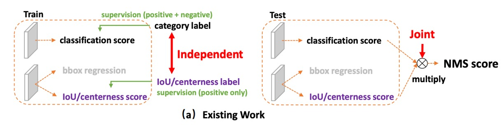

## Unified Focus

[**Generalized Focal Loss: Learning Qualified and Distributed Bounding Boxes for Dense Object Detection**](https://arxiv.org/abs/2006.04388)

---

This method has repeatedly appeared in recent object detection systems. Let’s take a quick look at its core concepts.

## Problem Definition

In object detection, we are always chasing two types of scores:

- **Classification Score**: What is inside this box?
- **Localization Quality**: How accurate is this box?

Mainstream one-stage detectors (dense/one-stage) typically learn these two tasks **separately**: one branch for classification, another branch for quality (such as IoU or centerness).

When it comes to inference, all candidate boxes are sorted with NMS, and we **directly multiply the two scores** to get the final score, which determines which boxes survive as the final predictions.

<figure style={{ "width": "90%"}}>

</figure>

Why multiply?

Intuitively, we want either the classification score or the localization score to be high—ideally, both should be high.

Multiplication in the 0–1 score range rapidly pulls down the overall score if either side is low. Sounds reasonable, right?

But this brings two structural problems:

1. **Inconsistency Between Training and Inference**:

   During training, the classification and quality branches are independent—**the model is never explicitly required to make “the product of both” good**. But in inference, we suddenly use their product for ranking.
   If the model could talk, it would probably complain: “Hey, that’s not what we agreed on!”

2. **Interference from Negative Samples**:

   The quality branch is usually supervised **only for positive samples**; background or negative samples have no explicit constraints.

   As a result, sometimes the quality score for background boxes **can become inexplicably high**:

   - Even if the classification score is low, a sudden spike in the quality score means the final product might still make it to the top, **pushing out true positives**.
   - In dense anchor/fully sampled scenarios, this kind of “mis-ranking” gets amplified, directly harming the final decision made by NMS.

    

    <figure style={{ "width": "90%"}}>
    
    </figure>
    

---

These aren’t the only issues—we also have doubts about **the representation of bounding boxes themselves**.

For years, boxes have been treated as “deterministic coordinates,” but the real world is full of uncertainty: blurry boundaries, occlusion, annotator differences, etc. Describing everything with a single point is too rigid.

Some have introduced **Gaussian distributions**, letting the model learn a mean and variance to at least express “uncertainty.” But Gaussian distributions are inherently symmetric and unimodal; when faced with real data that may be **skewed, long-tailed, or even multimodal**, they become inadequate.

So we’re stuck again:

- **Score level**: Classification and localization quality **speak different languages**; the training objective and inference ranking **don’t match**, and negative samples occasionally mess things up.
- **Box representation**: It’s either **overly deterministic** or **oversimplified**, making it hard to truly reflect the actual distribution in the data.

Can we make “classification” and “quality” speak the same language, aligning training and inference from the start?

Can we avoid presetting what the box distribution looks like, and instead let the model learn a “more general, more flexible” distributional representation directly?

## 解決問題

Before diving into the methods proposed in this paper, let’s first review the Focal Loss we learned in the past.

:::tip
For details on Focal Loss, you can refer to our previous notes:

- [**[17.08] RetinaNet: Focal Loss is the Key**](../1708-retinanet/index.md)
  :::

### Focal Loss

In one-stage object detection, the first challenge faced by the classifier is **extreme sample imbalance**.

Most candidate boxes are background (negative), while real foregrounds (positive) are extremely rare. This causes traditional cross-entropy loss to be dominated by “a huge number of easy background samples.” The model quickly learns to classify the background correctly, but struggles to properly learn those truly difficult foreground samples.

The goal of Focal Loss is:

> **Suppress the contribution of easy samples and highlight the impact of hard samples.**

It introduces a “dynamic scaling factor” $(1-p_t)^{\gamma}$ in front of the loss function. This makes the contribution of “samples that the model predicts with high confidence” close to zero, while “uncertain/easy-to-misclassify” samples are emphasized.

The formula is:

$$
\mathrm{FL}(p) \;=\; - (1 - p_t)^{\gamma}\,\log p_t,\qquad
p_t \;=\;
\begin{cases}
p, & y=1 \\
1-p, & y=0
\end{cases}
$$

Where:

- $p \in [0,1]$: The model’s predicted probability for the positive class.
- $y \in {0,1}$: The ground truth label.
- $\gamma \ge 0$: Controls the suppression strength for “easy samples.”

The key to this mechanism is that it is not just for binary $y \in {0,1}$, but also sets the stage for **extending to continuous labels** ($y \in [0,1]$). In other words, even when we go beyond the simple “right/wrong” division and consider more fine-grained localization quality, the “hard example mining” spirit of Focal Loss remains intact.

### Quality Focal Loss

<figure style={{ "width": "90%"}}>

</figure>

Having understood Focal Loss’s focusing mechanism, let’s take it a step further:

> In object detection, outputting a box means not only answering “what class is this?” but also “how accurate is this box?”

Traditionally, **classification scores and localization quality scores are learned separately and only multiplied at inference**.

However, as we discussed, this “last-minute fusion” introduces inconsistency: the model is trained for classification, but inference relies on a combination of classification and quality, without real synergy.

To solve this, the authors propose **Quality Focal Loss (QFL)**.

The design concept is: **let the model learn the “classification × quality” composite score from the very beginning, rather than stitching them together afterward.**

---

In practice, the authors first introduce continuous labels.

- For the ground truth class $c^*$, the **label is no longer simply $0$ or $1$**, but the candidate box’s **IoU value with the GT**, i.e., $y \in [0,1]$.

  - $y=0$: Not this class or quality is zero.
  - $y=1$: Perfect and high-quality match.
  - In between: The box is partially correct, with limited quality.

- For negative samples, all class labels remain $0$ (quality = 0).

- The model output for each class is a **sigmoid probability** $\sigma \in [0,1]$.

---

For the loss function, QFL achieves its goal in two steps:

It extends the original binary cross-entropy (BCE) into the full BCE form, and replaces the Focal modulation factor with a “continuous version based on label distance”:

$$
\mathrm{QFL}(\sigma) \;=\; -\,|y-\sigma|^{\beta}\;\big[(1-y)\log(1-\sigma) + y\log\sigma\big], \qquad \beta \ge 0
$$

Key points:

- When $\sigma = y$, $\mathrm{QFL}$ reaches its **global minimum**.
- $|y-\sigma|^{\beta}$ is the “continuous focusing factor”: the further the output deviates from the label, the heavier the penalty.
- If $y \in {0,1}$ and an appropriate $\beta$ is chosen, this **degenerates to the original Focal Loss** form.

With QFL, the model’s output $\sigma$ **already encodes both classification and quality signals**, so during inference, sorting and NMS can **directly use $\sigma$**, greatly reducing inconsistencies.

:::tip
Let’s look at an example:

Suppose we are training a detector for “dog,” with the corresponding class _dog_.

Now, in a given image, there are candidate boxes (proposals) with different IoUs to the ground truth (GT):

1. **Candidate Box A**: IoU = 0.9 (almost perfect, very high quality)
2. **Candidate Box B**: IoU = 0.4 (roughly correct, but noticeably off in position)
3. **Candidate Box C**: IoU = 0.0 (completely incorrect, background)

---

- **Traditional Focal Loss (FL)**

  In FL, the label $y$ can only be binary:

  - A → $y=1$
  - B → $y=1$ (even though IoU is only 0.4, it’s still a “positive sample”)
  - C → $y=0$

  The model only learns: **A and B are both positive, C is negative**.
  In other words, the model doesn’t know “A is much better than B,” because the training signal doesn’t contain that information.

  ***

- **Quality Focal Loss (QFL)**

  In QFL, the label $y$ is no longer just ${0,1}$, but the candidate box’s **IoU** value:

  - A → $y=0.9$
  - B → $y=0.4$
  - C → $y=0.0$

  Now, the model output $\sigma$ will be directly trained to “approach the IoU”:

  - A should learn $\sigma \approx 0.9$
  - B should learn $\sigma \approx 0.4$
  - C should learn $\sigma \approx 0.0$

  In other words, the “classification score” output by the model **simultaneously reflects both “is it a dog” and “how well is it drawn.”**

---

Take candidate box B as an example for the loss function:

- Ground truth label $y=0.4$
- Model’s first prediction $\sigma=0.7$

At this point:

$$
\mathrm{QFL}(0.7) = -\,|0.4-0.7|^\beta \big[(1-0.4)\log(1-0.7) + 0.4 \log(0.7)\big]
$$

- The focusing factor $|0.4-0.7|^\beta$ reminds the model:
  **“You’re still off by 0.3 from the ground truth; fix it.”**
- The term inside the parentheses is BCE, pulling $\sigma$ toward $0.4$.

So in the end, $\sigma$ will gradually converge to the **actual IoU value**, rather than just learning “dog/no dog.”
:::

### Distribution Focal Loss

At this point, we’ve unified classification and quality in QFL.

Next, the remaining issue is **box localization regression**.

Traditionally, the offset for each edge (left, right, top, bottom) is regressed directly to a single number.

This is essentially telling the model:

> “There’s only one correct answer—you must hit it exactly.”

This sounds reasonable, but it’s actually **too strict**.

Because in the real world, box positions are not a single absolute answer—there’s labeling error in the data, and the model’s predictions are uncertain. If you regress to a single value, it’s like asking an archer to “hit only the bullseye,” with zero tolerance for deviation.

Some have thought of using a Gaussian distribution instead of a single point, allowing the model to express uncertainty. This is better than direct delta regression, but a Gaussian is **symmetric and of fixed shape**, and still cannot flexibly express things like “I lean more toward the left.”

The authors argue: Instead of forcing the model to “report an answer directly,” why not let the model “describe its own belief as a distribution”?

- First, discretize the possible regression range into bins ($y_0, y_1, \dots, y_n$).
- Then, let the model output a **softmax probability distribution** over these bins.
- Finally, take the expected value of the distribution as the regression result:

$$
\hat{y} = \sum_{i=0}^n S_i \, y_i
$$

This way, the model doesn’t have to obsess over a single number, but can say “I think the answer is somewhere around here.”

However, this approach allows infinitely many distribution shapes to produce the same expected value, making efficient learning difficult.

<figure style={{ "width": "90%"}}>

</figure>

So, the authors introduce a clever design: supervise **only the two bins closest to the ground truth**.

Suppose the true value $y$ is between $y_i$ and $y_{i+1}$. Decompose it into weights:

- The closer to $y_i$, the greater the weight for $y_i$.
- The closer to $y_{i+1}$, the greater the weight for $y_{i+1}$.

Mathematically:

$$
w_{\text{left}} = \frac{y_{i+1}-y}{y_{i+1}-y_i}, \qquad
w_{\text{right}} = \frac{y-y_i}{y_{i+1}-y_i}
$$

The loss function is simple—just use cross-entropy:

$$
\mathrm{DFL} = - \Big[ w_{\text{left}} \log S_i + w_{\text{right}} \log S_{i+1} \Big]
$$

When the model learns $S_i = w_{\text{left}}$ and $S_{i+1} = w_{\text{right}}$, the expected value can **accurately reconstruct the true $y$**.

:::tip
Let’s go back to the dog detection example: what about the box position?

Earlier, in the QFL example, we cared about “whether there’s a dog in this box, and how well it’s drawn.”
Now, let’s look at it from another angle: **Suppose candidate box B has IoU=0.4 because the right boundary is drawn too far out.** How do we train the model to pull the right boundary back in?

- **Traditional regression**: Directly tell the model, “move the right boundary 7.3 pixels to the left.”

  - But in reality, there may be some annotation error—does it really have to be exactly 7.3?

- **DFL approach**:
  Decompose the ground truth “7.3” into nodes 7 and 8, and tell the model:

  > “The probability of the boundary being at 7 is 0.7, and at 8 is 0.3.”

In this way, the predicted distribution will concentrate around the ground truth (between 7 and 8), and the final expected value $\hat y = 0.7 \times 7 + 0.3 \times 8 = 7.3$, perfectly aligning with the label.
:::

### Generalized Focal Loss

If we plot the two lines (QFL and DFL) on the same coordinate system, we’ll see that we’ve been doing the same thing all along:

> **Between two adjacent label values, use probability to perform linear interpolation, and use “how close to the true value” to determine whether to amplify the penalty.**

First, define the minimal local coordinate system:

1. Take two adjacent continuous label values $y_l < y_r$.
2. The model only needs to predict their probabilities $p_l, p_r \ge 0$ (with $p_l + p_r = 1$).
3. The final continuous prediction is obtained by linear combination:

   $$
   \hat y \;=\; y_l\,p_l \;+\; y_r\,p_r, \qquad y \in [y_l,\,y_r].
   $$

Next, embed the spirit of **focusing on hard examples** into the loss function in a continuous manner:

If $\hat y$ is far from the ground truth $y$:

- The penalty increases.
  If it’s close:
- The penalty decreases.

This leads us to **Generalized Focal Loss (GFL)**:

$$
\mathrm{GFL}(p_l,p_r)
\;=\;
-\;\big|\,y - (y_l p_l + y_r p_r)\,\big|^{\beta}
\;\Big[\,(y_r - y)\,\log p_l \;+\; (y - y_l)\,\log p_r\,\Big]
$$

This formula encapsulates two key elements:

- **Soft-label cross-entropy** (the term in brackets; weights determined by $y$’s relative position within $[y_l, y_r]$);
- **Continuous focusing factor** $\big|y-\hat y\big|^{\beta}$ (the greater the absolute distance, the stronger the penalty; $\beta$ controls the strength).

In this formula, the global minimum is reached when

$$
p_l^* \;=\; \frac{y_r - y}{\,y_r - y_l\,}, \qquad
p_r^* \;=\; \frac{y - y_l}{\,y_r - y_l\,},
$$

At this point, $\hat y = y_l p_l^* + y_r p_r^* = y$, meaning the prediction exactly matches the continuous ground truth.

As $\beta$ increases, examples farther from the ground truth are penalized more heavily; with $\beta=0$, it reduces to pure soft-label cross-entropy.

---

At this point, GFL gives us a clean perspective:

> Describe continuous labels by “interpolation between two points,” and determine the focusing strength by “distance to the true value.”

Classification and quality finally **speak the same language**, and box localization evolves from a **single point** to a **distribution**;

Both can ultimately be unified by a single concise formula.

That’s the end of our look at this paper.

Congratulations.

## Discussion

This paper conducts a comprehensive evaluation on **COCO**, following common settings:

- Training uses **trainval35k (115K)**.
- Validation uses **minival (5K)** for ablation studies.
- Final main results are reported on **test-dev (20K)**.

The implementation is based on **mmdetection** default hyperparameters; unless otherwise stated, ablations use **ResNet-50**, **1× schedule (12 epochs)**, and **no multi-scale**. Speed is measured on **RTX 2080Ti, batch=1**.

### Is QFL Effective?

<figure style={{ "width": "90%"}}>

</figure>

Results are shown in the table above:

- **Table (a) Design Comparison: Unified Representation (QFL) Outperforms Separate or Implicit Schemes.**

  Under the same training settings and backbone, switching classification and localization quality to a single unified score (directly supervised by QFL) consistently surpasses:

  - “Separate quality estimation” methods using IoU or centerness branches, and implicit weighting in classification loss.

  This shows that using a single score to represent both “what” and “how well” is more effective than post-hoc multiplication; at the same time, if you still use separate quality estimation, IoU is generally a better quality metric than centerness.

- **Table (b) Cross-architecture Generalization: Plug-and-Play, Consistent Gains.**

  Replacing the original classification loss in various one-stage detectors with QFL as the training objective for the classification head yields consistent accuracy improvements; QFL’s benefit does not depend on specific anchor designs or matching strategies (as shown in table (b)).

  In practice, you can simply remove the “multiplication at inference” and use QFL’s output as the NMS ranking score.

- **Table (c) Parameter Sensitivity: $\beta=2$ is a Robust Choice.**

  QFL’s focusing factor uses $|y-\sigma|^{\beta}$; ablations show that $\beta=2$ is overall the most robust, effectively focusing on harder outliers without excessively suppressing easy samples (see table (c)).

### Is DFL Effective?

<figure style={{ "width": "90%"}}>

</figure>

Results are shown in the table above:

- **Table (a) Advantages of Distributional Regression: General Distribution Outperforms Gaussian and Dirac.**

  Changing box regression from a single point (Dirac) to a general distribution and adding DFL loss steadily improves AP across IoU thresholds, especially at higher IoU (e.g., 0.75), where the gains are even more pronounced.

  Qualitative results show that in **blurry boundaries and severe occlusion** scenarios, the general distribution more accurately fits object boundaries, outperforming Gaussian and Dirac; the distribution shapes in all four directions can also truly reflect uncertainty.

- **Table (b) and (c) Hyperparameter Robustness: $n$ Is Insensitive, Smaller $\Delta$ Is Better.**

  Histogram analysis of regression target distributions shows that the chosen discretization granularity is robust on **ATSS** with **$n \approx 14\sim16$**; **a small bin size ($\Delta=1$)** is recommended for fine quantization and more accurate expectation recovery. Overall, $n$ is not very sensitive and allows flexibility.

- **Learning Efficiency: Pushing Probability Mass Toward the Ground Truth**

  DFL, through soft-label cross-entropy on two neighboring nodes, **explicitly encourages probability to concentrate near $y$**, avoiding inefficient distributions with the same expectation but varying shapes. This directly improves **localization precision at high IoU thresholds** and yields stable AP gains.

DFL upgrades box regression from “guessing a number” to “outputting a distribution whose expectation recovers the truth”; in this framework, the model can give more reasonable geometric predictions for **uncertainty and occlusion**, achieving **stable AP improvement with negligible overhead**.

Practical recommendations: **$n=14\sim16$, $\Delta=1$** as default, and use with QFL/geometric losses.

## Conclusion

GFL **combines classification and localization quality into a single supervised score (QFL)** and **upgrades box regression from a single point to a learnable distribution (DFL)**.

The former addresses the long-standing inconsistency between training and inference; the latter enables the model to accurately recover continuous positions via expectation, while honestly expressing “uncertainty.” Together, these designs form the **Generalized Focal Loss** framework, which pushed the accuracy-speed boundary of one-stage detectors further on COCO at the time.

GFL turns “score alignment” and “distributional regression” into **reusable design languages**:

- You can **directly replace your one-stage dense detector’s losses with QFL+DFL** for more reliable ranking and robust geometry;
- Or take them as conceptual sources for “quality as score” and “box as distribution,” to be compared alongside TAL, VFL, or even E2E alignment approaches.

It’s not the end, but it has changed the **default mindset** when designing detectors—a fact that remains clear in 2025.

---

:::info
**Subsequent Developments (2021–2023)**

The community continued to advance along the same main line: how to make the “classification score” more reliably reflect “localization quality.”

**GFLv2** directly utilizes statistics from the “learned box distribution” to estimate quality, making quality prediction more dependable. **VarifocalNet (VFL)** takes the “IoU-aware classification score” approach, directly incorporating IoU into the label design; both methods push “score alignment” even further.

This period also saw the emergence of **TOOD / TAL**, which align the best samples for classification and regression from both the assignment and loss perspectives, making alignment a standard concept for one-stage detectors.

**Where is it in 2025?**

- **DFL has become the default in YOLO series**: Starting with YOLOv8, DFL is widely adopted for box regression, and the Ultralytics training interface explicitly uses `dfl` as a weight. Later, YOLOv11 documentation and third-party benchmarks also include DFL as part of the loss composition.
- **QFL/IoU-aware classification has permeated more frameworks**: Even in Transformer-based DETR families, recent research on alignment often evaluates **QFL/VFL** and similar IoU-aware classification designs alongside alignment losses.
- **Box distribution/joint scores are now mainstream toolbox components**: For example, MMDetection has long maintained the GFL head, providing standardized QFL+DFL implementations for easy replacement in one-stage baselines like ATSS/FCOS.

**YOLOv10 in 2024–2025** shifted focus to **NMS-free unified training** and consistent assignment, representing a new direction beyond score alignment; yet, for box regression, DFL or its variants remain common.

**Limitations and Use Cases**

- **QFL is not a cure-all**: It assumes IoU is a good proxy for quality—which is true for most datasets, but for tiny objects, severe occlusion, or significant annotation bias, IoU remains a “coarse-grained” indicator. That’s why methods like GFLv2, which estimate quality directly from box distribution statistics, were developed.
- **DFL introduces discretization hyperparameters**: You have to choose the number and width of bins. Although literature suggests **$n\approx14\sim16$, $\Delta=1$** is robust and low-cost, in ultra-high-resolution or long-tail scenarios, you might need to tune them further to avoid quantization errors.
- **Relationship with new E2E designs**: In DETR/Align-style “one-to-one matching” systems, classification-quality alignment is mostly handled by the matching mechanism and specialized losses. GFL’s value lies in **one-stage dense detection**, remaining a robust, easy-to-implement replacement in this domain.
  :::
