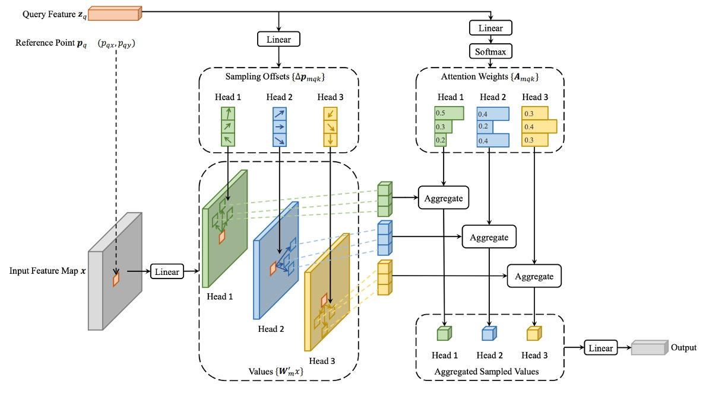
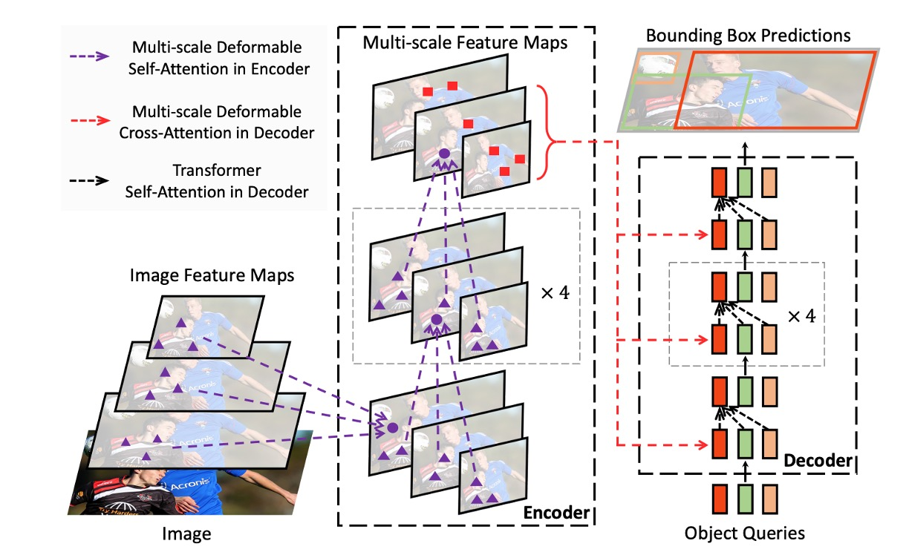
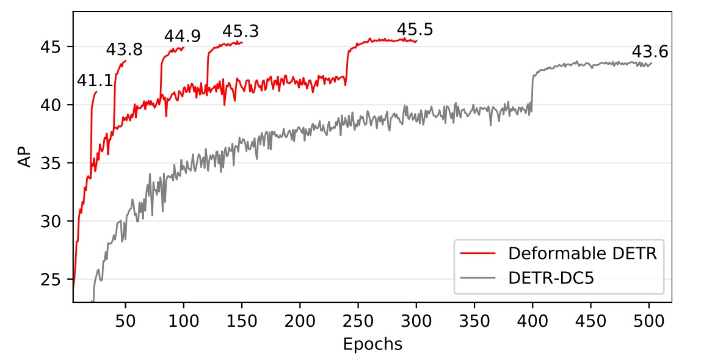

## Deformable Attention Mechanism

[**Deformable DETR: Deformable Transformers for End-to-End Object Detection**](https://arxiv.org/abs/2010.04159)

---

DETR leaves a lot of room for researchers to innovate.

It uses only the most basic Transformer architecture to perform the simplest object detection. There are no score-boosting tricks inside; it simply takes the image as input and outputs the object locations and classes.

What a beautiful paper!

Subsequent researchers can improve the model based on this idea, and papers will keep coming out rapidly.

## Problem Definition

Compared to current object detectors, DETR is just too slow.

If we compare it with the currently popular Faster-RCNN, its inference speed is twice as slow!

So what? It doesn’t seem like a big problem?

Correct, the problem is not the inference speed but the training convergence speed, which is 20 times slower!

What originally took one day of training now requires 20 days. How terrifying is that?

Time flies, youth fades. Waiting for the model to converge, waiting until the hair turns white.

This is unacceptable and must be changed.

## Problem Solution

The authors believe the problem lies in the Transformer’s attention mechanism.

Using Transformer on images means each pixel attends to all other pixels, causing most computation power to be wasted on ineffective areas.

So the original Transformer attention mechanism cannot be used here. Instead, inspired by the idea of “deformable convolution,” the original attention is modified into a “deformable attention mechanism.”

:::tip
At this time, ViT had not yet been published, so the operation was based on each pixel, not on image patches.
:::

### Deformable Attention

<div align="center">
<figure style={{ "width": "80%"}}>

</figure>
</div>

In the image feature map, given each query element, unlike the traditional Transformer, the authors select a reference point as a base and perform attention on several important sampling points around it.

Assuming the input feature map is:

$$
x
\in \mathbb{R}^{C \times H \times W}
$$

where $C$ is the number of channels, and $H$, $W$ are the height and width of the feature map, respectively.

The query element $q$ contains a content feature $z_q$ and a 2D reference point $p_q$. The deformable attention feature is computed as follows:

$$
\text{DeformAttn}(z_q, p_q, x) = \sum_{m=1}^{M} W_m \sum_{k=1}^{K} A_{mqk} \cdot W_m^{\prime} x(p_q + \Delta p_{mqk})
$$

where:

- $M$ is the number of attention heads.
- $K$ is the number of sampling points selected per query, chosen from a small neighborhood around the reference point.
- $A_{mqk}$ is the attention weight for the $k$-th sampling point of the $m$-th attention head, ranging in $\[0, 1]$.
- $\Delta p_{mqk}$ is the offset of the $k$-th sampling point of the $m$-th head; these offsets can be arbitrary real numbers.
- $W_m$ and $W_m^{\prime}$ are learnable weight matrices responsible for linear transformations of the input features.
- $x(p_q + \Delta p_{mqk})$ denotes the feature value at location $p_q + \Delta p_{mqk}$. Since this position is fractional (non-integer), bilinear interpolation is used to compute it.

The query feature $z_q$ undergoes a linear projection outputting a tensor with $3mk$ channels:

- The first $2mk$ channels encode the offsets $\Delta p_{mqk}$ of each sampling point.
- The remaining $mk$ channels pass through a softmax to produce the attention weights $A_{mqk}$.

This design ensures that both the offsets and attention weights are learned from the query element’s features rather than being fixed by a predetermined rule.

### Multi-Scale Computation

Modern object detection frameworks usually use multi-scale feature maps for detection.

The deformable attention module naturally supports a multi-scale version, allowing sampling and operations on multiple feature map layers simultaneously.

Assuming the multi-scale feature maps as ${x_l}_{l=1}^L$, where each feature map $x_l \in \mathbb{R}^{C \times H_l \times W_l}$.

The query element’s reference point is represented by normalized coordinates $\hat{p}_q \in \[0, 1]^2$. The multi-scale computation formula is:

$$
\text{MSDeformAttn}(z_q, \hat{p}_q, \{x_l\}_{l=1}^L) =
$$

$$
\sum_{m=1}^{M} W_m \sum_{l=1}^{L} \sum_{k=1}^{K} A_{mlqk} \cdot W_m^{\prime} x_l(\phi_l(\hat{p}_q) + \Delta p_{mlqk})
$$

- $L$ is the number of input feature map levels.
- $\phi_l(\hat{p}_q)$ is a scaling function that converts normalized coordinates to actual coordinates on the $l$-th feature map layer.
- Other symbols have similar meanings as in the single-scale case.

### Model Architecture

<div align="center">
<figure style={{ "width": "80%"}}>

</figure>
</div>

As shown above, after solving the deformable attention problem, replacing all the Transformer modules in the original DETR architecture yields Deformable DETR.

:::info
If theoretical knowledge is not your focus, you can also directly access their official implementation on Github:

- [**fundamentalvision/Deformable-DETR**](https://github.com/fundamentalvision/Deformable-DETR)
  :::

### Code Breakdown

Let's take a closer look at the author's implementation to understand the difference between MSDeformAttn and a standard Attention module:

```python
class MSDeformAttn(nn.Module):

    def __init__(self, d_model=256, n_levels=4, n_heads=8, n_points=4):
        """
        Multi-Scale Deformable Attention Module
        :param d_model      hidden dimension
        :param n_levels     number of feature levels
        :param n_heads      number of attention heads
        :param n_points     number of sampling points per attention head per feature level
        """
        super().__init__()
        if d_model % n_heads != 0:
            raise ValueError('d_model must be divisible by n_heads, but got {} and {}'.format(d_model, n_heads))
        _d_per_head = d_model // n_heads
        # you'd better set _d_per_head to a power of 2 which is more efficient in our CUDA implementation
        if not _is_power_of_2(_d_per_head):
            warnings.warn("You'd better set d_model in MSDeformAttn to make the dimension of each attention head a power of 2 "
                          "which is more efficient in our CUDA implementation.")

        self.im2col_step = 64

        self.d_model = d_model
        self.n_levels = n_levels
        self.n_heads = n_heads
        self.n_points = n_points

        self.sampling_offsets = nn.Linear(d_model, n_heads * n_levels * n_points * 2)
        self.attention_weights = nn.Linear(d_model, n_heads * n_levels * n_points)
        self.value_proj = nn.Linear(d_model, d_model)
        self.output_proj = nn.Linear(d_model, d_model)

        self._reset_parameters()

    def _reset_parameters(self):
        constant_(self.sampling_offsets.weight.data, 0.)
        thetas = torch.arange(self.n_heads, dtype=torch.float32) * (2.0 * math.pi / self.n_heads)
        grid_init = torch.stack([thetas.cos(), thetas.sin()], -1)
        grid_init = (grid_init / grid_init.abs().max(-1, keepdim=True)[0]).view(self.n_heads, 1, 1, 2).repeat(1, self.n_levels, self.n_points, 1)
        for i in range(self.n_points):
            grid_init[:, :, i, :] *= i + 1
        with torch.no_grad():
            self.sampling_offsets.bias = nn.Parameter(grid_init.view(-1))
        constant_(self.attention_weights.weight.data, 0.)
        constant_(self.attention_weights.bias.data, 0.)
        xavier_uniform_(self.value_proj.weight.data)
        constant_(self.value_proj.bias.data, 0.)
        xavier_uniform_(self.output_proj.weight.data)
        constant_(self.output_proj.bias.data, 0.)

    def forward(self, query, reference_points, input_flatten, input_spatial_shapes, input_level_start_index, input_padding_mask=None):
        """
        :param query                       (N, Length_{query}, C)
        :param reference_points            (N, Length_{query}, n_levels, 2), range in [0, 1], top-left (0,0), bottom-right (1, 1), including padding area
                                        or (N, Length_{query}, n_levels, 4), add additional (w, h) to form reference boxes
        :param input_flatten               (N, \sum_{l=0}^{L-1} H_l \cdot W_l, C)
        :param input_spatial_shapes        (n_levels, 2), [(H_0, W_0), (H_1, W_1), ..., (H_{L-1}, W_{L-1})]
        :param input_level_start_index     (n_levels, ), [0, H_0*W_0, H_0*W_0+H_1*W_1, H_0*W_0+H_1*W_1+H_2*W_2, ..., H_0*W_0+H_1*W_1+...+H_{L-1}*W_{L-1}]
        :param input_padding_mask          (N, \sum_{l=0}^{L-1} H_l \cdot W_l), True for padding elements, False for non-padding elements

        :return output                     (N, Length_{query}, C)
        """
        N, Len_q, _ = query.shape
        N, Len_in, _ = input_flatten.shape
        assert (input_spatial_shapes[:, 0] * input_spatial_shapes[:, 1]).sum() == Len_in

        value = self.value_proj(input_flatten)
        if input_padding_mask is not None:
            value = value.masked_fill(input_padding_mask[..., None], float(0))
        value = value.view(N, Len_in, self.n_heads, self.d_model // self.n_heads)
        sampling_offsets = self.sampling_offsets(query).view(N, Len_q, self.n_heads, self.n_levels, self.n_points, 2)
        attention_weights = self.attention_weights(query).view(N, Len_q, self.n_heads, self.n_levels * self.n_points)
        attention_weights = F.softmax(attention_weights, -1).view(N, Len_q, self.n_heads, self.n_levels, self.n_points)
        # N, Len_q, n_heads, n_levels, n_points, 2
        if reference_points.shape[-1] == 2:
            offset_normalizer = torch.stack([input_spatial_shapes[..., 1], input_spatial_shapes[..., 0]], -1)
            sampling_locations = reference_points[:, :, None, :, None, :] \
                                 + sampling_offsets / offset_normalizer[None, None, None, :, None, :]
        elif reference_points.shape[-1] == 4:
            sampling_locations = reference_points[:, :, None, :, None, :2] \
                                 + sampling_offsets / self.n_points * reference_points[:, :, None, :, None, 2:] * 0.5
        else:
            raise ValueError(
                'Last dim of reference_points must be 2 or 4, but get {} instead.'.format(reference_points.shape[-1]))
        output = MSDeformAttnFunction.apply(
            value, input_spatial_shapes, input_level_start_index, sampling_locations, attention_weights, self.im2col_step)
        output = self.output_proj(output)
        return output
```

From the architecture perspective, a traditional Attention module typically handles a single feature map. Here, it supports multiple feature levels (different resolutions), for example multiple stages output by ResNet FPN are flattened into a large `input_flatten`, accompanied by `input_spatial_shapes` and `input_level_start_index` which mark the size and position of each level.

- **Each Query Learns Its Own Offsets**

  ```python
  self.sampling_offsets = nn.Linear(d_model, n_heads * n_levels * n_points * 2)
  ```

  This means for each query, the model outputs multiple offsets (dx, dy), representing directions and distances offset from the reference point — essentially "where to look." These sampling offsets are learned rather than fixed predefined grids.

  ***

- **Reference Points Determine the “Base Location”**

  ```python
  if reference_points.shape[-1] == 2:
      ...
  elif reference_points.shape[-1] == 4:
      ...
  ```

  Attention is no longer computed over the entire image for each query, but locally weighted around specified `reference_points` with several offset points. These reference points can come from decoder queries or grid coordinates of encoder feature points.

  ***

That’s roughly it; other parts are largely similar to regular Attention.

### Training Strategy

The authors conducted experiments on the **COCO 2017** dataset.

The Backbone used is **ResNet-50**, pretrained on **ImageNet**. The Neck directly extracts features from multi-scale feature maps without using FPN.

Deformable Attention settings:

- Number of attention heads: **M = 8**
- Number of sampling points per query: **K = 4**

Parameters in the deformable transformer encoder are shared across different feature levels.

Hyperparameters and training strategy mostly follow DETR’s setup, with these exceptions:

- Bounding box classification uses Focal Loss with a loss weight of 2.
- Number of object queries increased from 100 to 300.

The model is trained for 50 epochs by default; at epoch 40, the learning rate is reduced to 0.1 times the original. Adam optimizer is used with a base learning rate of $2 \times 10^{-4}$, $\beta_1 = 0.9$, $\beta_2 = 0.999$, and weight decay of $10^{-4}$.

The linear projections predicting object query reference points and sampling offsets have their learning rates scaled by an additional factor of 0.1.

## Discussion

### Comparison with DETR

<div align="center">
<figure style={{ "width": "90%"}}>

</figure>
</div>

According to the table, compared to Faster R-CNN + FPN, DETR requires more training epochs to converge and performs worse on small object detection. Compared to DETR, Deformable DETR achieves better performance with roughly comparable training epochs to Faster R-CNN, especially in small object detection.

Detailed convergence curves are shown below:

<div align="center">
<figure style={{ "width": "90%"}}>

</figure>
</div>

Through iterative bounding box refinement and a two-stage mechanism, this method further improves detection accuracy.

Deformable DETR’s FLOPs are comparable to Faster R-CNN + FPN and DETR-DC5, but it runs 1.6 times faster than DETR-DC5 and is only 25% slower than Faster R-CNN + FPN.

The slower speed of DETR-DC5 mainly stems from extensive memory access in the Transformer attention mechanism. Deformable Attention mitigates this issue at the cost of irregular memory access, still slightly slower than traditional convolutions.

### Ablation Studies

<div align="center">
<figure style={{ "width": "90%"}}>

</figure>
</div>

The table shows ablation studies of different design choices within the deformable attention module.

Using multi-scale input instead of single-scale input effectively improves detection accuracy, with Average Precision (AP) increasing by 1.7%, especially Small Object AP (APS) rising by 2.9%. Increasing sampling points $K$ further improves AP by 0.9%.

Multi-scale deformable attention enables information exchange across different scale levels, providing an additional 1.5% AP gain. Since cross-level feature exchange is already adopted, adding FPN does not further improve performance. When multi-scale attention is not used and $K=1$, the deformable attention module degenerates to deformable convolution, with a significant drop in accuracy.

### SoTA Comparison

<div align="center">
<figure style={{ "width": "90%"}}>

</figure>
</div>

In the table above, Deformable DETR uses iterative bounding box refinement and a two-stage mechanism.

Using ResNet-101 and ResNeXt-101 backbones, the method achieves 48.7 AP and 49.0 AP respectively, without additional optimization techniques. With DCN-equipped ResNeXt-101, accuracy improves to 50.1 AP.

With test-time augmentations (TTA), the method reaches 52.3 AP.

:::info
TTA is a technique where multiple augmented versions of the test images are passed through the model, and the predictions are averaged. This improves model robustness and accuracy.
:::

## Conclusion

Compared to the original DETR, Deformable DETR significantly shortens required training time. It shows more evident advantages in small object detection.

Although deformable attention speeds up computation, its irregular memory access causes it to be slightly slower than traditional CNN architectures like Faster R-CNN. Thus, speed remains a consideration for real-time applications.

Deformable DETR’s design opens new directions for exploring more efficient and practical end-to-end object detector variants, with broad research and application potential.
