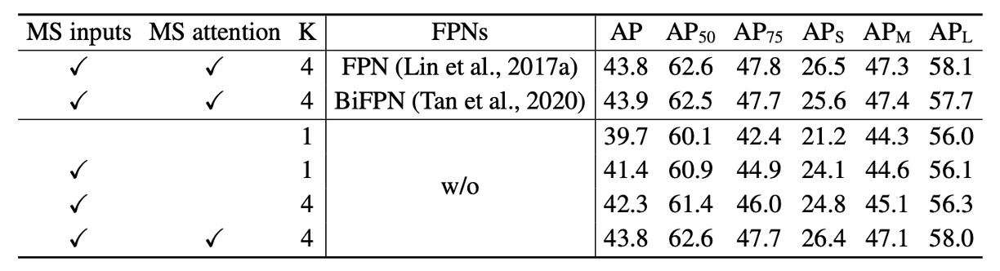

## Deformable Attention Mechanism

[**Deformable DETR: Deformable Transformers for End-to-End Object Detection**](https://arxiv.org/abs/2010.04159)

---

DETR left an excellent foundation for researchers to build upon.

- [**[20.05] DETR: A Foundation Across Domains**](../2005-detr/index.md)

In DETR, the authors used only the basic Transformer architecture for the simplest form of object detection, without employing any advanced tricks. They simply fed images into the model, and out came the object locations and categories.

What a brilliant paper!

This leaves ample room for researchers to improve the model, allowing for countless future publications based on this foundation.

## Problem Definition

Compared to existing object detectors, DETR is remarkably slow. Although it runs at half the speed of the popular Faster-RCNN during inference, this doesn’t seem like a big issue.

But the training convergence time is 20 times slower!

What used to take just a day to train now takes 20 days. This is a significant problem—time is precious, and no one wants to wait for weeks to get a model to converge.

Clearly, this issue needs to be addressed.

## Solution

The authors believe the issue lies in the attention mechanism of the Transformer. In the Transformer, every pixel attends to every other pixel, which wastes most of the computational power on irrelevant regions.

Thus, instead of using the original Transformer attention mechanism, they borrowed the idea of deformable convolutions and created a "deformable attention mechanism."

:::tip
At the time of this research, Vision Transformers (ViT) hadn’t been published yet, so the operations were based on individual pixels rather than image patches.
:::

### Deformable Attention

In the feature map, for each query element, the authors select a reference point and compute attention only around a few important sampling points near that reference. This differs from the traditional Transformer, which calculates attention over all points in the spatial domain.

Suppose the input feature map is:

$$
x \in \mathbb{R}^{C \times H \times W}
$$

where $C$ is the number of channels, and $H$ and $W$ are the height and width of the feature map, respectively.

Each query element $q$ consists of a content feature $z_q$ and a 2D reference point $p_q$. The deformable attention feature is computed as:

$$
\text{DeformAttn}(z_q, p_q, x) = \sum_{m=1}^{M} W_m \sum_{k=1}^{K} A_{mqk} \cdot W_m^{\prime} x(p_q + \Delta p_{mqk})
$$

Where:

- $M$ is the number of attention heads.
- $K$ is the number of sampling points selected for each query, chosen from a small region around the reference point.
- $A_{mqk}$ is the attention weight for the $k$-th sampling point in the $m$-th attention head, constrained to $[0, 1]$ and normalized such that:

  $$
  \sum_{k=1}^{K} A_{mqk} = 1
  $$

- $\Delta p_{mqk}$ is the offset of the $k$-th sampling point in the $m$-th attention head, which can take arbitrary real values.
- $W_m$ and $W_m^{\prime}$ are learnable weight matrices responsible for linear transformations of the input features.
- $x(p_q + \Delta p_{mqk})$ represents the feature value at location $p_q + \Delta p_{mqk}$. Since this position is a fractional value (i.e., not a discrete grid point), bilinear interpolation is used to calculate it.

The query feature $z_q$ undergoes a linear projection that outputs a tensor of size $3mk$:

- The first $2mk$ channels encode the offsets $\Delta p_{mqk}$ for each sampling point.
- The remaining $mk$ channels are passed through a softmax function to compute the attention weights $A_{mqk}$.

This design ensures that both the offsets and attention weights are learned from the query feature rather than based on fixed rules.

### Multi-Scale Computation

Modern object detection frameworks often use multi-scale feature maps to detect objects at different scales. The deformable attention module naturally extends to a multi-scale version, allowing sampling and operations on multiple feature map layers simultaneously.

Assume the input multi-scale feature maps are denoted as $\{x_l\}_{l=1}^L$, where each feature map $x_l \in \mathbb{R}^{C \times H_l \times W_l}$. The reference point for the query is represented using normalized coordinates $\hat{p}_q \in [0, 1]^2$. The multi-scale deformable attention module is computed as:

$$
\text{MSDeformAttn}(z_q, \hat{p}_q, \{x_l\}_{l=1}^L) =
$$

$$
\sum_{m=1}^{M} W_m \sum_{l=1}^{L} \sum_{k=1}^{K} A_{mlqk} \cdot W_m^{\prime} x_l(\phi_l(\hat{p}_q) + \Delta p_{mlqk})
$$

Where:

- $L$ is the number of feature map layers.
- $\phi_l(\hat{p}_q)$ is a scaling function that converts normalized coordinates to the actual coordinates on the $l$-th feature map layer.
- The other notations are similar to the single-scale case.

### Model Architecture

As shown in the diagram above, after solving the deformable attention issue, the Transformer module in the original DETR architecture is completely replaced.

This forms the Deformable DETR.

:::info
If you're not interested in theoretical details, you can check out the official implementation on Github.

- [**fundamentalvision/Deformable-DETR**](https://github.com/fundamentalvision/Deformable-DETR)

:::

### Training Strategy

The authors conducted experiments on the **COCO 2017** dataset.

The backbone used was **ResNet-50**, pretrained on **ImageNet**. The neck directly extracted features from the multi-scale feature map without using an FPN.

Deformable attention settings:

- Number of attention heads: **M = 8**
- Number of sampling points per query: **K = 4**

Parameters in the deformable transformer encoder are shared across different feature layers.

Most hyperparameters and training strategies followed the setup of DETR, with a few exceptions:

- Focal Loss was used for bounding box classification with a weight of 2.
- The number of object queries was increased from 100 to 300.

The model was trained for 50 epochs, with the learning rate reduced to 0.1 of its initial value at epoch 40. The Adam optimizer was used with a base learning rate of $2 \times 10^{-4}$, $\beta_1 = 0.9$, $\beta_2 = 0.999$, and weight decay of $10^{-4}$.

The learning rate for the linear projections that predict reference points and sampling offsets was further scaled by a factor of 0.1.

## Discussion

### Comparison with DETR

From the table above, compared to Faster R-CNN + FPN, DETR requires more training epochs to converge and performs poorly on small object detection. Deformable DETR, however, achieves better performance with a similar number of training epochs to Faster R-CNN, especially for small object detection.

The detailed convergence curve is shown below:

Through iterative bounding box refinement and a two-stage mechanism, this method further enhances detection accuracy.

Deformable DETR has FLOPs comparable to Faster R-CNN + FPN and DETR-DC5, but it runs 1.6 times faster than DETR-DC5 and is only 25% slower than Faster R-CNN + FPN.

The slower speed of DETR-DC5 is primarily due to the large memory access requirements in the Transformer attention mechanism. Deformable Attention alleviates this issue, although the unordered memory access still makes it slightly slower than traditional convolutions.

### Ablation Studies

The table above shows the ablation study of different design choices in the deformable attention module.

Replacing single-scale input with multi-scale input significantly improves detection accuracy, increasing the average precision (AP) by 1.7%, especially for small objects (APS), which improves by 2.9%. Increasing the number of sampling points $K$ further improves AP by 0.9%.

Using multi-scale deformable attention enables information exchange across different feature layers, providing an additional 1.5% AP boost. Since cross-layer information exchange is already incorporated, adding FPNs does not provide further improvement. Without multi-scale attention and with $K=1$, the deformable attention module degrades into deformable convolution, leading to a significant drop in accuracy.

### SoTA Comparison

In the table above, Deformable DETR uses both iterative bounding box refinement and the two-stage mechanism.

With ResNet-101 and ResNeXt-101, the method achieves 48.7 AP and 49.0 AP, respectively, without any additional optimization techniques. When ResNeXt-101 with DCN is used, accuracy increases to 50.1 AP.

With test-time augmentations (TTA), the method achieves 52.3 AP.

:::info
TTA (Test-Time Augmentations) is a technique where an image is augmented multiple times during testing, and the results of these predictions are averaged to increase model robustness and accuracy.
:::

## Conclusion

Deformable DETR significantly reduces the training time compared to traditional DETR. It also performs much better on small object detection.

Though Deformable DETR introduces deformable attention to improve inference speed, it still lags slightly behind traditional convolutional networks like Faster R-CNN due to the unordered memory access. Therefore, speed is still a concern for real-time applications.

Deformable DETR opens up new directions for designing more efficient and practical end-to-end object detectors, with broad research and application potential.
