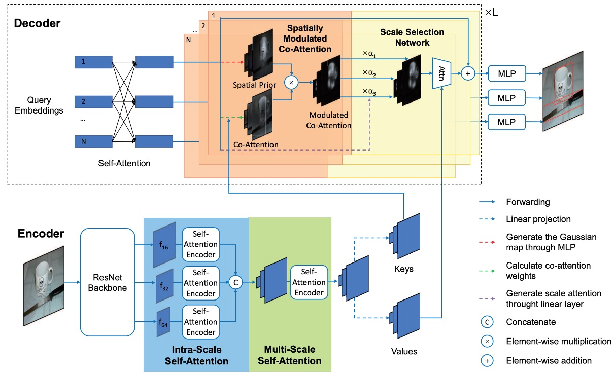

## Add Some Gaussian!

[**Fast Convergence of DETR with Spatially Modulated Co-Attention**](https://arxiv.org/abs/2101.07448).

---

Continuing our discussion on DETR, we already know how DETR works, so let’s jump straight to the problem at hand.

## Defining the Problem

Similar to Deformable DETR, the authors of this paper also observed a major issue:

- **DETR's convergence speed is too slow.**

The root of the problem lies in the fact that DETR's cross-attention mechanism does not consider predicted bounding boxes. This results in the need for multiple iterations to generate appropriate attention maps for each object query.

Thus, the solution to faster convergence might lie in improving the cross-attention mechanism.

:::tip
Deformable DETR changed the fundamental way attention operates.

This paper introduces prior knowledge into the cross-attention mechanism.
:::

## Solving the Problem

### Spatially Modulated Co-Attention

The core idea behind the Spatially Modulated Co-Attention (SMCA) mechanism is:

**Combining learnable cross-attention maps with hand-crafted query spatial priors.**

SMCA dynamically predicts the initial center and scale of the box corresponding to each object query, generating 2D spatial Gaussian-weighted maps. These weight maps are element-wise multiplied with the co-attended feature maps of object queries and image features, allowing for more efficient aggregation of query-relevant information from the visual feature map.

:::tip
In simple terms, DETR lacks prior knowledge, so its convergence is slow.

To speed it up, we provide it with some prior knowledge.
:::

### Initial Predictions

Each object query dynamically predicts the center and scale of the object it is responsible for. The predicted center and scale of the object query $O_q$ can be expressed as:

$$
c^{\text{norm}}_h, c^{\text{norm}}_w = \text{sigmoid(MLP}(O_q)),
$$

$$
s_h, s_w = \text{FC}(O_q)
$$

Where the object query $O_q$ is projected via a two-layer MLP and sigmoid function to predict normalized centers within the range of $[0, 1] \times [0, 1]$. The normalized centers are then inversely transformed to obtain the real center coordinates in the image.

Additionally, object queries predict the width and height ratio of the object, generating a 2D Gaussian weight map that reweights the cross-attention map, emphasizing features near the predicted object location.

### Gaussian Weight Map

Once the object center $c_w, c_h$ and scale $s_w, s_h$ are predicted, SMCA generates a 2D Gaussian weight map $G$, which can be expressed as:

$$
G(i, j) = \exp \left( - \frac{(i - c_w)^2}{\beta s_w^2} - \frac{(j - c_h)^2}{\beta s_h^2} \right)
$$

Where $(i, j) \in [0, W] \times [0, H]$ are spatial indices, and $\beta$ is a hyperparameter that adjusts the width of the Gaussian distribution.

$G$ assigns higher weights to locations near the center and lower weights to positions farther from the center.

Using the spatial prior $G$, SMCA modulates the cross-attention map $C_i$. The modulation is performed as follows:

$$
C_i = \text{softmax} \left( \frac{K_i^T Q_i}{\sqrt{d}} + \log G \right) V_i
$$

Here, SMCA adds the logarithm of the spatial weight map $G$ to the cross-attention scores and applies softmax normalization over all spatial locations, increasing the focus on the predicted bounding box region and reducing the search space of cross-attention, thus speeding up the model's convergence.

:::tip
Compared to the original attention mechanism, the main addition here is the $log G$ term.
:::

### Multi-Head SMCA

In the multi-head version of SMCA, different cross-attention heads are modulated based on their respective spatial weight maps.

Each attention head starts from the shared center $[c_w, c_h]$ and predicts a head-specific offset $[\Delta c_{w,i}, \Delta c_{h,i}]$ as well as a head-specific scale $s_{w,i}, s_{h,i}$.

A Gaussian spatial weight map $G_i$ is generated for each head, centered at $[c_w + \Delta c_{w,i}, c_h + \Delta c_{h,i}]$ with the predicted scales.

The multi-head cross-attention feature map is expressed as:

$$
C_i = \text{softmax} \left( \frac{K_i^T Q_i}{\sqrt{d}} + \log G_i \right) V_i
$$

To improve object detection performance, SMCA integrates multi-scale features. A CNN extracts multi-scale visual features $f_{16}, f_{32}, f_{64}$ with downsampling rates of 16, 32, and 64, respectively. These features are directly extracted from the CNN backbone without using a Feature Pyramid Network (FPN).

Each object query dynamically selects the most relevant scale by generating attention weights for different scales:

$$
\alpha_{16}, \alpha_{32}, \alpha_{64} = \text{Softmax}(\text{FC}(O_q))
$$

Cross-attention at different scales is computed as:

$$
C_{i,j} = \text{Softmax} \left( \frac{K_{i,j}^T Q_i}{\sqrt{d}} + \log G_i \right) V_{i,j} \odot \alpha_j
$$

$$
C_i = \sum_j C_{i,j}, \quad j \in \{16, 32, 64\}
$$

This mechanism allows each object query to dynamically select the most relevant scale while suppressing irrelevant scale features.

After cross-attention computation, the updated object query features $D \in \mathbb{R}^{N \times C}$ are used to predict the bounding box and classification scores:

$$
\text{Box} = \text{Sigmoid}(\text{MLP}(D))
$$

$$
\text{Score} = \text{FC}(D)
$$

Bounding box predictions are further adjusted using the initial spatial prior:

$$
\text{Box}[:2] = \text{Box}[:2] + [d c_{\text{norm}_h}, c_{\text{norm}_w}]
$$

This ensures that the predicted bounding boxes are closely related to the highlighted cross-attention areas in SMCA.

### Training Strategy

1. **Dataset:**

   - The experiments are conducted on the COCO 2017 dataset. The training set contains 118,000 images, while the validation set contains 5,000 images. Performance is evaluated using mAP (Mean Average Precision), consistent with previous research.

2. **Implementation details:**

   - The experimental setup follows the original DETR. ResNet-50 is used for feature extraction (denoted as SMCA-R50).
   - Unlike DETR, SMCA uses 300 object queries (instead of 100) and replaces the original cross-entropy classification loss with focal loss to address foreground/background class imbalance. The initial focal loss probability is set to 0.01 to stabilize the training process.

3. **Training setup:**

   - The model is trained for 50 epochs, with the learning rate reduced by a factor of 10 at epoch 40.
   - The initial learning rate for the Transformer encoder is set to $10^{-4}$, while the learning rate for the pre-trained ResNet backbone is set to $10^{-5}$, using the AdamW optimizer.
   - The default downsampling rates for multi-scale feature encoding are 16, 32, and 64.

4. **Loss function and matching:**

   - Classification loss, L1 distance loss, and GIoU loss coefficients are set to 2, 5, and 2, respectively, during bipartite matching.
   - After bipartite matching, the model minimizes classification loss, bounding box L1 loss, and GIoU loss with the same coefficients.

5. **Additional experimental details:**
   - The Transformer layers use post-norm settings, consistent with previous studies.
   - Random cropping is used during data augmentation, with the maximum width or height after cropping set to 1333.
   - All models are trained on 8 V100 GPUs, each processing one image.

## Discussion

### Comparison with DETR

SMCA shares the same architecture as DETR but introduces a new co-attention modulation mechanism in the decoder. Additionally, a linear network is added to generate spatial modulation priors. The computational cost of SMCA is small, with minimal training time increments per epoch.

With single-scale features, SMCA uses a self-attention dimension of 256 and an intermediate dimension of 2048 for the feed-forward network (FFN). For multi-scale features, the intermediate dimension of the FFN is set to 1024, and the encoder uses 5 layers of intra-scale and multi-scale self-attention, ensuring a similar parameter count to DETR for fair comparison.

As shown in the table above, "SMCA w/o multi-scale" achieves an mAP of 41.0 using single-scale features in 50 epochs, while the mAP improves to 43.7 with multi-scale features. With extended training, SMCA’s single-scale feature mAP increases from 41.0 to 42.7, and the multi-scale feature mAP improves from 43.7 to 45.6.

SMCA converges 10 times faster than DETR-based methods. SMCA uses thinner Transformer layers and convolution operations without dilation in the ResNet backbone, matching the efficiency of the original dilated convolution DETR model.

### Ablation Studies

A series of ablation experiments were conducted to verify the importance of each component in SMCA.

### Head-shared SMCA

The authors added a head-shared spatial modulation mechanism to the baseline DETR while keeping the learning rate, training schedule, self-attention parameters, etc., the same as the baseline model.

The results show that this approach improves mAP from 34.8 to 40.2, proving the effectiveness of SMCA. Not only does it accelerate DETR's convergence, but it also significantly enhances performance. Additionally, tests with different batch sizes show that SMCA is insensitive to batch size.

Using the multi-head mechanism for spatial modulation modulates each Transformer head with a different spatial weight map. Each head starts from the same object center and predicts offsets relative to the shared center and head-specific scales. The results show that multi-head spatial modulation achieves an mAP of 41.0, a further improvement over head-shared modulation (40.2 to 41.0).

The authors also tested spatial weight maps with fixed scales, shared or independent predictions for width and height. When fixing the Gaussian distribution scale (set to 1), mAP is 38.5 (an improvement of 3.7 over the baseline), demonstrating the importance of predicting object centers in spatial modulation.

### Multi-head SMCA

Introducing multi-scale feature encoding in the encoder, the design labeled as "SMCA (2Intra-Multi-2Intra)" uses 2 layers of intra-scale self-attention, 1 layer of multi-scale self-attention, followed by 2 more layers of intra-scale self-attention. This design improves performance from 41.0 to 43.7. Removing SSA results in a drop to 42.6.

Replacing the 2Intra-Multi-2Intra design with a simple stack of 5 intra-scale self-attention layers results in a performance drop to 43.3, likely due to the lack of cross-scale information exchange. Although a 5-layer intra-scale self-attention encoder performs better than a 3-layer version, introducing multi-scale information exchange (3-layer multi-scale self-attention encoder) yields better results.

The authors ultimately chose the 2Intra-Multi-2Intra combination design, which achieved 43.7 mAP with fewer parameters. Sharing the weights of the Transformer and FFN further enhanced the model's generalization ability.

### Comparison with Other SoTA Architectures

The authors compared SMCA with other object detection frameworks on the COCO 2017 validation set.

1. **Comparison with DETR:**

   - DETR uses an end-to-end Transformer for object detection. DETR-R50 and DETR-DC5-R50 refer to the ResNet-50-based and dilated ResNet-50-based versions of DETR. Compared to DETR, SMCA achieves faster convergence and better performance on small, medium, and large object detection tasks.

2. **Comparison with Faster RCNN:**

   - Faster RCNN with FPN (Feature Pyramid Network) is a two-stage object detection method. After 109 epochs of training, SMCA's mAP (45.6) surpasses Faster RCNN-FPN-R50 (42.0).
   - Faster RCNN has an advantage in detecting small objects (small object mAP of 26.6 vs. SMCA's 25.9), but SMCA is stronger in localizing large objects (large object mAP of 62.6 vs. 53.4). This is due to SMCA's multi-scale self-attention mechanism, which can propagate information across all scales and positions.

3. **Comparison with Deformable DETR:**

   - Deformable DETR replaces DETR's global self-attention with local deformable attention in both the encoder and decoder, speeding up convergence but sacrificing performance on large objects.
   - Deformable DETR's large object mAP drops from DETR’s 61.1 to 58.0. In contrast, SMCA uses spatially modulated co-attention to restrict co-attention to dynamically estimated object locations, resulting in faster convergence and improved large object detection performance (SMCA large object mAP of 60.4, Deformable DETR at 59.0).
   - SMCA achieves an mAP of 43.7 at 50 epochs, comparable to Deformable DETR (43.8), but SMCA excels at large object detection, while Deformable DETR is better at small object detection.

4. **Comparison with UP-DETR:**

   - UP-DETR explores unsupervised pre-training to accelerate DETR's convergence. In comparison, SMCA achieves faster convergence and better performance. After 108 epochs, SMCA achieves 45.6 mAP, while UP-DETR reaches 42.8 mAP after 300 epochs.

5. **Comparison with TSP-FCOS and TSP-RCNN:**

   - TSP-FCOS and TSP-RCNN combine DETR’s Hungarian matching method with FCOS and RCNN detectors, resulting in faster convergence and better performance than DETR.
   - Similar to Deformable DETR and Faster RCNN-FPN, TSP-FCOS and TSP-RCNN excel at small object detection but fall behind in large object detection.
   - In short-term training (38 epochs), SMCA-R50 achieves an mAP of 43.7, comparable to TSP-RCNN (43.8) and better than TSP-FCOS (43.1). In long-term training, SMCA achieves 45.6 mAP at 108 epochs, surpassing TSP-RCNN’s 45.0 at 96 epochs.

6. **Comparison using ResNet-101 Backbone:**
   - When replacing ResNet-50 with ResNet-101, the performance improvement trend is similar to that of the ResNet-50 backbone.

## Conclusion

In this paper, the authors successfully integrated a Spatially Modulated Co-Attention (SMCA) mechanism into the DETR framework, achieving significant performance improvements.

The training process, which originally required 500 epochs, was reduced to 108 epochs, while the mAP improved from 43.4 to 45.6. This demonstrates that SMCA can increase detection accuracy while maintaining a low inference cost. By exploring global feature information, SMCA shows the potential for improving both efficiency and performance in object detection.

Several papers continue to improve DETR, so let’s keep exploring them.
