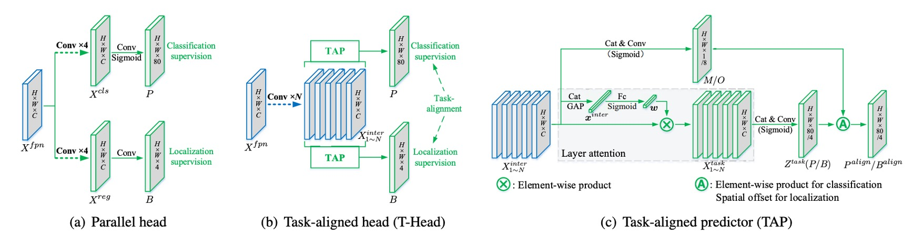
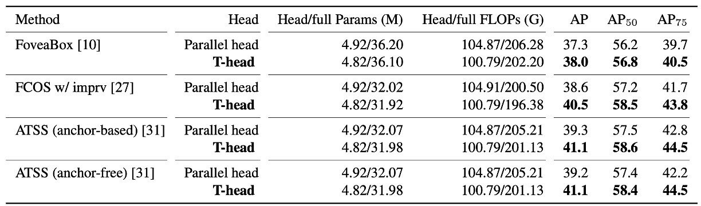
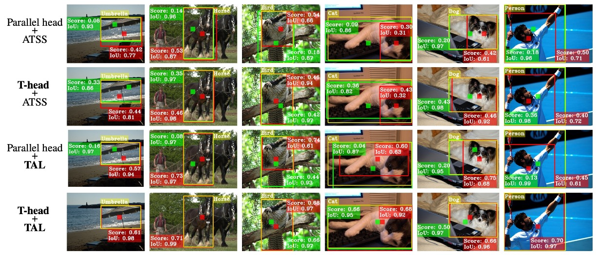

## The End of Misalignment

[**TOOD: Task-aligned One-stage Object Detection**](https://arxiv.org/abs/2108.07755)

---

Continuing the line of thinking from ATSS, we now explore subsequent research.

:::tip
If you haven't read ATSS yet, you can check out our previous notes:

- [**[19.12] ATSS: The Death of Anchors**](../1912-atss/index.md)
  :::

## Problem Definition

What is object detection? Most people can recite the answer by heart.

It consists of two sub-tasks:

- **Classification**: Identifies the most distinguishable part of the object and answers "What is it?"
- **Localization**: Precisely outlines the entire boundary and answers "Where is it?"

The problem is, these two tasks are inherently contradictory: classification focuses on local salient features, while localization requires the global contour. When the model optimizes both simultaneously, the learned feature distributions are often inconsistent, causing predictions to "speak past each other."

In recent years, one-stage detectors have tried to unify the two tasks using the "center hypothesis."

- **FCOS, ATSS**: Use a centerness branch so that anchors near the center score higher and the localization loss gets a greater weight.
- **FoveaBox**: Simply defines the center region as positive samples.

These designs have indeed improved performance, but two core concerns remain:

1. **Task Independence**:

   Most existing methods maintain a "dual-branch architecture": one branch handles classification, the other handles localization.

   The result is a lack of communication between the two tasks, which can lead to situations like:

   - The classification branch says, "This is a dining table"!
   - The localization branch, however, more accurately boxes a pizza.

   Each is correct on its own, but combined, the result is wrong.

2. **Sample Assignment Failure**:

   Traditional anchor-based methods use IoU thresholds to determine positive and negative samples; anchor-free methods use geometric rules (like the center region).

   All these strategies are based on an implicit assumption:

   > **Classification and localization can share the same set of samples.**

   But in reality, the optimal points for classification and localization often do not overlap.

   For example, see the figure below:

    

    <figure style={{ "width": "70%"}}>
    
    </figure>
    

   It looks like the best localization box (green patch) is not at the object center, and in the end, it's suppressed by an anchor (red patch) that scores higher in classification but is less accurate in localization, resulting in it being discarded during NMS.

In other words: **Not only do classification and localization differ in learning direction, they also depend on different sets of samples.**

This makes us ask:

- Since the two are naturally misaligned, can they truly be coordinated?
- Can we get "the most accurate score" and "the most accurate box" on the same anchor?

Or have our designs all along been fundamentally mistaken?

## Problem Solving

<figure style={{ "width": "70%"}}>

</figure>

Let’s follow the diagram provided by the authors to walk through TOOD’s architecture.

In traditional approaches, after FPN output, features are directly split into two branches, each predicting classification and localization separately. As a result, we often get predictions with high scores but poor boxes, or accurate boxes with low scores that are drowned out during NMS.

Here, the authors' idea is straightforward: **explicitly “align” the two branches at the prediction stage**.

### Task Interaction Features

<figure style={{ "width": "90%"}}>

</figure>

Let the FPN features be $X^{fpn}\in\mathbb{R}^{H\times W\times C}$.

TOOD no longer splits into branches at the start, but first uses a **shared trunk** to transform feature representations.

We stack $N$ convolutional layers in sequence (each followed by ReLU), obtaining a set of multi-scale **task interaction features** ${X^{inter}*k}*{k=1}^N$:

$$
X^{inter}_k=
\begin{cases}
\delta\!\big(\mathrm{conv}_k(X^{fpn})\big), & k=1\\\\
\delta\!\big(\mathrm{conv}_k(X^{inter}_{k-1})\big), & k>1
\end{cases}
$$

The purpose of this step is singular: **to let classification and localization see the same region’s features, the same context, the same effective receptive field**—rather than working in isolation.

### TAP: Layer-wise Attention

But sharing also introduces friction: the preferred layers for classification and localization are actually different.

So, after sharing, we use the **Task-Aligned Predictor (TAP)** for “division of labor.”

The method is to learn a **layer-wise attention** $w\in\mathbb{R}^N$ from ${X^{inter}_k}$ to determine “for a given task, which layers should be emphasized more.”

First, concatenate ${X^{inter}_k}$ and perform global average pooling to get $x^{inter}$, then pass it through two fully connected layers and a Sigmoid:

$$
w=\sigma\!\Big(\mathrm{fc}_2\big(\delta(\mathrm{fc}_1(x^{inter}))\big)\Big)\, .
$$

For “classification” or “localization,” apply element-wise scaling to the $k$-th layer’s features:

$$
X^{task}_k = w_k \cdot X^{inter}_k \quad (k=1,\dots,N)\, ,
$$

Concatenate all $X^{task}_k$ into $X^{task}$, then use $1!\times!1$ convolution and another convolution to produce the task-specific prediction tensor:

$$
Z^{task}=\mathrm{conv}_2\!\big(\delta(\mathrm{conv}_1(X^{task}))\big)\, .
$$

From here, we get the **classification probability map** $P\in\mathbb{R}^{H\times W\times C_{\text{cls}}}$ (after Sigmoid) and **bounding box regression** $B\in\mathbb{R}^{H\times W\times 4}$.

$B$ adopts the FCOS/ATSS “distance to boundaries” format $(l,t,r,b)$.

If a feature point (scaled by stride) corresponds to image coordinates $(x,y)$, then the reconstructed box is: $(x-l,;y-t,;x+r,;y+b)$.

Up to this point, classification and localization still share information on the same features, but each also gets their preferred layer-wise representation.

### Explicit Alignment: $M$ and $O$

Sharing alone is not enough—the authors further “lock together” the two tasks at the output.

**First, align classification.**

From the shared $X^{inter}$, another spatial probability map $M\in\mathbb{R}^{H\times W\times 1}$ is learned:

$$
M=\sigma\!\big(\mathrm{conv}_2(\delta(\mathrm{conv}_1(X^{inter})))\big)\, .
$$

It is then combined with the classification probability $P$ via **geometric mean** to produce the aligned classification output:

$$
P^{align}=\sqrt{P\times M}\, .
$$

The intuition: $M$ represents the confidence that “this location is beneficial to both tasks.”

Using geometric mean (instead of weighted sum) prevents domination by one side (such as an extremely high $P$ or $M$).

---

**Second, align localization.**

Localization is more direct: each side of the box is allowed to “borrow” the most accurate prediction nearby.

From $X^{inter}$, a set of offset maps $O\in\mathbb{R}^{H\times W\times 8}$ is learned, providing a pair of $(\Delta i,\Delta j)$ offsets for each of the four sides. Then, bilinear sampling is performed on $B$:

$$
B^{align}(i,j,c)=B\!\big(i+O(i,j,2c),\;j+O(i,j,2c+1),\;c\big),\quad c\in\{0,1,2,3\}\, .
$$

Meaning: the four sides (top, bottom, left, right) can each select values from the “nearest and most accurate” anchor; the four sides need not use the same point. This achieves two things at once: **improving regression accuracy** and **shortening the spatial gap between classification and localization**.

Finally, there’s one last part: how does the model **adapt** to this alignment?

TOOD designs a simple “ruler” $t$ to measure whether both the **classification score** $s$ and **localization quality (IoU)** $u$ are simultaneously high for the same anchor:

$$
t = s^{\alpha} \, u^{\beta}\, .
$$

$\alpha,\beta$ control the relative importance of the two tasks.

This ruler has a key property: **as long as either side is poor, $t$ will remain low**.

The authors use it in two places: **sample assignment** and **loss weighting**.

### Task-aligned Sample Assignment

For each ground-truth object, compute $t$ for all candidate anchors, and select the **top $m$** as **positive samples**, with the rest as negatives.

This step directly writes “two-task alignment” into the rules for **who can be a positive sample**.

From now on, the model learns primarily from those examples that are “high-scoring and well-localized,” naturally steering learning toward alignment.

### Loss Design

Directly using $t$ as a soft label can cause numerical stability issues (when $\alpha,\beta$ are large, $t$ becomes very small).

Thus, the paper adopts **instance-level normalization**: within each object, scale $t$ to a reasonable range, while preserving the relative localization quality between different objects.

The method is to set the maximum $\hat t$ within an instance to the maximum IoU for that instance:

$$
\hat t_i \;=\; t_i \cdot \frac{u_{\max}}{t_{\max}+\varepsilon}\, ,\qquad
u_{\max}=\max_k u_k,\ \ t_{\max}=\max_k t_k\, .
$$

In this way, “difficult objects” (those with overall low $t$) won’t be systematically ignored, nor will large $\alpha,\beta$ push learning into a starvation state.

- **Classification Loss**

  Replace the BCE label for positive samples from 1 to $\hat t_i$, and add a Focal-style hard example modulation (with exponent $\gamma$):

  $$
  L_{cls}
  =\sum_{i=1}^{N_{pos}} \big|\hat t_i - s_i\big|^{\gamma}\,\mathrm{BCE}(s_i,\hat t_i)
  \;+\;
  \sum_{j=1}^{N_{neg}} s_j^{\gamma}\,\mathrm{BCE}(s_j,0)\, .
  $$

  **The more misaligned positive samples ($|\hat t_i-s_i|$ large), the higher their weight**; among negatives, lower scores are suppressed, focusing on hard negatives.

- **Localization Loss**

  For positive samples, use $\hat t_i$ as the weight to focus on high-quality boxes, using GIoU as an example:

  $$
  L_{reg}=\sum_{i=1}^{N_{pos}} \hat t_i \, \mathrm{L}_{GIoU}\!\big(b_i,\bar b_i\big)\, .
  $$

  The total loss is the sum of both (coefficients can be added in practice):

  $$
  L = L_{cls} + L_{reg}\,
  $$

This assignment and weighting mechanism is known as **Task Alignment Learning (TAL)**.

## Discussion

All results below are based on **MS COCO 2017**:

Training is conducted on **trainval135k (115K)**, ablation studies use **minival (5K)**, and final results are reported on **test-dev**; evaluation metric is **COCO AP**.

All model architectures use **Backbone → FPN → Head**, with a **single anchor per location** (same as ATSS), and pretrained backbones include **ResNet-50/101, ResNeXt-101-64×4d**. The number of interaction layers in T-head is **$N=6$**, and the classification focal parameter is **$\gamma=2$**.

### Is T-head Worth Replacing?

<figure style={{ "width": "90%"}}>

</figure>

The authors first replace the **traditional parallel dual-head** with the **T-head** under otherwise identical conditions, conducting A/B tests on multiple one-stage detector bases.

The result is clear: **T-head yields a consistent improvement of about +0.7 to +1.9 AP, with fewer parameters and FLOPs**.

This table conveys two layers of meaning:

- Simply using the **interaction-sharing → layer-wise division → output alignment** head design already achieves strong results.
- The improvement is **consistent**, not occasional, indicating that this "interact first, then align" approach is transferable.

### TAL Effectiveness

<figure style={{ "width": "60%"}}>

</figure>

Next is the sample assignment part, where the authors test **fixed** (geometric/IoU rule-based) and **adaptive** (learning-based) methods.

The **TAL** approach uses: $t=s^{\alpha}u^{\beta}$.

This metric simultaneously determines **positive/negative assignment (Top-$m$)** and **positive sample weights $\hat t$**.

Experimental results show: **TAL series achieves higher AP under comparable conditions**; and when you add their **TAP** to TAL (essentially a "division-of-labor head"), performance further rises to **42.5 AP** (see "+TAP" row above).

### The Complete TOOD

<figure style={{ "width": "60%"}}>

</figure>

When **T-head + TAL** are combined, the authors validate both **anchor-free** and **anchor-based** versions: **42.5 AP vs. 42.4 AP**—almost equally strong.

Compared to **ATSS**, this is about **+3.2 AP** overall; under the stricter **AP$_{75}$** metric, the improvement is about **+3.8**, directly reflecting the methodology’s emphasis:

- **When scores are aligned with localization, box quality improves.**

Additionally, TOOD’s overall gain (+3.3 AP) is greater than the sum of "T-head + ATSS" (+1.9) and "Parallel head + TAL" (+1.1). In other words, **head interaction/alignment** and **TAL’s learning rules** are **complementary**: only together does alignment become complete.

### Comparison with SOTA

<figure style={{ "width": "90%"}}>

</figure>

Under the same settings on **test-dev**, **single-model single-scale**, **2× schedule (24 epochs), scale jitter 480–800**:

- **ResNet-101**: **46.7 AP**; **ResNeXt-101-64×4d**: **48.3 AP**.
- Compared to **ATSS**, about **+3 AP**; compared to **GFL**, about **+2 AP**.

Interestingly, the paper places **DCN in the first two layers of the head tower**—TOOD’s improvement is **$48.3 \rightarrow 51.1$ (+2.8 AP)**, while **ATSS** is **$45.6 \rightarrow 47.7$ (+2.1 AP)**.

This indicates that TOOD’s alignment design enables more effective use of DCN’s deformable capacity.

### Did “Alignment” Actually Happen?

<figure style={{ "width": "90%"}}>

</figure>

The authors provide two quantitative observations:

1. **Without NMS**, for each instance, the **top 50 classification-confidence predictions** are taken, and **PCC (Pearson correlation coefficient)** is calculated for both "classification ranking" and "localization ranking," along with the **mean IoU of the top 10**.

   The results show: **With T-head and TAL, both PCC and IoU increase**, indicating that "**higher scores**" and "**better boxes**" are becoming more **synchronized**.

2. **After NMS**, the number of **correct boxes (IoU≥0.5)/ redundant boxes (IoU≥0.5)/ incorrect boxes (0.1\<IoU\<0.5)** is tallied: **correct boxes increase, while redundant/incorrect drop significantly**.

Finally, when looking at these alignment metrics together with AP, the total gain is **about +3.3 AP**.

### How Was Misalignment Improved?

<figure style={{ "width": "90%"}}>

</figure>

Lastly, the authors provide a visualization: in traditional methods, high-scoring but inaccurate boxes are often clustered near the center, while the truly accurate box is suppressed; **after TOOD**, **high-scoring and accurate boxes coincide**, and redundant boxes disappear. This is exactly the effect of the two mapping strategies: **$M$** cools down inconsistent locations, and **$O$** lets each side shift halfway to its most accurate neighbor, resulting in cleaner NMS decisions.

## Conclusion

TOOD solves the long-standing misalignment between classification and localization with a clean, concise path:

First, T-head enables both tasks to share the same field of view, then layer-wise attention accomplishes division of labor. Finally, $M$ (classification alignment) and $O$ (localization alignment) tightly couple the outputs, while $t=s^{\alpha}u^{\beta}$ unifies “sample assignment” and “loss design,” forcing the model to learn the habit of “high score = accurate box.”

This design not only achieves 51.1 AP (with DCN) on COCO, but also shows significant improvement in strict metrics like AP$_{75}$, confirming the paper’s claim:

- **Alignment brings more accurate boxes.**

However, it comes with some costs: the branching and bilinear sampling add implementation complexity, and although the hyperparameters are semantically meaningful, they still need tuning for each dataset. In settings with dense small objects or high noise, Top-$m$ assignment may fall into local optima. Moreover, as tasks expand to segmentation or pose, how to maintain balance between "sharing and division" remains an open challenge.

In terms of impact, TOOD—along with OTA/SimOTA—established "score × localization quality" as the mainstream syntax for positive sample assignment, making quality-aware classification a standard in one-stage detectors. Its "share first, then divide" design has been widely adopted by various frameworks, and its combination with DCN and learnable offsets has found more precise applications since TOOD.

As of now (2025), it still serves as foundational infrastructure in production lines and open-source frameworks. Task-aligned assignment and weighting have become indispensable options for many models, and its design philosophy has deeply influenced the evolution of YOLO and other one-stage detectors. Even as DETR-style set matching matures, TOOD’s alignment approach remains an efficient and robust engineering solution.
