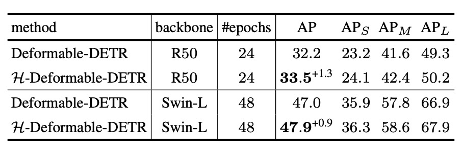

## The Rebellion of Silent Queries

[**DETRs with Hybrid Matching**](https://arxiv.org/abs/2207.13080)

---

In the world of DETR, most queries are assigned to classification and ordered to stay silent.

Even if they get close to the truth... sorry, there is only one truth; the rest do not count.

## Problem Definition

Since DETR pioneered the introduction of Transformers into object detection, the DETR architecture quickly became a landmark standard in the vision field, as shown below:

<figure style={{ "width": "80%"}}>

</figure>

Its core contribution lies in abandoning handcrafted components such as anchors, proposals, and NMS, reformulating the object detection problem as a "query-to-object" matching task.

This design not only simplifies the pipeline but also enhances the overall architecture's transferability and generalization, spawning a whole ecosystem widely applied in 2D detection, 3D perception, pose estimation, visual tracking, segmentation, and other tasks.

This development path also encouraged researchers to continuously optimize various modules: some redesigned the Transformer structure, such as Deformable-DETR introducing deformable attention to address small object detection and convergence speed; others explored more efficient query representations, like the DAB-DETR and DINO series improving matching stability via denoising queries.

However, regardless of architecture type, most learning mechanisms are still based on DETR’s foundational "one-to-one matching": each ground truth can only be assigned to a unique query, which is a key condition for removing NMS.

Yet, this one-to-one assignment strategy introduces significant bottlenecks during training.

Taking the common COCO dataset as an example, an image has on average fewer than 30 annotated boxes, but the model often generates 100 to 300 queries. Under such assignment, the vast majority of queries can only be treated as "background," supervised by classification loss without participating in bounding box regression.

This means most queries receive very limited learning signals during training. Although they might still produce predictions during inference, their learning space during training is heavily constrained.

Moreover, this assignment limitation suppresses the model’s ability to explore potential positive samples.

Even if some queries align well spatially with an object, they are excluded from regression learning because that object is already "occupied" by other queries. This reduces training sample efficiency, limits queries’ spatial feature learning, and leads to slow training, poor positive sample fitting, and low resource utilization.

While existing improvements like DN-DETR or DINO-DETR attempt to supplement positive sample supervision by "adding noisy queries," their core aim is matching stability rather than training efficiency, often requiring extra noising schemes or query format adjustments and lacking generality for other tasks.

So, the question arises:

> **Can we, while preserving DETR’s matching advantages, unleash the potential of idle queries and expand positive sample supervision?**

---

## Solution

In DETR’s original design, each image generates a set of query vectors, which after decoder processing produce predicted boxes and classification probabilities. These predictions are matched one-to-one with ground truth, selecting the "best query describing each object," and the loss is computed accordingly.

H-DETR’s modification does not break this one-to-one mechanism but adds an auxiliary branch allowing more queries to participate in learning.

Specifically, the model trains two groups of queries simultaneously: one maintains the original one-to-one supervision logic; the other adopts a "one-to-many" supervision, where each ground truth can correspond to multiple queries. This way, those previously "wasted" queries can learn to fit positive samples by approaching ground truth boxes during training.

### Main Branch: One-to-One Supervision

For the first query group $Q = \{q_1, q_2, ..., q_n\}$, the standard DETR training is applied:

1. Queries pass through $L$ decoder layers, producing $L$ sets of predictions $\{P^1, P^2, ..., P^L\}$.
2. Each layer’s predictions are matched to ground truth via Hungarian Matching, selecting the best correspondences.
3. The loss function is:

$$
\mathcal{L}_{\text{one2one}} = \sum_{l=1}^{L} \mathcal{L}_{\text{Hungarian}}(P^l, G)
$$

where $\mathcal{L}_{\text{Hungarian}}$ is the standard DETR loss, including:

- Classification loss
- Bounding box $L_1$ regression loss
- Generalized IoU loss

This branch preserves the core of DETR’s streamlined inference.

---

### Auxiliary Branch: One-to-Many Supervision

The other branch creates more "opportunities to approach true objects" through:

1. Generating another query set $Q_b = \{q_b^1, q_b^2, ..., q_b^T\}$ for one-to-many learning.
2. Repeating ground truth $G = \{g_1, ..., g_m\}$ $K$ times to obtain an augmented target set:

$$
G_b = \{G, G, ..., G\} \quad (K \text{ times})
$$

3. For each layer’s predictions $\{P_b^1, ..., P_b^L\}$, perform matching with $G_b$, calculating the loss:

$$
\mathcal{L}_{\text{one2many}} = \sum_{l=1}^{L} \mathcal{L}_{\text{Hungarian}}(P_b^l, G_b)
$$

This branch does not interfere with the main query inference and purely aims to improve training efficiency and learning strength.

---

### Total Loss and Implementation Details

The overall training loss is:

$$
\mathcal{L} = \mathcal{L}_{\text{one2one}} + \lambda \cdot \mathcal{L}_{\text{one2many}}
$$

where $\lambda$ balances the importance of the two branches.

To enable parallel processing of the two query groups within the computation graph, H-DETR employs masked multi-head attention to avoid interference between queries. This design adds minimal training overhead.

Finally, during inference, H-DETR completely ignores the one-to-many branch and only retains the main branch’s outputs. Thus, H-DETR maintains DETR’s original simplicity: no NMS required, detection completed solely via query outputs.

### More Forms of Hybrid Supervision

Besides the "dual-branch" training structure, H-DETR proposes two further variants that implement dynamic switching of supervision strategies along the "temporal" and "layer" dimensions.

- **Hybrid Epoch Scheme: Implicit Stage Switching**

  This variant uses only one query set $Q_e = \{q_1, ..., q_M\}$ but changes matching strategy according to training "stage."

  - **Early phase (ρ percentage of epochs)**: use one-to-many matching by repeating each ground truth $K$ times to form an augmented annotation set $G_e$, matched against predictions $\{P_e^1, ..., P_e^L\}$. The loss is:

  $$
  \mathcal{L}_{\text{one2many}} = \sum_{l=1}^{L} \mathcal{L}_{\text{Hungarian}}(P_e^l, G_e)
  $$

  - **Late phase (remaining $1 - \rho$ epochs)**: switch back to one-to-one supervision with original ground truth $G$, loss:

  $$
  \mathcal{L}_{\text{one2one}} = \sum_{l=1}^{L} \mathcal{L}_{\text{Hungarian}}(P_e^l, G)
  $$

  The idea is to use abundant supervision early to help queries approach ground truth quickly, then converge to the exclusivity required by one-to-one matching once the model learns basic localization.

  During inference, only the one-to-one query outputs remain, preserving DETR’s simplicity.

---

- **Hybrid Layer Scheme: Supervision Splitting Within Layers**

  This variant also uses a single query set $Q = \{q_1, ..., q_N\}$, but switches supervision based on the decoder layer number.

  - **First $L_1$ decoder layers**: apply one-to-many supervision, matching predictions $\{P^1, ..., P^{L_1}\}$ to repeated ground truth $G$:

  $$
  \mathcal{L}_{\text{one2many}} = \sum_{l=1}^{L_1} \mathcal{L}_{\text{Hungarian}}(P^l, G)
  $$

  - **Last $L_2$ decoder layers**: revert to one-to-one supervision with loss:

  $$
  \mathcal{L}_{\text{one2one}} = \sum_{l=L_1+1}^{L_1+L_2} \mathcal{L}_{\text{Hungarian}}(P^l, G)
  $$

  This design intuitively "warms up" queries with dense supervision early, then strengthens independent prediction and inference consistency later.

  The total training loss is the sum:

  $$
  \mathcal{L} = \mathcal{L}_{\text{one2many}} + \mathcal{L}_{\text{one2one}}
  $$

  Allowing the model to balance supervision density and inference consistency along the decoder depth.

---

Compared to the original dual-branch architecture, these two strategies are simpler to implement, require no extra query parameters, yet still provide additional positive sample supervision. H-DETR’s core design philosophy is to provide more training information to the model to improve convergence speed and stability without compromising DETR’s inference simplicity.

## Discussion

The authors first focus on examining whether H-DETR can effectively improve the detection capability of the existing DETR architecture.

Using the COCO and LVIS datasets as benchmarks, they evaluate the performance of the improved H-Deformable-DETR model across different backbones and training durations.

### COCO Benchmark

<figure style={{ "width": "70%"}}>

</figure>

According to the experimental results, H-Deformable-DETR demonstrates consistent performance gains on the COCO validation set across different backbone scales—including ResNet-50, Swin-T, and Swin-L—and training schedules of 12 or 36 epochs.

For example, with Swin-T:

- At 12 training epochs, the AP improves from 49.3% to 50.6%.
- At 36 training epochs, AP increases from 51.8% to 53.2%.

These results indicate that even without changing the inference architecture and only adjusting the training supervision strategy, significant gains can be achieved for Deformable-DETR. Moreover, these improvements generalize well regardless of backbone scale or training length.

### LVIS Benchmark

<figure style={{ "width": "70%"}}>

</figure>

Next, the LVIS results are examined. LVIS is a dataset with thousands of categories exhibiting a highly long-tailed distribution, used to validate H-DETR’s generalization ability on large-scale and low-frequency classes.

Despite the greater difficulty of LVIS compared to COCO, H-DETR still maintains an average improvement of about **+0.8% to +1.0%**, demonstrating that its one-to-many supervision strategy effectively enhances learning for underrepresented classes.

### SOTA Benchmark

The authors also perform a system-level comparison of H-Deformable-DETR against recent representative state-of-the-art (SOTA) methods, shown in the table above.

All models use single-scale inference and adopt the Swin-L backbone with comparable parameter sizes to ensure fairness.

Overall, H-Deformable-DETR achieves 59.4% AP on the COCO validation set, surpassing several strong baselines including DINO-DETR.

This result highlights that the hybrid matching strategy proposed by H-DETR remains competitive—even leading—against current top architectures when combined with other enhancements. Achieving such performance while preserving DETR’s inference simplicity and eliminating the need for post-processing underscores the critical role of training supervision mechanisms on learning efficiency and final performance.

### Ablation Study

<figure style={{ "width": "70%"}}>

</figure>

Let us review the performance of different hybrid architectures; readers can refer to the original paper for further experiments.

In designing this experiment, the authors made two key settings to ensure fairness:

1. All three strategies incorporate **6 times the number of positive samples** compared to the baseline.
2. All three strategies use a **total of 1800 queries**.

Additionally, the table annotates different data sources as follows:

- **† symbol**: The method uses **1800 queries in both training and inference**.
- **# symbol**: The timing is measured using **optimized implementations (e.g., GPU-based matching)**, detailed in the supplementary materials.

Key observations include:

- The **Hybrid Branch** strategy achieves the most balanced overall performance:

  - It yields the **best accuracy improvement**.
  - Training time overhead is moderate (about 7% more than baseline).
  - It remains robust in inference FPS, FLOPs, and memory cost.

- The **Hybrid Epoch** strategy, due to switching training strategies across stages, results in longer training time. Although accuracy improves significantly, the increased training time may be costly for practical use.

- The **Hybrid Layer** strategy strikes a balance between efficiency and accuracy but generally performs slightly below the Hybrid Branch.

## Conclusion

DETR’s key innovation is reframing object detection as a query matching problem, simplifying inference but causing low training efficiency.

H-DETR precisely addresses this by introducing one-to-many supervision on the training side, improving learning efficiency while maintaining one-to-one inference semantic consistency and architectural simplicity. This design offers three major engineering advantages: zero inference modification, controllable cost, and modular ease of integration. It holds strong potential for transferability to any query-based perception tasks.

---

:::info
For more information, refer to H-DETR’s GitHub homepage. Interested readers are encouraged to try it out:

- [**DETRs with Hybrid Matching, CVPR 2023**](https://github.com/HDETR)
  :::
