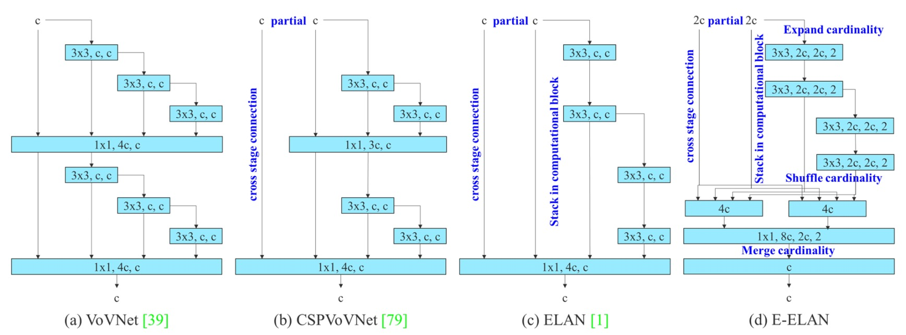

## The Underdog’s Comeback

[**YOLOv7: Trainable bag-of-freebies sets new state-of-the-art for real-time object detectors**](https://arxiv.org/abs/2207.02696)

---

The author team behind YOLOv7 comes from Academia Sinica, Taiwan.

Wait, why was v7 released two months earlier than v6? This is because many teams worldwide are competing to become the true successor of the original YOLO. Welcome to the star-studded YOLO universe!

## Problem Definition

The field of real-time object detection has always been balancing four factors: **speed, accuracy, parameter count, and deployability**.

These trade-offs are reordered depending on the scenario: in autonomous driving, latency is critical; in embedded devices, power consumption matters; and in medical imaging, accuracy is paramount.

In recent years, real-time detector design has generally followed two main paths:

The first is pursuing **extreme lightweighting**, targeting microprocessors and edge CPUs, such as MCUNet and NanoDet; the other focuses on **squeezing performance from efficient architectures**, like YOLOX and YOLOR, by backbone modification, neck optimization, and feature fusion design to improve inference speed and accuracy.

What these methods have in common is:

- **They almost all start from the inference architecture, trying to achieve better accuracy via faster pathways.**

However, YOLOv7 takes a reverse path.

The authors propose a relatively less-explored angle in this paper:

> **What if we don’t change the model architecture but redesign the training pipeline instead?**

This starting point gave birth to YOLOv7’s core concept: the **trainable bag-of-freebies**.

The so-called bag-of-freebies refers to techniques that increase training cost but do not add any inference cost.

YOLOv7’s innovation lies in upgrading these techniques into “trainable” modules, further boosting model performance without altering any inference structure.

Although this design sounds simple, it immediately raises two challenging questions at the structural level:

1. **How should module re-parameterization be designed to benefit both training and inference simultaneously?**
2. **When using dynamic label assignment techniques, how to handle the alignment problem across multiple output layers?**

These two issues were often dismissed as mere “training details” in the past, but along YOLOv7’s path, these **implicit bottlenecks during training become the main battlefield of design**.

This time, YOLOv7 shifts the focus from “inference performance” to “training efficiency.”

The order of thinking has quietly reversed at this moment.

## Problem Solving

### Extended-ELAN

The first key design introduced by YOLOv7 is the backbone architecture called **E-ELAN (Extended Efficient Layer Aggregation Networks)**.

Its predecessor is the ELAN architecture used in YOLOX, and the core design principle of E-ELAN is:

> **To improve parameter utilization and feature representation diversity without changing the gradient path length.**

From the above figure, it is clear that E-ELAN fully preserves the original ELAN’s gradient propagation paths.

As we know, effective gradient paths in neural networks directly affect training efficiency and convergence capability.

While maintaining this main backbone unchanged, E-ELAN implements several key modifications:

- **Expand**: Expands channels and cardinality via group convolution.
- **Shuffle**: Performs grouped rearrangement of feature maps.
- **Merge**: Fuses the grouped features to promote cross-group learning.

These operations enable each block to learn more diverse features, while also increasing memory and computational density efficiency without compromising the original ELAN architecture’s stability.

Overall, E-ELAN is a technique that optimizes both **computational density and learning diversity** specifically for the backbone.

### Scaling for Cascaded Architectures

The second key design is a **compound model scaling strategy for cascaded architectures**.

Previously, the concept of model scaling was seen in EfficientNet, which scales network **width, depth, and resolution** simultaneously.

However, such scaling methods mostly target “single-path” architectures like ResNet or PlainNet.

YOLO series, on the other hand, is a typical “multi-branch, inter-layer cascaded” architecture. When you independently increase the depth of a certain block, it changes the input channels of the transition layer; once the channel numbers before and after are asymmetric, it causes wasted computational resources and memory fragmentation issues.

:::tip
When performing convolutions, GPUs/TPUs schedule computations based on fixed input channel counts and tensor shapes. Once certain layers have an explosive increase in channel numbers but subsequent operations do not effectively utilize these channels, it results in **redundant computations**, and at the same time reduces the operational efficiency of some core modules.

Modern deep learning systems (such as PyTorch and TensorRT) attempt to pre-allocate memory. If tensor sizes change frequently—for example, some blocks have channels of 128 while others have 256—this causes the memory allocator to create irregular memory blocks. Ultimately, this can lead to inefficient packing of GPU memory, resulting in waste or allocation failures.
:::

Therefore, the authors propose the following solution:

> **When scaling depth, the width should be adjusted accordingly to maintain stable channel ratios.**

This strategy avoids resource waste caused by asymmetric layer scaling and preserves the hardware-friendly characteristics of the original model design.

The specific approach is:

1. First perform depth scaling by increasing the number of stacked layers within a block;
2. According to the changes in output channels after expansion, correspondingly scale the width of the transition layers;
3. Maintain the overall channel ratio unchanged to prevent misaligned memory allocation or computational bottlenecks on hardware.

This is a **coupled scaling method** that considers parameter changes across different levels simultaneously, allowing model scaling while retaining efficient computation.

### Trainable BoF

The **trainable bag-of-freebies** proposed by YOLOv7 is not merely a stacking of existing techniques but advances the training pipeline into the main arena of model optimization.

Let’s take a closer look at three key innovations.

1. **Planned Re-parameterized Convolution**

   

   <figure style={{ "width": "80%"}}>
   
   </figure>
   

   Re-parameterized convolution (RepConv) is a training/inference separated structural design:

   - During training, it contains three branches: a 3×3 convolution, a 1×1 convolution, plus an identity shortcut (direct input pass-through);
   - During inference, these three paths are merged into a single path, achieving zero additional cost.

   This design performs well in some flat structures (e.g., VGG), accelerating convergence and improving accuracy.

   However, the authors discovered:

   > **When applying the original RepConv in networks like ResNet or DenseNet, which already have shortcuts or feature concatenation, accuracy significantly drops.**

   This is because ResNet inherently includes a residual shortcut; adding RepConv’s identity branch causes overlapping gradients on multiple identity paths, generating interference.

   In DenseNet’s case, its architecture concatenates outputs across layers; inserting identity branches in every layer disrupts the learning paths of feature diversity, preventing branches from learning distinct features.

   Thus, the authors proposed:

   > **Depending on internal network structure (whether residual/concat exists), decide whether to use RepConvN without the identity branch.**

   This approach is called Planned Re-parameterized Convolution, aiming for “planned replacement and configuration based on model structure.” For example:

   - In a PlainNet (a basic network without residuals), using full RepConv with 3×3, 1×1, and identity branches is beneficial;
   - For ResNet or DenseNet, RepConvN (keeping only 3×3 + 1×1, removing the identity branch) should be used to avoid gradient transmission confusion.

---

2. **Coarse-to-Fine Label Design**

   

   When training multiple detection heads, the authors introduced an innovative supervision mechanism:

   - **Coarse-to-Fine Label Assignment**.

   This mechanism involves two important roles:

   - **Lead Head**: the main output head responsible for the final detection task;
   - **Auxiliary Head**: the auxiliary output head that helps shallow layers converge.

   Traditional deep supervision assigns labels to each head independently, but here the authors propose a novel perspective:

   > **Use the Lead Head’s predictions as the leader for overall training.**

   There are two design strategies in practice:

   - **Lead Head Guided Label Assigner**: generates soft labels based on Lead Head predictions plus ground truth, applied to all heads;
   - **Coarse-to-Fine Label Assigner**: produces two kinds of soft labels—coarse and fine—assigned respectively to the Auxiliary Head and Lead Head, improving recall for the former and precision for the latter.

   The logic behind this strategy is:

   - **Lead Head has strong learning ability and suits being the indicator;**
   - **Auxiliary Head has weaker learning ability and requires relaxed positive sample conditions to improve recall;**
   - **Inspired by residual learning, Lead Head focuses on parts not yet learned.**

   To prevent coarse labels from causing bad priors, the authors further restrict the decoder to progressively converge during training, forming a dynamically adjusted supervision mechanism.

---

3. **Other Trainable Freebies**

   Finally, the authors integrate several previously considered “training tricks” and elevate them into **trainable design units**:

   - **BatchNorm and convolution fusion**: merging BatchNorm mean and variance into convolution weights and bias to simplify inference computations;
   - **YOLOR-style implicit knowledge injection**: combining implicit vectors into convolution layers, precomputable at inference as fixed vector weights;
   - **EMA (Exponential Moving Average) model**: smoothing training parameters via moving averages and using the EMA model for final inference to enhance stability and generalization.

   Though these techniques are not new, in YOLOv7 their role is redefined as **accelerators for model training performance**, no longer just black-box tuning tools.

### Experimental Setup

All YOLOv7 experiments are conducted on the **Microsoft COCO 2017** dataset, with the following emphasis:

- **Training from scratch**, without any ImageNet pretrained weights;
- Using `train2017` for training, `val2017` for validation and hyperparameter tuning, and `test2017` for final evaluation.

Moreover, to cater to different application scenarios, the YOLOv7 series models are categorized as follows:

| Model Name | Design Goal          | Scaling Technique                             | Notes                   |
| ---------- | -------------------- | --------------------------------------------- | ----------------------- |
| v7-tiny    | Edge devices         | Lightweight design                            | Uses LeakyReLU          |
| v7         | General GPU          | Neck expansion + compound scaling             | Uses SiLU               |
| v7-W6      | High-performance GPU | Compound scaling + W6 design                  |                         |
| v7-E6/E6E  | E-ELAN structure     | Deepening & channel expansion + group shuffle | E6E is enhanced version |
| v7-D6/X    | Cloud models         | -                                             | -                       |

All scaling strategies use the previously introduced compound model scaling method to avoid computational resource waste caused by channel mismatches.

## Discussion

### Comparison with Previous YOLO Versions

<figure style={{ "width": "90%"}}>

</figure>

First, looking at the comparison with previous YOLO series and YOLOR results as shown above:

It is evident that YOLOv7 achieves the goal of being "**smaller, faster, and more accurate**" in nearly all comparison metrics, especially standing out in small models (tiny) and mid-tier models (W6).

### Comparison with Latest State-of-the-Art Models

<figure style={{ "width": "90%"}}>

</figure>

Regarding speed and accuracy trade-offs:

- **YOLOv7-tiny-SiLU** vs **YOLOv5-N (r6.1)**: +127 fps, +10.7% AP accuracy improvement
- **YOLOv7** achieves **51.4% AP** at 161 fps, while PPYOLOE-L reaches the same accuracy at only **78 fps**

For high-end models comparison:

- **YOLOv7-X** vs **YOLOv5-L (r6.1)**: 15 fps faster inference, 3.9% higher accuracy
- **YOLOv7-X** vs **YOLOv5-X (r6.1)**: 31 fps faster, 22% fewer parameters, 8% less computation, yet 2.2% AP improvement

For large-scale models:

- **YOLOv7-E6** vs **YOLOv5-X6 (r6.1)**: 0.9% AP improvement, with 45% fewer parameters, 63% less computation, and 47% faster
- **YOLOv7-D6** vs **YOLOR-E6**: comparable speed, 0.8% AP improvement
- **YOLOv7-E6E** vs **YOLOR-D6**: comparable speed, 0.3% AP improvement

From these comparisons, several key observations emerge:

1. **YOLOv7 maintains high efficiency across lightweight to large models;**
2. Even without pretrained weights, YOLOv7 outperforms most SOTA models;
3. Model scaling strategies and module training designs (e.g., RepConvN, Coarse-to-Fine Label Assigner) directly translate into practical performance gains.

YOLOv7 is not just a showcase of training tricks but a comprehensive architectural design paradigm addressing real-world deployment needs.

### Ablation Study: Model Scaling

Common traditional scaling approaches include:

- **Width-only scaling**: increasing channels per layer;
- **Depth-only scaling**: increasing the number of layers or blocks;
- **Compound scaling** (e.g., EfficientNet): simultaneously adjusting depth, width, and resolution.

The authors adopt a method specialized for **concatenation-based architectures**:

> **Increase computational block depth by 1.5× and simultaneously scale transition block width by 1.25×.**

The rationale is to maintain:

- stable output feature map structure within blocks;
- channel alignment between layers;
- reduced memory fragmentation to enhance hardware computation efficiency.

The results are shown below:

<figure style={{ "width": "70%"}}>

</figure>

From the data:

- **Width-only scaling** is simple but least efficient, with increased parameters but no clear accuracy gain;
- **Depth-only scaling** yields some accuracy gain but causes output misalignment and reduces compute utilization;
- **Compound scaling strategy** achieves the greatest AP increase (+0.5%) with fewer parameters and computation.

This compound scaling is not merely scaling but a geometry-stable scaling method tailored for specific architectures like ELAN and YOLO-style networks.

### Label Assignment Strategy

In past multi-head detectors, the **Auxiliary Head** was often just an additional intermediate supervision point to accelerate gradient flow and convergence.

YOLOv7’s design goes further:

> **Why not let the learning content of the auxiliary head be guided by the main output (Lead Head)?**

This is the core idea behind **Assistant Loss for Auxiliary Head**, building a semantically layered supervision structure via Lead Head predictions.

1. **Experiment 1: Comparison of Three Label Assignment Strategies**

   

   <figure style={{ "width": "70%"}}>
   
   </figure>
   

   Results show:

   - **Adding assistant loss improves performance;**
   - **Lead Head guided soft labels outperform traditional supervision;**
   - The best result comes from **Coarse-to-Fine guidance**, assigning fine labels to the Lead Head and relaxed, recall-oriented labels to the Auxiliary Head, achieving hierarchical supervision.

   The authors further visualize the **Objectness Map** under different strategies:

   

   Under traditional methods, the Auxiliary Head often learns inconsistent features; after applying Lead-guided soft labels, the Auxiliary Head’s features align better with the Lead Head and even help learn residual information.

   This mid-to-high-level guided information flow forms a special “residual learning architecture,” enhancing overall network learning division and efficiency.

---

2. **Experiment 2: Decoder Upper Bound Constraint**

   

   <figure style={{ "width": "70%"}}>
   
   </figure>
   

   To prevent negative effects of Coarse Labels on final outputs, the authors added a constraint in the decoder:

   > **Limit the objectness score upper bound of coarse labels, decaying it based on the target center distance.**

   The results show this design not only provides tolerance for coarse labels but also helps the model focus on what the auxiliary head should learn, avoiding unnecessary noise.

---

3. **Experiment 3: Partial Auxiliary Head Design**

   

   <figure style={{ "width": "70%"}}>
   
   </figure>
   

   YOLOv7 also proposes a new design:

   > **Connect the Auxiliary Head to intermediate layers of the E-ELAN pyramid rather than the final output.**

   This serves two purposes:

   1. **Avoid direct interference of Assistant Loss on the final feature update weights;**
   2. **Allow objects of different sizes to be learned at different layers, maintaining pyramid learning distribution for small, medium, and large targets.**

   Results show the **Partial Coarse-to-Fine strategy performs best**, preserving clear learning boundaries for each layer.

Letting the Lead Head guide supervision is not just reuse of information but forms a semantically consistent, gradient-complementary training path for the whole network.

## Conclusion

YOLOv7 presents an object detection design philosophy centered on **the training pipeline as the core, with inference architecture as background**.

From model scaling and module replacement to label assignment, the authors bring those previously considered “training details” to the forefront of design, demonstrating that training itself is the key factor in model optimization.

For practitioners, YOLOv7’s greatest insight is realizing how important **memory alignment, channel matching, and gradient flow**—hardware-oriented designs—are for practical deployment. Moreover, module replacements (like RepConv) must consider information paths and architectural logic beyond mere parameter counts.

This is the intersection of engineering and research, rich with concepts worth learning.
