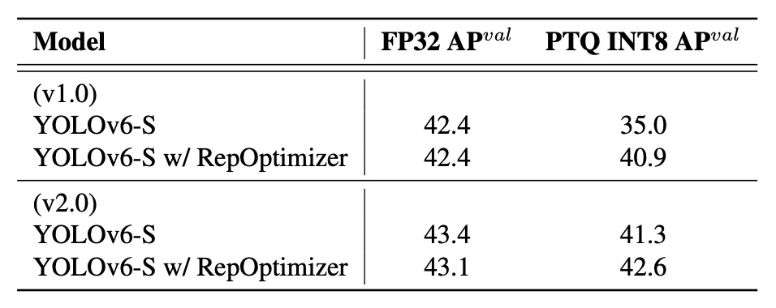

## The Crossroad of Re-parameterization

[**YOLOv6: A Single-Stage Object Detection Framework for Industrial Applications**](https://arxiv.org/abs/2209.02976)

---

Since YOLOv5 was never formally published, we directly move on to v6.

YOLOv6 is developed under the leadership of the computer vision team at Meituan, a Chinese lifestyle service platform.

## Problem Definition

The YOLO series has always enjoyed extremely high popularity in industrial applications.

The reason is simple: it’s straightforward, fast, and accurate enough.

However, as task types expand and deployment scenarios become more complex, the foundational assumptions once considered “good enough” gradually become insufficient.

For example, the myth of architectural consistency causes a performance gap between small and large models; the instability of quantized inference results in re-parameterized models producing adverse effects during practical deployment.

Moreover, current speed reports mostly rely on high-end GPUs, causing a large discrepancy between expected and actual latency in deployment; advanced training strategies such as label assignment, loss design, and knowledge distillation often remain theoretical or limited to small-scale experiments, making it hard to form a complete training pipeline.

At the core lies a fundamental question:

> **When we say a model is fast and accurate enough, what do we really mean?**

Is it the benchmark score on an A100 GPU, or real-time response on a T4? Is it the endpoint of the training accuracy curve, or the ability to run stably in industrial settings for a month?

These accumulated questions are not just technical details but also reflect differing design philosophies.

Looking back at the YOLO architecture, past development focused on module stacking, feature fusion, and data augmentation. However, before reaching the threshold of industrial deployment, the core that needs reconsideration is:

**model quantizability, module re-parameterizability, training strategies, and hardware friendliness.**

## Problem Solving

YOLOv6 breaks down its design philosophy into six strategic aspects addressing six long-standing engineering bottlenecks:

1. **Network Design**
2. **Label Assignment**
3. **Loss Function**
4. **Training Enhancements (Industry-handy Improvements)**
5. **Quantization and Deployment**
6. **Self-distillation**

:::tip
The YOLO series introduces re-parameterized architectures starting from this paper, a concept that gained popularity following the 2021 RepVGG paper. For readers who haven't yet read RepVGG, you can refer to our previous notes:

- [**[21.01] RepVGG: Making VGG Great Again**](../../reparameterization/2101-repvgg/index.md)
  :::

### Network Design

An object detection model can basically be decomposed into three core modules:

- **Backbone, Neck, and Head.**

These terms should be familiar to everyone.

The Backbone dominates feature extraction, determining the semantic representation ability of the model and accounting for most of the computational cost; the Neck integrates feature maps at different levels, building a multi-scale pyramid structure; the Head performs classification and bounding box prediction based on these feature maps.

YOLOv6 redesigns all three modules with differentiated adjustments according to different model sizes. The core idea is:

> **Design different architectures for different model scales.**

For small models, YOLOv6 uses the **RepBlock** re-parameterizable module as the main Backbone. This conversion mechanism is inspired by RepVGG’s design philosophy: **training is for learning, inference is optimized for deployment.**

<figure style={{ "width": "90%"}}>

</figure>

The RepBlock module, shown in figure (a) above, contains a multi-branch structure during training, which facilitates feature representation learning; during inference, it is converted into a single-path, stacked 3×3 convolution form that maximizes hardware computation density and parallel efficiency, performing particularly well on mainstream GPUs and CPUs.

However, when scaling up the model size, the single-path architecture causes parameters and computations to grow exponentially. Therefore, YOLOv6 introduces a new design for medium and large models: the **CSPStackRep Block**, shown in figure (c). This is a hybrid module combining the **CSP structure** with the **RepBlock re-parameterization mechanism.**

Internally, it consists of three 1×1 convolutions and a stack of RepBlocks, incorporating cross-stage residual connections (CSP) to maintain performance stability while reducing redundant computation. This structure achieves a better trade-off between accuracy and speed, especially suitable for medium to large models.

---

Next, looking at the Neck.

YOLOv6 continues to use the **PAN (Path Aggregation Network)** architecture from v4/v5 as the main Neck. The difference is that small models use RepBlock, while larger models use CSPStackRep Block to replace v5’s original CSPBlock.

This architecture is named **Rep-PAN** by the authors. Its width and depth dynamically adjust according to model scale, allowing features to flow effectively across different levels and spatial scales, while maintaining inference efficiency.

The overall architecture is shown below:

<figure style={{ "width": "90%"}}>

</figure>

---

Finally, the Head design optimization.

Compared to v5’s coupled design or YOLOX’s decoupled Head with two extra 3×3 convolution layers, YOLOv6 adopts a decoupled design called **Efficient Decoupled Head**, which retains only one intermediate convolutional layer and adjusts overall channel counts based on Backbone and Neck widths.

Additionally, YOLOv6 uses an **anchor-free** approach based on anchor points. The model no longer assumes a preset set of anchor boxes but directly predicts the distance from each point to the object boundary. This method offers simple decoding, strong generalization, and low post-processing cost. It is also a mainstream design in recent anchor-free detectors such as FCOS and YOLOX.

### Label Assignment

Label assignment is a critical step in the object detection training pipeline.

It is responsible for assigning each ground-truth object to a set of predefined anchors or prediction points during training. This process not only determines the distribution of positive and negative samples but also directly affects the learning dynamics of both classification and regression branches.

Early methods mostly relied on geometric criteria, such as IoU-based strategies or rules based on whether a point lies inside a bounding box. These approaches are intuitive but often insufficient for handling multi-scale objects and uneven backgrounds.

In recent years, advanced methods have emerged that treat label assignment as an optimization or task alignment problem.

1. **SimOTA: An ideal transport problem with suboptimal convergence**

   Early versions of YOLOv6 adopted **SimOTA** as the label assignment strategy.

   This method is derived from OTA (Optimal Transport Assignment), modeling label assignment as a global transport problem and using the loss function as the distance metric to achieve an overall optimal allocation between classification and regression results.

   SimOTA simplifies OTA by retaining its core idea while reducing hyperparameter complexity. However, in practice, the authors observed several issues:

   - Introducing SimOTA **significantly lengthened training time**;
   - The model tended to exhibit **unstable oscillations** during early training stages and was more sensitive to initialization and learning rates.

   These observations led them to seek a more stable and training-friendly alternative.

2. **TAL: Task alignment from geometry to semantics**

   Ultimately, the authors adopted **Task Alignment Learning (TAL)**.

   Proposed by TOOD, unlike SimOTA, TAL **no longer relies solely on geometric metrics (e.g., IoU) as assignment criteria**, but establishes a unified metric considering both classification scores and predicted box quality, enabling synchronous alignment of classification and regression branches during label assignment.

   This design brings two clear advantages:

   1. **Mitigates task misalignment between classification and regression**, enhancing overall model consistency;
   2. **Demonstrates stability and accelerated convergence from early training stages**, with less reliance on hyperparameter tuning.

   TOOD’s original architecture also introduced T-head and TAP (Task-Aligned Predictor) modules. Later, PP-YOLOE simplified this to the ET-head.

   However, the authors found that incorporating ET-head in YOLOv6 did not yield significant accuracy improvements and slowed inference speed. Therefore, they retained their Efficient Decoupled Head design and adopted TAL only for label assignment.

---

Experiments confirmed that TAL not only outperforms SimOTA in accuracy but more importantly, **significantly stabilizes the training process**, becoming YOLOv6’s default label assignment mechanism.

### Loss Function

The object detection task can essentially be decomposed into two subtasks: **classification** and **localization**, corresponding to classification loss and bounding box regression loss. These two loss paths influence prediction accuracy as well as the overall convergence speed and stability.

In YOLOv6, the authors conducted extensive experiments on loss design for these subtasks and ultimately selected a balanced combination strategy.

1. **Classification Loss: Balancing signal strength between positive and negative samples**

   For the classification branch, traditional cross-entropy loss tends to cause the model to overfit easy samples and ignore a small number of hard samples due to class imbalance. Focal Loss was proposed to address this by down-weighting easy samples, focusing training on harder examples.

   Further extensions include:

   - **Quality Focal Loss (QFL)**, which integrates classification confidence with predicted box quality for supervision;
   - **Poly Loss**, which expands the loss polynomially to improve generalization;
   - **VariFocal Loss (VFL)**, which asymmetrically handles positives and negatives by assigning stronger signals to positive samples, further balancing the signal distribution.

   Through experiments, **YOLOv6 ultimately selects VFL as the classification loss**, primarily due to its high sensitivity to hard samples and stable training behavior.

---

2. **Bounding Box Loss: From IoU to probability distribution**

   The core of localization loss design is to make predicted boxes as close as possible to ground truth. Early methods used L1 or L2 loss but found inconsistencies with evaluation metrics (such as IoU), causing misdirected learning.

   Therefore, IoU-based losses were proposed, including:

   - **GIoU, DIoU, CIoU**: incorporating geometric information such as enclosing box area, center distance, and aspect ratio;
   - **SIoU**: further considering convergence behaviors along diagonal and angular directions.

   YOLOv6 adopts the following strategy:

   - Small models (YOLOv6-N/T) use **SIoU**;
   - Medium and large models use **GIoU** to balance stability and performance.

   Additionally, YOLOv6 introduces **Distribution Focal Loss (DFL)** in medium and large models. This loss treats box regression as a probability distribution estimation, better handling ambiguous or uncertain object boundaries. Considering its computational cost, **DFL is only used in YOLOv6-M/L**, not in smaller models.

---

3. **Objectness Loss: A design without gains**

   The authors also experimented with adding an **objectness loss** similar to FCOS and YOLOX, aimed at suppressing low-quality predicted boxes. However, experiments showed that in YOLOv6’s anchor-free architecture, **this design brought no significant benefits** and thus was excluded from the final model.

---

Overall, YOLOv6’s loss design follows a **task-alignment plus signal-enhancement** strategy:

- The classification branch emphasizes signal asymmetry, using VFL to stabilize discrimination;
- The regression branch prioritizes stable and fast learning in small models, while allowing complex but precise DFL in large models;
- All designs aim to **improve overall learning quality without sacrificing inference efficiency**.

### Quantization and Deployment

In industrial applications, speed is essential.

Therefore, **how to accelerate inference without severely sacrificing performance** becomes a practical challenge beyond model design and training.

Quantization is the primary solution to this problem.

However, for architectures like YOLOv6 that heavily utilize re-parameterization blocks, traditional quantization workflows are not directly applicable.

Using Post-Training Quantization (PTQ) leads to a significant drop in accuracy; switching to Quantization-Aware Training (QAT) introduces mismatches between the quantization simulator during training and actual inference, causing additional issues.

:::info
Before moving on, let’s pause here.

Shortly after this paper was published, another classic study on quantization issues for re-parameterized architectures appeared: QARepVGG.

This paper points out that the cause of quantization problems lies in BatchNorm collapse during the re-parameterization process due to certain statistical parameter issues. Interested readers can refer to our previous notes:

- [**[22.12] QARepVGG: Making RepVGG Great Again**](../../reparameterization/2212-qarepvgg/index.md)
  :::

At this moment, YOLOv6 tackles the problem step-by-step.

1. **RepOptimizer: Solving quantization issues at the optimizer level for re-parameterized blocks**

   YOLOv6 uses **RepOptimizer** as its training optimizer, a gradient optimization strategy designed specifically for re-parameterized architectures. The core idea is to perform structural-level re-parameterization during every gradient update, aligning training and deployment behaviors from the source.

   Experiments (see figure below) show that models trained this way have a narrower feature distribution range, making them more suitable for direct Post-Training Quantization (PTQ). This enables producing a quantized model with stable inference performance without requiring additional large-scale annotated data.

   

   <figure style={{ "width": "70%"}}>
   
   </figure>
   

---

2. **Sensitivity Analysis: Protecting fragile parts of the model with float precision**

   Even when trained with RepOptimizer, some layers may still suffer significant accuracy drops after quantization. Therefore, YOLOv6 applies **sensitivity analysis** to evaluate the quantization impact on feature maps layer-by-layer and identify the most sensitive layers.

   Evaluation metrics used include:

   - **MSE (Mean Squared Error)**
   - **SNR (Signal-to-Noise Ratio)**
   - **Cosine Similarity**

   After comprehensive analysis on the YOLOv6-S model, the authors choose to keep the top six most sensitive layers in full float precision, while safely quantizing the rest. This mixed-precision deployment strategy effectively improves stability without adding extra complexity.

---

3. **QAT + Channel-wise Distillation**

   

   <figure style={{ "width": "80%"}}>
   
   </figure>
   

   In some deployment scenarios, even RepOptimizer combined with mixed precision is insufficient, thus further Quantization-Aware Training (QAT) is needed. YOLOv6 makes two improvements on this basis:

   1. QAT must be built on top of the RepOptimizer framework to solve inconsistencies caused by fake quantizers;
   2. It incorporates Channel-wise Distillation, where the FP32 model outputs serve as teacher signals to guide the quantized training process.

   This self-distillation design further improves channel-level distribution learning, compensating for details lost during quantization.

### Implementation Details

YOLOv6’s training pipeline largely follows YOLOv5’s setup, including these techniques and strategies:

- Optimizer: Stochastic Gradient Descent (SGD) with momentum;
- Learning rate schedule: Cosine decay;
- Other techniques: Warm-up initialization, grouped weight decay, and exponential moving average (EMA).

For data augmentation, the authors adopt two widely validated strong augmentations: **Mosaic** and **Mixup**, continuing the practice from YOLOv4/YOLOv5.

Training data comes from COCO 2017 training set; validation uses the COCO 2017 validation set.

All models are trained on 8 NVIDIA A100 GPUs. Unless otherwise noted, speed tests are performed on Tesla T4 using TensorRT 7.2.

## Discussion

This paper dedicates considerable space to planning and experiments on self-distillation, but due to space constraints, we highlight only a few key results here. Readers interested in self-distillation techniques are encouraged to consult the original paper.

### Comparison with Other Architectures

<figure style={{ "width": "90%"}}>

</figure>

<figure style={{ "width": "70%"}}>

</figure>

Since YOLOv6’s core goal is to build an efficient detector for industrial deployment, the authors focus not on FLOPs or parameter counts but on actual inference efficiency after deployment, including:

- **Throughput (FPS):** inference frame rate at batch sizes 1 and 32;
- **Latency:** average per-image processing delay.

Experiments compare the YOLOv6 series with other YOLO-family models:

- YOLOv5
- YOLOX
- PP-YOLOE
- YOLOv7

:::tip
**Wait, why can v6 be compared with v7?**

Because v7 was released earlier than v6! Welcome to the chaotic world of YOLO! 😱
:::

All models were tested under identical conditions: **FP16 precision + TensorRT deployment + Tesla T4 GPU**.

YOLOv7-Tiny results were re-tested using its open-source models and official weights at input sizes 416 and 640.

Key takeaways from the experiments:

- **YOLOv6-N** achieves **7.9% / 2.6% AP improvements over YOLOv5-N / YOLOv7-Tiny** at input size 416, with best throughput and latency metrics.
- **YOLOv6-S** outperforms YOLOX-S / PPYOLOE-S by **3.0% / 0.4% AP**, also running faster.
- At input size 640, **YOLOv6-T** improves accuracy by **2.9%** over YOLOv5-S / YOLOv7-Tiny and is faster by **73 / 25 FPS** at batch size 1.
- **YOLOv6-M** gains **4.2% AP over YOLOv5-M** and **2.7% / 0.6% over YOLOX-M / PPYOLOE-M**, while maintaining speed advantages.
- In large model comparisons, **YOLOv6-L** surpasses YOLOX-L / PPYOLOE-L by **2.8% / 1.1% AP** while leading in latency.

The authors also propose a faster variant, **YOLOv6-L-ReLU**, which replaces SiLU activation with ReLU. Without increasing latency, it achieves **51.7% AP with only 8.8ms delay**, outperforming YOLOX-L, PPYOLOE-L, and YOLOv7 in both accuracy and speed.

### Ablation Studies

To verify the impact of design choices on final performance, systematic ablation experiments cover three aspects: **network architecture, label assignment, and loss functions**. Experiments mainly use YOLOv6-N/S/M models under consistent training and testing setups.

First, performance of single-path vs. multi-branch (CSPStackRep Block) structures is compared across model scales.

<figure style={{ "width": "70%"}}>

</figure>

Results show:

- On YOLOv6-N, **single-path structure** outperforms multi-branch in accuracy and speed. Despite higher FLOPs and parameters, lower memory footprint and better parallelism lead to faster runtime.
- YOLOv6-S shows comparable performance between both structures.
- For YOLOv6-M/L, **multi-branch structure** performs better; authors select CSPStackRep with channel coefficients of 2/3 (M) and 1/2 (L).

Analysis of YOLOv6-L’s Neck width and depth reveals that narrow-and-deep design yields 0.2% higher AP with similar speed, aligning with expectations that deeper architectures have larger receptive fields suited for detection.

Additional conclusions include:

- Conv + SiLU achieves best accuracy.
- RepConv + ReLU balances speed and accuracy well.
- Adding Decoupled Head (DH) improves AP by 1.4% with only 5% more computation.
- Anchor-free design increases inference speed by 51% compared to anchor-based, mainly due to reduced output dimensions.
- Unified Backbone and Neck redesign (EB+RN) improves AP by 3.6% and speed by 21%.
- Hybrid-channel Decoupled Head (HC) adds 0.2% AP and boosts FPS by 6.8%.

For label assignment, **TAL** proves best, achieving **35.0% AP on YOLOv6-N**, 0.5% higher than SimOTA, with more stable training.

Loss function comparisons among VFL, QFL, Focal Loss, and Poly Loss show VFL yields AP improvements of 0.2% / 0.3% / 0.1% on YOLOv6-N/S/M, becoming the default classification loss.

Tests on IoU-based and distribution-based losses find:

- **SIoU** best for YOLOv6-N and YOLOv6-T;
- **CIoU** better for YOLOv6-M;
- DFL adds 0.1–0.2% gain but slows small models, thus used only in YOLOv6-M/L.

Objectness loss experiments show introducing it on YOLOv6-N/S/M causes up to 1.1% AP drop. The authors attribute this to TAL’s alignment logic becoming disrupted by adding a third task branch, hence opting to exclude objectness loss.

### Quantization Results

To validate YOLOv6’s quantization design in deployment, authors conduct complete PTQ and QAT experiments on **YOLOv6-S**, testing both v1.0 and v2.0 models trained for 300 epochs by default.

:::tip
The biggest improvement in v2.0 is the removal of quantization-sensitive layers, such as certain composite activations, shortcut structures, and misaligned convolution modules.
:::

1. **Post-Training Quantization (PTQ)**

   Comparison of PTQ effects with and without RepOptimizer shows:

   

   <figure style={{ "width": "70%"}}>
   
   </figure>
   

   RepOptimizer does not affect FP32 accuracy but **significantly improves INT8 quantized accuracy**, especially in v1.0, from 35.0% to 40.9%. This demonstrates its ability to converge feature distributions, aiding quantization error tolerance.

---

2. **Quantization-Aware Training (QAT)**

   For YOLOv6 v1.0, **Partial QAT** is applied to non-sensitive layers, comparing Full QAT and Channel-wise Distillation (CW Distill):

   

   <figure style={{ "width": "70%"}}>
   
   </figure>
   

   Partial QAT outperforms Full QAT overall, improving accuracy by 7.3% with only slight throughput reduction. This confirms the effectiveness of selectively choosing quantization blocks to minimize accuracy loss.

   For v2.0, with quantization-sensitive layers removed, QAT can be applied network-wide. Combined with graph optimizations and quantization module simplifications, accuracy and speed improve further.

   Comparison with PaddleSlim’s quantized models shows:

   

   <figure style={{ "width": "70%"}}>
   
   </figure>
   

   Results indicate the proposed quantization method outperforms other publicly available quantized models in both accuracy and speed, even surpassing YOLOv6 FP16 in speed while maintaining only 0.1% lower accuracy.

---

These results demonstrate that through **RepOptimizer + selective QAT + graph optimization + channel-wise distillation**, YOLOv6 not only achieves quantization but does so efficiently, truly balancing speed and accuracy for deployment.

## Conclusion

YOLOv6’s main contributions include:

- Designing re-parameterizable architectures for small models and efficient multi-branch architectures for large models based on model scale differences;
- Employing TAL for label assignment and VFL + SIoU/CIoU + DFL loss design, balancing stability and accuracy;
- Incorporating engineering techniques such as extended training, self-distillation, gray border handling, and Mosaic augmentation to enhance performance;
- Combining RepOptimizer with mixed-precision PTQ/QAT strategies to successfully build deployable quantized detectors.

YOLOv6 surpasses existing models in accuracy and speed, maintaining strong performance after quantization, providing a practical solution for real-time industrial applications.
