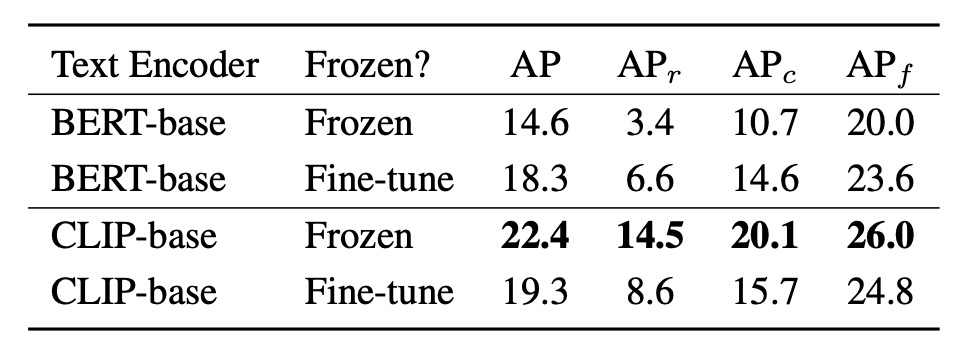

## The Pursuer of Nouns

[**YOLO-World: Real-Time Open-Vocabulary Object Detection**](https://arxiv.org/abs/2401.17270)

---

In this era of object detection represented by YOLO, speed and efficiency have long ceased to be new topics.

What is truly challenging is the closed nature of categories.

## Problem Definition

Over the past decade, the progress in object detection has been revolutionary.

We witnessed the R-CNN series gradually constructing the rule-based world of two-stage detection, saw SSD and RetinaNet simplify the process by querying each anchor on a pixel basis; we also saw DETR introduce query design and Transformers, transforming "detection" from mere localization to semantic interaction.

Among all these architectures, the YOLO series remains a distinctive existence.

It continuously compresses computational costs, pushing the limits of real-time inference with a minimalist architecture: **fast! faster! fastest!**

However, despite these technological iterations, one thing has rarely been shaken:

> **Almost all mainstream detection models still live in a world of "fixed vocabularies."**

Training data defines the language the model can speak; if the dataset contains no "kite," the model will never learn to recognize what a kite looks like. COCO has 80 categories, Objects365 has 365, but the real world contains many more objects without names in these datasets.

How can we enable models to have the ability to "open the dictionary" instead of only responding within a few known options?

**Open-Vocabulary Object Detection** (abbreviated OVD) was born to solve this bottleneck. It aims for object detection to transcend fixed-class boundaries and learn to understand "semantics" rather than merely memorizing the mapping between images and labels.

But every attempt at OVD comes at a high cost.

## Solution

<figure style={{ "width": "90%"}}>

</figure>

The architecture of YOLO-World is shown above.

It retains the overall design familiar in the YOLO series: after the image is encoded by a backbone, it passes through a multi-scale feature fusion module, ultimately outputting predicted bounding boxes and object representations. Unlike past fixed-category setups, YOLO-World introduces a language encoder and cross-modal fusion module, enabling the whole architecture to handle open-vocabulary detection tasks.

The overall process is as follows:

1. The user input prompt (which could be a description, a set of nouns, or a class list) is first converted into semantic vectors by CLIP’s text encoder.

2. The image is processed by YOLOv8’s image encoder to extract multi-scale image features.

3. Then, through the newly proposed RepVL-PAN, language and image features are aligned and fused.

4. Finally, a decoupled head simultaneously outputs bounding boxes and object semantic representations, which are matched against the input vocabulary.

This design allows YOLO-World to no longer rely on fixed-class classifiers but to find the regions in the image that best match the input prompt via semantic matching. Therefore, it can flexibly switch vocabularies during inference and even handle objects never seen during training.

Under such a structure, object detection shifts from "predicting which class" to "whether this region corresponds to the concept described by a certain word."

Next, let's take a closer look at the design of RepVL-PAN.

### RepVL-PAN

<figure style={{ "width": "70%"}}>

</figure>

As shown above, YOLO-World proposes RepVL-PAN (Re-parameterizable Vision-Language Path Aggregation Network), a module that enhances vision-language interaction and operates during YOLO’s multi-scale feature fusion stage.

Traditional PAN only handles top-down and bottom-up image feature passing and fusion. However, in open-vocabulary detection tasks, relying solely on visual signals is insufficient for semantic matching. Therefore, RepVL-PAN injects language information into the image feature pipeline, allowing semantics to permeate the feature map generation process.

It consists of two key components:

1. **Text-guided CSPLayer**

   In the YOLO architecture, CSPLayer is an improved residual stack module responsible for maintaining feature stability and channel expressiveness. In YOLO-World, the authors design a text-guided version of CSPLayer, enabling each feature layer to be adjusted based on vocabulary semantics.

   Specifically, for an image feature at a certain scale $X_l \in \mathbb{R}^{H \times W \times D}$, and a set of word embedding vectors from the text encoder $W = \{w_j\}_{j=1}^C$, we compute the similarity between each position and the semantics, and apply a sigmoid function to form attention weights:

   $$
   X_l' = X_l \cdot \delta\left( \max_{j \in \{1..C\}} (X_l W_j^\top) \right)^\top
   $$

   where $\delta(\cdot)$ is the sigmoid function used to suppress extreme values. This design weights each position’s image feature according to semantic cues, generating a feature map $X_l'$ that better corresponds to the vocabulary.

   These enhanced image features are concatenated with the original CSPLayer output, then passed to the next PAN layer, gradually building a semantically sensitive pyramid representation.

2. **Image-Pooling Attention**

   Besides letting language influence images, YOLO-World also designs a feedback path so image information can refine language representations. This is implemented through Image-Pooling Attention.

   Specifically, image features from various scales are pooled down to several regional vectors (e.g., $3 \times 3$ patch tokens, totaling 27), denoted as $\tilde{X} \in \mathbb{R}^{27 \times D}$, which serve as Key and Value to update the original word embeddings via multi-head attention:

   $$
   W' = W + \text{MultiHeadAttention}(W, \tilde{X}, \tilde{X})
   $$

   As a result, the word embeddings are no longer static semantic vectors but enriched with current image context, strengthening the correspondence between words and image content.

---

These two designs form a symmetrical semantic loop: one allows language to infiltrate the image, the other lets the image refine the language.

Ultimately, these updated language and image features jointly participate in object detection, enabling the model to perform stable semantic matching without relying on fixed-class classifiers.

A key aspect of this entire mechanism is that it supports **re-parameterization**, meaning that during inference, offline vocabulary can be directly converted into model weights, removing the CLIP encoder and greatly reducing computational cost.

### Pretraining Strategy

Although language and images are different modalities, if we want the model to understand what a "word refers to," it ultimately comes down to one thing:

> **The correspondence between words and image regions.**

YOLO-World adopts a region-text contrastive learning strategy, aiming to teach the model to distinguish: **"This is a dog," not "This looks like a dog."**

To train this ability, the authors reconstruct the training data format, representing each annotated sample as:

$$
\Omega = \{(B_i, t_i)\}_{i=1}^N
$$

where $B_i$ is the bounding box of the $i$-th region in the image, and $t_i$ is the corresponding word.

This word can be a category noun or a noun phrase extracted from the description.

### Contrastive Learning

During the forward phase, YOLO-World predicts $K$ object regions per training image, each with a representation vector $e_k$. Meanwhile, the text encoder generates corresponding word vectors $\{w_j\}$ for the input vocabulary set $T$.

To make the similarity between these vectors meaningful, the model calculates similarity as follows:

$$
s_{k,j} = \alpha \cdot \text{L2Norm}(e_k) \cdot \text{L2Norm}(w_j)^\top + \beta
$$

where $\alpha, \beta$ are trainable scale and bias parameters to stabilize training; L2 normalization ensures similarity mainly reflects direction (semantics) rather than magnitude.

With this similarity matrix, the model transforms the word classification task into a semantic matching task, further computing the **region-text contrastive loss**:

$$
\mathcal{L}_{\text{con}} = \text{CrossEntropy}(s_{k,j}, y_{k})
$$

### Task Separation

In the overall training process, YOLO-World uses data not only from annotated datasets like COCO but also samples from grounding tasks or image-text paired datasets.

Considering data quality differences, the authors use an indicator variable $\lambda_I$ to control whether to apply box regression losses:

- When image $I$ comes from detection or grounding data, IoU loss and distributed focal loss are calculated.
- When image $I$ comes from image-text data (e.g., CC3M), only the semantic contrastive loss is calculated.

The total loss is:

$$
\mathcal{L}(I) = \mathcal{L}_{\text{con}} + \lambda_I \cdot (\mathcal{L}_{\text{iou}} + \mathcal{L}_{\text{dfl}})
$$

This design enables YOLO-World to flexibly handle data of varying quality and sources, maintaining generalization ability while preserving bounding box regression accuracy.

### Automatic Annotation

The real key enabling YOLO-World to conduct large-scale pretraining is the **pseudo-labeling** strategy.

After all, large image-text datasets like CC3M have rich descriptions but lack bounding box annotations; relying on manual labeling is impractical.

Therefore, YOLO-World adopts a three-stage automatic annotation pipeline:

1. **Word Extraction:** Extract noun phrases from descriptions (e.g., "a dog running in the park" → "dog," "park").
2. **Bounding Box Generation:** Use a pretrained GLIP model to generate predicted boxes in the image based on these words.
3. **Filtering:** Use CLIP to evaluate the similarity between words and image regions, remove unreliable pseudo pairs, and apply NMS to eliminate redundant boxes.

In the end, the authors collected 246k images from CC3M and generated 820k pseudo region-text annotations, becoming a crucial data source for training YOLO-World.

## Discussion

The experiments in the paper cover three aspects: zero-shot, fine-tuning, and open-vocabulary segmentation, verifying YOLO-World’s generalization ability, practical value, and extensibility respectively.

We highlight several key results here; please refer to the original paper for full details.

### Generalization Ability of Small Models

<figure style={{ "width": "90%"}}>

</figure>

The authors conducted zero-shot evaluation on LVIS, shown above. The numbers in parentheses indicate model sizes before re-parameterization, meaning the text encoder has been removed during inference to reduce latency and computation.

Without any fine-tuning, YOLO-World-L achieves **35.4 AP / 52 FPS** on LVIS minival, surpassing most large architectures (e.g., GLIP, Grounding DINO) in accuracy while also leading in speed.

More importantly, this result was measured on a pure V100 setup without TensorRT or FP16 acceleration, demonstrating the model’s highly efficient inference pipeline.

Several observations arise from this result:

- The model does not rely on large language model prompts, special prompting techniques, or post-processing tricks, yet can stably detect "over a thousand vocabulary terms," showing robust semantic alignment and representation quality.
- YOLO-World-S, the smallest version with only **13M parameters**, still reaches **26.2 AP**, close to other medium-sized architectures, proving good scalability and potential for lightweight applications.

Previously, open-vocabulary detection models were often impractical for deployment due to their large size and language model dependencies.

This result is the first to show that without sacrificing generalization, open-vocabulary detection can also be brought within the design boundary of “edge real-time computation.”

### Module Ablation Study

<figure style={{ "width": "70%"}}>

</figure>

To validate the contribution of the RepVL-PAN module in YOLO-World, the authors designed ablation studies on two core modules: **Text-guided CSPLayer (T→I)** and **Image-Pooling Attention (I→T)**, corresponding to language influencing image and image feeding back to language respectively. The table shows zero-shot detection performance on LVIS under five settings.

Here:

- “T→I” means enabling Text-guided CSPLayer;
- “I→T” means enabling Image-Pooling Attention;
- “GQA” indicates whether the language-rich GQA dataset was used in pretraining.

The experiments divide into two parts:

First, without GQA pretraining:

- The **baseline with no language module** has AP only **22.4**, and rare category ($AP_r$) at **14.5**.
- Enabling **T→I** module raises AP to **23.2**, with slight increase of $AP_r$ to **15.2**.
- Enabling both **T→I and I→T** (bidirectional language fusion) further improves AP to **23.5**, and notably raises $AP_r$ to **16.2**, showing combined modules help rare vocabulary recognition.

This shows that even with limited semantic annotation in pretraining data, the language modules provide stable semantic alignment ability to YOLO.

Next, with GQA pretraining:

- Adding GQA alone without language modules improves the model significantly to **29.7 AP / 21.0 $AP_r$**, indicating the semantic information in GQA benefits recognition.
- Enabling both language modules with GQA yields the highest scores: **31.9 AP / 22.5 $AP_r$**, with frequent and common categories ($AP_c$, $AP_f$) also reaching **29.9 / 35.4**.

Overall:

- **T→I provides early fusion, language-guided capability**, aligning image features with semantics from the start;
- **I→T supplements contextual feedback**, making word embeddings more image-context aware;
- When pretrained on semantically dense data (like GQA), the effects of both modules are amplified.

These results show YOLO-World does not rely on stacking backbones but establishes bidirectional language fusion paths within the PAN structure, enabling stable and fine-grained semantic alignment for open vocabularies.

### Encoder Fine-tuning Strategy

<figure style={{ "width": "70%"}}>

</figure>

For generating word embeddings, YOLO-World adopts two text encoders with different traits: CLIP-base and BERT-base, comparing their performance when frozen and fine-tuned.

Observations:

- When frozen, **CLIP-base greatly outperforms BERT-base**, with a rare category gap on LVIS of **+11.1 AP** (14.5 vs. 3.4), and overall AP increasing from **14.6** to **22.4**.
- Fine-tuning BERT-base improves its performance to **18.3 AP** and rare category to **6.6 AP**, but still below frozen CLIP.
- Conversely, **fine-tuning CLIP results in performance degradation**: AP drops from **22.4** to **19.3**, $AP_r$ falls drastically from **14.5** to **8.6**.

This indicates several insights:

- CLIP, pretrained on massive image-text pairs, encodes semantics with strong visual context sensitivity, showing strong zero-shot generalization even without parameter adjustment.
- BERT is stable in language understanding but lacks joint vision training; its semantic mapping is more abstract and needs fine-tuning to better align with the task.
- However, fine-tuning CLIP on datasets with limited classes (like O365) and constrained language distributions may harm its semantic breadth, impairing open-vocabulary generalization.

This reminds us that in designing open-vocabulary detection models, **semantic breadth of the language module is often more critical than local fitting**. Over-adapting can cause the model to overfit labels in specific data while losing ability to generalize to unseen vocabularies.

### Downstream Task Extensibility

<figure style={{ "width": "90%"}}>

</figure>

YOLO-World extends beyond detection to **Open-Vocabulary Instance Segmentation (OVIS)**, requiring the model not only to locate "what it is" but also to outline "its contour."

The authors designed two experiment settings:

1. **COCO → LVIS**: pretrain on COCO (80 classes), then test transfer to 1203 classes.
2. **LVIS-base → LVIS**: train on LVIS-base with 866 classes, test generalization on full set including 337 rare classes.

Two training strategies:

- **Fine-tune only the segmentation head**, preserving the detection backbone and pretrained semantic generalization.
- **Fine-tune all modules (All)**, allowing full learning of segmentation context but possibly sacrificing zero-shot flexibility.

With only the segmentation head fine-tuned:

- Training on COCO, YOLO-World-L achieves **16.2 AP / 12.4 $AP_r$**;
- Using the semantically denser, more finely annotated LVIS-base improves to **19.1 AP / 14.2 $AP_r$**.

This shows the segmentation head can absorb semantic knowledge from pretraining and extend it to fine-grained segmentation without backbone modification, maintaining good open-vocabulary performance.

Allowing full-model fine-tuning (including PAN, language module, detection head):

- Under LVIS-base training, YOLO-World-L reaches **28.7 AP**, a significant improvement over segmentation-head-only tuning.
- However, $AP_r$ rises only from 14.2 to 15.0, and box $AP_r$ slightly drops by 0.6, indicating some loss in semantic generalization for rare classes.

This highlights a classic open-vocabulary dilemma:

> **The more focused on specific task learning, the more likely to sacrifice cross-context generalization.**

If the priority is overall accuracy, full fine-tuning is beneficial; if maintaining stable semantic correspondence for unknown classes is the goal, preserving pretrained semantics is preferable.

In multimodal systems, **accuracy and generalization form a dynamic balance, not an infinitely coexisting goal**. Adjusting this balance per scenario may be a more important design choice going forward.

## Conclusion

The bidirectional fusion mechanism of RepVL-PAN enables words to be not mere labels attached to predictions but active participants in feature construction. This design philosophy is not language-model-assisted nor vision-model-dominant, but an equal cooperative structure.

For developers, YOLO-World offers several insights:

- **Language-vision fusion does not need to wait for large multimodal models to start.**

  With careful design and streamlined architecture, even a speed-focused YOLO framework can achieve generalizable semantic alignment.

- **Open-vocabulary tasks are no longer confined to offline pipelines.**

  With modules like RepVL-PAN, deploying detection models that recognize "word-defined" concepts in low-resource scenarios becomes feasible, beyond relying on fixed-class classifiers for dynamic scenes.

- **Re-parameterizable language modules provide a practical trade-off design.**

  They allow retention of semantic generalization advantages while controlling inference cost within acceptable boundaries, crucial for mass production and edge deployment.

The contribution of this paper is not just plugging CLIP into YOLO, but rethinking language-vision intersection at the feature pathway level, and enabling semantic alignment without deployment burden via re-parameterization.

The fusion of words and vision is no longer the privilege of high-cost architectures.
