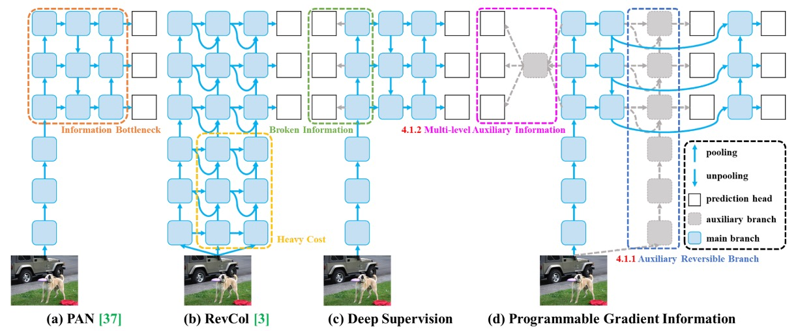
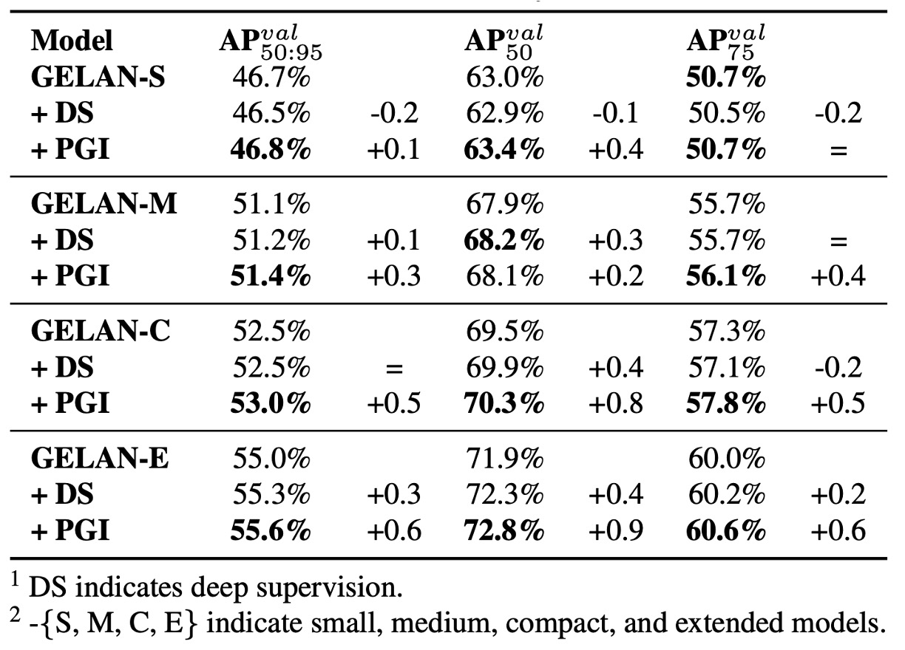
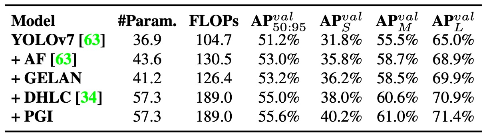

## Programmable Gradient Information

[**YOLOv9: Learning What You Want to Learn Using Programmable Gradient Information**](https://arxiv.org/abs/2402.13616)

---

YOLOv8 didn’t publish a paper either?

If so, let's continue reading the YOLOv9 paper, which is also a work from Taiwan's Academia Sinica.

## Problem Definition

In recent years, the YOLO series has become the de facto standard in real-time object detection. From YOLOv3 to YOLOv7, the continuously evolving architectures have achieved a good balance between accuracy and inference speed, widely applied in surveillance, traffic, AR/VR, and many other scenarios.

Most of these models adopt CSPNet or ELAN as backbone modules, assisted by PAN/FPN for feature fusion, and use YOLO heads or FCOS heads for multi-scale prediction. Even emerging Transformer architectures like RT-DETR have yet to truly surpass the YOLO series in terms of efficiency and deployment.

However, as models become increasingly complex, researchers gradually realize that the issues affecting convergence quality do not stem solely from architectural design or loss function choice, but deeper bottlenecks actually lie in the information transmission paths.

> **The real challenge of modern deep neural networks lies in the information bottleneck during training.**

As input data passes through deep networks layer by layer, the original semantic information is repeatedly compressed and transformed, often diluted or lost by the intermediate layers. This semantic degradation leads to features obtained at the later stages being poorly correlated with the target, causing unreliable gradients that result in slow convergence, low accuracy, or even ineffective training.

Although the industry has proposed three major technical approaches to address this problem:

- **Reversible Architectures**: Designs with inverse mapping functions that preserve complete input information after each layer operation. Representative works include RevNet or Res2Net. In theory, they avoid information loss, but their complex structures and extra computation cost limit inference efficiency.

- **Masked Modeling**: Strategies like those used in MAE or BERT, where the model learns key semantics by reconstructing masked regions. However, these methods are mostly designed for large Transformer architectures and tend to fail at stable semantic restoration when applied to lightweight models due to insufficient parameters.

- **Deep Supervision**: Inserting auxiliary supervision signals into intermediate layers to guide the model to maintain semantic consistency. While this can improve learning stability, it is prone to accumulating erroneous information and is practically effective only in very deep networks, often harming smaller models.

Though each technique has merits, none can simultaneously satisfy both "information retention" and "lightweight efficiency" demands. This bottleneck remains a major obstacle especially for parameter-constrained real-time models.

:::tip
**What is a "Reversible Architecture"?**

A reversible architecture is a neural network design that guarantees no information loss in the forward pass. That is, given the output of a layer, you can perfectly recover its input.

For detailed design ideas, see:

- [**[22.12] Reversible Column Networks**](https://arxiv.org/abs/2212.11696)
  :::

### Why Does Semantic Information Get Lost?

Traditionally, model convergence difficulties were attributed to "vanishing gradients" or "gradient saturation," but these issues have been largely mitigated by BatchNorm, ReLU, and other techniques. The real problem is that **the semantic information on which gradients are based no longer exists**.

According to the **Information Bottleneck principle**, after transformation by each network layer, the mutual information between data and the target task decreases:

$$
I(X, X) \geq I(Y, X) \geq I(Y, f_θ(X)) \geq \dots \geq I(Y, \hat{Y})
$$

where $I(Y, X)$ denotes the semantic information in the input data relevant to the target.

If this information is diluted during forward propagation, even with little total information loss, the model cannot learn truly useful target mappings. This phenomenon is especially pronounced in **lightweight models**, since their limited parameters cannot support full feature representation, making semantic signals more prone to compression and erasure.

Expanding model capacity can alleviate symptoms, but this "wider instead of deeper" approach cannot fundamentally solve semantic loss and gradient degradation.

### The Possibility of Reversible Functions

Reversible functions offer a theoretical solution.

If a transformation function $r_ψ$ has an inverse $v_ζ$ satisfying:

$$
X = v_ζ(r_ψ(X)),\quad I(X, X) = I(X, r_ψ(X)) = I(X, v_ζ(r_ψ(X)))
$$

then the transformation loses no information, guaranteeing complete semantic signal flow.

However, most reversible architectures still face practical challenges like high complexity, unstable learning, and poor generalization, making them difficult to deploy in real-time tasks.

Therefore, we need a novel method that not only preserves key semantics and improves gradient reliability but also:

- **Applies to lightweight architectures**
- **Incurs zero extra inference cost**
- **Can flexibly combine with task losses and structural modules**

Considering these requirements, the authors propose a novel concept to address the information bottleneck:

> **Programmable Gradient Information (PGI).**

Let's continue.

## Solution

<figure style={{ "width": "90%"}}>

</figure>

To solve the information bottleneck and gradient degradation issues, the authors propose a new training framework: **Programmable Gradient Information (PGI)**.

As shown above, this framework draws on experiences from prior methods (such as PAN, RevCol, Deep Supervision), designing a training strategy that **supplements semantic loss during training yet deploys with zero cost during inference**.

### Design Concept

PGI consists of three key components:

1. **Main Branch**

   - The original model architecture responsible for inference.
   - Only this branch is kept during actual deployment, maintaining inference efficiency.

2. **Auxiliary Reversible Branch**

   - Provides additional gradients during training to compensate for semantic features lost due to information bottlenecks in the main branch.

3. **Multi-level Auxiliary Information**

   - Integrates and reorganizes supervision signals from prediction heads at different scales, enabling the main branch to learn gradients consistent with global semantics.

In Figure (b), reversible architectures like RevCol can preserve information integrity but significantly increase inference latency. The authors observe that **instead of making the main branch reversible, it is better to introduce an auxiliary reversible branch during training**.

Figure (d) illustrates this design.

During training, this auxiliary branch simulates a complete semantic path of the input data, providing clear and reliable gradient signals to the main branch. Even if the main branch’s features have been compressed or diluted, it can still receive correct corrections from the auxiliary branch.

### Multi-level Semantic Integration

Traditional deep supervision, as shown in Figure (c), assigns features at each layer to different tasks (e.g., small object detection, large object detection), which can cause semantic conflicts. For example, a layer focusing on small objects while ignoring large ones may cause the backbone features to mistakenly treat important regions as background, resulting in distorted training signals.

To solve this problem, PGI proposes a **Multi-level Auxiliary Information module** that integrates semantic information via a semantic fusion network before sending gradients back from the prediction branches to the backbone.

The advantages of this design are:

- Features at all layers learn complete semantics rather than correspond to a single object scale only.
- Eliminates supervisory conflicts between different prediction heads.
- Allows customizable fusion architectures to flexibly adjust semantic depth and scope.

PGI transforms “deep supervision” from simple multi-point losses into a **multi-semantic consistency fusion training strategy**.

### Generalized ELAN

<figure style={{ "width": "90%"}}>

</figure>

To fully unleash the potential of the PGI framework, YOLOv9 concurrently introduces a new backbone architecture:

- **Generalized ELAN (GELAN).**

As shown above, GELAN draws inspiration from CSPNet and ELAN, where:

- **CSPNet** provides branch-wise gradient control to enhance feature reuse;
- **ELAN** uses deep convolutional stacking for effective aggregation.

GELAN further **generalizes ELAN’s computational unit design**, supporting arbitrary computational modules (such as standard convolution, depthwise convolution, attention modules, etc.), enabling optimization according to different platform constraints.

Its advantages include:

- **Modular design**: adaptable for mobile, embedded devices, or server inference.
- **Stable gradient paths**: structurally built-in signal flow mechanisms that synergize well with PGI.
- **Lightweight yet efficient**: can achieve higher parameter utilization efficiency even without using depthwise convolutions.

As the backbone network, GELAN not only facilitates PGI’s effectiveness but also lays a foundation for efficient and scalable models.

## Discussion

To verify the practicality and generalization capability of the proposed **PGI training mechanism** and **GELAN architecture**, the authors conducted comprehensive experiments on the MS COCO 2017 dataset, comparing against multiple current state-of-the-art real-time object detection models.

This study follows the YOLOv7 training protocol and uses the standard MS COCO 2017 dataset split. All models were trained from scratch for a total of **500 epochs**, with the first 3 epochs using **linear warm-up** and subsequent learning rates decayed according to model scale.

To stabilize final training, **Mosaic data augmentation** was disabled during the last 15 epochs.

YOLOv9 is implemented in two versions:

- **YOLOv9-C / YOLOv9-E**: built respectively upon YOLOv7 and Dynamic YOLOv7.
- The original YOLOv7’s **ELAN modules** were replaced by the proposed **GELAN**, using **RepConv and CSPNet blocks** as computational units.
- Downsampling modules were simplified, and the anchor-free prediction head further optimized.
- PGI’s auxiliary supervision settings fully retained YOLOv7’s multi-branch feature learning design.

### Comparison with Existing Methods

Experimental results shown above demonstrate that YOLOv9 outperforms existing real-time object detectors of similar scale across multiple tasks, with advantages in parameter count, computation cost, and final accuracy:

- For **lightweight models** (e.g., YOLO MS-S), YOLOv9 reduces parameters by about **10%** and computation by **5–15%** while maintaining accuracy, highlighting its suitability for edge computing.

- For **mid-tier models** (YOLO MS), YOLOv9 retains cost advantages and further improves accuracy by **0.4 to 0.6 AP percentage points**, demonstrating better model efficiency despite smaller overall size.

- Compared with the mainstream **YOLOv7 AF**, YOLOv9-C reduces parameters by **42%** and FLOPs by **22%**, while achieving the same AP (53%), underscoring PGI’s effective training quality improvement.

- Compared to the large **YOLOv8-X**, YOLOv9-E cuts parameters by **16%** and FLOPs by **27%**, yet improves AP by **1.7%**, fully showcasing the synergy of efficient design and semantics-driven training.

These results indicate that YOLOv9 achieves highly competitive performance in various real-time detection scenarios **without relying on any pretrained models or external datasets**, confirming the practicality and generalizability of PGI training and GELAN architecture.

### GELAN Architecture Analysis

<figure style={{ "width": "70%"}}>

</figure>

First, the authors examined the substitutability of GELAN’s computational modules, comparing three alternatives:

- **ResNet Block**
- **DarkNet Block**
- **CSP Block**

Results show that even replacing ELAN’s original convolutional units with these modules maintains stable overall performance, demonstrating GELAN’s high flexibility and portability. Among them, **CSP Block performed best**, improving accuracy by **0.7 AP** while reducing parameters and computation.

Hence, YOLOv9 ultimately selects **CSP** as GELAN’s core unit, balancing performance and lightweight design.

Further, the authors tested the impact of **ELAN module depth** and **CSP stacking depth** on performance across different model scales.

<figure style={{ "width": "70%"}}>

</figure>

The experiments show:

- Increasing ELAN depth from 1 to 2 yields significant accuracy gains.
- For depths ≥ 2, increasing either ELAN or CSP stack layers results in linear scaling of performance, parameters, and computation, with no explosive gains.

In other words, **GELAN achieves stable performance without excessive fine-tuning**, suitable for flexible design according to hardware or task needs.

YOLOv9 versions use the following depth configurations:

- YOLOv9-S: ELAN depth 2, CSP depth 3
- YOLOv9-M / C: ELAN depth 2, CSP depth 1

### PGI Training Strategy Analysis

<figure style={{ "width": "70%"}}>

</figure>

PGI consists of two main components: the auxiliary reversible branch and multi-level semantic integration.

The authors conducted ablation studies independently and jointly, finding:

- The **auxiliary reversible branch (ICN)** uses **DHLC linkage** design to provide multi-level reversible information, stably enhancing model performance.
- **Multi-level semantic integration** was tested with FPN and PAN structures, where PAN resembles traditional Deep Supervision (PFH) but shows notable effect only in very deep models.
- **PGI contributes across all model sizes**, with the ICN combination providing the most stable improvements, confirming its capability to alleviate the information bottleneck problem.

Additionally, YOLOv7’s **Lead-Head Guided Assignment technique** was applied to PGI’s auxiliary supervision path, further improving supervision quality and final learning outcomes.

### Model Scale Comparison

<figure style={{ "width": "70%"}}>

</figure>

The authors applied PGI and traditional Deep Supervision on different model scales, observing:

- **Deep supervision reduces accuracy in shallow models**, due to over-supervision causing feature misguidance.

In general models, deep supervision performs unstably and may induce overfitting. PGI, however, **stably improves accuracy across scales**, showing significant advantage especially in lightweight models.

This validates PGI’s two main contributions:

1. **Successfully applying auxiliary supervision to lightweight/shallow models**
2. **Injecting more reliable semantic gradients in deep model training, enhancing learning efficiency and convergence quality**

### Overall Component Integration

<figure style={{ "width": "70%"}}>

</figure>

Finally, the authors present an ablation from the **YOLOv7 baseline** to the full **YOLOv9-E version**.

After gradually adding GELAN and PGI, the model shows clear improvements in accuracy, efficiency, and computational cost, proving these two designs bring comprehensive breakthroughs to YOLOv9.

## Conclusion

The key innovation of YOLOv9 lies in transforming the "gradient flow" into a **programmable information transmission mechanism**.

Through PGI, training is no longer passive backpropagation but an active planning of:

- How semantics should flow
- Where gradients should come from
- At which layer the target should be learned

Together with the GELAN backbone, YOLOv9 simultaneously achieves three major goals: high accuracy, low parameter count, and deployment flexibility.
