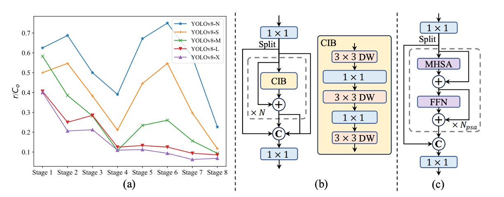
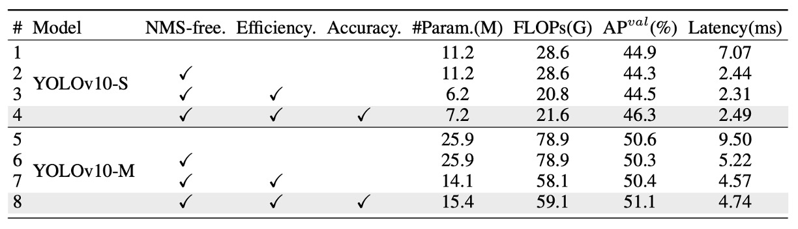
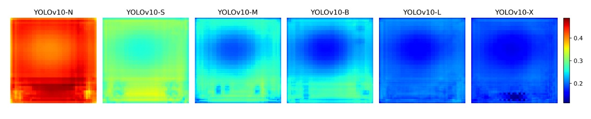

## Goodbye NMS

[**YOLOv10: Real-Time End-to-End Object Detection**](https://arxiv.org/abs/2405.14458)

---

We have followed the evolution from YOLOv1 through YOLOv9.

Now with YOLOv10, we can finally break free from the constraints of NMS—much to celebrate.

## Problem Definition

In computer vision, real-time object detection plays an indispensable role.

From autonomous driving, industrial robots, AR/VR, to real-time analysis systems deployed at the edge, nearly all applications demand achieving high-accuracy classification and localization under extremely low latency. To meet these demands, the research community has continuously innovated, producing a proliferation of efficient detectors.

Since YOLOv1, its unified architecture integrating backbone, neck, and head has revolutionized the traditionally complex detector designs.

Subsequent versions like YOLOv3, YOLOv4 up to YOLOv9 have continuously optimized feature extraction and fusion capabilities by introducing modules such as **CSPNet**, **PAN**, **ELAN**, and **GD**. New techniques like **YOLOv6’s SimCSPSPPF**, **YOLOv7’s E-ELAN**, and **YOLOv9’s GELAN + PGI** attempt to push accuracy limits while maintaining speed.

However, regardless of innovation, most YOLO models remain constrained by the Non-Maximum Suppression (NMS) mechanism in the post-processing stage.

This limitation stems from the training phase’s one-to-many annotation strategy, which forces reliance on NMS during inference to select the best candidate boxes. This not only increases latency but also introduces hyperparameter sensitivity, hindering truly end-to-end inference.

To escape NMS limitations, End-to-End architectures led by DETR gained popularity.

DETR employs Transformers and Hungarian Matching to complete one-to-one label assignment, eliminating dependence on post-processing. Variants like Deformable-DETR, DINO, and RT-DETR have gradually improved convergence speed and operational efficiency. RT-DETR notably became the first to successfully bring DETR to real-time applications, offering a promising path.

But can these Transformer-based designs truly replace CNNs?

In reality, although DETR architectures omit NMS, their forward-pass latency remains significantly higher than traditional CNNs, making deployment on edge devices challenging. Meanwhile, some studies have attempted to enable CNNs to support one-to-one correspondence directly—e.g., OneNet, DeFCN, FCOSpss propose various sample selectors or matching mechanisms aiming for end-to-end detection, but results remain unsatisfactory.

**So, is it possible to transcend this binary choice?**

Neither blindly follow Transformers nor confine ourselves to legacy YOLO designs, but rethink the two key points: "training annotation strategy" and "architectural efficiency bottlenecks"? Or can we design a unified, lightweight, fast, and accurate new architecture that retains CNN advantages?

This paper’s authors attempt to fundamentally resolve the challenges faced by the YOLO series in real-time object detection.

## Solution

YOLOv10’s technical core can be divided into two main threads:

- First, freeing YOLO from NMS constraints to achieve true end-to-end inference;
- Second, reassessing efficiency and accuracy of each network component, restructuring computational distribution from the architecture itself.

### Dual Annotation Architecture

<figure style={{ "width": "90%"}}>

</figure>

As shown above, YOLOv10 retains the traditional YOLO encoder-decoder design, adding only a **one-to-one head** at the decoder end (i.e., detection head), running in parallel with the original **one-to-many head**. Both share the same backbone and neck, with a nearly symmetrical structure.

During training, the one-to-many head uses TAL (Task-Aligned Label Assignment) for conventional multi-sample annotation, assigning multiple positive samples per ground truth to increase supervisory density; the one-to-one head pairs only one predicted box per ground truth, learning more precise sample correspondence.

This design allows the model to enjoy both dense and concise supervisory signals during training, ultimately keeping only the one-to-one head at inference while discarding the one-to-many branch, achieving truly "NMS-free" output.

:::tip
**Wait, why does this part look so familiar?**

Isn’t this exactly what H-DETR is doing?

- [**[22.07] H-DETR: The Rebellion of Silent Queries**](../2207-h-detr/index.md)

In H-DETR, to improve DETR’s one-to-one annotation strategy, the authors introduced a one-to-many head, enabling the model to learn a more diverse sample distribution.

It seems that YOLO and DETR series started from different directions but ultimately converged. 🤣
:::

However, the dual annotation also brings a potential issue: if the two heads use different sample matching logic, the supervisory signals learned will diverge, causing inconsistent training directions.

To solve this, the authors propose a simple and effective solution:

- **Consistent Matching Metric**

Since the essential difference between the two annotation strategies lies in how matching scores are defined.

YOLOv10 unifies this score as follows:

$$
m(\alpha, \beta) = s \cdot p^\alpha \cdot \text{IoU}^\beta
$$

Where:

- $p$ is the predicted classification score;
- $\text{IoU}$ is the Intersection-over-Union between predicted box and ground truth;
- $s$ is the spatial prior, indicating whether the prediction point lies within the ground truth;
- $\alpha$ and $\beta$ are hyperparameters adjusting the weights of classification and localization information.

If the two heads use different $\alpha$, $\beta$ values, the same sample will have different ranking scores in each branch’s view, causing “inconsistent supervision direction.”

The authors’ strategy is to let both heads adopt the same matching parameters, generating consistent supervisory signals. By default, $\alpha = 0.5$ and $\beta = 6$.

The next question is:

> **Does this adjustment really align the two heads?**

Figure (b) above provides experimental evidence.

It statistics whether samples selected by the one-to-one head in a YOLOv8-S model also rank in the one-to-many head’s Top-1, Top-5, and Top-10 selections.

The contrasting colors represent different settings:

- Orange: “Inconsistent matching” setting with $\alpha = 0.5$, $\beta = 2$;
- Blue: “Consistent matching” setting with $\alpha = 0.5$, $\beta = 6$.

Results clearly show that under consistent settings, the overlap ratio of samples selected by the two heads significantly increases, especially in Top-1 alignment, meaning the one-to-one head can more precisely learn the same high-quality supervisory signals as the one-to-many head.

### Efficiency and Accuracy Optimization

Although past YOLO series have undergone multiple module innovations, they still lack a systematic method to evaluate the overall architectural design logic. Therefore, the authors approach the problem from a global perspective, attempting to optimize both efficiency and accuracy simultaneously, so that each computational unit’s cost is fully leveraged.

The YOLO architecture can be primarily divided into four parts:

- Stem (initial convolution layers);
- Downsampling layers;
- Stage module stacks;
- Detection head.

Considering the stem’s minimal computational cost, the authors focus optimization efforts on the latter three.

1. **Classification and Regression Heads**

   In YOLO, classification and regression heads typically share the same design, but detailed analysis reveals a large cost difference. For example, in YOLOv8-S, the classification head requires 5.95G FLOPs and has 1.51M parameters—2.5× the computation and 2.4× the parameters of the regression head.

   However, according to the authors’ error sensitivity analysis, **classification errors have far less impact on overall mAP than regression errors**. Therefore, they redesign the classification head into two layers of 3×3 depthwise convolutions followed by a 1×1 convolution, significantly reducing computational load while retaining basic classification capability.

2. **Spatial and Channel-Decoupled Downsampling**

   The conventional downsampling uses a stride=2 3×3 convolution, which simultaneously reduces spatial dimensions and increases channel count.

   Although seemingly simple, this incurs substantial cost, with computation complexity:

   $$
   \mathcal{O}\left(\tfrac{9}{2}HWC^2\right)
   $$

   and parameter count:

   $$
   \mathcal{O}(18C^2)
   $$

   The authors adopt a separated design: first using a pointwise (1×1) convolution to adjust channels, then a depthwise (3×3) convolution to perform downsampling.

   This modification reduces computational complexity to:

   $$
   \mathcal{O}\left(2HWC^2 + \tfrac{9}{2}HWC\right)
   $$

   and parameters to:

   $$
   \mathcal{O}(2C^2 + 18C)
   $$

   while preserving more feature information, enabling faster forward passes without compromising accuracy.

- **Rank-Guided Block Design**

    

    <figure style={{ "width": "90%"}}>
    
    </figure>
    

  YOLOv10 is the first to systematically analyze structural redundancy within YOLO models.

  The authors calculate the **numerical rank** of the weight matrix in the last convolution layer of each stage, normalizing it by $\tfrac{r}{C_\text{out}}$, where $C_\text{out}$ is the output channel count, and use half of the largest singular value $\lambda_{\text{max}}$ as the threshold.

  Figure (a) shows: **the deeper the model, the higher the redundancy; the larger the model, the lower the rank**.

  This indicates extremely poor parameter utilization efficiency in later modules, reinforcing the intuition that a one-size-fits-all structure is suboptimal.

  Therefore, the authors introduce a new module design: **Compact Inverted Block (CIB)**, illustrated in figure (b), which uses depthwise convolution for spatial mixing and pointwise convolution for channel fusion, significantly reducing computation cost.

  They then adopt a rank-guided iterative replacement strategy: starting from the stage with the lowest rank, replace modules one by one with CIB; if performance remains stable, continue replacing; otherwise, stop. This allows the model to automatically adjust depth and structure according to scale, achieving optimal efficiency-accuracy balance.

### Accuracy-Oriented Enhancements

Beyond simplification, YOLOv10 also strengthens high-level semantic modeling and recognition over large receptive fields.

- **Large Convolution Kernels: Enlarging Receptive Field Only Where Needed**

  Large kernels effectively capture long-range signals and structured background information, especially safe to use in deeper stages. However, applying large kernels across the entire model damages small object textures and severely burdens high-resolution layers.

  Therefore, the authors apply large 7×7 depthwise kernels only in the second depthwise convolution of deep CIB blocks, paired with reparameterization techniques adding a 3×3 branch to stabilize optimization. During inference, this branch is fused back into the main path without extra cost.

  Note that large kernels are used only in smaller models (e.g., YOLOv10-S/N), since as models scale up, the intrinsic receptive field grows and marginal benefits of large kernels diminish.

- **PSA Module: Not All Attention Is Worth Paying**

  Although self-attention offers powerful global modeling, its computational complexity $\mathcal{O}(HW^2)$ is unfriendly for real-time models. To address this, the authors design a **Partial Self-Attention (PSA)** module.

  This module splits feature channels into two halves: one half passes through multi-head self-attention (MHSA) and feed-forward network (FFN), while the other half remains unchanged; both are concatenated and fused via a 1×1 convolution. To further improve speed, they employ:

  - Half-dimensional Q/K projections;
  - BatchNorm replacing LayerNorm;
  - Insertion only after Stage 4, where resolution is lowest.

  This selective self-attention design enables YOLOv10 to introduce global context at minimal cost, significantly improving classification accuracy and semantic consistency.

### Implementation Details

This work takes YOLOv8 as the main baseline model for two reasons: it currently offers a good balance between speed and accuracy, serving as a representative comparison; and it publicly supports multiple model sizes, facilitating fair benchmarks.

YOLOv10 inherits YOLOv8’s size divisions—N / S / M / L / X variants—and additionally introduces **YOLOv10-B**, a width-expanded version of YOLOv10-M designed to fill the gap between mid-tier model accuracy and capacity.

All models are trained and evaluated on the **COCO dataset**, following the same **training-from-scratch settings** as YOLOv8 and YOLOv9.

Inference performance is uniformly measured on **NVIDIA T4 GPU with TensorRT FP16 mode** to ensure latency data fairness and comparability.

All YOLOv10 models in this study adopt the **consistent dual-annotation training strategy** and **structural optimizations**, rather than single-point changes.

## Discussion

### Comparison with SOTA Methods

YOLOv10 demonstrates significant advantages across multiple model scales.

As shown in the table above, compared to the original YOLOv8, across five common sizes (N / S / M / L / X):

- AP improves by 0.3% to 1.4%;
- Parameter count reduces by 28% to 57%;
- FLOPs decrease by 23% to 38%;
- Inference latency drops by up to 70%.

In other words, under the same or even fewer resource conditions, YOLOv10 delivers faster speed and higher accuracy, with this trend continuing as models scale up. This indicates that the efficiency designs (e.g., Rank-Guided Block, PSA) apply not only to lightweight models but also effectively to large-scale ones.

In cross-model comparisons:

- **YOLOv10-N / S** vastly outperform YOLOv6-3.0-N / S, improving AP by 1.5 / 2.0 while reducing parameters and FLOPs by over 50%;
- **YOLOv10-B / M** compared to YOLOv9-C and YOLO-MS, maintain or improve accuracy while reducing latency by 46% / 62%, making them particularly suitable for latency-sensitive deployments;
- **YOLOv10-L** is smaller than Gold-YOLO-L (68% fewer parameters, 32% lower latency) yet achieves 1.4% higher AP.

These results show that whether facing legacy YOLO series or new efficient YOLO derivatives, YOLOv10 achieves better performance and resource utilization.

When compared to non-YOLO real-time detectors, YOLOv10 remains competitive. For instance, against the well-known end-to-end RT-DETR architecture:

- **YOLOv10-S** is 1.8× faster than RT-DETR-R18;
- **YOLOv10-X** is 1.3× faster than RT-DETR-R101;
- while maintaining equal or better accuracy levels.

### Ablation Study

<figure style={{ "width": "90%"}}>

</figure>

To further verify the individual contributions of each module, the authors conducted comprehensive ablation experiments on YOLOv10-S and YOLOv10-M, as shown in the table above. The experiments sequentially add three core designs to observe their impact on latency, parameter count, computation, and accuracy.

First, on YOLOv10-S, simply introducing the **NMS-free training mechanism** (i.e., the consistent dual-annotation strategy) significantly **reduces end-to-end latency by 4.63 ms**, while maintaining a stable **44.3% AP**, demonstrating a good balance between efficiency and accuracy.

Next, by further applying the **efficiency-oriented architectural optimizations** on YOLOv10-M, the model drastically cuts **11.8M parameters and 20.8 GFLOPs**, with inference latency dropping by **0.65 ms**. This shows that designs like the Rank-Guided Block and decoupled downsampling effectively reduce computational redundancy.

Finally, the **accuracy-oriented modules** (including large-kernel convolutions and PSA) provide clear gains: improving AP by **1.8** on YOLOv10-S and **0.7** on YOLOv10-M, while increasing latency minimally by only **0.18 ms / 0.17 ms**, indicating an excellent performance-to-cost ratio.

### Can NMS-free Truly Replace Traditional Methods?

Although YOLOv10 demonstrates excellent overall performance and very low latency under NMS-free training, the authors honestly point out that compared to traditional training combined with NMS, there remains a certain accuracy gap.

However, this gap is not fixed.

Observations show that the larger the model, the smaller the AP difference between the two training strategies. For large models like YOLOv10-X, the gap is nearly nonexistent; but for resource-constrained models like YOLOv10-N, NMS-free training AP is still about 1.0% lower than traditional training.

Where does this gap come from?

The key is that one-to-one annotation relies more heavily on strongly discriminative features. Since each ground truth corresponds to only one predicted sample, if the model fails to produce clearly separable feature embeddings, it easily selects incorrect matches during the matching process, leading to unstable supervision and decreased accuracy.

To further verify this hypothesis, the authors plotted the following:

<figure style={{ "width": "90%"}}>

</figure>

Analyzing the average cosine similarity between each anchor’s feature and those of other anchors on the COCO validation set.

The results show: the larger the model, the lower the similarity among anchor features, indicating a more dispersed and discriminative feature space distribution, which is the foundation for successful one-to-one matching.

This also leads to a reasonable inference:

Small models, due to limited capacity, cannot learn sufficiently separated feature spaces and thus struggle to meet the precise requirements of one-to-one training; whereas large models, having more discriminative features, naturally narrow the performance gap with one-to-many training.

### Why Doesn’t Simplification Drag Performance?

YOLOv10’s efficiency-oriented design includes three key adjustments: a lightweight classification head, spatial-channel decoupled downsampling, and rank-guided module allocation.

Experimental results show these changes reduce parameters and computations without sacrificing accuracy.

Specifically, simplifying the classification head does not affect overall AP because error analysis reveals the model’s performance bottleneck lies in regression errors rather than classification mistakes. Improved downsampling avoids unnecessary feature loss, yielding a 0.7% AP gain. The CIB and rank-guided design effectively prevent performance loss on critical modules by replacing only the highly redundant stages with lighter structures, achieving better resource utilization.

### Accuracy Improvements with Nearly No Latency Increase?

Following efficiency optimizations, YOLOv10 introduces two accuracy-oriented designs: **large-kernel convolutions** and **Partial Self-Attention (PSA)**. These modules enhance the model’s receptive field and semantic modeling capacity but add minimal latency, especially effective for small models.

For example, on YOLOv10-S, adding 7×7 large-kernel convolution and PSA modules improves AP by **0.4%** and **1.4%** respectively, while latency increases by only **0.03 ms** and **0.15 ms**.

Since large models already have sufficiently large receptive fields, the benefits of large kernels are limited and thus only applied to smaller models (e.g., YOLOv10-N / S).

The PSA module is lighter than traditional Transformers; on YOLOv10-S, it is even **0.05 ms faster than full MHSA**, while gaining 0.3% AP. This is because PSA performs attention only on part of the channels, reducing redundancy and optimization difficulty. With just one attention module, it achieves an optimal balance of efficiency and accuracy.

## Conclusion

YOLOv10, through its NMS‑free training process and overall architectural simplifications, delivers a cleaner inference pipeline and a superior speed-accuracy trade-off for real-time object detection.

For developers, the greatest value lies in **deployment simplification**: removing the NMS step and concentrating operator types makes the model easier to maintain and optimize in mainstream inference frameworks like TensorRT and ONNX Runtime.

However, industry feedback reveals two perspectives:

- On cloud GPUs or high-end Jetson Orin devices, YOLOv10‑M/B can save 30–40% computational resources while maintaining the same AP as YOLOv8, ideal for multi-stream or high-concurrency scenarios;
- On NPUs or mobile devices, latency advantages depend heavily on hardware support for depth-wise, large-kernel convolutions, PSA, and similar operators, sometimes making YOLOv10 inference slower than YOLOv8 or YOLOv9.

Currently, NMS‑free training still has about a 1% AP gap on the smallest models, indicating that improving small model feature discriminability remains a key future optimization focus.

Overall, considering deployment platform support for operators, remember to test performance before adopting!
