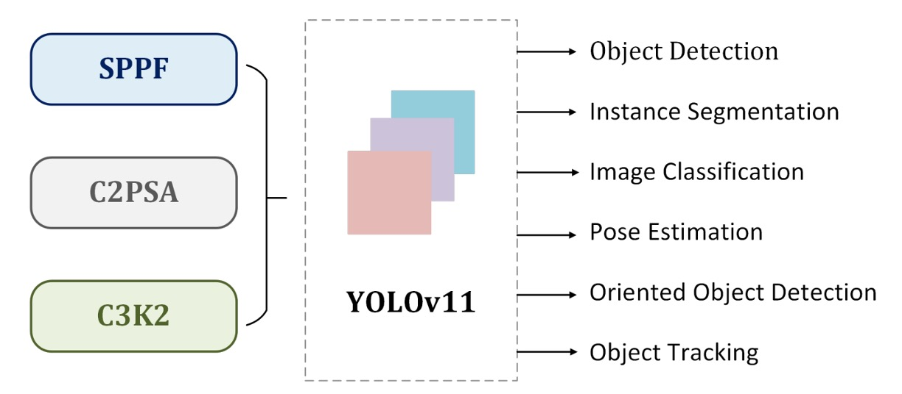
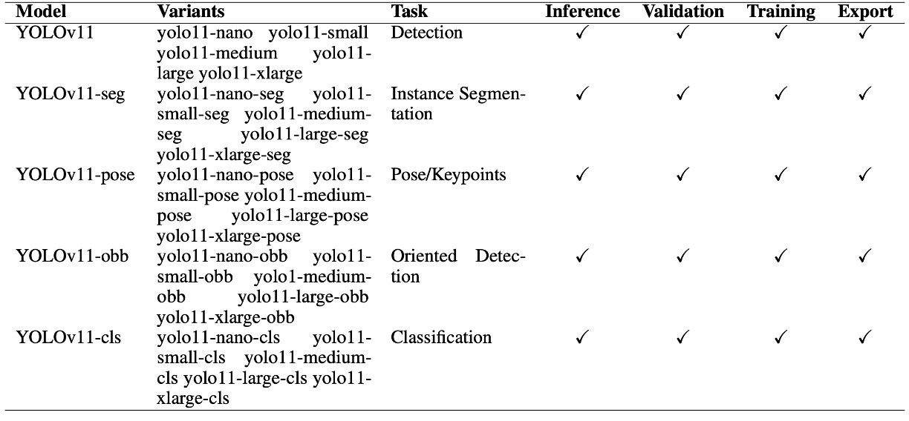

## Engineering-Optimized Edition

[**YOLOv11: An Overview of the Key Architectural Enhancements**](https://arxiv.org/abs/2410.17725)

---

It's rare for Ultralytics to publish a paper whenever they release a new architecture.

In any case, we should give them some encouragement.

## Problem Definition

In the realm of object detection, the name **YOLO** has been around for a decade.

Back in 2015, Redmon came up with the slogan: "**You Only Look Once**." He decisively ditched the mainstream two-stage detection architecture, boldly redefining detection as a **regression problem**—combining classification and localization in a single shot.

Since then, each generation of YOLO has become synonymous with "real-time detection."

However, as the YOLO family evolved, two core issues have become apparent:

1. **The Performance-Speed Dilemma:** Small models are fast but inaccurate; large models are accurate but slow.
2. **Multi-task Integration:** Tasks like detection, segmentation, pose estimation, and rotated bounding boxes are often required in real-world applications, but past versions could never truly integrate them all.

So, the Ultralytics team has tried to push YOLO forward into an **all-in-one vision system**.

Oh? Is that really possible? Let’s take a look.

## Problem Solving

<div align="center">
<figure style={{ "width": "90%"}}>

</figure>
</div>

YOLOv11 continues the design foundations of YOLOv9 and YOLOv10. The overall architecture still follows the classic three-stage structure:

- **Backbone → Neck → Head**

There are no radical overhauls here, but with several local tweaks, they attempt to achieve more stable performance in both speed and accuracy.

### Backbone: Minor Replacement

- **C2f → C3k2**

  The previously common C2f block is now replaced by the new **C3k2 block**.

  The purpose of this change is purely to pursue "**faster and more efficient**" performance: breaking large convolutions into smaller ones, using smaller kernels to reduce computation and the number of parameters. In practice, C3k2 delivers a better latency-accuracy tradeoff, providing more efficiency without sacrificing too much accuracy.

  :::tip
  Let’s visualize the architecture—the overall structure remains mostly the same.

  Essentially, the stacked Bottleneck modules have been replaced by the C3k module.

    <div style={{display:'flex', gap:'2rem', flexWrap:'wrap'}}>

        <div>
            <h4 style={{textAlign:'center'}}> C2f</h4>

            ```mermaid
            %%{init: {'theme':'base','themeVariables':{
            'fontFamily':'ui-sans-serif, system-ui, -apple-system, Segoe UI, Roboto, Noto Sans, Helvetica, Arial',
            'primaryColor':'#EEF2FF','primaryTextColor':'#0f172a','primaryBorderColor':'#4338ca',
            'lineColor':'#64748b','tertiaryColor':'#F1F5F9'
            }}}%%
            %% -------- C2f：Fast Dual-Conv Bottleneck --------
            flowchart TD
                X["x<br/>C_in × H × W"]
                C1["1×1 Conv<br/>BN + Act<br/>C_in → 2h"]
                SPLIT{{split<br/>2h → h,h}}
                Y0["y0<br/>h × H × W"]
                Y1["y1<br/>h × H × W"]

                subgraph STACK["Bottleneck_f × n"]
                    direction LR
                    Z1["z₁"] --> Z2["z₂"] --> Zn["zₙ"]
                end

                CAT["Concat<br/>y0, y1, z₁…zₙ<br/>(2+n)·h"]
                C2["1×1 Conv<br/>BN + Act<br/>(2+n)·h → C_out"]
                OUT["out<br/>C_out × H × W"]

                X --> C1 --> SPLIT
                SPLIT -->|skip| Y0 --> CAT
                SPLIT -->|stack| Y1 --> Z1
                Zn --> CAT
                CAT --> C2 --> OUT

                classDef tensor fill:#ffffff,stroke:#64748b,stroke-width:1px,rx:6,ry:6;
                classDef op     fill:#eef2ff,stroke:#4338ca,stroke-width:1px,rx:6,ry:6;
                classDef fuse   fill:#ecfccb,stroke:#65a30d,stroke-width:1px,rx:6,ry:6;
                class X,Y0,Y1,Z1,Z2,Zn tensor
                class C1,SPLIT,STACK,C2 op
                class CAT fuse
            ```
        </div>

        <div>
            <h4 style={{textAlign:'center'}}> C3k2</h4>

            ```mermaid
            %%{init: {'theme':'base','themeVariables':{
            'fontFamily':'ui-sans-serif, system-ui, -apple-system, Segoe UI, Roboto, Noto Sans, Helvetica, Arial',
            'primaryColor':'#EEF2FF','primaryTextColor':'#0f172a','primaryBorderColor':'#4338ca',
            'lineColor':'#64748b','tertiaryColor':'#F1F5F9'
            }}}%%
            %% -------- C3k2：C2f 骨架 + C3k 作為內部堆疊單元 --------
            flowchart TD
                X["x<br/>C_in × H × W"]
                C1["1×1 Conv<br/>BN + Act<br/>C_in → 2h"]
                SPLIT{{split<br/>2h → h,h}}
                Y0["y0<br/>h × H × W"]
                Y1["y1<br/>h × H × W"]

                subgraph STACK["C3k × n"]
                    direction LR
                    Z1["z₁"] --> Z2["z₂"] --> Zn["zₙ"]
                end

                CAT["Concat<br/>y0, y1, z₁…zₙ<br/>(2+n)·h"]
                C2["1×1 Conv<br/>BN + Act<br/>(2+n)·h → C_out"]
                OUT["out<br/>C_out × H × W"]

                X --> C1 --> SPLIT
                SPLIT -->|skip| Y0 --> CAT
                SPLIT -->|stack| Y1 --> Z1
                Zn --> CAT
                CAT --> C2 --> OUT

                classDef tensor fill:#ffffff,stroke:#64748b,stroke-width:1px,rx:6,ry:6;
                classDef op     fill:#eef2ff,stroke:#4338ca,stroke-width:1px,rx:6,ry:6;
                classDef fuse   fill:#ecfccb,stroke:#65a30d,stroke-width:1px,rx:6,ry:6;
                class X,Y0,Y1,Z1,Z2,Zn tensor
                class C1,SPLIT,STACK,C2 op
                class CAT fuse
            ```

        </div>

    </div>
    :::

* **SPPF + C2PSA**

  After the SPPF module, a **C2PSA (Cross Stage Partial with Spatial Attention)** is added.

  This allows the model to focus a bit more on critical areas of the image, which is helpful for small objects or occluded items.

  However, this type of attention design isn’t particularly novel—it's more of a "keeping up with the trend" kind of choice.

  ---

  :::tip
  As usual, let’s also visualize this new C2PSA module.

    <div style={{display:'flex', gap:'2rem', flexWrap:'wrap'}}>

    <div>
        <h4 style={{textAlign:'center'}}> C2‑PSA</h4>

        ```mermaid
        %%{init: {'theme':'base','themeVariables':{
        'fontFamily':'ui-sans-serif, system-ui, -apple-system, Segoe UI, Roboto, Noto Sans, Helvetica, Arial',
        'primaryColor':'#EEF2FF','primaryTextColor':'#0f172a','primaryBorderColor':'#4338ca',
        'lineColor':'#64748b','tertiaryColor':'#F1F5F9'
        }}}%%
        %% -------- C2‑PSA：1×1 投影 → split → PSA×n → concat → 1×1 fuse --------
        flowchart TD
            X["x<br/>C × H × W"]
            C1["1×1 Conv<br/>BN + Act<br/>C → 2h"]
            SPLIT{{split<br/>2h → h, h}}
            Y0["y0<br/>h × H × W"]
            Y1["y1<br/>h × H × W"]

            subgraph STACK["PSA × n"]
                direction LR
                P1["PSA₁"] --> P2["PSA₂"] --> Pn["PSAₙ"]
            end

            CAT["Concat<br/>2h"]
            C2["1×1 Conv<br/>BN + Act<br/>2h → C"]
            OUT["out<br/>C × H × W"]

            X --> C1 --> SPLIT
            SPLIT -->|skip| Y0 --> CAT
            SPLIT -->|stack| Y1 --> P1
            Pn --> CAT
            CAT --> C2 --> OUT

            classDef tensor fill:#ffffff,stroke:#64748b,stroke-width:1px,rx:6,ry:6;
            classDef op     fill:#eef2ff,stroke:#4338ca,stroke-width:1px,rx:6,ry:6;
            classDef fuse   fill:#ecfccb,stroke:#65a30d,stroke-width:1px,rx:6,ry:6;
            class X,Y0,Y1,P1,P2,Pn tensor
            class C1,SPLIT,STACK,C2 op
            class CAT fuse
        ```

    </div>

    <div>
        <h4 style={{textAlign:'center'}}> PSA（Position‑Sensitive Attention）</h4>

        ```mermaid
        %%{init: {'theme':'base','themeVariables':{
        'fontFamily':'ui-sans-serif, system-ui, -apple-system, Segoe UI, Roboto, Noto Sans, Helvetica, Arial',
        'primaryColor':'#EEF2FF','primaryTextColor':'#0f172a','primaryBorderColor':'#4338ca',
        'lineColor':'#64748b','tertiaryColor':'#F1F5F9'
        }}}%%
        %% -------- PSA：MHSA → Add(res, 可選) → FFN → Add(res, 可選) --------
        flowchart TD
            U["u<br/>h × H × W"]
            MHSA["MHSA（ConvAttention）<br/>QKV → Attn → PE → Proj"]
            ADD1["Add"]
            FFN["FFN<br/>1×1 Conv + Act → 1×1 Conv (no Act)"]
            ADD2["Add"]
            Z["z（Output）<br/>h × H × W"]

            U --> MHSA --> ADD1 --> FFN --> ADD2 --> Z
            U -->|skip| ADD1
            ADD1 -->|skip| ADD2

            classDef tensor fill:#ffffff,stroke:#64748b,stroke-width:1px,rx:6,ry:6;
            classDef op     fill:#eef2ff,stroke:#4338ca,stroke-width:1px,rx:6,ry:6;
            classDef fuse   fill:#ecfccb,stroke:#65a30d,stroke-width:1px,rx:6,ry:6;
            class U,Z tensor
            class MHSA,FFN op
            class ADD1,ADD2 fuse
        ```

    </div>

    <div>
        <h4 style={{textAlign:'center'}}> ConvAttention（PSA 內部 MHSA 細節）</h4>

        ```mermaid
        %%{init: {'theme':'base','themeVariables':{
        'fontFamily':'ui-sans-serif, system-ui, -apple-system, Segoe UI, Roboto, Noto Sans, Helvetica, Arial',
        'primaryColor':'#EEF2FF','primaryTextColor':'#0f172a','primaryBorderColor':'#4338ca',
        'lineColor':'#64748b','tertiaryColor':'#F1F5F9'
        }}}%%
        %% -------- ConvAttention：QKV 投影 → 注意力 → 位置編碼 → 輸出投影 --------
        flowchart TD
            X2["x<br/>C x H x W"]
            QKV["1x1 Conv (QKV proj)<br/>no Act"]
            SPLITQKV{{split<br/>Q: H*d_k<br/>K: H*d_k<br/>V: H*d_v}}
            ATTN["Scaled Dot-Product<br/>softmax( transpose(Q) * K / sqrt(d_k) )"]
            WSUM["Weighted Sum<br/>V * Attn^T"]
            RESHAPE["Reshape<br/>B x C x H x W"]
            PE["3x3 Depth-wise Conv<br/>Positional Enc. (no Act)"]
            ADDPE["Add<br/>positional enc."]
            PROJ["1x1 Conv (output proj)<br/>no Act"]
            Y2["y<br/>C x H x W"]

            X2 --> QKV --> SPLITQKV
            SPLITQKV -->|Q| ATTN
            SPLITQKV -->|K| ATTN
            SPLITQKV -->|V| WSUM
            ATTN --> WSUM --> RESHAPE --> ADDPE --> PROJ --> Y2
            SPLITQKV -->|V| PE --> ADDPE

            classDef tensor fill:#ffffff,stroke:#64748b,stroke-width:1px,rx:6,ry:6;
            classDef op     fill:#eef2ff,stroke:#4338ca,stroke-width:1px,rx:6,ry:6;
            classDef fuse   fill:#ecfccb,stroke:#65a30d,stroke-width:1px,rx:6,ry:6;
            class X2,Y2 tensor
            class QKV,ATTN,WSUM,RESHAPE,PE,PROJ op
            class SPLITQKV op
            class ADDPE fuse
        ```

    </div>

    </div>
    :::

### Neck: Minor Feature Fusion Tweaks

The neck’s role is still to bring together features at different resolutions.

Here, YOLOv11 also switches to the **C3k2 block**, combined with C2PSA, to make the fusion process slightly more efficient.

Overall, these changes make YOLOv11’s **speed-accuracy curve** look a bit better than v8 or v9.

### Head: Extended Output Layer

For the head, YOLOv11 doesn’t drastically change the structure—just continues to use the **C3k2 block** and **CBS (Conv-BN-SiLU)**, finally outputting bounding boxes, objectness scores, and classification results.

### Multi-Task Integration

Compared to previous versions, the most significant change in YOLOv11 isn’t in the detection architecture itself, but in its official positioning as a "multi-task framework."

As shown in the table below:

<div align="center">
<figure style={{ "width": "90%"}}>

</figure>
</div>

Beyond standard object detection, Ultralytics now includes segmentation, pose estimation, rotated bounding boxes (OBB), and classification—all in a unified system, with the same inference, validation, training, and export interfaces.

In practical terms, this integration is meaningful. For researchers or industry developers, it used to be necessary to rely on separate toolchains or scattered implementations for detection, segmentation, pose, and so on. Now, with YOLOv11’s unified version, it can all be done in one place.

However, note that YOLOv11 isn’t the state-of-the-art in accuracy for every task; more often, it maintains a “usable and consistent” standard.

In other words, its strength isn’t peak performance in a single task, but rather the convergence of various computer vision needs into a single entry point, forming a relatively stable multi-task ecosystem. This positioning also aligns with Ultralytics’ product strategy, making the YOLO series applicable across a broader range of real-world scenarios.

## Discussion

<div align="center">
<figure style={{ "width": "90%"}}>

</figure>
</div>

Looking at the official benchmark, YOLOv11 does appear neater on the speed-accuracy curve than previous generations.

Models of various sizes (n, s, m, x) achieve slightly higher mAP on COCO than YOLOv8, YOLOv9, and YOLOv10, while maintaining relatively low latency. Notably, YOLOv11m achieves accuracy close to YOLOv8l, but with fewer parameters and lower FLOPs, demonstrating real effort in efficiency optimization.

In the high-latency range, large models like YOLOv11x can reach about 54.5% mAP\@50–95 with inference times around 13ms; in the low-latency range, small models like YOLOv11s can still maintain around 47% mAP within 2–6ms. This distribution allows YOLOv11 to offer suitable model sizes for various real-time requirements—a practical convenience.

### Conclusion

After reading this paper, I think YOLOv11’s contribution is more about engineering refinements than methodological breakthroughs.

By switching the backbone, neck, and head entirely to the C3k2 block, it does bring better parameter efficiency and inference speed, with solid results in low-latency scenarios. Still, these changes don’t alter YOLO’s fundamental paradigm—they’re just optimizations of existing designs.

Strictly speaking, the magnitude of these improvements doesn’t quite justify being called a “next-generation architecture”...

But hey, it’s released, so let’s accept it.
