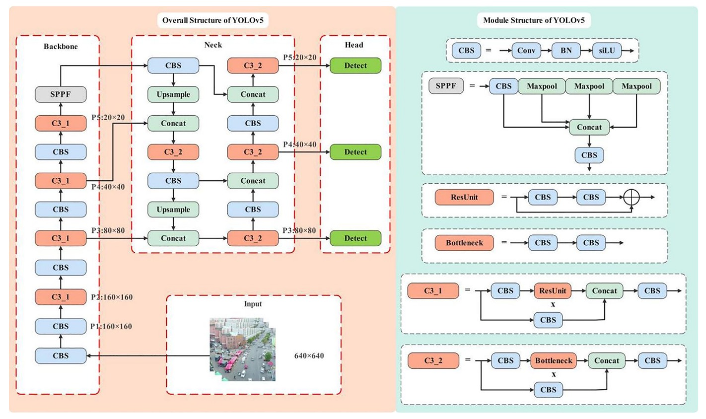
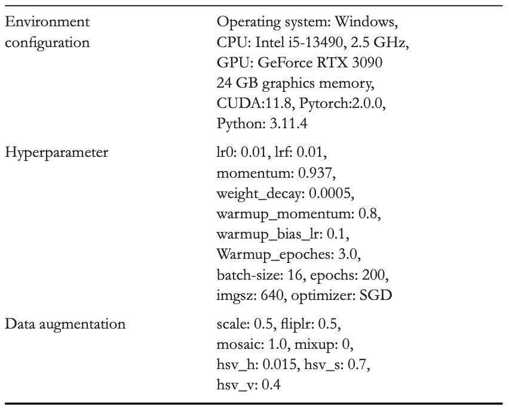
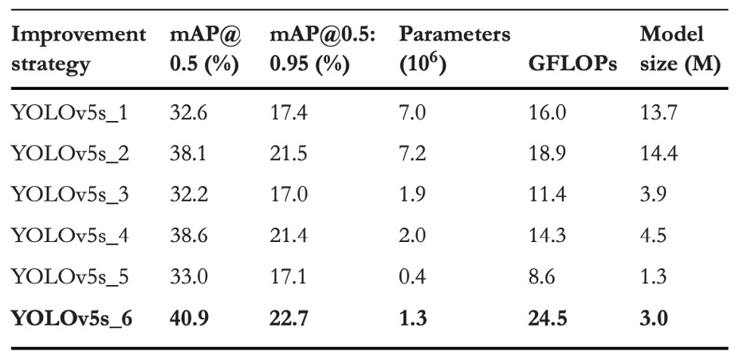

## I Am a Little Bird

[**YOLO-Tiny: A lightweight small object detection algorithm for UAV aerial imagery**](https://ietresearch.onlinelibrary.wiley.com/doi/pdfdirect/10.1049/ipr2.13314)

---

Drones have quietly flown into every crevice of our lives.

But for object detection algorithms, the challenges brought by these machines are truly troublesome.

## Problem Definition

Drones have penetrated every gap in daily scenarios. From aerial inspection to disaster detection, the vast amount of imagery they generate poses new challenges to object detection algorithms.

For models, the "sky viewpoint" captured by drones comes with unfriendly conditions: targets are extremely small in the frame with varying scales, often disturbed or partially occluded by the background, further compressing the space for effective feature recognition. Meanwhile, deployment scenarios usually have severe resource constraints, making even accurate high-performance models hard to operate in practice.

Although mainstream object detection methods have matured in performance, especially the one-stage algorithms represented by the YOLO series, which have become the preferred choice for real-time applications due to their speed advantage, their original architectures still struggle to directly address the dual demands of high-altitude imaging and small object detection.

Previous improvements tried replacing convolution modules, adding pyramid structures, introducing attention mechanisms, or performing cross-layer fusion to enhance small object recognition; others focused on training stages such as data augmentation, anchor presets, and scale adjustments.

However, most methods still cannot solve a fundamental problem: achieving real-time, accurate, and stable recognition of tiny suspicious targets in the frame on low-computation terminal devices is not just a matter of "compressing the model."

This paper addresses this issue by proposing a lightweight small object detection architecture designed for UAV aerial tasks, based on YOLOv5s.

## Solution

### Reviewing YOLOv5

In YOLOv5’s backbone, the input image undergoes five downsampling steps, generating five sets of feature maps (P1 to P5) with resolutions of 320, 160, 80, 40, and 20 respectively. This pyramid-style feature map design enables the model to predict objects of different sizes on corresponding layers.

The standard YOLOv5 detection structure performs multi-scale fusion from P3 (80×80) to P5 (20×20), mainly targeting objects larger than 8×8 pixels.

However, for drones, this size threshold is clearly too high.

Statistics from the VisDrone2019 dataset provide key observations:

<figure style={{ "width": "70%"}}>

</figure>

- Figure (a) shows severe class imbalance in object numbers,
- Figure (b) shows most targets fall within extremely small size ranges,
- Figure (c) shows bounding box aspect ratios are highly concentrated,
- Figure (d) shows dense annotation hotspots in the middle-lower region.

In other words, this is a "highly small-object-biased aerial detection task," and YOLOv5’s current design has a structural bias under this condition: its prediction layers focus mainly on P3–P5, which is the least friendly for extremely small targets.

Previous research tried adding a P2 detection head (160×160 feature map) to YOLOv5 to capture finer signals. While detection improved, parameters and computation rose accordingly, making it too costly for resource-limited devices.

Another group of researchers took a different path: removing the P5 layer and focusing on medium and small objects. But this simplification only yielded limited accuracy gains and failed to break through the bottleneck.

In this paper, the authors continue this line of structural adjustment by further **removing the P4 layer**, compressing the original triple detection structure into a dual-layer architecture with only P2 and P3, concentrating firepower on earlier, higher-resolution feature maps.

But this also brings another risk:

> **The P4 + P5 layers account for 92.1% of the total parameters in the YOLOv5s model.**

Removing these nearly halves the total parameters, and detection capability may drop accordingly.

To avoid this "over-lightweight" problem, the authors adopt a compensation strategy:

- **While retaining P2 and P3, moderately increase the model’s depth and width**

to maintain acceptable feature extraction and fusion capacity.

After practical trade-offs, the authors chose a **depth of 0.67 and width of 0.75** configuration as a compromise between parameter count and computational cost. This choice keeps sufficient model expressiveness while controlling GFLOPs within resource limits, laying a foundation for subsequent module lightweighting.

### Module Lightweighting

In model design, there is a clear tension among parameter count, computational cost (GFLOPs), and representational capacity. This tension is especially intense for edge devices like drones, where we want strong expressiveness but cannot afford too many parameters.

In the prior structural adjustments, the authors reduced the P4 and P5 detection heads, cutting parameters by **82.05%**, which also shrunk the model’s "expressive space."

To compensate for this loss, the authors moderately increased depth and width, slightly raising parameters and restoring representational power. However, this also caused GFLOPs to increase from **16.0 to 24.2**, a **53.13%** growth. Further expansion would cause exponential rise in computation, clearly unsuitable for resource-constrained environments.

To resolve this contradiction, the authors introduced a highly efficient architectural unit:

- **Dynamic Convolution**.

One of the core feature extraction modules in YOLOv5 is the C3 structure, containing many residual paths and stacked convolutions.

The authors replaced all of it with a newly designed **LW_C3**, featuring the key change:

- **LW_C3**: replaces every **3×3 standard convolution** in residual branches with a **3×3 dynamic convolution**, retaining depth but reducing static computational burden.

<figure style={{ "width": "90%"}}>

</figure>

- **LW_Downsample**: the original module using 1×1 convolution for channel compression and downsampling is fully replaced with stride=2 dynamic convolution, enhancing expressiveness and receptive field control.

<figure style={{ "width": "90%"}}>

</figure>

The core idea of dynamic convolution is similar to dynamic perceptrons:

> **For each input $x$, dynamically select the best weighted combination from a set of basis functions.**

Illustrated below:

<figure style={{ "width": "70%"}}>

</figure>

Mathematically, it can be written as:

$$
y = g(\tilde{W}(x)^T x + \tilde{b}(x))
$$

where

$$
\tilde{W}(x) = \sum_{k=1}^K \pi_k(x) \tilde{W}_k,\quad
\tilde{b}(x) = \sum_{k=1}^K \pi_k(x) \tilde{b}_k
$$

subject to

$$
0 \leq \pi_k(x) \leq 1,\quad \sum_k \pi_k(x) = 1
$$

Here, $\pi_k(x)$ is the **attention weight** of the input on the $k$-th convolution kernel.

Essentially, rather than learning a fixed set of weights, the model learns a "selection" mechanism to decide which feature extraction strategy to emphasize based on input content.

To implement this selection mechanism, the authors used a common SE technique to generate attention weights, with the following steps:

1. **Global Average Pooling** to compress spatial information,
2. A fully connected layer + Sigmoid produces a k-dimensional weight vector $\pi(x)$,
3. The weights are applied to k predefined convolution kernels, performing weighted dynamic convolution.

For input channels $C_{\text{in}}$, output channels $C_{\text{out}}$, kernel size $D_k \times D_k$, and kernel count $k$, the module’s computational complexity is:

$$
O_{\text{dynamic}} = k C_{\text{in}} C_{\text{out}} D_k^2 + k C_{\text{out}}
$$

Compared to standard convolution’s

$$
O_{\text{static}} = H W C_{\text{in}} C_{\text{out}} D_k^2
$$

the computation is greatly reduced, especially when the image resolution $H \times W$ is large.

By introducing dynamic convolution, the model achieves increased parameters while controlling GFLOPs within an acceptable local range.

More importantly, this design allows each feature point’s perception to be **non-uniform** but adaptively tuned based on input context. This gives YOLOv5’s feature extraction module semantic adaptability for the first time, a critical ability for small object detection.

### Adaptive Multi-Scale Fusion

In object detection, **multi-scale feature fusion** is a fundamental technique to enhance model recognition capability. Shallow layers excel at preserving texture and positional information, while deeper layers focus on semantic abstraction and object judgment.

In theory, fusing both should combine "seeing clearly" and "understanding." However, this fusion is not trivial: scale differences cause semantic gaps, and simple concatenation or weighting often only "stacks" rather than "integrates."

To address this fusion failure, the authors proposed the **AMSFF (Adaptive Multi-Scale Spatial Feature Fusion) module**.

Refer to the architecture below:

<figure style={{ "width": "90%"}}>

</figure>

The AMSFF operation logic, taking neck features **L2** (shallower) and **L3** (deeper) as an example:

1. **Scale Alignment**: L2 is downsampled to match L3’s spatial resolution.
2. **Channel Adjustment**: a 1×1 convolution aligns L2’s channel number with L3’s for element-wise operations.
3. **Initial Fusion**: concatenation of adjusted L2 and L3 forms the base fusion tensor.
4. **Weight Learning**: a 1×1 convolution computes two spatially adaptive weight maps $\alpha_{i,j}$ and $\beta_{i,j}$ for the two feature layers. A Softmax ensures the weights sum to 1 and lie in [0,1].
5. **Weighted Fusion**: weighted summation is computed by

$$
y^l_{i,j} = \alpha^l_{i,j} \cdot x^{(1 \to l)}_{i,j} + \beta^l_{i,j} \cdot x^{(2 \to l)}_{i,j}
$$

where $x^{(n \to l)}_{i,j}$ denotes the feature vector from layer $n$ scaled to layer $l$ at position $(i,j)$, and $y^l_{i,j}$ is the fused feature map.

6. **Semantic Expansion**: AMSFF applies two 3×3 dynamic convolutions with dilation rates 1 and 2 to enhance scale adaptation under different contexts.
7. **Integrated Output**: a 1×1 CBS layer packages and outputs the fused structure for subsequent detection heads.

Compared to previous fusion methods (FPN, PAN, BiFPN), AMSFF differs not only by adding attention but by treating fusion as a form of **dynamic relationship construction**.

### Experimental Setup

The study uses the **VisDrone2019** dataset, released by Tianjin University’s Machine Learning and Data Mining Lab.

This dataset contains images captured by drones under various weather and lighting conditions, covering diverse scenes such as cities, suburbs, parking lots, and roads, making it ideal for testing small object and complex background recognition.

VisDrone2019 includes ten object categories and a total of **10,209 images**, divided as:

- Training set: 6,471 images
- Validation set: 548 images
- Test set: 3,190 images

Dataset characteristics:

- **High scene diversity**: includes static poses and motion tracking,
- **Small object sizes**: majority of bounding boxes are smaller than 32×32 pixels,
- **Obvious occlusion and lighting changes**: challenging model generalization.

Below are sample images and annotations from four different scenes:

The experiments follow the standard YOLO training procedure, with environment settings and hyperparameters listed below:

<figure style={{ "width": "70%"}}>

</figure>

## Discussion

### Comparative Experiments on Network Architecture Adjustments

<figure style={{ "width": "60%"}}>

</figure>

To evaluate the impact of different detection heads on small object recognition, this study designed **six architectural variants** and conducted comparative experiments under identical training conditions. The specific structural changes are shown in the above table, with corresponding performance results below:

<figure style={{ "width": "70%"}}>

</figure>

Key observations from the experiments include:

1. **Adding the P2 Detection Head**

   Adding a **P2 layer (resolution 160×160)** to the original YOLOv5s architecture significantly improved performance on the VisDrone2019 dataset:

   - **mAP\@0.5 improved by +5.5%**
   - **mAP\@0.5:0.95 improved by +4.1%**

   This indicates that the model gains higher-resolution feature correspondence ability and can attend to tiny targets earlier. Although parameter count and GFLOPs slightly increased, the overall cost remained acceptable.

2. **Removing the P5 Detection Head**

   Another experiment removed the **P5 (20×20) layer** to reduce parameters and computation related to large objects, focusing resources on medium and small-scale recognition:

   - mAP\@0.5 slightly increased by **+0.5%**
   - mAP\@0.5:0.95 slightly decreased by **−0.1%**

   While this greatly reduced parameter count, it showed that simply removing deep features yields limited improvement and may slightly harm generalization.

3. **Simultaneous Removal of P4 and P5 with Model Depth and Width Enlargement**

   The final version removed both **P5 and P4**, increasing model depth from 0.33 to 0.67 and width from 0.5 to 0.75 to compensate for reduced representational power caused by aggressive pruning.

   This version produced the most significant results:

   - **mAP\@0.5 overall improvement +8.3%**
   - **mAP\@0.5:0.95 improvement +5.3%**

   This suggests that although P4 and P5 are deep semantic pathways, they contribute little to small object detection. Their high downsampling rates (16×, 32×) cause serious signal loss. Moreover, moderately increasing network capacity (rather than mere compression) preserves semantic abstraction integrity, enabling the model to respond to tiny targets with more suitable "contextual parsing ability."

This comparative experiment illustrates that for aerial small-object detection tasks, the key is not "more paths" or "deeper features," but identifying nodes that truly "see the small things" and allocating enough capacity for them to perform.

### Ablation Study

<figure style={{ "width": "60%"}}>

</figure>

To verify the independent and combined contributions of three optimization strategies, the authors conducted an ablation study on VisDrone2019.

The specific optimization combinations are shown above, and performance results are summarized below:

<figure style={{ "width": "70%"}}>

</figure>

These results reveal each module’s contribution:

1. **Structural Optimization**

   - mAP\@0.5 +8.3%
   - mAP\@0.5:0.95 +5.3%
   - Parameters reduced by 81.4% compared to original YOLOv5s
   - GFLOPs increased by 53.1%

   By removing P4 and P5 layers (which together account for 92.1% of model parameters), the model detects directly from shallow features (P2, P3). Omitting unnecessary deep features shifts the model’s focus from macro semantics to micro details.

   To avoid degradation due to insufficient parameters, the authors simultaneously increased network depth (0.33→0.67) and width (0.5→0.75), preserving certain abstraction capability.

2. **Module Lightweighting**

   - LW_C3:

     - mAP\@0.5 +2.2%
     - mAP\@0.5:0.95 +1.9%
     - GFLOPs reduced by 48.2%

   - LW_Downsample:

     - mAP\@0.5 +3.9%
     - mAP\@0.5:0.95 +3.0%
     - GFLOPs reduced by 11.0%

   Although both modules increased parameters by about **38.5%**, GFLOPs significantly decreased due to dynamic convolution’s ability to enhance expressiveness while compressing static computation.

3. **AMSFF**

   - mAP\@0.5 +3.4%
   - mAP\@0.5:0.95 +2.6%

   AMSFF addresses the "dialogue imbalance" problem in multi-scale feature fusion by learning spatial adaptive weights, allowing shallow detail and deep semantic features to be reasonably apportioned. This is especially critical for small object detection where semantic signals are weak and fusion errors amplify prediction mistakes.

### Comparison with Other YOLO Models

<figure style={{ "width": "70%"}}>

</figure>

The YOLO series has long been synonymous with object detection, widely recognized for end-to-end, ultra-fast inference. From YOLOv3’s multi-scale prediction and Darknet-53 backbone to YOLOv8’s introduction of gradient flow into feature branches and YOLOv10’s removal of Non-Maximum Suppression (NMS), each generation pursues accuracy and efficiency improvements.

Here, the authors compare with smaller versions of mainstream YOLO models. The results show YOLO-Tiny delivers impressive accuracy despite dramatically reduced parameters and computation.

For mAP\@0.5, it surpasses YOLOv3-Tiny, YOLOv6s, YOLOv8s, and YOLOv10s by 23.7%, 10.8%, 8.3%, and 9.1% respectively; mAP\@0.5:0.95 improvements are 14.4%, 5.8%, 4.2%, and 4.9%. Meanwhile, it saves 60% to 80% of parameters and 30% to 70% of GFLOPs.

### Visualization

From left to right: original image, YOLOv5s result, and YOLO-Tiny result.

## Conclusion

Facing extremely small targets in UAV aerial imagery under limited terminal computation, YOLO-Tiny’s structural adjustments and module designs offer a practical technical approach.

Previous lightweight architectures often force explicit trade-offs between speed and accuracy. In VisDrone-like scenarios, small object features are easily diluted by multiple downsampling layers, causing detection accuracy stagnation.

This work prunes large-object detection layers P5 and P4, refocusing the network on smaller scales P3 and P2, while employing dynamic convolution and AMSFF modules for signal compression and feature fusion. This aims to improve small object recognition without increasing computational burden.

Experimental results confirm this strategy yields significant mAP gains on VisDrone2019 while maintaining advantages in parameters and GFLOPs, demonstrating targeted design for small object structures.

However, given the recent publication, lack of released training modules, and absence of open real-world deployment and community validation, its practical effectiveness and generalizability remain to be further observed.
