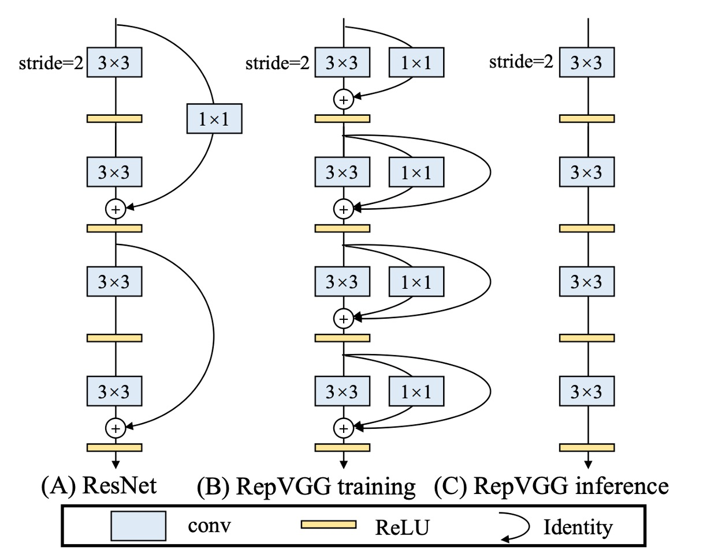
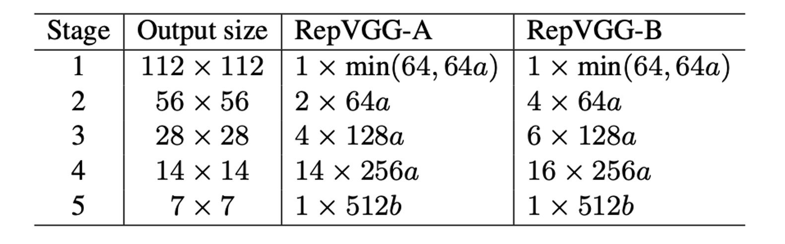

## Making VGG Great Again

[**RepVGG: Making VGG-style ConvNets Great Again**](https://arxiv.org/abs/2101.03697)

---

**Is it true that fewer parameters in a model result in faster speeds?**

You might know the answer is: "Not necessarily!"

This is because we need to consider the computational load, specifically the FLOPs (floating-point operations per second) of the model.

So let's ask another question: "**Does fewer FLOPs in a model mean faster speed?**"

The answer is still "Not necessarily!"

## Defining the Problem

There are many factors influencing inference speed!

Many research papers focus on reducing the FLOPs of a model, but when used in engineering, the inference speed doesn't always improve, and sometimes it even slows down.

This is a typical gap between academia and industry, and as engineers, we can't be misled by the computational data.

### High Memory Usage

With the advent of Inception, ResNet, and DenseNet, many researchers shifted their focus to carefully designed architectures, making models increasingly complex. Moreover, some architectures are based on NAS (Neural Architecture Search) or use compound scaling strategies.

Although these network architectures achieve higher accuracy, their complex branching leads to increased memory usage, as shown in the figure above.

In residual structures, branches require additional memory to store branch results during inference. If you have multiple branches (yes, Inception, looking at you!), the memory usage becomes even higher.

### Slow Inference Speed

Some operations lack hardware support, such as the depthwise convolution in MobileNets. This method reduces parameters by about 80% compared to standard convolution but is slower:

Similarly, the channel shuffle operation in ShuffleNet, although not computationally intensive, also reduces inference speed:

### However...

Multi-branch structures are very effective!

**Multi-branch architectures allow the model to become an implicit ensemble of many shallow models.**

- [**[16.05] Residual networks behave like ensembles of relatively shallow networks**](https://arxiv.org/abs/1605.06431)

  

Residual connections provide a shortcut. For ResNet, theoretically, for N blocks, the model can be interpreted as an ensemble of 2N models because each block can be split into two possible paths.

Additionally, shortcuts offer better gradient flow, alleviating the training difficulty caused by vanishing gradients.

ResNet's success has already proven the effectiveness of residual connections, so why give them up?

## Solving the Problem

### Model Architecture

To address the above issues, this paper first modifies the residual structure of ResNet.

The authors redefine the RepVGG unit, as we need multi-branch architectures to improve model performance during training. Hence, the structure is as shown in Figure (b):

1. A 3x3 convolution
2. A 1x1 convolution
3. An identity connection

But during inference, we need to remove all branches, as shown in Figure (c).

The training structure is defined this way to satisfy the multi-branch training architecture while also meeting the model's inference requirements:

- **Reparameterization** of the model.

### Reparameterization

Removing branches isn't about directly deleting them; past research on model pruning has shown that direct deletion leads to performance degradation.

The authors propose a new method: **Reparameterization**.

In the RepVGG unit, each convolution operation is followed by Batch Normalization. This structure can be reparameterized into an equivalent convolution operation.

The entire process is as follows:

1. Merge the 3x3 convolution and BatchNorm into an equivalent convolution operation.
2. Expand the 1x1 convolution into an equivalent 3x3 convolution using zero-padding, then merge it with BatchNorm into an equivalent convolution operation.
3. Expand the identity connection into an equivalent 3x3 convolution, then merge it with BatchNorm into an equivalent convolution operation.
4. Finally, add the three branches together into an equivalent convolution operation.

---

Although you might not like it, we still describe the specific process provided in the paper:

- Let $W^{(3)} \in \mathbb{R}^{C_2 \times C_1 \times 3 \times 3}$ represent the kernel of a $3 \times 3$ convolution layer with $C_1$ input channels and $C_2$ output channels.
- Let $W^{(1)} \in \mathbb{R}^{C_2 \times C_1}$ represent the kernel of a $1 \times 1$ convolution layer with $C_1$ input channels and $C_2$ output channels.
- $\mu^{(3)}, \sigma^{(3)}, \gamma^{(3)}, \beta^{(3)}$ denote the mean, standard deviation, learnable scaling factor, and bias of the BN layer after the $3 \times 3$ convolution layer.
- $\mu^{(1)}, \sigma^{(1)}, \gamma^{(1)}, \beta^{(1)}$ denote the mean, standard deviation, learnable scaling factor, and bias of the BN layer after the $1 \times 1$ convolution layer.
- $\mu^{(0)}, \sigma^{(0)}, \gamma^{(0)}, \beta^{(0)}$ denote the identity branch.

Let $M^{(1)} \in \mathbb{R}^{N \times C_1 \times H_1 \times W_1}$ and $M^{(2)} \in \mathbb{R}^{N \times C_2 \times H_2 \times W_2}$ represent the input and output, respectively, and $\ast$ denote convolution operation.

If $C_1 = C_2, H_1 = H_2, W_1 = W_2$, then:

$$
M^{(2)} = \text{bn}(M^{(1)} \ast W^{(3)}, \mu^{(3)}, \sigma^{(3)}, \gamma^{(3)}, \beta^{(3)})
$$

$$
+ \text{bn}(M^{(1)} \ast W^{(1)}, \mu^{(1)}, \sigma^{(1)}, \gamma^{(1)}, \beta^{(1)})
$$

$$
+ \text{bn}(M^{(1)}, \mu^{(0)}, \sigma^{(0)}, \gamma^{(0)}, \beta^{(0)})
$$

It should be noted that this conversion's equivalence requires that the 3x3 and 1x1 layers have the same stride and that the latter's padding configuration should be one pixel less than the former. For instance, if the 3x3 convolution layer has a padding of 1, the 1x1 convolution layer should have a padding of 0.

:::tip
A similar concept is presented in the paper:

- [**[17.06] Diracnets: Training very deep neural networks without skip-connections**](https://arxiv.org/abs/1706.00388)

They use a different mathematical expression of convolution structures to make the model easier to optimize, but RepVGG is a true multi-branch model during training, unlike DiracNets.
:::

### Parameter Configuration

Finally, the authors provide several different configurations of RepVGG. In the table above, `Layers of each stage` indicates the number of layers at different resolution features.

The first stage only has one layer because the image size is large, taking up a lot of computation. Most computations are concentrated in the fourth stage, with 14 or 16 layers stacked.

The parameters a and b are used to control the number of channels, with the specific configuration shown in the table below:

## Discussion

### ImageNet Performance

In this study, the authors compared RepVGG with some classic and state-of-the-art models on the ImageNet-1K dataset.

These models include VGG-16, ResNet, ResNeXt, EfficientNet, and RegNet. The dataset comprises 1.28 million training images and 50,000 validation images.

During training, lightweight and medium models used simple data augmentation techniques such as random cropping and horizontal flipping, while heavyweight models added techniques such as warm-up, cosine learning rate annealing, label smoothing, mixup, and Autoaugment.

The authors trained on 8 GPUs, using the standard SGD optimizer and cosine annealing learning rate strategy.

Speed test results show that RepVGG outperforms many classic models in both accuracy and speed. For example, RepVGG-A0 improves accuracy and speed by 1.25% and 33% over ResNet-18, respectively, and RepVGG-A1 improves accuracy and speed by 0.29% and 64% over ResNet-34.

Even in comparisons with larger models such as ResNet-101 and ResNet-152, RepVGG models with interleaved grouped layers show significant advantages.

In terms of parameter efficiency, RepVGG also performs excellently. Compared to VGG-16, RepVGG-B2 reduces parameters by 42%, increases running speed by 10%, and improves accuracy by 6.57%. This demonstrates RepVGG's ability to maintain high performance with fewer parameters.

Finally, RepVGG also shows good performance compared to state-of-the-art baseline models. For example, RepVGG-A2 outperforms EfficientNetB0 by 1.37% in accuracy and is 59% faster. RepVGG-B1 outperforms RegNetX3.2GF by 0.39% in performance and is slightly faster.

### Ablation Experiments

To verify the importance of structural reparameterization technology, the authors conducted detailed experiments and ablation studies to explore its impact on model performance.

All models were trained from scratch for 120 epochs under the same simple training settings.

First, the authors conducted an ablation study by removing branches from each block of RepVGG-B0. The results showed that after removing two branches, the model's accuracy was only 72.39%. When keeping the 1x1 branch, accuracy increased to 73.15%; keeping the identity branch increased accuracy to 74.79%. The full-featured RepVGG-B0 achieved 75.14% accuracy.

From the inference speed of the model during training, the structural reparameterization to remove the identity and 1x1 branches brought significant acceleration.

---

To further compare, the authors established a series of variants and baseline models, compared with RepVGG-B0, as shown in the table above.

These variants include:

- **Identity w/o BN**: Removing BN from the identity branch.
- **Post-addition BN**: Removing the BN layers from the three branches and adding a BN layer after addition.
- **Branch-wise+ReLU**: Inserting ReLU into each branch.
- **DiracNet**: Using a carefully designed convolution kernel reparameterization.
- **Trivial Re-param**: Directly adding the identity kernel to the 3x3 kernel.
- **Asymmetric Convolution Block (ACB)**: Another form of structural reparameterization.
- **Residual Reorg**: Reorganizing each stage similarly to ResNet.

The authors believe that the superiority of structural reparameterization over DiracNet and Trivial Re-param lies in the former relying on actual data flow through specific structures with non-linear behavior (BN), while the latter only uses another mathematical expression of the convolution kernel. Specifically, removing BN reduces accuracy, while adding ReLU improves accuracy, indicating that non-linear components during training are crucial for performance.

Comparison with ACB shows that RepVGG's success is not just due to over-parameterization. RepVGG blocks can be equivalently converted into a single convolution for inference, but this does not mean they are equivalent during training. Comparison with Residual Reorg shows that RepVGG outperforms by 0.58% due to its more branches, making RepVGG's model ensemble larger.

These experimental results indicate that structural reparameterization technology significantly impacts model performance during training and inference and is a key method for training powerful ordinary ConvNets.

## Conclusion

Structural reparameterization is one of the key technologies behind RepVGG's success.

This method allows the model to maintain high flexibility during training while converting to a more efficient single convolution layer during inference. This design enables RepVGG to significantly improve inference speed while maintaining high accuracy.

Experimental results show that RepVGG outperforms several state-of-the-art models in terms of the trade-off between speed and accuracy, making it an ideal choice for high-performance computing and real-time applications.

RepVGG represents a new design approach for convolutional neural networks, demonstrating how to simplify design without sacrificing performance. Its simple and efficient structure and strong performance open new avenues for the development of convolutional neural networks.
