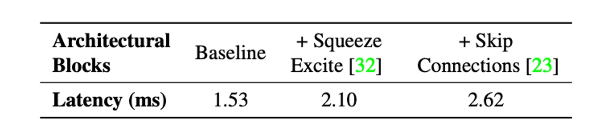
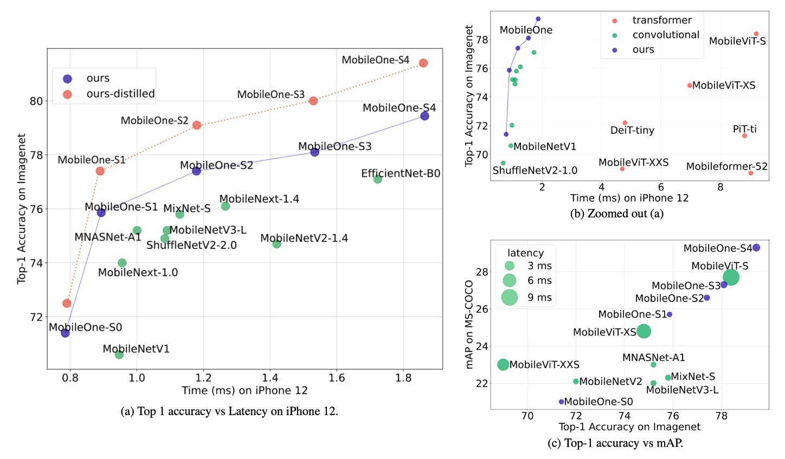
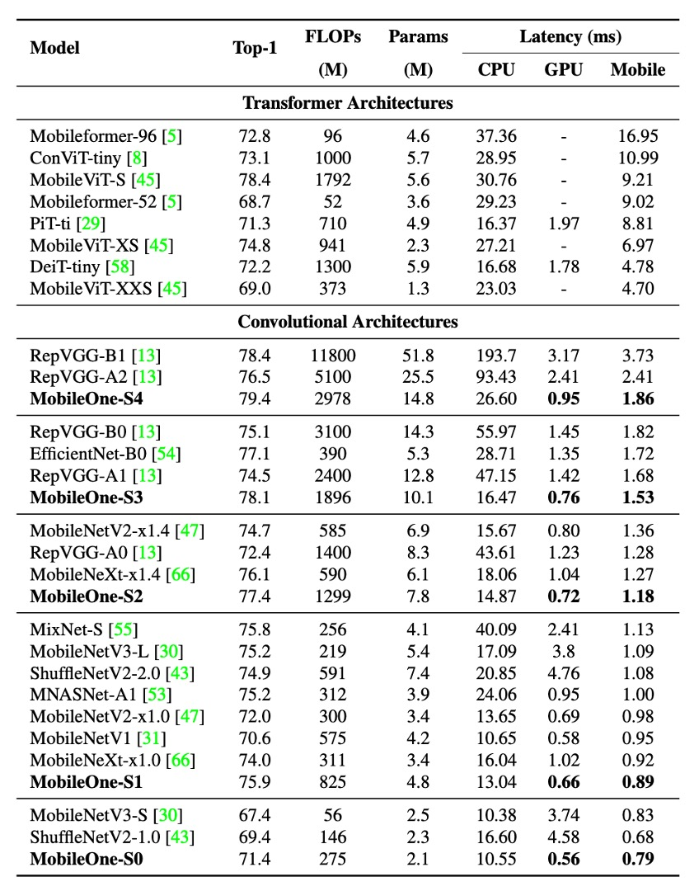

# [22.06] MobileOne

## One Millisecond Optimization

[**MobileOne: An Improved One Millisecond Mobile Backbone**](https://arxiv.org/abs/2206.04040)

---

The concept of reparameterization gained attention around 2021 after the introduction of RepVGG.

Researchers have been exploring ways to find suitable reparameterization methods in model architecture to enhance performance.

:::tip
**Model Reparameterization**:

This involves separating training and inference architectures, converting original model parameters into new ones. The training architecture is transformed into an inference architecture in a mathematically equivalent way, thus improving model speed and performance.
:::

## Problem Definition

Inspired by the success of RepVGG, the authors aimed to explore the effects of reparameterization by designing another structural unit for reparameterization and conducted neural network deployment and benchmarking on an iPhone 12 using CoreML.

Like RepVGG, MobileOne uses a linear hyperparameterization model during training and reparameterizes the linear structure during inference, dynamically relaxing regularization during training.

:::tip
For a deeper understanding of model reparameterization, we recommend revisiting RepVGG. This MobileOne paper does not introduce new concepts in the problem description.

- [**RepVGG: Making VGG Great Again**](../2101-repvgg/index.md)
  :::

## Problem Solving

### Bottleneck Analysis - Activation Functions

To analyze the impact of activation functions on latency, the authors built a 30-layer convolutional neural network and conducted benchmarking on an iPhone 12 using different activation functions.

The table above shows that despite having identical architectures except for the activation functions, the latencies varied significantly.

These latency differences are mainly due to recently introduced activation functions. Although these functions showed significant accuracy improvements in ultra-low FLOPs models like MicroNet, their usage can incur high latency costs.

Therefore, to reduce latency costs, the authors chose to use only ReLU activation functions in the design of MobileOne.

### Bottleneck Analysis - Architecture

Next, they considered two common architectures: skip connections and Squeeze-Excite modules.

Two critical factors affecting runtime performance are memory access costs and parallelism. In multi-branch architectures, memory access costs increase significantly as activations for each branch need to be stored to compute the next tensor in the computation graph. If the number of branches is small, this memory bottleneck can be avoided. Additionally, forced synchronization blocks (e.g., global pool operations used in Squeeze-Excite blocks) can also impact overall runtime due to synchronization costs.

To illustrate hidden costs such as memory access and synchronization costs, the authors eliminated the use of skip connections and Squeeze-Excite modules in the 30-layer convolutional neural network. The table above shows the impact of each choice on latency.

Thus, MobileOne adopts a branchless architecture during inference, resulting in smaller memory access costs. Squeeze-Excite modules are only used in the largest variant to improve accuracy.

### Model Architecture

The unit structure of MobileOne is similar to previous studies, differing in that it transforms the basic blocks of MobileNet into reparameterizable forms, unlike RepVGG, which reparameterizes the residual structures of ResNet.

As shown in the above figure, this time the reparameterization target is the form of depthwise separable convolutions, first performing a 3x3 depthwise convolution, followed by a 1x1 pointwise convolution. Then, reparameterizable skip connections with batch normalization and replicated structure branches are introduced.

During inference, MobileOne models have no branches. They are removed using the reparameterization process. For a convolution layer with a kernel size of K, input channel dimension $C_{in}$, and output channel dimension $C_{out}$, the weight matrix is represented as $W' \in \mathbb{R}^{C_{out} \times C_{in} \times K \times K}$, and bias as $b' \in \mathbb{R}^D$. With cumulative standard deviation $\mu$, scale $\gamma$, and bias $\beta$.

After obtaining batch normalization folded weights in each branch, the convolution layer's weight $W$ and bias $b$ during inference are calculated as follows: weight $W$ equals the sum of weights $W_{i}$ from all branches, i.e., $W = \sum_{i=1}^{M} W_{i}$; bias $b$ equals the sum of biases $b_{i}$ from all branches, i.e., $b = \sum_{i=1}^{M} b_{i}$, where $M$ is the number of branches.

### Model Configuration

Recent studies have improved performance by adjusting the width, depth, and resolution of models. The table above shows five different width scales.

MobileOne scales depth similarly to MobileNet-V2, using shallower early stages for larger input resolutions as these layers are much slower than later stages.

Since MobileOne has no multi-branch architecture during inference, it avoids the data movement costs associated with such architectures. This allows for model parameter expansion without significant latency cost increases, which is a major advantage compared to competitive multi-branch architectures like MobileNet-V2 and EfficientNets.

## Discussion

### ImageNet Performance

The authors evaluated MobileOne models on the ImageNet dataset, which contains 1.28 million training images and 50,000 validation images from 1,000 classes.

All models were trained from scratch using the PyTorch library on machines equipped with 8 NVIDIA GPUs. The training process used SGD with momentum optimizer for 300 epochs, with an effective batch size of 256. To enhance model performance, label smoothing regularization with a smoothing factor of 0.1 and cross-entropy loss were used.

The initial learning rate was set to 0.1 and decayed using a cosine annealing schedule, with the initial weight decay coefficient set to $10^{-4}$, gradually decaying to $10^{-5}$.

Larger MobileOne variants (S2, S3, and S4) were trained with AutoAugment, while smaller variants (S0 and S1) used standard data augmentation techniques such as random resized cropping and horizontal flipping.

All versions of MobileOne used EMA (Exponential Moving Average) weights during training with a decay constant of 0.9995.

During testing, all models were evaluated on images with a resolution of 224 × 224. Parameter counts were kept below 20 million, and no distillation techniques were used during training. FLOPs counts were reported using the fvcore library.

Experimental results showed that even the smallest variant of the Transformer architecture had a latency of up to 4 milliseconds on mobile devices.

The state-of-the-art MobileFormer achieved a top-1 accuracy of 79.3% with a latency of 70.76 milliseconds, while MobileOne-S4 achieved 79.4% accuracy with a latency of only 1.86 milliseconds, making it 38 times faster. MobileOne-S3 had a top-1 accuracy 1% higher than EfficientNet-B0 and was 11 times faster on mobile devices.

Compared to other competitive methods, MobileOne models also exhibited lower latency on both CPU and GPU.

## Conclusion

This study analyzed the efficiency bottlenecks of various architectural components used in modern high-performance CNNs and demonstrated that optimization bottlenecks can be improved by using reparameterizable structures.

The model scaling strategy of MobileOne, using reparameterizable structures, achieved state-of-the-art performance and maintained high efficiency on both mobile devices and desktop CPUs.

The results of this research not only enhance model accuracy and generalization but also significantly reduce latency, providing important references and foundations for future research and applications.
