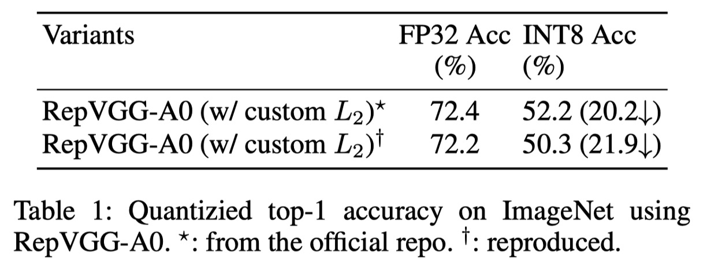
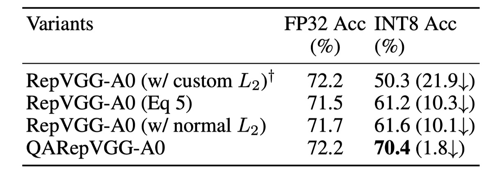

## Making RepVGG Great Again

[**Make RepVGG Greater Again: A Quantization-Aware Approach**](https://ojs.aaai.org/index.php/AAAI/article/view/29045)

---

RepVGG leverages an over-parameterized network with multiple branches during the training phase, and merges these branches into a single one during inference, a process termed "re-parameterization."

- [**RepVGG: Making VGG Great Again**](../2101-repvgg/index.md)

## Defining the Problem

This "re-parameterization" design is widely used as a fundamental component in many scenarios, covering both low-level and high-level visual tasks.

Recent popular object detection methods like YOLOv6 and YOLOv7 are built on such components.

- [**[22.07] YOLOv7**](https://arxiv.org/abs/2207.02696)
- [**[22.09] YOLOv6**](https://arxiv.org/abs/2209.02976)

However...

### RepVGG cannot be quantized!

Quantization is an effective model compression method that maps network weights and input data to lower precision (usually INT8) for faster computation, significantly enhancing computational efficiency.

- Post-training quantization (PTQ) is the most common scheme, requiring only a few batches of images to calibrate quantization parameters without additional training.
- Quantization-aware training (QAT) methods are also proposed to improve quantization accuracy. QAT usually involves intrusively modifying training code and requires additional costs, so it is typically used only when PTQ does not yield satisfactory results and when training code is available.

There is a trade-off: quantization typically results in some loss of accuracy, so it's used only if it can be applied without significantly impacting performance for deployment tasks.

- **But RepVGG loses 20% accuracy after quantization!**

This makes it completely impractical!

### Why?

---

The authors first evaluate the performance of several RepVGG models using the official code. As shown in the table above, after standard PTQ (post-training quantization), RepVGG-A0's Top-1 accuracy on the ImageNet validation dataset drops significantly from 72.4% to 52.2%, a total decrease of 20.2%!

Quantization of a tensor $X$ is typically represented as:

$$
Q(X) = Clip(Round(X/\Delta x ))
$$

where $Round$ rounds the floating-point values to integers using ceiling rounding, and $Clip$ truncates values beyond the quantization range. $\Delta x$ is a scaling factor that maps the tensor to a given range, defined as:

$$
\Delta x = \frac{(x_{max} - x_{min})}{2^{b}-1}
$$

where $x*{max}$ and $x*{min}$ are boundary values chosen to better represent the distribution of $X$. The variance of the quantization error is calculated as $\sigma^2 = (\Delta x)^2/12$. Therefore, the problem becomes how to reduce the range between $x*{max}$ and $x*{min}$.

In practice, these values are chosen in various ways. Sometimes the maximum and minimum values are used directly, such as for weight quantization; sometimes they are chosen by optimizing the quantization error's MSE or entropy, typically for activation quantization. The quality of the selection depends on many factors, such as the tensor's variance and the presence of outliers.

For neural networks, two main components need quantization and can lead to accuracy degradation: weights and activations. Activations also serve as inputs to the next layer, so errors accumulate layer by layer. Therefore, good quantization performance of a neural network primarily requires two basic conditions:

- $C1$: The weight distribution is quantization-friendly and feasible in range.
- $C2$: The activation distribution (i.e., the model's response to input features) is also quantization-friendly.

Empirically, we define quantization-friendly weight or activation distributions as those with small variance and few outliers. Violating either condition results in poor quantization performance.

The authors then show the weight distribution of the RepVGG-A0 model:

The figure above shows the weight distribution for each layer and the corresponding standard deviation.

Observation reveals that these weights are evenly distributed around zero, with no significant outliers, satisfying condition $C1$.

This prompts the authors to further verify condition $C2$ by examining whether the activation functions significantly worsen the quantization effect.

Unfortunately, activation functions depend on the input and are coupled with learned weights.

Thus, the authors do not make any assumptions about the distribution of weights or activations and analyze the biases of each branch.

### Regularization Amplifies Activation Variance

Before further discussion, let's introduce the computation operations in a typical RepVGG block.

Here, the same naming conventions as RepVGG are used for better understanding.

Specifically, $W^{(k)} \in \mathbb{R}^{C_2 \times C_1 \times k \times k}$ denotes the kernel of the $k \times k$ convolution, where $C_1$ and $C_2$ are the numbers of input and output channels, respectively. For RepVGG, $k \in \{1, 3\}$. For the BN layer after the $k \times k$ convolution, $\mu^{(k)} \in \mathbb{R}^{C_2}$, $\sigma^{(k)} \in \mathbb{R}^{C_2}$, $\gamma^{(k)} \in \mathbb{R}^{C_2}$, and $\beta^{(k)} \in \mathbb{R}^{C_2}$ represent the mean, standard deviation, scaling factor, and bias, respectively. For the BN in the Identity branch, $\mu^{(0)}$, $\sigma^{(0)}$, $\gamma^{(0)}$, $\beta^{(0)}$ are used.

Let $M^{(1)} \in \mathbb{R}^{N \times C_1 \times H_1 \times W_1}$ and $M^{(2)} \in \mathbb{R}^{N \times C_2 \times H_2 \times W_2}$ represent the input and output, respectively, with $\ast$ denoting convolution operation.

Let $Y^{(0)}$, $Y^{(1)}$, and $Y^{(3)}$ be the outputs of the Identity, $1 \times 1$, and $3 \times 3$ branches, respectively.

Without loss of generality, assume $C_1 = C_2$, $H_1 = H_2$, and $W_1 = W_2$.

Then the output $M^{(2)}$ can be written as:

$$
M^{(2)} = BN(M^{(1)} \ast W^{(3)}, \mu^{(3)}, \sigma^{(3)}, \gamma^{(3)}, \beta^{(3)})
$$

$$
+ BN(M^{(1)} \ast W^{(1)}, \mu^{(1)}, \sigma^{(1)}, \gamma^{(1)}, \beta^{(1)})
$$

$$
+ BN(M^{(1)}, \mu^{(0)}, \sigma^{(0)}, \gamma^{(0)}, \beta^{(0)})
$$

Next, the BN operation of the $3 \times 3$ branch can be written as:

$$
Y^{(3)} = \gamma^{(3)} \odot \frac{M^{(1)} \ast W^{(3)} - \mu^{(3)}}{\sqrt{\sigma^{(3)} \odot \sigma^{(3)} + \epsilon}} + \beta^{(3)}
$$

where $\odot$ denotes element-wise multiplication, and $\epsilon$ is a small value (default $10^{-5}$) to ensure numerical stability. This means BN changes the statistics (mean and variance) of its input.

Note that changes in $\mu$ do not affect quantization errors. However, changes in variance directly impact quantization accuracy. From a probabilistic perspective, given a random variable $X$ and scalar $\lambda$, the variance of $\lambda X$, $D(\lambda X)$, equals $\lambda^2 D(X)$.

Let $X^{(3)} = M^{(1)} \ast W^{(3)}$, then:

$$
D(Y^{(3)}) = \frac{\gamma^{(3)} \odot \gamma^{(3)}}{\sigma^{(3)} \odot \sigma^{(3)} + \epsilon} \odot D(X^{(3)})
$$

Here, the value of $\frac{\gamma^{(3)} \odot \gamma^{(3)}}{\sigma^{(3)} \odot \sigma^{(3)} + \epsilon}$ controls the expansion or reduction of $X^{(3)}$'s variance, leading to either better or worse quantization performance.

Similar conclusions can be drawn for the $1 \times 1$ and Identity branches.

Based on the above analysis, the authors delve into the details of RepVGG:

A crucial yet often overlooked component is a specially designed custom $L_2$ weight decay that enhances accuracy and facilitates quantization by regularizing the multi-branch weights, similar to regularizing their equivalent fused convolution kernels.

This may lead to quantization-friendly fused weights.

This custom $L_2$ loss is essentially:

$$
L_{2,\text{custom}} = \frac{\|W_{\text{eq}}\|_2^2}{\frac{\|\gamma^{(3)}\|_2^2}{\sqrt{\sigma^{(3)} \odot \sigma^{(3)} + \epsilon}} + \frac{\|\gamma^{(1)}\|_2^2}{\sqrt{\sigma^{(1)} \odot \sigma^{(1)} + \epsilon}}}
$$

It's worth noting that optimizers are encouraged to minimize this loss by amplifying the denominator, which enlarges the activation variance and brings quantization challenges.

This means that custom $L_2$ helps make the learned weights quantization-friendly at the cost of making activations quantization-unfriendly.

To address the issue of increased variance, a simple and straightforward approach is to remove the denominator from the above formula, resulting in:

$$
L_{2,\text{custom}}' = \|W_{\text{eq}}\|_2^2
$$

The results are shown in the table below:

Removing the denominator term yields an FP32 accuracy of 71.5%, which is 0.7% lower than the baseline.

However, the quantization performance improves significantly to 61.2%. Still, this method requires inconvenient equivalent transformations.

Another promising approach is to directly apply ordinary $L_2$.

Considering previous multi-branch networks like the Inception series no longer required special treatment for weight decay, this prompted the authors to apply the ordinary $L_2$ loss. The results showed that, besides simplicity, $L_2$ achieved slightly better results.

Thus, this method is chosen as the default implementation (M1).

### Uncontrollable Outlier Weights

Although the FP32 accuracy is 0.5% lower than the baseline, its INT8 accuracy is 11.3% higher than the baseline. However, this design still cannot meet application requirements due to the lack of an explicit regularizer to amplify activation variance. Therefore, examining the weight distribution is a direct approach.

First, we can derive the fused weights as:

$$
W = \hat{W}^{(3)} + \hat{W}^{(1)} + \hat{W}^{(0)}
$$

$$
= \frac{\gamma^{(3)}}{\sqrt{\sigma^{2}_{(3)} + \epsilon}} \odot W^{(3)}
$$

$$
+ \frac{\gamma^{(1)}}{\sqrt{\sigma^{2}_{(1)} + \epsilon}} \odot Padding(W^{(1)})
$$

$$
+ \frac{\gamma^{(0)}}{\sqrt{\sigma^{2}_{(0)} + \epsilon}} \odot Padding(W^{(0)})
$$

where $Padding()$ is used to match the shape of the $3 \times 3$ convolution kernel.

In this architecture, $W^{(3)}$ and $W^{(1)}$ are trainable parameters, while $W^{(0)}$ is a fixed identity matrix that does not decay during training. The scalars $\frac{\gamma^{(3)}}{\sqrt{\sigma^{2}_{(3)} + \epsilon}}$ and $\frac{\gamma^{(1)}}{\sqrt{\sigma^{2}_{(1)} + \epsilon}}$ depend on the output of the convolutional layers in the $3 \times 3$ and $1 \times 1$ branches, respectively.

**However, $\frac{\gamma^{(0)}}{\sqrt{\sigma^{2}\_{(0)} + \epsilon}}$ directly depends on the output of the last layer, and the Identity branch is special because the activations pass through the ReLU layer before entering the BatchNorm layer.**

This operation is very dangerous because if a channel is entirely inactive (i.e., contains only zeros), it generates a very small $\sigma$ and a singular value $\frac{1}{\sqrt{\sigma^{2}\_{(0)} + \epsilon}}$. This issue is common in networks widely using ReLU.

**If this happens, the singular value will dominate the distribution of the fused convolution kernels, significantly affecting their quantization preference.**

This explains the poor quantization performance due to the violation of $C1$, leading to irreparable errors.

---

The authors further display the $\frac{\gamma}{\sqrt{\sigma^2 + \epsilon}}$ of the three branches, as shown below.

In Layers 5 and 6, the maximum $\frac{\gamma}{\sqrt{\sigma^2 + \epsilon}}$ from the Identity branch is 692.1107 and 1477.3732, respectively.

The authors repeated the experiment three times, and this phenomenon recurred.

:::tip
The maximum value appears randomly in different layers across different experiments, and simply skipping these layers cannot solve the quantization problem.

According to the authors' analysis, the quantization error of RepVGG accumulates across all layers, so partial solutions cannot mitigate the breakdown, prompting the authors to design a quantization-friendly re-parameterization structure to address the issue.
:::

## Solving the Problem

Based on ordinary $L_2$ loss, the authors address the issues by altering the re-parameterization structure.

They remove BN from the Identity and $1 \times 1$ branches and add an extra BN after the sum of the three branches.

Removing the BN from the Identity branch (M2) eliminates uncontrollable outlier weights, satisfying condition $C1$.

This setup is named S2, with results shown in the third row of the table below.

Error analysis of weight quantization indicates that this design indeed meets condition $C1$. The FP32 accuracy of this model is relatively low at 70.7%, with an INT8 accuracy of 62.5%, still impractical.

This prompted the authors to verify if it violated condition $C2$. If the $3 \times 3$ and $1 \times 1$ branches have the same mean, their sum tends to amplify variance.

This phenomenon frequently occurs in RepVGG's design. Since ReLU is the activation function in RepVGG, if most inputs are below zero (dead neurons), it's harmful. Conversely, if all inputs are above zero, it's also undesirable due to losing non-linearity. Empirically, many modern high-performance CNN models have zero mean before ReLU.

Assuming this, we have:

$$
E(M^{(2)}) = E(Y^{(1)} + Y^{(3)} + Y^{(0)}) = 0
$$

If the $3 \times 3$ and $1 \times 1$ branches have the same mean, we get:

$$
\beta^{(3)} = \beta^{(1)} = -2E(Y^{(0)})
$$

Note $E(Y^{(0)}) \ge 0$, adding three branches tends to amplify variance, as shown below:

Unfortunately, the original design of RepVGG inevitably encounters this issue.

---

To better control variance, several simple methods have potential, as shown in the table below:

This design removes BN from the $1 \times 1$ branch (M3), achieving the best performance, named S3. This design achieves 70.1% Top-1 FP32 accuracy and 69.5% INT8 accuracy on ImageNet, significantly improving quantization performance.

However, its FP32 accuracy is still low.

Due to the introduction of the covariate shift issue from summing the three branches, the authors add an additional batch normalization (M4) after summing the three branches to stabilize the training process, naming this setup S4.

The post-BN does not affect the equivalent convolution kernel fusion during deployment. This further boosts the A0 model's Top-1 FP32 accuracy on ImageNet from 70.1% to 72.2%. Additionally, its INT8 accuracy increases to 70.4%.

In summary, combining the four modifications above (from M1 to M4) ultimately forms QARepVGG, maintaining RepVGG's excellent FP32 performance while significantly surpassing RepVGG in INT8 performance.

## Discussion

### Performance on ImageNet

The research shows that RepVGG's INT8 accuracy is severely impacted, far below FP32.

For example, RepVGG-B0's Top-1 accuracy drops from 75.1% to 40.2%. In contrast, the method in this paper performs excellently in INT8 performance, with accuracy drops within 2%.

Notably, RepVGG with grouped convolutions performs particularly poorly. After PTQ, RepVGG-B2g4's accuracy drops from 78.5% to 13.7%, a decrease of 64.8%. In contrast, QARepVGG-B2g4's accuracy only drops by 0.7%, demonstrating its robustness across different scales and variations.

In comparison with RepOpt-VGG, which uses gradient re-parameterization, its quantization accuracy is highly sensitive to scale search quality. With only partial pre-trained models released, the authors re-trained RepOpt-VGG-A0/B0 models.

Results show that RepOpt-VGG-A0 achieves 70.3% accuracy on ImageNet, 2.1% lower than RepVGG. Although RepOpt-VGG shows some improvement, its PTQ accuracy remains too low. In contrast, the authors' method significantly outperforms RepOpt-VGG without sensitive hyperparameters or additional training costs.

Finally, the authors compared RepVGG with QAT using the NVIDIA quantization toolkit. Results show that QARepVGG equipped with QAT significantly outperforms RepVGG+QAT. All models were trained for 10 epochs with an initial learning rate of 0.01, further confirming the significant advantage of this method in post-quantization performance.

## Conclusion

Through theoretical and quantitative analysis, this study delves into the failure reasons for quantizing the famous re-parameterization-based structure RepVGG. The study finds that its structural defects inevitably magnify quantization errors and accumulate to produce poor results. To address this issue, the research team redesigned the structure, introducing QARepVGG. This improved design yields quantization-friendly weights and activation distributions.

QARepVGG maintains the excellent FP32 performance of RepVGG while greatly simplifying the final deployment quantization process. This study emphasizes the importance of quantization awareness in architecture design to improve overall model performance. Through this design, QARepVGG demonstrates superior quantization performance, providing valuable insights for future model designs.

:::tip
After patiently reading through this paper, one might feel a sense of greatness...

Despite the numerous mathematical formulas, the paper is actually quite comprehensible.

We recommend readers delve into the original paper for a deeper understanding of the design and performance of QARepVGG.
:::
