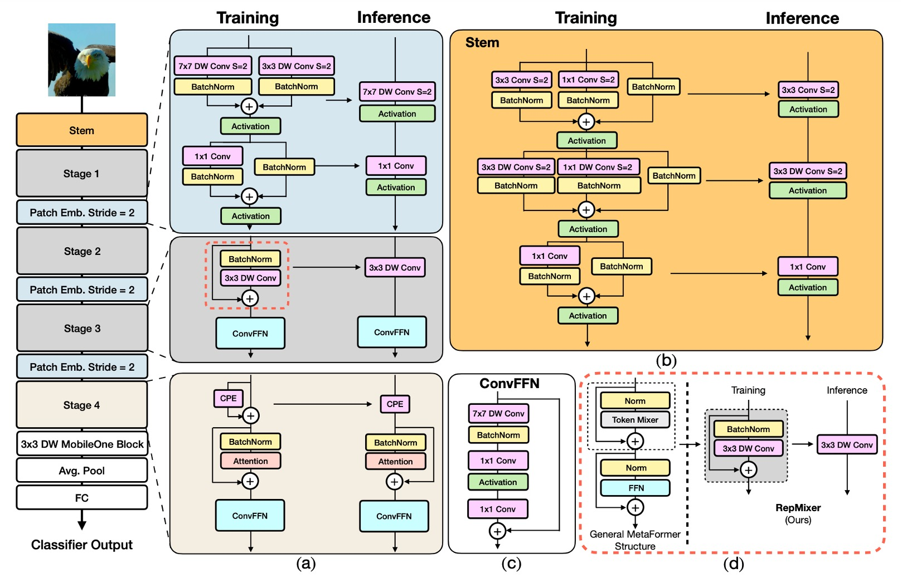
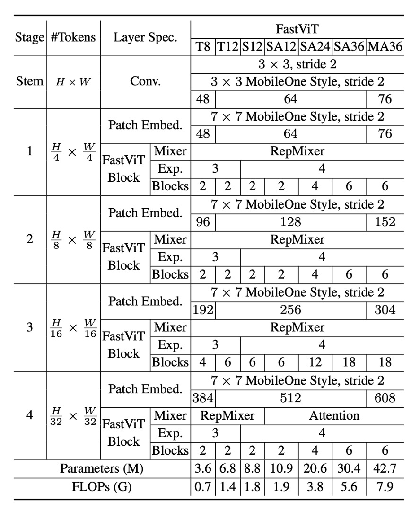

## Reparameterized ViT Experiments

[**FastViT: A Fast Hybrid Vision Transformer using Structural Reparameterization**](https://arxiv.org/abs/2303.14189)

---

After the recent introduction of MobileOne, Apple continues to explore more possibilities with model reparameterization. Previously, they tackled the MobileNet architecture; now, it's Vision Transformer's turn.

:::tip
**Model Reparameterization**:

This involves separating the training and inference architectures, converting the original model parameters into new ones. This transformation mathematically equates the training architecture to the inference architecture, enhancing model speed and performance.

This series of research into model reparameterization gained popularity after the introduction of RepVGG. If this is your first time encountering this concept, we strongly recommend starting with RepVGG to grasp the reparameterization concept. Understanding this will make subsequent papers much easier to comprehend. Otherwise, you might find this content quite perplexing.

- [**RepVGG: Making VGG Great Again**](../2101-repvgg/index.md)
  :::

## Problem Definition

Several design directions have been established over the past few years for Transformer models in computer vision.

First, we structure multiple layers corresponding to the multi-scale resolution needs of vision tasks. This concept comes from PVT and Swin Transformer:

- [**[21.02] PVT: Spatial Reduction Attention Mechanism**](../../vision-transformers/2102-pvt/index.md)
- [**[21.03] Swin Transformer: The Dance Begins**](../../vision-transformers/2103-swin-transformer/index.md)

Next, we design a Token Mixer block paired with an FFN block to form a basic module, a concept derived from MetaFormer:

- [**[21.11] PoolFormer: You Need a Meta!**](../../vision-transformers/2111-poolformer/index.md)
- [**[22.10] CaFormer: MetaFormer User Manual**](../../vision-transformers/2210-caformer/index.md)

After proposing MobileOne, the authors turned their attention to this structural architecture.

- [**[22.06] MobileOne: One Millisecond Optimization**](../2206-mobileone/index.md)

Is there an opportunity to reparameterize the Vision Transformer series of models as well?

## Solution

### Model Architecture

The FastViT architecture comprises four distinct stages, operating at different scales.

- **RepMixer**

  RepMixer is based on the convolutional mixing concept introduced by ConvMixer, with its mixing block defined as follows:

  - [**[22.01] ConvMixer**](https://arxiv.org/abs/2201.09792)

  $$Y = \text{BN}(\sigma(\text{DWConv}(X))) + X$$

  Where $\sigma$ represents a non-linear activation function, BN denotes Batch Normalization, and DWConv is a depth-wise convolution layer. FastViT simplifies this by rearranging operations and removing the non-linear function:

  $$Y = \text{DWConv}(\text{BN}(X)) + X$$

  This design primarily benefits inference, where it can be reparameterized into a single depth-wise convolution layer:

  $$Y = \text{DWConv}(X)$$

  This reparameterization significantly reduces memory access costs and computational complexity. Compared to PoolFormer’s PoolMixer, RepMixer offers better inference performance.

  

- **Positional Encoding**

  FastViT employs conditional positional encoding (referenced below), which dynamically generates encodings based on the local neighborhood of input tokens. These encodings are generated through depth-wise convolutions and added to the patch embedding. Due to the lack of non-linear operations in this process, this block can be effectively reparameterized.

  - [**[21.02] Conditional positional encodings for vision transformers**](https://arxiv.org/abs/2102.10882)
  - [**[21.04] Twins: Revisiting the design of spatial attention in vision transformers**](https://arxiv.org/abs/2104.13840)

- **Depth-wise Separable Convolution**

  Continuing the design philosophy of MobileOne, FastViT replaces dense $k \times k$ convolutions with depth-wise separable convolutions, i.e., $k \times k$ depth-wise convolutions and $1 \times 1$ point-wise convolutions, paired with reparameterized training strategies.

  This approach enhances model capacity without significantly increasing training time. For instance, FastViT-SA12 and FastViT-SA36 saw training time increases of only 6.7% and 4.4%, respectively.

- **Large Kernel Convolution**

  

  To address the local receptive field limitation of RepMixer compared to self-attention Token Mixers, FastViT integrates depth-wise large kernel convolutions within FFN and patch embedding layers.

  Experimental results, as shown in the table, indicate that incorporating large kernel convolutions significantly enhances model performance and robustness. This strategy increases the receptive field without significantly adding computational cost.

### Model Configurations

FastViT offers various configurations to meet different computational demands and application scenarios, as shown in the table above. These configurations vary in embedding dimensions, MLP expansion ratios, and the types of modules included.

Detailed specifics are as follows:

- Models with smaller embedding dimensions, such as [64, 128, 256, 512], are prefixed with “S”.
- Models including self-attention (Self-Attention) layers are prefixed with “SA”.
- Models with larger embedding dimensions, such as [76, 152, 304, 608], are prefixed with “M”.
- Models with MLP expansion ratios less than 4 are prefixed with “T”.

The numbers in the table represent the total number of FastViT modules, with FLOP counts calculated using the fvcore library.

### Training and Evaluation Strategy

The authors conducted experiments using the ImageNet-1K dataset, which includes approximately 1.3 million training images and 50,000 validation images.

The training methodology for this model is as follows:

- **Optimizer**: AdamW
- **Training epochs**: 300
- **Weight decay**: 0.05
- **Peak learning rate**: $10^{-3}$
- **Total batch size**: 1024
- **Warm-up epochs**: 5
- **Learning rate decay**: Cosine annealing strategy
- **Implementation tool**: timm library
- **Training hardware**: 8 NVIDIA A100 GPUs

For input sizes of 384×384, a fine-tuning of 30 epochs was performed, with specific settings as follows:

- **Weight decay**: $10^{-8}$
- **Learning rate**: $5 \times 10^{-5}$
- **Batch size**: 512

The authors compared FastViT with other state-of-the-art models on the ImageNet-1K dataset. For fair comparison, they modified the official implementation of ConvNeXt to avoid expensive reshape operations. Additionally, due to poor support for deformable convolutions in the two libraries, LITv2 could not be reliably derived in this paper.

## Discussion

### Performance on ImageNet

The complete comparison results are shown in the tables above:

- **FastViT-MA36**:

  - Achieved a Top-1 accuracy of 84.9%
  - 49.3% smaller than LITv2-B
  - Consumes 55.4% fewer FLOPs

- **FastViT-S12**:

  - 26.3% faster than MobileOne-S4 on iPhone 12 Pro
  - 26.9% faster on GPU

- **FastViT-MA36**:

  - Top-1 accuracy of 83.9%
  - 1.9 times faster than the optimized ConvNeXt-B model on iPhone 12 Pro
  - 2.0 times faster on GPU

- **FastViT-MA36**:
  - Top-1 accuracy of 84.9%
  - As fast as NFNet-F1 on GPU
  - 66.7% smaller
  - Uses 50.1% fewer FLOPs
  - 42.8% faster on mobile devices

:::tip
These results are based on experiments conducted on an iPhone 12. Subsequent research found that FastViT's inference speed was not as expected on most devices. This may be due to certain FastViT operators not being optimized for acceleration on other devices. Therefore, we recommend selecting FastViT based on specific application scenarios and device characteristics.
:::

## Conclusion

FastViT achieves a balance of high performance and low latency through structural reparameterization and other improvements, demonstrating robust performance across various application scenarios.

:::tip
This paper does not compare results with CAFormer. In our own comparisons, CAFormer outperforms FastViT in terms of performance with the same computational cost.

For example:

- CAFormer-S18, MACs 4.1G; FastViT-SA24, MACs 3.8G.
- CAFormer-S18 has a Top-1 accuracy of 83.6%, while FastViT-SA24 has a Top-1 accuracy of 82.6%.

However, CAFormer does not involve reparameterization, so it can be expected to be much slower. Additionally, the smallest model in CAFormer is still quite large and unsuitable for deployment on mobile devices. FastViT has an advantage in this aspect, with the smallest model having approximately 3.6M parameters.
:::
