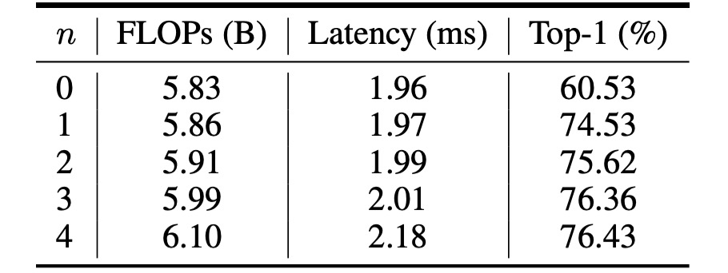
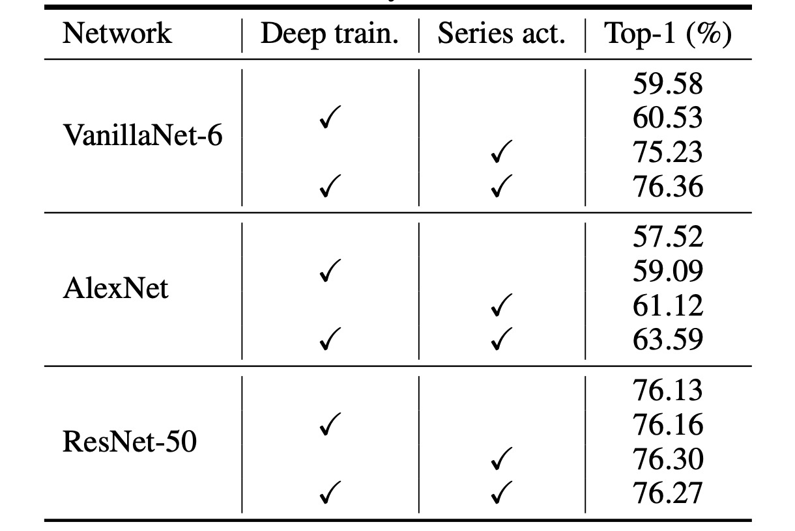
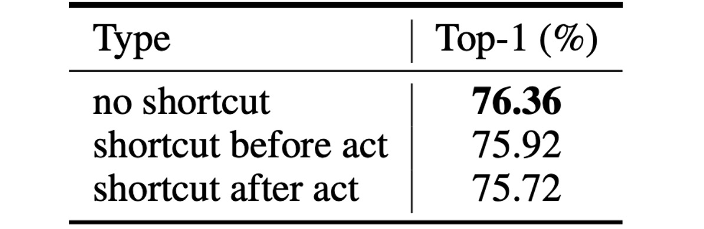

## Vanilla Minimalism

[**VanillaNet: the Power of Minimalism in Deep Learning**](https://arxiv.org/abs/2305.12972)

---

Even after a decade of deep convolutional networks dominating the field, it's refreshing to see such a minimalist approach like VanillaNet emerge.

## Problem Definition

In recent years, the field of computer vision has advanced rapidly. From the early days of AlexNet to the latest CNN and Transformer hybrid architectures, there's been a relentless push towards more complex models.

To climb the ImageNet leaderboard, researchers have continuously increased model complexity, leading to a corresponding rise in computational costs and resource demands. Moreover, deploying these complex architectures has become increasingly challenging. For instance, ResNet consumes a significant amount of additional memory during operation, while the shifted window mechanism in Swin Transformer requires complex engineering solutions, including rewriting CUDA code.

### Why Have Non-Residual Convolutional Architectures Fallen Out of Favor?

Take AlexNet and VGG, for example.

The reason is well understood: the issues of gradient vanishing and network degradation in deep network structures. The introduction of the residual structure by ResNet effectively addressed these problems, making non-residual architectures less competitive in terms of accuracy—a fact that cannot be ignored.

As a result, simple network designs seemed to have hit a dead end, receiving little attention.

However, with the continuous development of AI chips, modern GPUs can easily handle parallel computations, and the bottleneck in neural network inference speed is no longer FLOPs or parameter count. Instead, the complexity and depth of modern models have become the obstacles to speed.

This realization brought about the insight that the ultimate bottleneck was destined from the start.

## Solution

### Model Architecture


The authors of this paper propose a simple neural network architecture called VanillaNet, as shown in the figure above.

Looking at this architecture feels like a blast from the past:

- AlexNet! What are you doing here?

---

Unlike modern deep networks, each downsampling stage here consists of only **one layer**.

In the Stem stage, the authors use a $4 \times 4 \times 3 \times C$ convolutional layer with a stride of 4 to map the image into a $C$-dimensional feature space.

In stages 1 to 3, a MaxPool layer with a stride of 2 is used to reduce the feature map size while doubling the number of channels.

The final layer is a fully connected layer that outputs the classification result. Each convolutional layer is $1 \times 1$, minimizing the number of parameters. An activation function follows each convolutional layer, and BatchNorm is applied to stabilize the training process.

There are no residual connections, attention mechanisms, or shifted windows here—just basic convolution and pooling.

### Does This Really Work?

How could such a straightforward architecture possibly perform well?

The authors point out that this design lacks a crucial element: **non-linearity**.

We know that the strength of neural networks lies in their non-linearity, which is key to fitting complex functions. How can we enhance the non-linear capacity of this network? We'll explore this later, but first, let's look at another issue: **depth**.

### Depth Training Strategy

In convolutional neural networks, the combination of convolutional layers and activation functions is crucial for capturing the non-linear features of data.

During the initial training stages, the authors use two convolutional layers with activation functions. This design aims to provide the network with strong non-linear capabilities at the start, enabling it to learn data features more effectively. As training progresses, the non-linearity of the activation functions is gradually reduced, eventually transforming them into an identity mapping.

The entire transformation of the activation function can be described by the following formula:

$$
A'(x) = (1 - \lambda)A(x) + \lambda x,
$$

where $\lambda$ is a hyperparameter that changes with training iterations. At the start of training, $\lambda = 0$, meaning $A'(x) = A(x)$, with the activation function at full strength. As training progresses, $\lambda$ gradually increases until, by the end of training, $\lambda = 1$, meaning $A'(x) = x$, and the activation function becomes an identity mapping.

At the end of training, since the activation function has become an identity mapping, the two convolutional layers can be merged into a single layer, reducing inference time and improving model efficiency. The merging process is akin to reparameterization, familiar from models like RepVGG:

- **BatchNorm Merging**:

  First, each BatchNorm layer is merged with the preceding convolutional layer.

  Let the weight and bias matrices of the convolutional layer be $W \in \mathbb{R}^{C_{out} \times C_{in} \times k \times k}$ and $B \in \mathbb{R}^{C_{out}}$, and the parameters of batch normalization (scaling, shifting, mean, and variance) be $\gamma, \beta, \mu, \sigma \in \mathbb{R}^{C_{out}}$.

  The merged weight and bias matrices are:

  $$
  W'_i = \frac{\gamma_i}{\sigma_i} W_i, \quad B'_i = \frac{(B_i - \mu_i) \gamma_i}{\sigma_i} + \beta_i,
  $$

  where the subscript $i$ represents the value of the $i$th output channel.

- **Merging Two $1 \times 1$ Convolutional Layers**:

  After merging the batch normalization layers, we proceed to merge the two $1 \times 1$ convolutional layers.

  Let $x \in \mathbb{R}^{C_{in} \times H \times W}$ and $y \in \mathbb{R}^{C_{out} \times H' \times W'}$ be the input and output features, respectively. The convolution can be expressed as:

  $$
  y = W * x = W \cdot \text{im2col}(x) = W \cdot X,
  $$

  where $*$ denotes the convolution operation, $\cdot$ denotes matrix multiplication, and $X$ is generated by the im2col operation, transforming the input into a matrix corresponding to the convolution kernel shape. For a $1 \times 1$ convolution, the im2col operation simplifies to a reshaping operation, so the weight matrices $W_1$ and $W_2$ of the two convolutional layers can be merged into one matrix:

  $$
  y = W_1 * (W_2 * x) = W_1 \cdot W_2 \cdot \text{im2col}(x) = (W_1 \cdot W_2) * X,
  $$

  Thus, the two $1 \times 1$ convolutional layers can be merged without increasing inference speed.

This depth training strategy offers several advantages:

1. **Enhanced Non-linearity**: Using strong non-linear activation functions in the early training stages helps the model capture complex patterns in the data, improving performance.
2. **Gradual Transition to a Simplified Model**: As training progresses, the activation functions gradually become identity mappings, simplifying the final model structure and improving inference speed.
3. **Easy Layer Merging**: At the end of training, the two convolutional layers can be easily merged into one, reducing computational costs and improving efficiency.

:::tip
The reparameterization process is similar to the concept seen in RepVGG.

- [**RepVGG: Making VGG Great Again**](../2101-repvgg/index.md)
  :::

### Series-Informed Activation Functions

According to existing research, the limited capabilities of simple and shallow networks are primarily due to insufficient non-linearity, which contrasts with deep and complex networks. This area remains underexplored.

In fact, there are two ways to enhance the non-linearity of neural networks:

1. **Stacking Non-linear Activation Layers**
2. **Increasing the Non-linearity of Each Activation Layer**

Current trends in network design favor the former approach, but this leads to high latency when parallel computing capacity is abundant.

---

A direct way to enhance the non-linearity of an activation layer is to stack it. The "serial" stacking of activation functions is the core idea of deep networks.

In contrast, the authors of this paper chose to "parallelize" the stacking of activation functions.

Let a single activation function in a neural network be $A(x)$, which could be a common function like ReLU or Tanh.

Parallel stacking of activation functions can be expressed as:

$$
A_s(x) = \sum_{i=1}^{n} a_i A(x + b_i)
$$

where $n$ represents the number of stacked activation functions, and $a_i$ and $b_i$ are the scaling and bias for each activation function. Parallel stacking significantly enhances the non-linearity of the activation function, and the above equation can be seen as a series, essentially a sum of several operations.

To further enhance the series' approximation ability, the authors ensure that "**the series-based functions can learn global information by varying their input neighborhoods**," which aligns with the concept of BNET.

- [**[23.01] BNET: Batch normalization with enhanced linear transformation**](https://ieeexplore.ieee.org/document/10012548)

Given an input feature $x \in \mathbb{R}^{H \times W \times C}$, where $H$, $W$, and $C$ are the height, width, and channels, respectively, the activation function is expressed as:

$$
A_s(x_{h,w,c}) = \sum_{i,j \in \{-n, n\}} a_{i,j,c} A(x_{i+h,j+w,c} + b_c)
$$

where $h \in \{1, 2, ..., H\}$, $w \in \{1, 2, ..., W\}$, and $c \in \{1, 2, ..., C\}$.

It can be seen that when $n = 0$, the series-based activation function $A_s(x)$ reduces to the ordinary activation function $A(x)$, meaning this method can be considered a general extension of existing activation functions. In the paper, the authors use ReLU as the base activation function to construct the series, due to its high inference efficiency on GPUs.

:::tip
Let's pause here for a moment. If you're reading the paper, you might find this explanation a bit abstract.

Simply put, in common network designs, assume we have a $3 \times 3$ convolutional layer followed by a ReLU. At this point, the receptive field of ReLU is $3 \times 3$. Next, there's another $3 \times 3$ convolutional layer followed by another ReLU, giving it a receptive field of $5 \times 5$, and so on as it "serially" goes deeper.

So, what does "parallel" stacking of activation functions mean?

It means we directly "increase" the size of the convolution kernel to enlarge the receptive field. Stacking one layer is equivalent to using a $3 \times 3$ convolution; stacking two layers is equivalent to a $5 \times 5$ convolution; stacking three layers is equivalent to a $7 \times 7$ convolution, and so on.

We can look at the implementation to understand this concept better:

```python
# Ref: VanillaNet
#     https://github.com/huawei-noah/VanillaNet/blob/main/models/vanillanet.py
import torch
import torch.nn as nn

class activation(nn.ReLU):

    def __init__(self, dim, act_num=3, deploy=False):
        super(activation, self).__init__()
        self.act_num = act_num
        self.deploy = deploy
        self.dim = dim
        self.weight = nn.Parameter(torch.randn(dim, 1, act_num*2 + 1, act_num*2 + 1))
        if deploy:
            self.bias = nn.Parameter(torch.zeros(dim))
        else:
            self.bias = None
            self.bn = nn.BatchNorm2d(dim, eps=1e-6)
        weight_init.trunc_normal_(self.weight, std=.02)

    def forward(self, x):
        if self.deploy:
            return nn.functional.conv2d(
                super(activation, self).forward(x),
                self.weight, self.bias, padding=self.act_num, groups=self.dim)
        else:
            return self.bn(nn.functional.conv2d(
                super(activation, self).forward(x),
                self.weight, padding=self.act_num, groups=self.dim))
```

If you look directly at `def forward(self, x):`, it first applies a ReLU activation function to the input, followed by a convolution operation using `nn.functional.conv2d`. The convolution kernel for this operation is `self.weight`, and its size is `act_num*2 + 1`, meaning it has stacked `act_num` layers of activation functions.

Finally, all these operations are performed channel-wise, as indicated by the `groups=self.dim` parameter. This parameter in PyTorch's `groups` specifies independent convolution operations for each channel.

:::

## Discussion

Earlier, we mentioned that the limited capabilities of shallow networks are mainly due to "insufficient non-linearity." With the introduction of parallel stacking of activation functions, can this design improve the model's performance?

### Ablation Study - Activation Function



The table above shows the performance of VanillaNet with different values of $n$.

The original network structure only achieves 60.53% accuracy on the ImageNet dataset, which is insufficient for practical applications.

When $n = 1$, the accuracy jumps to 74.53%, marking a significant improvement. When $n = 3$, the accuracy and inference speed reach an optimal balance.

### Ablation Study - Depth Training Strategy



Given the extremely shallow structure of VanillaNet, the authors propose increasing non-linearity during training to enhance performance.

The table above analyzes the effectiveness of the proposed depth training technique. The results show that the original VanillaNet achieved a top-1 accuracy of 75.23%, which serves as the baseline. By using the depth training technique, the proposed VanillaNet reached 76.36% accuracy. These results indicate that the depth training technique is beneficial for shallow networks.

Additionally, the authors further applied the depth training and series-informed activation functions to other networks to demonstrate the generalization ability of these two techniques.

The table reports results on the ImageNet dataset for two classic deep neural networks: AlexNet and ResNet-50. The original AlexNet could only achieve 57.52% accuracy (12-layer structure).

By applying the proposed depth training and series-informed activation functions, AlexNet's performance improved by about 6%, demonstrating that these techniques are highly effective for shallow networks.

For the relatively complex ResNet-50, the performance improvement was smaller. This result suggests that deep and complex networks already possess sufficient non-linearity, making additional techniques unnecessary.

### Ablation Study - Residual Connections



Finally, how effective are the residual connections popular in general network structures?

The authors demonstrated through experiments that using residual connections in shallow network structures does not improve performance and can actually decrease accuracy.

A straightforward explanation is that the bottleneck in shallow networks is not identity mapping but rather "weak non-linearity." Therefore, shortcuts do not help improve non-linearity, as residual connections skip activation functions to reduce depth, leading to decreased performance.

### Performance on ImageNet


To demonstrate the effectiveness of the proposed methods, the authors conducted experiments on the ImageNet dataset.

This dataset consists of RGB color images with a resolution of 224 × 224 pixels, comprising 1.28 million training images and 50,000 validation images across 1,000 categories. They employed strong regularization because VanillaNet has a large number of parameters in each layer, allowing it to capture useful information from images with limited non-linearity.

The latency tests were conducted on an Nvidia A100 GPU, and the authors proposed VanillaNet architectures with different numbers of layers. To validate the performance of these architectures, they tested with a batch size of 1, meaning the AI chip had enough computational power to handle each network.

In this scenario, the study found that inference speed had little correlation with the number of FLOPs and parameters. For example, although MobileNetV3-Large has very low FLOPs (0.22B), its GPU latency is 7.83ms, even higher than that of VanillaNet-13, which has 11.9B FLOPs.

The study shows that under these settings, inference speed is highly related to the complexity and number of layers in the network. For instance, the inference speed difference between ShuffleNetV2x1.5 and ShuffleNetV2x2 is minimal (7.23ms and 7.84ms), despite a significant difference in their parameter count and FLOPs (0.3B vs. 0.6B). This is because the difference lies only in the number of channels.

The study also found that simple architectures, including ResNet, VGGNet, and VanillaNet, achieve the fastest inference speeds without needing additional branches or complex blocks (such as squeeze-and-excitation blocks or dense connections).


## Conclusion

VanillaNet outperforms contemporary networks in efficiency and accuracy, highlighting the potential of minimalist approaches in deep learning.

This research challengs established norms of foundational models and setting a new trajectory for refined and efficient model architectures.
