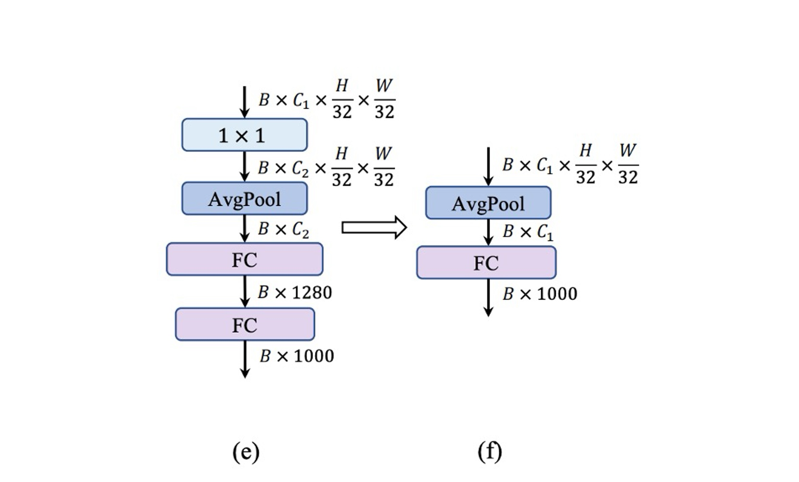
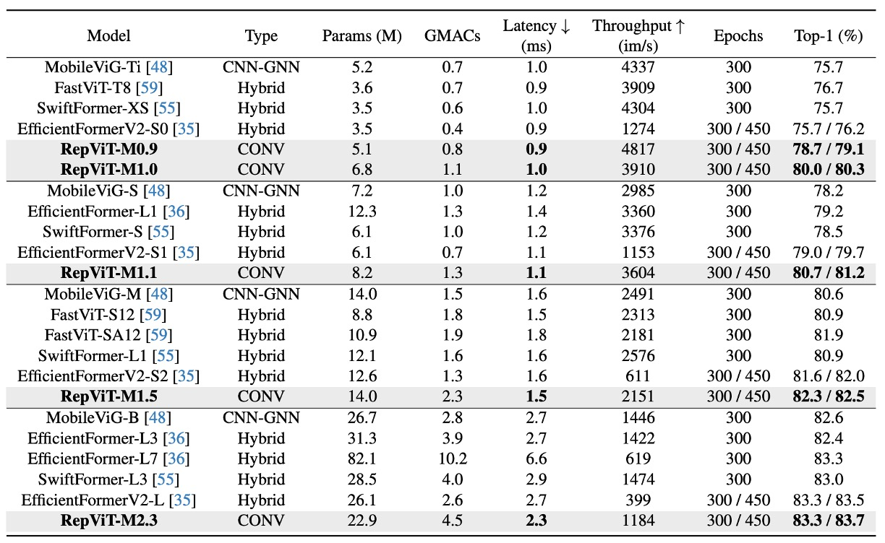
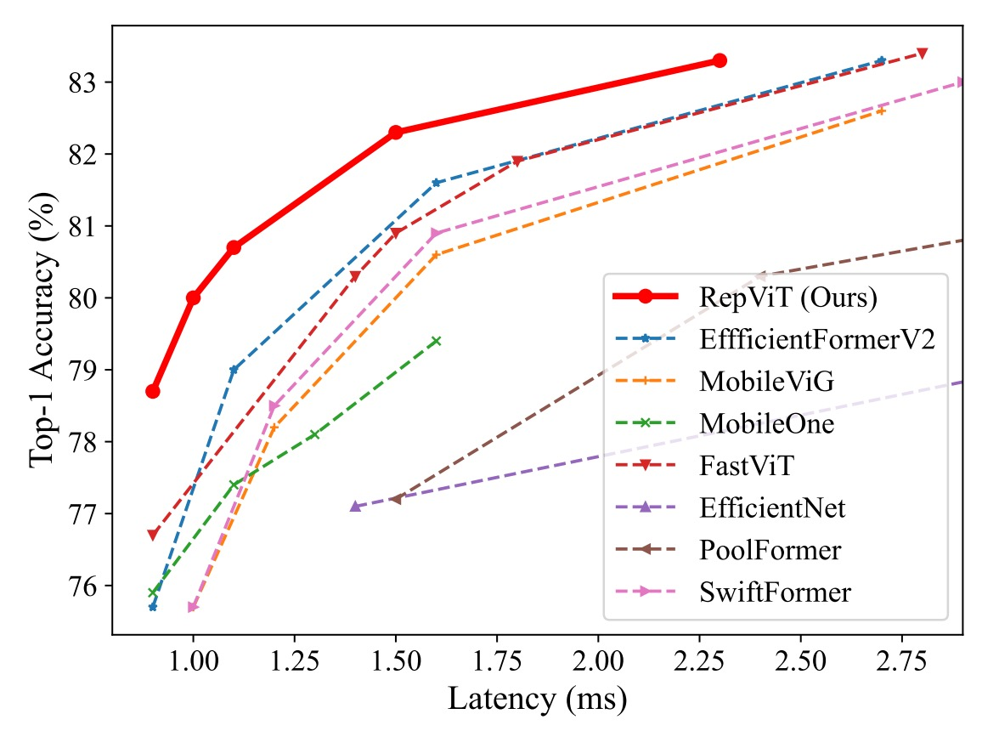

## Revisiting Mobile CNN from the ViT Perspective

[**RepViT: Revisiting Mobile CNN From ViT Perspective**](https://arxiv.org/abs/2307.09283)

---

Research on reparameterization is thriving and gradually spreading to different model architectures.

The goal of this paper is to reparameterize MobileNet-V3, but unlike previous works, this study approaches it from the perspective of Vision Transformers (ViTs).

## Problem Definition

Research on lightweight vision models is primarily divided into two camps:

1. **CNN-Based Research**: Represented by models like the MobileNet series, which reduce the number of parameters through depthwise separable convolutions and enhance the model's expressiveness using inverted residual bottleneck structures.
2. **ViT-Based Research**: Represented by models like MobileViT, Mobileformer, and FastViT, which use the MetaFormer architecture to maintain model expressiveness.

:::tip
For those unfamiliar with MetaFormer, you might find these references useful:

- [**[21.11] PoolFormer: You Need a Meta!**](../../vision-transformers/2111-poolformer/index.md)
- [**[22.10] CAFormer: MetaFormer User Manual**](../../vision-transformers/2210-caformer/index.md)
  :::

---

Is there an insurmountable gap between these two camps?

This paper aims to bridge this gap by redesigning MobileNet-V3 and rethinking it from the ViT perspective.

## Solution Approach

### Redesigning the Architecture

Initially, we ignore constraints like the number of parameters and FLOPs because the primary focus is Latency!

The goal is to be fast, faster, and extremely fast!

---

We start with MobileNet-V3 and take inspiration from recent lightweight ViTs, which typically use DeiT's training methods.

Specifically, the training methods used include:

- AdamW optimizer
- Cosine learning rate decay, training for 300 epochs
- Knowledge distillation using RegNetY16GF
- Data augmentation methods: Mixup, RandAugment, and Random Erasing

All models are trained using these standardized methods.

:::tip
For those unfamiliar with DeiT, you might find this reference helpful:

- [**[20.12] DeiT: Distillation ViT**](../../vision-transformers/2012-deit/index.md)
  :::

### Reparameterizing the Structure

Next, the structure of MobileNet-V3 is adjusted.

In MetaFormer, we know that the success of Transformers comes from separating information exchange into two parts:

1. **Token-level information exchange**, which corresponds to global information exchange in images.
2. **Feature-level information exchange**, which corresponds to channel-level information exchange in images.

In the original MobileNet structure, these two aspects are coupled together:

- First, $1 \times 1$ convolutions handle "channel" information exchange.
- Next, $3 \times 3$ depthwise convolutions handle "global" information exchange.
- Followed by a $SE$ layer, which handles both "global and channel" information exchange.
- Finally, another $1 \times 1$ convolution handles "channel" information exchange.

The authors separate these aspects in the new structure:

- Start with "global" information exchange using $3 \times 3$ depthwise convolutions, and to improve inference speed, use a reparameterized structure.
- Then apply the $SE$ layer for "global and channel" information exchange.
- Conclude with $1 \times 1$ convolutions for "channel" information exchange.

This separation improves inference speed by 20%.

---

The speed increases, but accuracy drops.

Next, measures are taken to recover the lost accuracy.

### Reducing Expansion Ratio and Increasing Width

In typical ViTs, the expansion ratio in the channel mixer is often set to 4, making the hidden dimensions in the feed-forward network (FFN) four times the input dimensions; MobileNet-V3 uses a ratio of 6. This consumes significant computational resources and increases overall inference time.

Previous research has shown that the FFN contains a lot of redundant information, and a lower expansion ratio is often sufficient.

- [**[21.04] LeViT: a Vision Transformer in ConvNet's Clothing for Faster Inference**](https://arxiv.org/abs/2104.01136)
- [**[21.04] All Tokens Matter: Token Labeling for Training Better Vision Transformers**](https://arxiv.org/abs/2104.10858)
- [**[22.12] SAViT: Structure-Aware Vision Transformer Pruning via Collaborative Optimization**](https://proceedings.neurips.cc/paper_files/paper/2022/hash/3b11c5cc84b6da2838db348b37dbd1a2-Abstract-Conference.html)
- [**[23.10] NViT: Vision Transformer Compression and Parameter Redistribution**](https://openreview.net/forum?id=LzBBxCg-xpa)

The authors decided to use an expansion ratio of 2 while increasing the model width to maintain expressiveness.

---

This adjustment recovers accuracy and surpasses the original MobileNet-V3, achieving 73.5%.

### Adjusting the Stem Structure

ViTs typically use a patchify operation as the backbone, dividing the input image into non-overlapping patches, with simple stem structures often using a large $16 \times 16$ convolution. In hierarchical ViTs, a $4 \times 4$ convolution is used.

In contrast, MobileNet-V3 has a complex stem structure with $3 \times 3$ convolutions, depthwise separable convolutions, and inverted residual bottlenecks, as shown in (a).

Since the stem structure processes input images at the highest resolution, its complexity can create significant speed bottlenecks on mobile devices. As a trade-off, MobileNet-V3's stem structure uses a small number of filters (only 16 channels), limiting its expressiveness.

To address this, the authors use early convolutions with two $3 \times 3$ convolutions and a stride of 2 to reduce computation while increasing the number of filters to enhance expressiveness, as shown in (b).

### Adjusting the Downsampling Structure

MobileNet-V3 uses a single stride-2 depthwise separable convolution for downsampling. While this design is efficient, it may lack sufficient network depth, leading to information loss and negatively impacting performance, as shown in (c).

To address this, the authors use a more complex downsampling structure, as shown in (d). This structure includes stride-2 depthwise separable convolutions for downsampling and adjusting channel dimensions, a RepViT module at the front, and an FFN module after $1 \times 1$ convolutions to retain more information.

### Simple Classifier

In lightweight ViTs, the classifier typically consists of global average pooling and a linear layer, which is very fast on mobile devices.

In contrast, MobileNet-V3's classifier includes a $1 \times 1$ convolution and an additional linear layer to expand features into a higher-dimensional space, as shown in (e). While this design is crucial for MobileNet-V3, it increases inference time on mobile devices.

The authors abandon MobileNet-V3’s design and opt for a simple global average pooling and linear layer combination for the final architecture.

---

This design brings inference time back to 0.77 ms, but accuracy drops again!

### Adjusting Stage Ratios

Past research has typically followed a 1:1:3:1 stage ratio, balancing model expressiveness and speed.

- [**[19.05] On Network Design Spaces for Visual Recognition**](https://arxiv.org/abs/1905.13214)
- [**[20.03] Designing Network Design Spaces**](https://arxiv.org/abs/2003.13678)

Recent studies suggest that more aggressive ratios might benefit smaller models. For example, Conv2Former-T and Conv2Former-S use ratios of 1:1:4:1 and 1:1:8:1, respectively.

- [**[22.11] Conv2Former: A Simple Transformer-Style ConvNet for Visual Recognition**](https://arxiv.org/abs/2211.11943)

The authors adopt a 1:1:7:1 ratio with deeper stages of 2:2:14:2, achieving a deeper network layout.

This adjustment successfully recovers the lost accuracy, reaching 76.9%.

### Kernel Size Selection

In previous research, larger kernel convolutions (e.g., $5 \times 5$ or $7 \times 7$) in small networks have been effective in improving model expressiveness.

However, on mobile devices, larger kernels do not benefit from acceleration, as hardware is generally not optimized for large kernels.

To ensure inference efficiency on mobile devices, the authors prioritize $3 \times 3$ convolutions across all modules.

This adjustment does not affect accuracy while reducing inference time to 0.89 ms.

### Squeeze-and-Excitation (SE) Layer Decision

The SE module has been widely used in various network architectures to enhance model expressiveness.

- **However, SE modules are quite slow!**

To balance the benefits of SE modules with speed, the authors use them sparingly:

- **Applying SE modules selectively in the 1st, 3rd, 5th... blocks of each stage.**

## Discussion

### Performance on ImageNet-1K

Experiments were conducted using standard 224×224 pixel images for training and testing, evaluating the performance of various models with different training epochs (300 or 450 epochs).

Key results include:

1. **Model Performance Comparison**:

   - The RepViT model shows excellent performance across various sizes, outperforming other state-of-the-art models. For instance, RepViT-M0.9's top-1 accuracy is 3.0% and 2.0% higher than EfficientFormerV2-S0 and FastViT-T8, respectively. Additionally, RepViT-M1.1 surpasses EfficientFormerV2-S1 by 1.7%.

2. **Latency and Accuracy**:

   - RepViT-M1.0 achieves over 80% top-1 accuracy with a 1.0 ms latency on an iPhone 12, marking a significant breakthrough in lightweight models.
   - The largest model, RepViT-M2.3, achieves 83.7% accuracy with only 2.3 ms latency, demonstrating outstanding performance and efficient latency control.

3. **Impact of Knowledge Distillation**:

   Even without knowledge distillation, RepViT models show significant performance advantages at various latency levels. For example, RepViT-M1.0’s accuracy is 2.7% higher than MobileOne-S1 at 1.0 ms latency. For larger models, RepViT-M2.3 achieves 1.1% higher accuracy than PoolFormer-S36 with a 34.3% reduction in latency (from 3.5 ms to 2.3 ms).

   

### Ablation Study - Reparameterized Structure

To validate the effectiveness of the reparameterized structure in RepViT, the authors conducted ablation studies by removing the multi-branch topology during training on ImageNet-1K.

Results show that without the reparameterized structure, RepViT variants consistently experience performance drops.

### Ablation Study - Impact of SE Layers

To verify the advantage of using SE layers in a cross-block manner, the authors compared scenarios with all SE layers removed and where SE layers are used in each block.

Results indicate that alternating SE layers in blocks offers a better trade-off between accuracy and latency.

## Conclusion

This architecture is the first to achieve over 80% accuracy on ImageNet-1K with an inference speed of under 1 ms on the iPhone 12, marking a significant advancement.

The authors have explored efficient designs for lightweight CNNs, combining innovative lightweight ViT structures to introduce the RepViT series.

This lightweight CNN model, designed for resource-constrained mobile devices, demonstrates superior performance in various vision tasks. RepViT not only outperforms current state-of-the-art lightweight ViTs and CNNs in accuracy but also excels in latency.

The authors hope RepViT will become a solid baseline for lightweight model design and inspire further research and innovation in this field.

:::tip
While RepViT's parameter size may be a concern, many modern mobile devices have ample capacity. However, model size remains a critical factor for many clients, which can limit its adoption.

If your development scenario is not constrained by model size and prioritizes accuracy and inference time, RepViT is an excellent choice.
:::
