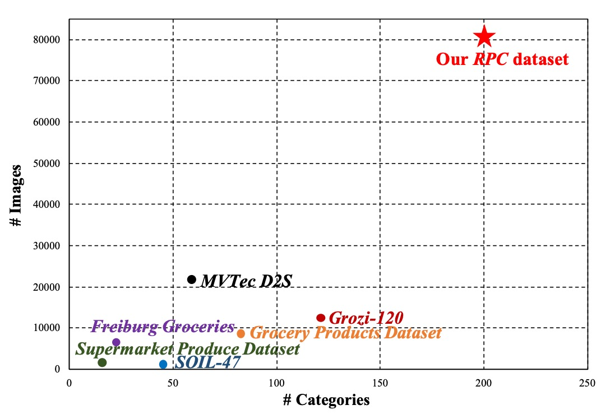
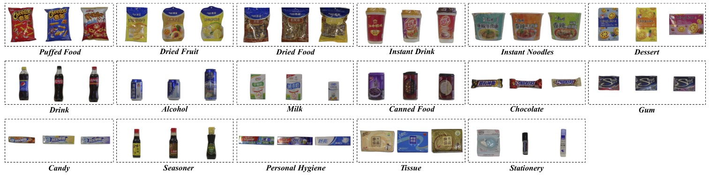
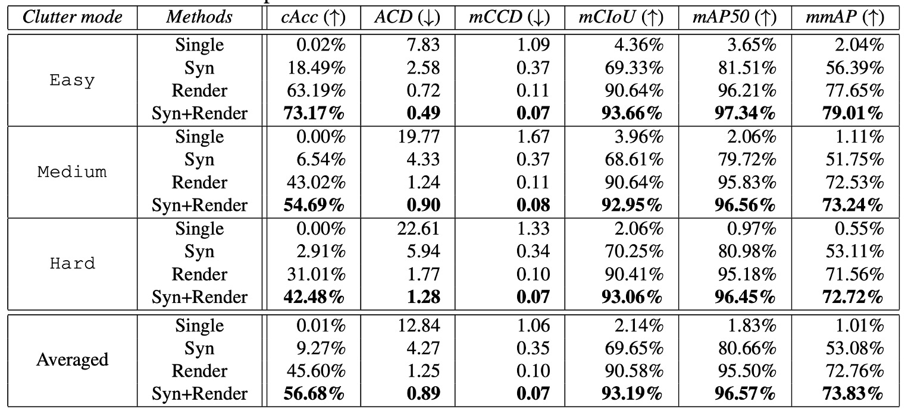

## Check, Please!

[**RPC: A Large-Scale Retail Product Checkout Dataset**](https://arxiv.org/abs/1901.07249)

---

This paper introduces a new dataset called RPC (Retail Product Checkout).

We found that many related papers use this dataset. Moreover, starting from this paper to search the literature allows faster discovery of the latest research achievements.

Such an important node—you definitely can’t miss it.

:::info
**Leaderboard**: [**RPC-Leaderboard**](https://github.com/RPC-Dataset/RPC-Leaderboard?tab=readme-ov-file)

---

**Dataset Download**:

1. [**https://rpc-dataset.github.io/**](https://rpc-dataset.github.io/)
2. [**Kaggle - RPC Dataset**](https://www.kaggle.com/datasets/diyer22/retail-product-checkout-dataset?resource=download)

- We recommend downloading from Kaggle, which is more convenient.
  :::

## Problem Definition

In traditional retail, “product recognition” occupies a large portion of labor costs. As computer vision technology matures, the application scenario of Automatic Check-Out (ACO) has attracted attention. Its goal is: **to automatically generate the corresponding shopping list from images of customers’ purchased products**, replacing manual scanning, improving efficiency, and reducing cost.

However, this is not a simple classification or detection task. ACO simultaneously faces several challenging characteristics:

- **Large-scale**: The number of product categories is huge; common supermarket SKUs often exceed thousands;
- **Fine-grained**: Many products look very similar, with differences only in small labels or packaging details;
- **Few-shot**: Most products have very limited training samples available;
- **Cross-domain**: Training data are usually clean single-product exemplar images, while test scenarios come from real checkout scenes with cluttered backgrounds, stacked products, unstable lighting, and severe occlusion, causing significant domain gaps.

Each of these factors is a major challenge in computer vision alone, but ACO’s difficulty lies in: **all these problems exist simultaneously!**

Some previous datasets try to address parts of these issues, for example:

- **SOIL-47** tests lighting and viewpoint variations;
- **Supermarket Produce Dataset** focuses on fruit and vegetable classification;
- **Grozi-120 / Grocery Products / Freiburg Dataset** collect online images and store scenes;
- **MVTec D2S** provides pixel-level segmentation annotations for industrial object semantic segmentation.

However, these datasets usually have limited category numbers or oversimplified shooting scenarios, far from real checkout workflows. They mostly address single subtasks and cannot simultaneously test the real-world challenges of “stacking, multiple classes, occlusion.”

Insufficient data volume also makes training models harder. Although traditional data augmentation methods (flip, translation, color jitter, etc.) can slightly expand data distribution, they cannot truly simulate noise and semantic combinations in test scenarios.

Therefore, the fundamental question is:

> **Can we build a dataset large and diverse enough to cover all the above challenges at once?**

---

## Dataset Design Philosophy

<figure style={{"width": "70%"}}>

</figure>

In real retail scenes, when customers place products on the checkout counter, the ideal goal of an ACO system is:

> **To recognize the types and quantities of products at a glance, and automatically generate the shopping list.**

Rather than a “classification” or “detection” task, it is more like a **combined multi-object counting and recognition task**.

By definition, the input of ACO is an image taken at the checkout scene, which may contain any number and combination of products. However, the training data we have often consist only of single-product images.

:::tip
**What is a single-product exemplar image?**

A single-product exemplar image refers to a photograph specifically taken of a single product. These images are typically used on e-commerce platforms or product catalogs to clearly showcase the product’s appearance and details.
:::

The real difficulty is: product inventories constantly update, making it nearly impossible to collect checkout images covering all possible product combinations. Thus, a more practical approach is to train on these single-product images and enable the model to recognize multiple objects, categories, and quantities in chaotic scenes **without ever seeing product stacks during training**.

Formally, the problem can be defined as:

- Given a set of product categories $P = \{p_i\}$ and a test image $I_t$.
- The goal is to predict the occurrence count $\text{count}(p)$ for every product $p$ appearing in the image.
- If a product does not appear, then $\text{count}(p) = 0$.

Available training resources include:

- A set of single-product exemplar images $S = \{(I_s, y_s)\}$, each image corresponding to one product category;
- An optional set of checkout images $C = \{(I_c, Y_c)\}$, where $Y_c$ may contain different levels of annotation.

This setup is highly challenging and offers a space to explore the intersection of classification, counting, detection, weak supervision, and domain shift tasks.

---

## Dataset Design

To address these challenges, the authors designed the RPC (Retail Product Checkout) dataset with six key features:

1. **Large-scale product categories and sample size**

   - Contains **200 product categories (SKUs)**, with about 4 physical items per category, totaling **83,739 images**.
   - Among these, there are 53,739 single-product exemplar images and 30,000 checkout images, far larger than existing public datasets.

        

        <figure style={{"width": "70%"}}>
        
        </figure>
        

        

        <figure style={{"width": "70%"}}>
        
        </figure>
        

2. **Two image types: exemplar and stacked images**

   - Single-product exemplar images: clear product images taken from multiple angles, simulating e-commerce product photos.
   - Checkout images: captured on a simulated checkout counter, containing multiple products, fixed viewpoint, with stacking and real occlusion.

3. **Scene realism**

   - Products in checkout images are randomly selected, random quantities, and placed arbitrarily;
   - Contain heavy occlusion, rotation, and multiple object overlap, simulating real retail complexity.

4. **Hierarchical product category structure**

   - All products are divided into **17 meta-categories** such as bottle-shaped, box-shaped, bag-shaped, etc.
   - This helps models learn semantic structure between categories and can be used as auxiliary supervision signals or for hierarchical classification research.

5. **Clutter level annotation**

    

    <figure style={{"width": "60%"}}>
    
    </figure>
    

   - Based on the number and variety of products in each checkout image, the clutter level is divided into three types, helping analyze model performance stability under different complexities.

6. **Three supervision levels**

    

    <figure style={{"width": "90%"}}>
    
    </figure>
    

   - **Weak supervision**: shopping list only (product types and counts);
   - **Medium supervision**: point annotations (center points and categories of each product);
   - **Strong supervision**: bounding boxes (complete bounding box and category annotation per product).

These designs make RPC a highly extensible benchmark, capable not only of evaluating recognition and counting abilities but also enabling research on weakly supervised detection, domain adaptation, multi-scale classification, and more.

## Dataset Construction Process

This dataset contains **200 retail product categories (SKUs)**, grouped into **17 meta-categories** based on appearance and function, covering a diverse range from food to daily necessities:

> puffed food, dried fruit, dried food, instant drink, instant noodles, dessert, drink, alcohol, milk, canned food, chocolate, gum, candy, seasoner, personal hygiene, tissue, stationery.

These categories encompass various forms such as bottles, boxes, cans, and bags.

SKUs within the same meta-category often exhibit high visual similarity. For example, different “juice” products may differ only by a word or label color, representing one of the most challenging fine-grained recognition problems in the ACO task.

---

### Single-Product Exemplar Images

<figure style={{"width": "90%"}}>

</figure>

To capture each product’s appearance from multiple viewpoints, the authors designed an automated photography process:

- Using **four fixed-angle cameras** corresponding to: top view, horizontal (side) view, 30° and 45° oblique views;
- Each product is placed on a **360-degree rotating turntable**, photographed every 9 degrees for a total of 40 images;
- Each camera takes 40 shots → generating **160 viewpoint images per SKU**;
- If a product has different top and bottom appearances (e.g., box or bag), it is flipped and re-photographed to capture the underside features.

In total, this phase produced **53,739 exemplar images**, all with **clean backgrounds, multiple angles, and single products**, corresponding to the typical source domain images used in training.

<figure style={{"width": "70%"}}>

</figure>

---

### Checkout Image Construction Process

<figure style={{"width": "80%"}}>

</figure>

Unlike exemplars, checkout images aim to simulate real checkout scenarios and deliberately introduce clutter and occlusion:

- Images are shot on an **80cm × 80cm whiteboard** background, with a camera positioned directly overhead at 1800 × 1800 resolution;
- Product categories and quantities per image are randomly combined but controlled by preset “clutter levels”;
- Products are randomly placed and rotated without manual alignment, further simulating realistic stacking scenarios.

Based on occlusion and density, checkout images are divided into three clutter levels:

| Clutter Level | Number of Product Categories     | Total Product Instances | Characteristics                                     |
| ------------- | -------------------------------- | ----------------------- | --------------------------------------------------- |
| Easy          | Few (e.g., 3–5 categories)       | Low total count         | Almost no occlusion, large gaps                     |
| Medium        | Moderate (e.g., 6–10 categories) | Moderate total count    | Occasional occlusion, moderate density              |
| Hard          | Many (over 10 categories)        | High total count        | Heavy stacking and occlusion, difficult recognition |

Each clutter level contains 10,000 images, totaling **30,000 checkout images**.

## Evaluation Metrics

The goal of the automatic checkout task is: **to correctly predict the types and quantities of all products in an image**.

To quantify model performance on this task, the RPC dataset proposes dedicated metrics designed specifically for ACO tasks, considering single-image accuracy, quantity error, category hierarchy performance, and semantic consistency.

Here are the four core metrics:

### Checkout Accuracy (cAcc)

cAcc represents the overall accuracy.

The ultimate goal of an ACO system is to **perfectly predict the entire shopping list in a single image**. Thus, the core metric is:

> **If the model’s predicted quantities for all product categories exactly match the ground truth, the image is counted as correct.**

Formally:

$$
cAcc = \frac{1}{N} \sum_{i=1}^{N} \delta \left( \sum_{k=1}^{K} |P_{i,k} - GT_{i,k}|, 0 \right)
$$

- $P_{i,k}$: predicted count of category $k$ in image $i$;
- $GT_{i,k}$: ground truth count;
- $\delta(\cdot)$: returns 1 if the sum of absolute differences is zero (perfect prediction), else 0.

This is a very strict metric — any single miscount causes the image to be considered incorrect.

### Average Counting Distance (ACD)

ACD measures average counting error.

Instead of requiring perfect prediction, it evaluates how many counts the model is off on average:

> **Measures the total prediction error (L1 distance) over all categories in each image.**

$$
ACD = \frac{1}{N} \sum_{i=1}^{N} \sum_{k=1}^{K} |P_{i,k} - GT_{i,k}|
$$

This metric suits comparing model accuracy on quantity prediction, regardless of classification correctness — only how many items are missed or overcounted.

---

### Mean Category Counting Distance (mCCD)

mCCD denotes the mean relative counting error per category, focusing on category-specific recognition difficulty:

> **Measures the ratio of prediction error to true count per category, averaged over all categories.**

$$
mCCD = \frac{1}{K} \sum_{k=1}^{K} \frac{ \sum_{i=1}^{N} |P_{i,k} - GT_{i,k}| }{ \sum_{i=1}^{N} GT_{i,k} }
$$

This metric reflects whether the model tends to over- or under-estimate certain categories (e.g., fine-grained products) and evaluates stability under class imbalance and long-tail distributions.

---

### Mean Category IoU (mCIoU)

mCIoU measures shopping list similarity.

Finally, the authors define an IoU-like metric to assess semantic closeness between predicted and ground truth shopping lists:

$$
mCIoU = \frac{1}{K} \sum_{k=1}^{K} \frac{ \sum_{i=1}^{N} \min(P_{i,k}, GT_{i,k}) }{ \sum_{i=1}^{N} \max(P_{i,k}, GT_{i,k}) }
$$

- The closer the predicted and actual counts for a category, the higher the ratio in numerator and denominator;
- If either predicted or ground truth count is zero, the IoU tends to zero.

mCIoU is a **semantically oriented, error-tolerant metric**, particularly suitable for analyzing whether the model can capture the main contents even without perfect correctness.

## Baseline Method Experiments

Since the automatic checkout (ACO) problem itself is a complex task involving cross-domain, few-shot, and fine-grained challenges, there is currently no unified solution framework.

To establish benchmarks on the RPC dataset, the authors treat ACO as a **cross-domain detection task** and propose four progressively advanced baseline methods. All methods train solely on exemplar single-product images without relying on annotations from checkout images.

---

### Single

This method directly trains an FPN on exemplar images.

The most straightforward approach is to use single-product exemplar images as supervised data to train an object detector. The authors choose the **Feature Pyramid Network (FPN)** as the backbone.

However, this baseline barely generalizes to checkout images because exemplars are clean, single-object images without occlusion, whereas test images contain multiple objects, stacked occlusions, and cluttered lighting—creating a domain gap. As a result, performance is very poor even on the easy clutter setting, making it the weakest baseline.

---

### Syn

This strategy trains on synthetic checkout scenes.

To reduce the domain gap, the second method “cut-and-paste” exemplar product images to **synthesize simulated checkout images**. The process is:

- Obtain product masks via salient region segmentation and CRF (Conditional Random Fields) post-processing;
- Randomly paste multiple products onto a blank background to build multi-object stacked scenes;
- Generate **100,000 synthetic checkout images** for training according to different clutter level rules.

This approach brings training data closer to test scenarios, significantly improving cAcc (about **18% gain on easy clutter**). However, performance remains limited on medium and hard clutter levels, indicating that synthetic images alone cannot fully bridge the style and noise domain gap.

---

### Render

<figure style={{"width": "50%"}}>

</figure>

This method employs Cycle-GAN for cross-domain style transfer.

As shown above, the left side depicts simple synthetic pasted images, while the right side shows images after Cycle-GAN style translation, which appear more natural and closer to real checkout scenes. The pipeline is:

- Perform Cycle-GAN translation on synthetic images to better match real checkout style;
- Train the FPN detector using the translated images.

This **domain translation** strategy significantly boosts generalization across clutter levels, proving Cycle-GAN effectively bridges visual style gaps and enhances cross-domain detection capability.

---

### Syn+Render

The final strategy mixes data to increase sample diversity.

The authors combine **rendered images** and **original synthetic images** during training to leverage sample diversity and further improve model generalization. Results outperform using either Syn or Render alone.

This suggests that data style consistency (render) and sample diversity (syn) complement each other, helping the model learn more robust decision boundaries.

---

### Detailed Evaluation Table

<figure style={{"width": "90%"}}>

</figure>

Experiments report results on:

- ACO task metrics (cAcc, ACD, mCCD, mCIoU);
- Standard detection metrics (mAP\@50, mmAP).

Training settings:

- Input images resized with shortest side = 800 px;
- Synchronized SGD, batch size 2 images per GPU × 2 GPUs;
- Maximum 512 RoIs per image;
- Initial learning rate 0.02, decayed to 0.002 after 60K iterations;
- For each clutter level, 2,000 images used for validation, 8,000 for testing.

Results show that even the best “Syn+Render” baseline remains impractical on medium and hard clutter. This indicates that ACO difficulty stems not only from domain shift but also from stacking occlusion, fine-grained recognition, and long-tail distributions.

Despite good mAP results (e.g., **72.72% mmAP** on hard clutter), from a cAcc perspective the model still falls far short. **Correctly recognizing the entire shopping list in one image remains a very strict requirement.**

Failure cases primarily arise from:

1. Missed detections;
2. Dense arrangements causing occlusion;
3. Fine-grained product misclassification;
4. False positives.

These challenges point to clear future research directions: **weak supervision, multi-view fusion, semantic alignment, and increased sample diversity**.

:::tip
The paper mentions that the architecture used is FPN but does not specify whether ResNet-50 or ResNet-101 was employed.

In another DPNet paper, it is stated that ResNet-101 was used in comparisons; therefore, we assume ResNet-101 here.

Reference: [**[19.04] Data Priming Network for Automatic Check-Out**](https://arxiv.org/abs/1904.04978)
:::

## Future Research Directions

Although this paper establishes RPC baselines from the cross-domain detection perspective, the ACO task’s nature is more open and diverse than a single solution. RPC provides a flexible structure and annotations, inspiring several potential research avenues:

- **Online learning and dynamic expansion**:

  In real scenarios, product lists are not fixed; new products keep appearing, requiring systems to **learn and update incrementally in real time**. Achieving quick inclusion of new products without retraining the entire model poses a typical online learning problem. The cross-domain and fine-grained nature of ACO complicates this, possibly demanding novel architectures and strategies.

- **List prediction models skipping detection**:

  Another direction is to **bypass bounding boxes or detection pipelines** entirely, directly predicting shopping lists from checkout images, framing the problem as a multi-class, multi-instance **object counting** task.

  Unlike traditional counting, ACO involves hundreds of object categories, very few samples, and high visual similarity, constituting a novel form of cross-category counting.

- **Hybrid supervised learning frameworks**:

  RPC offers checkout annotations at three supervision levels (list-level, point-level, bbox-level). How to effectively combine these heterogeneous labels and design an **adaptive, abstract hybrid supervision learning framework** remains an open problem, especially critical when data collection costs are high.

- **Extensions to other computer vision applications**:

  Although RPC targets automatic checkout, its image and annotation design support other research areas such as:

  - Object retrieval;
  - Few-shot detection;
  - Weakly supervised detection;
  - Fully supervised detection.

  Particularly, complete bounding box and SKU annotations in checkout images enable training and evaluating detection models, making RPC a complementary dataset for general object detection research.

## Conclusion

This paper was published in 2019; we review it in 2025.

In recent years, large vision-language models have rapidly developed, showing initial capabilities in product recognition and reasoning in images. Many have begun exploring their use in automatic checkout scenarios.

However, practical progress remains elusive, likely due to unresolved challenges in fine-grained recognition, occlusion handling, and cross-domain stability inherent to ACO.

This underscores the value of the RPC dataset: it is not only a past milestone but also a foundation for future research. We hope more researchers will build on this to propose innovative methods and solutions, driving the practical application of automatic checkout technology.
