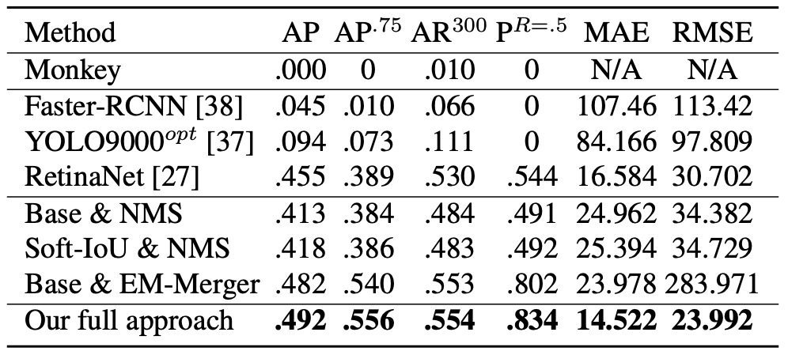
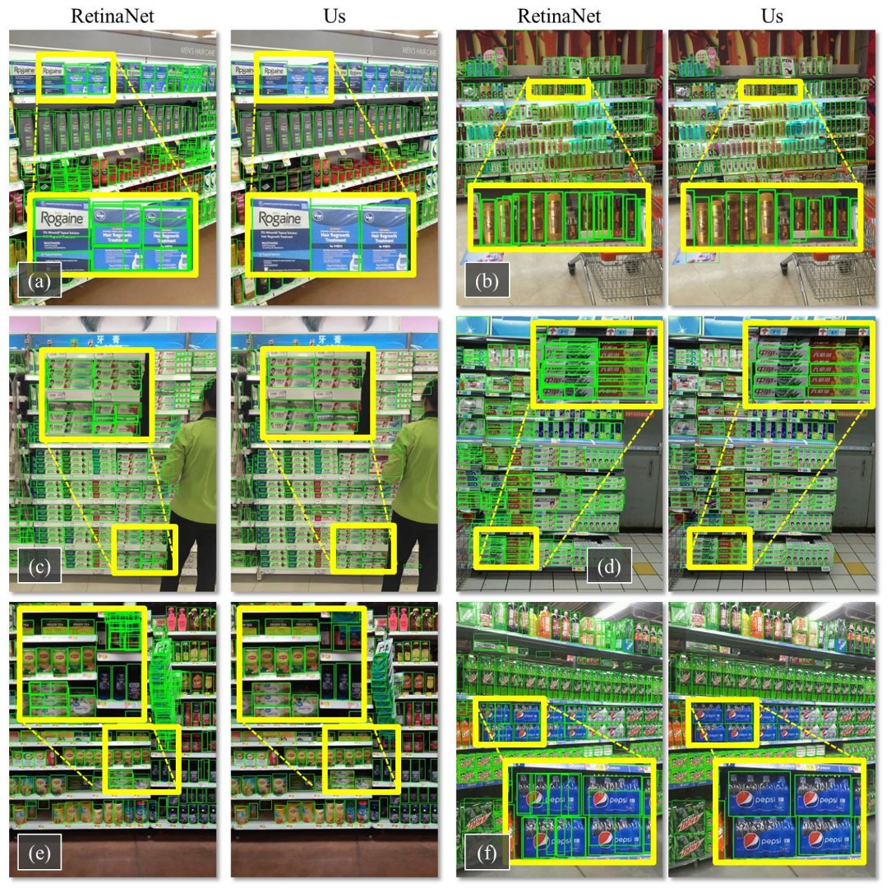
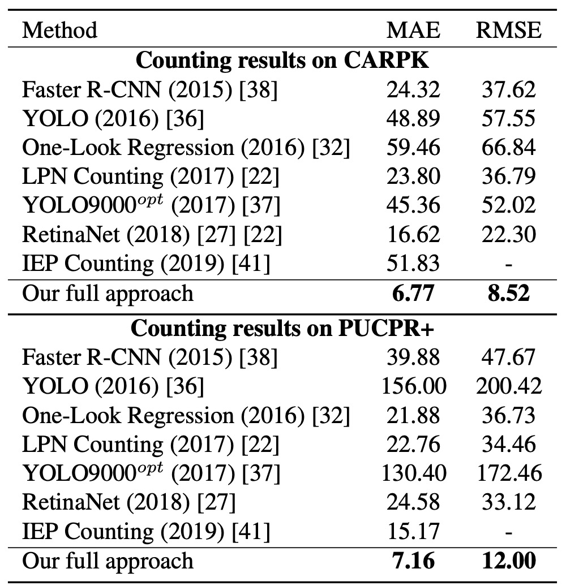

## Densely Packed Shelves

[**Precise Detection in Densely Packed Scenes**](https://arxiv.org/pdf/1904.00853)

---

This is also an earlier piece of literature.

However, the benchmark established in this paper remains one of the most commonly used retail product detection datasets to date.

## Problem Definition

Modern object detection techniques have demonstrated very high accuracy and speed in natural scenes. However, mainstream methods struggle when faced with densely arranged, visually similar, and closely adjacent objects.

Such "high-density scenes" are actually very common, for example: retail shelf displays, urban traffic surveillance footage, or indoor warehouse and stacking environments.

These scenes typically have several notable characteristics:

1. **A very large number of objects, arranged tightly and often occluding each other.**
2. **Highly similar appearances, making boundary distinction difficult.**

Traditional object detection methods, such as Faster R-CNN, YOLO, RetinaNet, etc., perform well in natural scenes but mostly rely on post-processing steps like **Non-Maximum Suppression (NMS)** to eliminate overlapping boxes. This hard suppression strategy shows clear bottlenecks in dense scenes. For example, a single real object might be split into multiple small boxes, or several adjacent objects might be mistakenly detected as one.

Although previous research has proposed various alternatives such as Mean-Shift, Agglomerative clustering, or learnable NMS layers (e.g., GossipNet), most methods are either computationally expensive or fail to truly replace traditional NMS, especially in high-density, visually similar object scenarios.

Furthermore, current mainstream datasets (e.g., COCO, VOC, Open Images) mainly contain natural scenes and lack good standards for these "dense, similar, overlapping" special scenes. Even datasets emphasizing crowd or vehicle congestion, like CARPK and PUCPR+, fall far short in item density and classification difficulty compared to real retail environments.

So, when facing these "crowded, look-alike, and numerous" scenes, how can deep learning models accurately distinguish each individual object while maintaining efficiency and stability?

Can we find a way to **let the model “know how precise its bounding boxes are”?**

The authors of this paper propose: Let’s start with Soft-IoU.

## Solution

The main baseline compared in this paper is RetinaNet, because it already performs quite well in dense scenes but still has room for improvement. The authors extend the standard detection architecture with two additions:

1. **Introduce a Soft-IoU prediction head**: allowing the model to estimate “how much this box overlaps with the ground truth”;
2. **Propose an EM-Merger inference unit**: converting multiple detection boxes into Gaussian distributions, then resolving overlaps via probabilistic clustering.

These two designs work together to produce more stable, non-overlapping detection results in dense scenes.

### Basic Architecture

The authors use ResNet-50 as the backbone and build a Feature Pyramid Network (FPN) with three upsampling layers to generate multi-scale feature maps.

Each RPN has three fully convolutional output heads:

- **Detection head**: regress bounding box center and size: $(x, y, h, w)$
- **Classification head**: predict objectness confidence $c \in \[0, 1]$
- **Soft-IoU head**: predict the overlap degree between the box and the true object $c_{\text{iou}}$

To avoid introducing excessive noise when training Soft-IoU, candidate boxes with classification scores below 0.1 are filtered out.

### Soft-IoU

In non-crowded scenes, objectness score + NMS is usually sufficient. But in dense scenes, multiple high-confidence boxes may correspond to different objects or be false detections caused by occlusion, so a more refined “overlap quality metric” is needed.

Soft-IoU is designed for this purpose. It predicts the IoU score between each box and its ground truth box. For each detection box $b_i$, the closest ground truth box $\hat{b}_i$ is found, then:

$$
\text{IoU}_i = \frac{\text{Intersection}(\hat{b}_i, b_i)}{\text{Union}(\hat{b}_i, b_i)}
$$

If there is no intersection, IoU is set to 0.

This value serves as ground truth to train the Soft-IoU prediction head with a binary cross-entropy loss:

$$
\mathcal{L}_{\text{sIoU}} = -\frac{1}{n} \sum_{i=1}^n \left[ \text{IoU}_i \log(c_{\text{iou},i}) + (1 - \text{IoU}_i) \log(1 - c_{\text{iou},i}) \right]
$$

The overall loss is the sum of three terms:

$$
\mathcal{L} = \mathcal{L}_{\text{cls}} + \mathcal{L}_{\text{reg}} + \mathcal{L}_{\text{sIoU}}
$$

where the first two are standard classification and regression losses.

A special point is that **objectness** predicts “whether there is an object,” while **Soft-IoU** predicts “how precise this box is.” Thus, a box partially covering an object may have a high objectness score but a lower Soft-IoU. These two signals complement each other.

### EM-Merger

<figure style={{"width": "70%"}}>

</figure>

Through Soft-IoU, each detection box has two confidence values:

- $c$: presence of an object
- $c_{\text{iou}}$: accuracy of the box

The problem is these boxes may overlap and cluster together.

How do we precisely find each object from these overlapping candidates?

The authors’ solution is to treat each detection box as a **2D Gaussian distribution**:

$$
f_i(p) = \mathcal{N}(p; \mu_i, \Sigma_i)
$$

where:

- Mean $\mu_i = (x_i, y_i)$: box center;
- Covariance $\Sigma_i = \text{diag}\left[\left(\frac{h_i}{4}\right)^2, \left(\frac{w_i}{4}\right)^2\right]$: reflecting box size.

These Gaussians form a mixture model (MoG):

$$
f(p) = \sum_{i=1}^N \alpha_i f_i(p), \quad \alpha_i = \frac{c_{\text{iou},i}}{\sum_k c_{\text{iou},k}}
$$

This expresses, at each pixel $p$, the likelihood of being an object center weighted by Soft-IoU.

Next, the MoG is reduced to a smaller number $K \ll N$ of high-confidence Gaussians $g_j$ representing the true object detections. The goal is to approximate the original distribution $f(p)$ with $g(p)$ by minimizing:

$$
d(f, g) = \sum_{i=1}^N \alpha_i \min_{j=1,...,K} \text{KL}(f_i \| g_j)
$$

where KL is the Kullback–Leibler divergence.

This minimization is solved via Expectation-Maximization (EM):

- **E-step**: assign each detection box to the nearest cluster (by KL divergence)

  $$
  \pi(i) = \arg\min_j \text{KL}(f_i \| g_j)
  $$

- **M-step**: re-estimate each cluster’s parameters

  $$
  \beta_j = \sum_{i \in \pi^{-1}(j)} \alpha_i
  $$

  $$
  \mu'_j = \frac{1}{\beta_j} \sum_{i \in \pi^{-1}(j)} \alpha_i \mu_i
  $$

  $$
  \Sigma'_j = \frac{1}{\beta_j} \sum_{i \in \pi^{-1}(j)} \alpha_i \left[\Sigma_i + (\mu_i - \mu'_j)(\mu_i - \mu'_j)^T\right]
  $$

This iteration continues until convergence (usually within 10 iterations), completing the dense object clustering.

Finally, for each cluster center, an ellipse with twice the standard deviation is drawn. The original detection boxes inside this ellipse are collected, and the median width and height are taken as the final bounding box.

This is the overall inference pipeline: **Soft-IoU as quality prediction → MoG expressing spatial probability → EM clustering producing clear box groups → avoiding missed true objects and overlapping detections.**

## SKU-110K Dataset and Benchmark Construction

The lack of breakthroughs in dense detection is partly due to the absence of high-quality datasets specifically designed for this task.

To address this, the authors created a brand-new dataset, **SKU-110K**, specifically targeting retail shelf environments. From design motivation to annotation quality, it was planned with the characteristics required for high-density scenes.

The dataset images were collected from thousands of physical stores across the United States, Europe, and East Asia, taken by dozens of photographers using personal smartphones to ensure the images reflect natural, unarranged real-world shelf displays.

- Each original image has a resolution of at least **5MP**, later compressed to **1MP JPEG**;
- No restrictions were placed on capture devices or angles, preserving natural lighting, blur, occlusions, and other real-world disturbances;
- Annotation was performed by **skilled full-time personnel** rather than crowdsourcing, further improving annotation accuracy and consistency;
- All images and annotations were manually reviewed to filter out obvious mislabels and incorrect boxes.

### Dataset Statistics and Splits

SKU-110K contains three subsets, ensuring that shelves from the same store do not appear in multiple subsets:

| Dataset    | Images |     Boxes | Ratio |
| ---------- | -----: | --------: | ----: |
| Training   |  8,233 | 1,210,431 |   70% |
| Validation |    588 |    90,968 |    5% |
| Testing    |  2,941 |   432,312 |   25% |

Compared to datasets like MS COCO and OpenImages, the number of objects per image increases by one to three orders of magnitude, posing a “true high-density scene challenge.”

### Evaluation Metrics and Criteria

The main evaluation criteria follow COCO standards, including:

- **AP@\[.50:.95]**: primary challenge metric;
- **AP\@.75**: strict localization accuracy;
- **AR\@300**: average recall limited to 300 predictions;
- **PR\@0.5 (IoU=0.75)**: precision at 50% recall sample point.

Additionally, to balance detection and counting performance, the authors introduced error metrics:

- **MAE (Mean Absolute Error)**

  $$
  \text{MAE} = \frac{1}{n} \sum_{i=1}^n |K_i' - t_i|
  $$

- **RMSE (Root Mean Squared Error)**

  $$
  \text{RMSE} = \sqrt{ \frac{1}{n} \sum_{i=1}^n (K_i' - t_i)^2 }
  $$

where $K_i'$ is the model’s predicted object count per image, and $t_i$ is the ground truth count.

This dataset design considers high density, multi-class variety, fine-grained differences, and real-world disturbances, making it one of the few benchmarks for rigorous evaluation in crowded scenes.

## Discussion

### Inference Speed Analysis

<figure style={{"width": "60%"}}>

</figure>

To verify model deployability, the authors measured average inference performance on identical hardware (Intel i7-5930K + GTX Titan X), using metrics:

- **FPS (Frames Per Second)**: number of images processed per second;
- **DPS (Detections Per Second)**: number of objects detected per second.

Results:

- **Base Detector (RetinaNet isomorphic)**: baseline inference speed;
- **Adding Soft-IoU Layer**: no speed impact since it is purely convolutional;
- **EM-Merger**: significant slowdown due to frequent data exchanges between CPU and GPU.

Although EM-Merger is currently slower, its accuracy gain justifies deployment optimization. The authors note that implementing it on GPU could greatly improve speed.

### Detection and Counting Experiments

Several comparisons and ablations were designed:

- **Monkey**: random point simulation as lower bound;
- **Base & NMS**: base architecture + traditional NMS;
- **Soft-IoU & NMS**: NMS using Soft-IoU scores;
- **Base & EM-Merger**: retaining original objectness, only EM clustering;
- **Full System (this paper’s method)**: Soft-IoU + EM-Merger.

Detection results:

<figure style={{"width": "70%"}}>

</figure>

- **Monkey** is almost ineffective, proving density alone is insufficient;
- **Faster R-CNN / YOLO9000opt** struggle with 50+ object scenes, performing poorly;
- **RetinaNet** performs relatively stably and slightly better than the authors’ Base.

The proposed method significantly outperforms all baselines across all metrics (AP\@.5–.95, AP\@.75, AR\@300).

For counting accuracy (see MAE and RMSE in the figure), although RetinaNet detection AP is close, its NMS causes **severe duplicate and missed detections**, resulting in much higher counting errors than the proposed method.

This indicates Soft-IoU provides a better candidate evaluation criterion, while EM-Merger effectively separates crowded areas. Together, they substantially improve counting stability.

Below is a comparison of detection results on the SKU-110K test set between this method and RetinaNet. The proposed method successfully removes overlaps, producing nearly one detection per object.

<figure style={{"width": "90%"}}>

</figure>

### Generalization Experiments on CARPK and PUCPR+

<figure style={{"width": "60%"}}>

</figure>

To verify generalization, the authors applied their method to two vehicle counting datasets: CARPK and PUCPR+.

Results show that although this method was not specifically designed for vehicle counting, it still achieves excellent performance on both datasets, outperforming other methods in MAE and RMSE.

## Conclusion

This study proposes the Soft-IoU layer and EM-Merger module as concrete engineering solutions to overlapping box issues in dense scenes. The former complements the blind spot of objectness which cannot measure boundary precision, while the latter replaces traditional NMS with probabilistic clustering to enhance localization clarity and deduplication.

On SKU-110K, the method outperforms contemporaneous mainstream architectures on both detection and counting metrics, confirming its effectiveness. However, from today’s perspective, main limitations include:

- **No support for multi-class detection**, making direct application to complex scenes difficult;
- **EM-Merger is challenging to deploy in real-time systems**, inference speed still needs optimization;
- **Lacks integration of semantic information**, still prone to confusion in fine-grained appearance variations.

Although published years ago, this method’s contribution to dense object detection remains valuable. Especially SKU-110K’s extreme crowded scenes remain common in many domains today (e.g., self-checkout, smart warehousing, traffic monitoring), serving as a good benchmark for evaluating model generalization.
