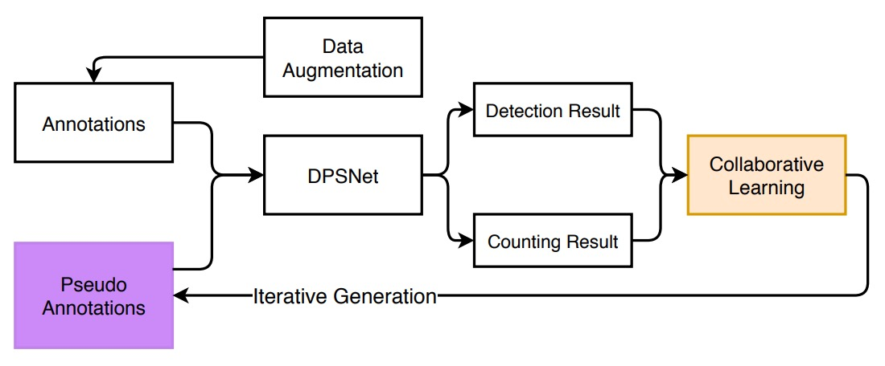
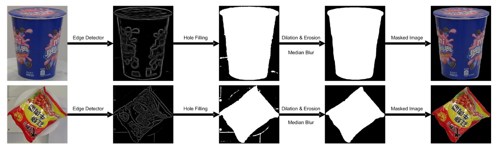

## Distillation on the Checkout Counter

[**Iterative Knowledge Distillation for Automatic Check-Out**](https://www.researchgate.net/profile/Libo-Zhang-6/publication/346079983_Iterative_Knowledge_Distillation_for_Automatic_Check-Out/links/5fba301da6fdcc6cc65a658b/Iterative-Knowledge-Distillation-for-Automatic-Check-Out.pdf)

---

The retail product domain includes several branches, one of which is automatic check-out.

Automatic Check-Out (ACO) is the full name of this task. Let’s examine related research.

## Problem Definition

With the gradual digital transformation of the retail industry, systematically recognizing the types and quantities of products purchased by customers has become key to improving customer experience and reducing labor costs. However, ACO differs significantly from typical object detection tasks in both problem structure and data characteristics.

Taking the largest RPC dataset as an example, the training data are captured on a turntable, each image containing a single product from various viewpoints, with clean backgrounds and stable lighting; whereas the test data simulate real checkout scenes, stacking multiple products on a white board shot from a fixed top-down view, with cluttered backgrounds, heavy occlusions, and uneven lighting.

- **This domain shift—from “single product display” to “stacked scenes”—is the most common challenge faced in ACO tasks.**

Besides domain shift, another difficulty in ACO is the asymmetry of annotation resources.

In practical applications, model training can only rely on manually annotated images, while the complexity of scenes during testing is far greater than in training. Even though datasets like RPC provide multi-level annotations, in real scenarios test images are often “unlabeled” or “weakly labeled,” limiting the extensibility of supervised learning in ACO.

Some studies attempt to use synthetic data, such as CycleGAN-based techniques, to reduce the domain gap; however, the effect is limited, and training data may still have quality issues.

Severe distribution misalignment, unequal supervision signals, and highly occluded, densely overlapping test scenes persist.

The authors of this paper aim to find an effective training process amidst these difficulties.

---

## Solution

<figure style={{"width": "80%"}}>

</figure>

The overall model training framework is shown above. Facing the huge gap between the source domain (single-product images) and the target domain (checkout scenes), the authors first propose a **data augmentation** strategy aimed at simulating real scenes and training adaptation to complexity.

### Data Augmentation

This augmentation process can be divided into three stages: **Background Removal → Pose Pruning → Synthetic Image Generation**.

1. **Background Removal**

   In the RPC dataset, training images are taken on a turntable. Although bounding boxes are provided, much background noise remains. Directly compositing these images would cause the model to learn the “wrong background.”

   Therefore, the authors use a coarse-to-fine image processing method for background removal:

   

   <figure style={{"width": "90%"}}>
   
   </figure>
   

   The specific steps are:

   - **Edge Detection**: Use an edge detector to find object contours, filtering out low-confidence areas.
   - **Morphological Processing**: Use dilation and erosion operations to remove noise and fill broken regions.
   - **Edge Smoothing**: Apply median filtering to further eliminate jagged edges.
   - **Visual Saliency Model**: Finally, use a saliency detection network (pretrained on MSRA-B and fine-tuned with coarse masks) to generate clean object masks.

   This transforms the original images containing backgrounds and turntables into clean product images, which can be used for subsequent synthetic training samples.

---

2. **Pose Pruning**

   Not all single-product poses are suitable for checkout scenes. For example, a water bottle photographed from a low upward angle looks unnatural in checkout images.

   

   <figure style={{"width": "90%"}}>
   
   </figure>
   

   To automatically select “reasonable poses,” the authors design a simple but practical metric:

   $$
   R_{k,v} = \frac{A_{k,v}}{\max_v A_{k,v}}
   $$

   - $A_{k,v}$: The mask area of category $k$ at viewpoint $v$.
   - If the mask area at a certain viewpoint is too small, it indicates that the pose deviates greatly from a natural placement angle → discard it.

   Only poses passing this threshold (greater than some value $\theta_m$) are kept for synthesis.

---

3. **Checkout Scene Synthesis**

   Once clean masks and reasonable poses are available, the next step is to synthesize simulated checkout scenes.

   The operation proceeds as follows:

   - **Randomly place multiple products**: Select several filtered products, randomly rotate them (0–360°) and scale them (0.4–0.7), then paste onto a clean background.
   - **Avoid excessive occlusion**: Each product is occluded at most 50%.
   - **Lighting and Shadow Handling**: Although the positions are reasonable, synthetic images lack real-world lighting variation. Therefore, CycleGAN style transfer is applied to make images closer to real test scenes.

   The figure below illustrates the entire transformation process:

   

   <figure style={{"width": "90%"}}>
   
   </figure>
   

### DPSNet

Through data augmentation, the model gains preliminary ability to simulate real checkout images, but this alone is insufficient to bridge the semantic gap with real test images. The authors propose a model architecture named **DPSNet (Dual Pyramid Scale Network)** that attempts to learn shared feature representations from **two different views**:

- **Object Detection**
- **Object Counting**

<figure style={{"width": "90%"}}>

</figure>

First, the Detection View aims to locate objects. It outputs a set of bounding boxes in the form $(c, x, y, w, h)$, where:

- $c$: object class
- $x, y$: object center coordinates
- $w, h$: object width and height

This is a typical object detection output providing spatial localization and classification.

The Counting View’s goal is to count how many objects are present, outputting a **density map** where each position $(i, j)$ corresponds to a $C$-dimensional vector representing the probability density for each class. This type of output is especially beneficial in heavily occluded or stacked product scenarios.

To allow both views to utilize features at different scales, DPSNet adopts a **Feature Pyramid Network (FPN)** backbone to extract multi-level feature maps $P_2$ through $P_6$.

Feature fusion is conducted as follows:

- **Upsample lower-level features and fuse with higher-level features** (to preserve spatial details for detection)
- **Downsample higher-level features and fuse with lower-level features** (to inject semantic strength for counting)

The fused feature maps then pass through 1×1 and 3×3 convolution layers, feeding into detection and counting heads respectively, outputting bounding boxes and density maps.

---

### Iterative Knowledge Distillation

Although the model already has prediction capability, its stable performance on the target domain cannot be guaranteed.

To incorporate the test dataset into the training process, the authors designed a **progressive self-distillation training strategy**, as illustrated below:

<figure style={{"width": "90%"}}>

</figure>

The overall workflow is as follows:

- **Consistency Check**

  For each unlabeled test image, DPSNet performs:

  - Detection view D: predicts object locations and classes
  - Counting view C: generates a density map estimating the total number of items per category

  Then, it checks whether the two views are “consistent”:

  - If, for a category c, the high-confidence detected object count matches the density map estimate, it is considered “consistent”
  - These “consistent samples” are added to the training data with generated pseudo labels

---

- **Iterative Distillation**

  In each training iteration, DPSNet will:

  1. Use the current model to predict on the test set
  2. Perform consistency check → select reliable samples → add to training
  3. Retrain with this new batch of pseudo labels
  4. Repeat this process multiple times

---

- **Instance-Level Refinement**

  Finally, after several rounds of distillation, the authors add a refinement step:

  - For images that were entirely discarded, if some objects have high confidence, keep those boxes and discard low-confidence ones
  - Use these “semi-reliable” images for fine-tuning

  The figure below shows three common types of discarded cases:

  

  <figure style={{"width": "90%"}}>
  
  </figure>
  

  Each row shows: original checkout image, image after removing low-confidence objects. Categories A/B/C represent common invalid predictions: A) visually similar duplicate objects, B) occluded objects, C) non-product items.

Through the cycle of “consistency → distillation → refinement,” knowledge gradually permeates from the source domain to the target domain, strengthening progressively at both image and instance levels, ultimately enhancing model stability on real test scenes.

### Loss Function

To ensure DPSNet learns domain-specific information stably during iterative training, the authors designed loss functions for the two views and combined them as the overall training objective.

The loss overview is:

$$
\mathcal{L} = \sum_{i=1}^{N} \sum_{\ell} \left| \hat{\Theta}(\ell; x_i) - \Theta(\ell; x_i) \right|^2 +
$$

$$
\sum_{d} \left( \mathcal{L}_{cls}(\hat{p}_d, p_d; x_i) + \mathbf{1}(p_d > 0) \cdot \mathcal{L}_{reg}(\hat{t}_d, t_d; x_i) \right)
$$

The counting view aims to learn a density map $\hat{\Theta}$ representing the likelihood of each product category’s presence at every location in the image.

- **Loss type:** L2 loss (squared Euclidean distance)
- **Intuition:** The closer the predicted density map is to the true density distribution, the better the model estimates the count per category.

Ground-truth density maps are constructed by:

- Placing Gaussian kernels at each object center
- Summing the Gaussian maps per category to form category-specific density maps
- Combining all category maps into the final density map (typically 1/8 the input size, e.g., 100×100)

The detection view’s goal is to predict class and bounding box locations for each object:

- **Classification loss** (Cross-Entropy): error between predicted class $\hat{p}_d$ and ground-truth class $p_d$
- **Regression loss** (Smooth L1): bounding box coordinate error, computed only for true objects ($p_d > 0$)

The indicator function $\mathbf{1}(p_d > 0)$ means:

- **Foreground objects:** compute both classification and regression loss
- **Background:** only classification loss to avoid false positives

The regression targets $t_d$, $\hat{t}_d$ represent parameterized bounding box coordinates (e.g., center and size). The Smooth L1 loss provides stable gradients for small errors, improving training stability.

## Discussion

### RPC Dataset Benchmark

<figure style={{"width": "90%"}}>

</figure>

The experimental results of DPSNet are detailed above, compared with two baselines: Reference [1] is the original checkout detection system paper; Reference [8] is the subsequent improved DPNet.

:::tip
This paper does not specify whether they used ResNet-50 or ResNet-101.

However, another paper on DPNet mentions using ResNet-101 for comparisons, so here we assume they also used ResNet-101.

Reference: [**[19.04] Data Priming Network for Automatic Check-Out**](https://arxiv.org/abs/1904.04978)
:::

Each method underwent training with two data versions: one using only CycleGAN-processed Render images, and another adding Copy-Paste synthetic images to form the Syn+Render training set. DPSNet also added an Instance+Render setup to evaluate the impact of instance-level pseudo-labels.

We start with the core metric **Checkout Accuracy (cAcc)**, a highly practical measure:

- **A prediction is considered “completely successful” only if all product categories and quantities in the entire checkout image are exactly correct. It is highly sensitive to errors and effectively reveals the model’s reliability in real scenarios.**

The original Render-only setup (using CycleGAN images) achieves just 45.60% cAcc. Despite style transfer, the semantic gap between synthetic and real scenes remains large.

Adding Copy-and-Paste synthetic images raises cAcc to 56.68%, reflecting improved data quantity and diversity, aiding generalization. However, such synthetic images may introduce noise like incorrect occlusions, unnatural poses, or inconsistent backgrounds, possibly leading to “more diverse but messier” data.

DPNet’s contribution was pioneering dual-view (detection and counting) learning, and selecting reliable pseudo-labels from test data for training. Even trained only on Render, DPNet pushes cAcc up to 77.91%, breaking the baseline ceiling.

DPNet trained on Syn+Render further improves to 80.51%. This is the first proof that test data themselves can serve as a knowledge source, provided a mechanism exists to select them.

DPSNet advances DPNet with two key innovations:

1. **Architecture:** Introduces pyramid-scale feature fusion, enabling detection and counting views to operate synchronously over multi-level features, beyond coarse stacking.
2. **Training:** Adopts iterative knowledge distillation, progressively selecting reliable test images and further filtering and refining at the instance level.

This propels “DPSNet (Render)” cAcc to **86.54%**, slightly higher than its Syn+Render counterpart. This supports the earlier point that Copy-Paste synthetic data do not always contribute positively, and may even cause slight negative transfer.

Beyond cAcc, DPSNet also excels on other metrics:

- **ACD (Average Counting Difference):** Measures average counting errors per image; DPSNet achieves significantly lower ACD, indicating stable counting.
- **mCIoU (mean Class Intersection over Union):** Reflects breadth and accuracy of class predictions; DPSNet improves about 5% over DPNet.
- **mmAP (mean mean Average Precision, IoU=0.50–0.95):** Even under strict detection standards, DPSNet outperforms all baselines, indicating accurate and reliable predictions.

These complementary metrics portray DPSNet’s improved coordination and precision between detection and counting tasks.

An interesting observation is that DPSNet trained only with Render slightly outperforms Syn+Render (86.54% > 85.98%), suggesting that its iterative pseudo-labeling effectively captures real test domain signals, making synthetic data benefits marginal.

This invites reconsideration of:

> “Where do truly valuable training signals come from—large-scale simulation or understanding and filtering of real distributions?”

DPSNet clearly supports the latter.

Below are inference examples on the RPC dataset, ordered from easy to hard samples top to bottom.

<figure style={{"width": "90%"}}>

</figure>

### Ablation Study

1. **Density Map Dimension Design**

<figure style={{"width": "70%"}}>

</figure>

In the counting view, the third dimension of the density map, $C$, represents the number of categories simultaneously estimated.

The authors compared the following three settings:

| Density Category (C) | Description                       | cAcc   |
| -------------------- | --------------------------------- | ------ |
| C = 1                | All products treated as one class | 86.54% |
| C = 17               | Using 17 super-categories         | 80.05% |
| C = 200              | Full fine-grained classes         | 77.22% |

Results show that the finer the $C$ setting, the harder the model converges.

This is because supervision signals in the density map become sparser as the number of categories increases, leading to unstable training. Conversely, $C=1$ cannot distinguish categories but provides more stable counting and consistency checking, so it was chosen as the final setting.

- **Impact of Feature Representation**

<figure style={{"width": "90%"}}>

</figure>

From the table, using only the pyramid-scale architecture (without co-learning) performs worse than DPNet (70.08% < 70.80%). This indicates that architectural advances without corresponding training strategies may not translate into performance gains.

With co-learning, DPSNet’s performance surpasses the baseline, increasing cAcc to 79.35%. This shows the potential of the pyramid-scale design can only be unlocked through interactive dual-view learning.

If detection (object localization) and counting (density estimation) are trained separately, the model may fall into local optima. For example, an object may be accurately localized but have density mispredicted, or vice versa.

Sharing the backbone and training both tasks collaboratively forces mutual correction, producing more robust intermediate feature representations. This improves cAcc from 70.80% to 79.35%, confirming the practical benefits of co-learning.

The most significant improvement comes from iterative learning: boosting cAcc from 79.35% to 86.54%.

The core idea is that the model no longer depends on external labels but extracts reliable signals from its own consistent predictions and iteratively trains itself with these.

## Conclusion

DPSNet addresses two core challenges in ACO—cross-domain distribution mismatch and limited labeled data—through pyramid-scale feature representation, multi-view co-learning, and optional knowledge distillation with iterative self-training.

This study reminds us that in label-scarce real-world scenarios, test data themselves are a latent source of information. Stable pseudo-labeling strategies can progressively convert them into learning resources. Moreover, compared to style transfer, semantic and structural consistency learning is more critical for cross-domain adaptation; scenarios difficult to cover with a single task can be complemented through multi-task designs.

From an engineering perspective, although counting cannot finely distinguish semantics, it provides additional supervision during training that effectively improves overall performance and is worth practical consideration.
