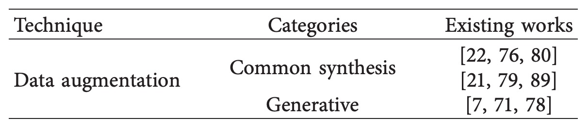
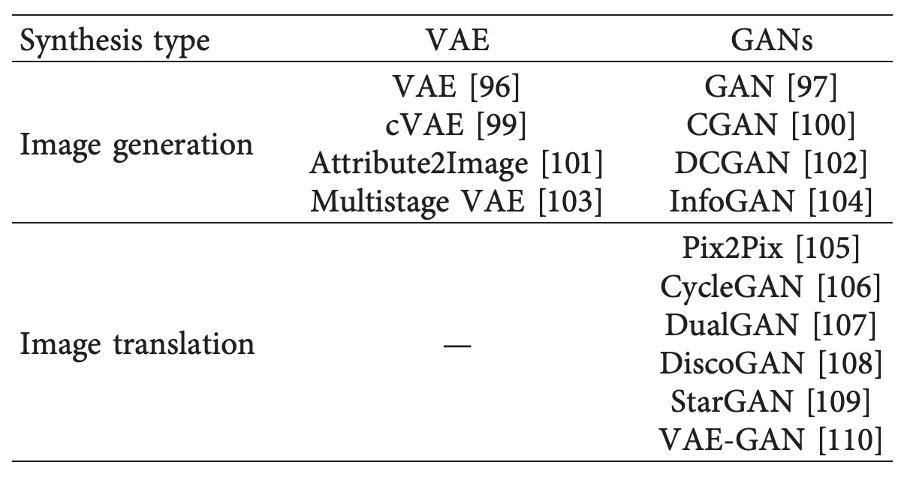

## Retail Product Recognition

[**Deep Learning for Retail Product Recognition: Challenges and Techniques**](https://onlinelibrary.wiley.com/doi/pdf/10.1155/2020/8875910)

---

Recently, I revisited and organized references in the field of Automatic Check-Out (ACO).

We begin with several survey papers to quickly grasp the overall landscape of this domain.

## Problem Definition

The main goal of Retail Product Recognition technology is to assist retailers in effective product management and to enhance the customer shopping experience. Traditionally, the most widely used method has been barcode recognition, which automatically captures product information by scanning the barcode printed on product packaging.

However, since barcode placement is not fixed, in practice it often requires manual rotation of the product to align with the scanner, causing delays in the process.

According to a survey by Digimarc, approximately 45% of customers report that barcode scanning is inconvenient.

:::tip
Digimarc Corporation is a publicly traded company headquartered in Beaverton, Oregon, USA, specializing in the development of digital watermarking and serialized QR code recognition technologies. These technologies are used to enhance product authentication, supply chain tracking, and recycling sorting applications.
:::

In this context, RFID technology can be considered a possible alternative. It transmits data via radio waves and does not rely on line-of-sight scanning to complete recognition tasks, offering theoretical efficiency advantages. Each product is tagged individually, allowing remote reading without the need for precise alignment.

The drawback is cost.

In the retail industry, where margins are tight, affixing an RFID tag to every item accumulates into a significant expense over time. Additionally, when multiple items are identified simultaneously, RFID signals can suffer from occlusion or interference, leading to errors, which is unfavorable for cost control in high-volume product sales.

With the rapid digitalization of the retail sector, companies are increasingly seeking to improve operational efficiency and customer experience through artificial intelligence technologies.

According to a Juniper Research report, global retail spending on AI-related services is expected to grow from \$3.6 billion in 2019 to \$12 billion by 2023, demonstrating strong investment in such technologies. On the other hand, as supermarkets display an ever-growing number of products, labor management costs rise significantly, further driving retailers to pursue higher automation in recognition solutions.

The widespread adoption of digital imaging devices has facilitated the generation of large-scale product image datasets, forming a crucial foundation for developing computer vision recognition systems.

Product recognition tasks can be viewed as a combined problem of image classification and object detection, with the core objective of automatically identifying product categories and locations through images. This technology can be applied in multiple scenarios:

1. **Shelf Management**: Automatically detecting out-of-stock products and alerting staff to restock. Research indicates that fully implementing shelf plans can increase sales by 7.8% and gross profit by 8.1%.
2. **Self-Checkout Systems**: Shortening checkout time via product image recognition, enhancing customer satisfaction. SCO system deployment grew steadily from 2014 to 2019 and is widely adopted to reduce labor costs.
3. **Assistance for the Visually Impaired**: Helping visually impaired customers recognize product information (such as price, brand, and expiration date), lowering shopping barriers and improving autonomy and social participation.

From a technical perspective, compared to traditional handcrafted feature methods, deep learning can automatically learn features directly from images, offering higher recognition capability and generalization. Its multilayer structure can extract more detailed semantic information, suitable for complex and multi-category product scenarios.

Currently, research teams have applied deep learning to the retail domain and achieved concrete results across multiple tasks. Industry applications such as Amazon Go and Walmart Intelligent Retail Lab have already emerged.

Despite the increasing volume of related research in recent years, systematic surveys focused on "deep learning for product recognition tasks" remain limited. Previously, only two surveys on retail shelf product detection have been published; both excluded checkout scenarios and did not focus on deep learning approaches.

The authors of this paper review over one hundred publications from leading conferences and journals like CVPR, ICCV, and AAAI, attempting to integrate existing techniques, challenges, and resources. They hope this paper can serve as an introductory guide for researchers and engineers in the field, helping them quickly grasp core problems and existing achievements.

:::tip
We especially appreciate authors who are so dedicated and helpful—our sincere gratitude.
:::

## Traditional Methods

The core of product image recognition lies in extracting representative features from packaging images to accomplish classification and identification tasks.

Early computer vision research commonly adopted a modular processing pipeline, decomposing the recognition system into several key steps:

1. **Image Capture**: Collecting product images via cameras or mobile devices.
2. **Preprocessing**: Removing noise and simplifying information in the input images, including image segmentation, geometric transformations, and contrast enhancement.
3. **Feature Extraction**: Analyzing image patches to identify stable features invariant to position or scale changes.
4. **Feature Classification**: Mapping extracted features into vector space and applying specific classification algorithms for prediction.
5. **Recognition Output**: Producing product category results from a pretrained classifier.

The crucial step in this framework is **feature extraction**, as its accuracy directly affects the final recognition performance. Before deep learning became widespread, researchers heavily relied on handcrafted features to capture visual characteristics of images.

Two classic methods are:

- **SIFT (Scale-Invariant Feature Transform)**: Proposed by David Lowe in 1999, it extracts local features at multiple scales using an image pyramid, offering invariance to rotation, translation, and scale, and has been widely used in object matching and classification.
- **SURF (Speeded Up Robust Features)**: Developed in 2006 based on SIFT, it optimizes computational efficiency and suits applications with real-time requirements.

However, these handcrafted features depend on developers’ expertise and assumptions, limiting their ability to capture all potentially important information in images. Moreover, when product categories are large, packaging designs vary significantly, or shooting conditions change (e.g., angle, lighting), handcrafted features struggle to maintain recognition stability and scalability. This prompted the research community to gradually shift toward data-driven deep learning methods, which learn the most discriminative feature representations directly from images through end-to-end training.

## Deep Learning Methods

Deep learning, a subfield of machine learning, aims to automatically learn multi-level representations from data to capture high-level semantic structures. This approach avoids the limitations of manual feature design and is particularly suitable for high-dimensional data such as images, speech, and text.

In image recognition tasks, deep learning advantages have been amplified by improved GPU computing power, gradually replacing traditional methods to become mainstream solutions. In retail product recognition, deep learning mainly covers two tasks:

1. **Image Classification**: Assigning input images to predefined categories. With sufficient training data, models achieve accuracy surpassing human-level performance.
2. **Object Detection**: Beyond classification, models also predict object locations in images (represented by bounding boxes). This task demands higher model design and computational efficiency and is an indispensable module in product recognition.

The breakthrough in deep learning for images primarily stems from convolutional neural networks (CNNs). Inspired by physiological studies of the cat visual cortex, LeCun et al. first proposed using CNNs for image classification in 1988, successfully applying them to handwritten digit and check recognition.

After 2010, the ImageNet challenge accelerated rapid evolution of CNN architectures, spawning various mainstream models:

- **AlexNet (2012)**: Introduced ReLU and Dropout, breaking traditional image recognition bottlenecks and igniting the deep learning boom.
- **GoogLeNet (2014)**: Employed Inception modules to reduce parameter count while increasing model depth.
- **VGG (2014)**: Emphasized uniform 3x3 convolution kernels for easy architecture composition and reuse.
- **ResNet (2015)**: Proposed residual connections to solve the degradation problem in very deep networks, enabling training of models over 100 layers.

Recent research has also extended CNN applications to 3D structure recognition, developing Multiview CNNs that input multi-angle images for more precise classification, suitable for advanced tasks like 3D product recognition.

In summary, deep learning’s two main driving forces are **large-scale data and deeper network structures**. Their synergy continuously advances model capabilities in visual recognition tasks, laying the technical foundation for product recognition systems.

Returning to object detection tasks:

Within deep learning, the core goal of object detection is:

> **Automatically identifying object categories and their locations (bounding boxes) within images.**

Before deep learning, object detection largely relied on sliding window strategies that scanned fixed-size windows over the entire image, classifying each patch to determine target presence. This method was extremely time-consuming and inefficient for large images or scenes with multiple objects.

With deep learning, object detection algorithms are broadly categorized into:

- **Two-stage methods (region proposal first)**
  Represented by the R-CNN series, the process involves two stages: first, generating candidate object regions via algorithms like Selective Search; second, classifying and refining these regions with CNNs.

  - R-CNN: Processes each candidate region individually with CNN, improving accuracy but slow in speed.
  - Fast R-CNN: Applies CNN to the entire image once, then uses ROI pooling on feature maps, greatly reducing redundant computation.
  - Faster R-CNN: Introduces a Region Proposal Network (RPN) to learn proposals automatically within the network, sharing features with the classifier, becoming the current mainstream for high accuracy.

- **One-stage methods (end-to-end regression)**
  Directly regress object locations and categories from the image, omitting the proposal stage, thus faster but initially less accurate.

  - Representative models include YOLO (You Only Look Once) and SSD (Single Shot MultiBox Detector), which show clear advantages in real-time applications such as instant checkout and visual navigation.

Both methods have pros and cons: Two-stage models generally offer higher stability in complex backgrounds, while One-stage models suit deployment environments with low latency requirements. Practical applications choose based on the trade-off between accuracy and timeliness.

<figure style={{"width": "90%"}}>

</figure>

Technically, product recognition tasks can be regarded as specialized applications of object detection, with a typical approach as illustrated above:

1. **Product Detection**: Use an object detection model to generate multiple bounding boxes indicating product regions.
2. **Region Cropping**: Crop each predicted region into a single product image.
3. **Image Classification**: Input cropped images into classification models to infer product categories.

In recent years, several companies have deployed deep learning technologies in retail environments:

- **Amazon Go (2018)**: Utilizes dozens of cameras to capture customer trajectories and combines CNN models to recognize shopping behavior and products. To compensate for pure image recognition limitations, the system integrates Bluetooth and weight sensors to improve overall accuracy.
- **Walmart IRL (2019)**: Focuses on real-time shelf monitoring, using cameras and deep learning models to automatically detect out-of-stock situations and alert restocking personnel.
- **Chinese Companies (DeepBlue Technology, Malong Technologies)**: Offer integrated automatic vending machines, smart weighing systems, and product recognition modules that combine product image analysis, real-time checkout, and classification recommendation. Malong’s AI Fresh system specially targets fresh produce, addressing unstructured visual features such as variations in fruit and vegetable appearance.

Currently, although initial commercial deployments exist, deep learning-based product recognition technologies still face many challenges:

- Trade-offs between accuracy and inference speed;
- High visual similarity among different products leading to misclassification;
- Imbalanced multi-class data and prominent long-tail distributions;
- Deployment costs and multi-device stability require evaluation;
- Handling non-ideal real-world factors such as occlusion, reflections, and hand interference remains difficult.

Based on these observations, deep learning holds the most potential for product recognition tasks, but its practical application still needs further empirical research and large-scale field deployment to improve and optimize.

## Challenges in Product Recognition

Although product recognition can be viewed as a variant of object detection tasks, the practical requirements and environments differ significantly from general object detection, making direct transfer of existing models difficult.

In this section, the authors summarize four major challenges faced by retail product recognition, as outlined below:

### Challenge 1: Large Number of Categories

Compared to typical object detection tasks, the most distinctive feature of product recognition is that the **number of categories far exceeds standard datasets**.

A medium-sized supermarket often stocks thousands of Stock Keeping Units (SKUs), far beyond common datasets. In practice, a single image frequently contains a dozen or more product categories, with subtle differences among categories (such as different specifications within the same brand), resulting in recognition difficulties much greater than usual detection tasks.

Moreover, mainstream models like Faster R-CNN, YOLO, and SSD assume a fixed number of classes in their classification heads. When the number of categories expands to thousands, both accuracy and recall drop significantly.

The paper’s experiments, as shown below, illustrate this:

<figure style={{"width": "60%"}}>

</figure>

Regardless of model architecture, **accuracy noticeably decreases when classes increase from 20 to 80**.

Thus, relying solely on traditional object detection architectures faces learning bottlenecks and inference instability due to the high dimensionality of classification in product recognition. This challenge extends beyond architecture design, involving data distribution, inter-class feature representation, and classification strategy design.

### Challenge 2: Domain Gap in Data Distribution

Deep learning models depend heavily on large annotated datasets for training. However, product recognition faces three main data acquisition constraints:

1. **High annotation cost:**
   Bounding box or segmentation annotation for product recognition usually requires manual labor. Creating tens of thousands of labeled training images demands significant time and human resources. Although tools like LabelImg and LabelMe aid annotation, overall production cost remains a barrier to large-scale expansion.

   

2. **Domain gap between training data and real scenarios:**
   Existing product datasets are often captured under ideal conditions—fixed angles and simple backgrounds (e.g., rotating platforms). Test or deployment environments typically feature complex backgrounds, variable lighting, and frequent occlusions, causing a gap between training and real-world performance.

  

  <figure style={{"width": "80%"}}>
  
  </figure>
  

3. **Imbalanced data and long-tail distribution:**
   Product datasets commonly exhibit “few samples per many classes.” Unlike VOC or COCO which have relatively balanced category distributions, retail datasets contain fewer images but many classes, making learning difficult.

    

    <figure style={{"width": "80%"}}>
    
    </figure>
    

In summary, data insufficiency limits model performance and hampers generalization and rapid transfer learning for new products. Without systematic solutions for data scarcity and domain shifts, even advanced architectures may fail to meet deployment requirements.

### Challenge 3: High Intraclass Variation

A major difficulty in product recognition lies in accurately distinguishing products with **high intraclass heterogeneity**, also known as **sub-category recognition** or **fine-grained classification**.

This challenge has the following characteristics:

1. **Extremely subtle visual differences:** Cookies of different flavors or packaging sizes within the same brand may differ only in color saturation or text placement, sometimes indistinguishable by the human eye.
2. **Diverse appearance variations:** The same product may look quite different from varying angles or scales; models must be invariant to scale and viewpoint.
3. **Significant environmental interference:** Lighting, background, and occlusion significantly impact recognition, posing challenges to model decision boundaries.

Fine-grained classification is well-studied in other domains (e.g., bird species or car model recognition), often relying on extra annotations like keypoints or part alignment to help models learn subtle differences. However, in retail scenarios, challenges are even more pronounced:

- Visual similarity between products extends beyond shape to packaging structure, colors, and fonts.
- Lack of dedicated fine-grained product datasets; most existing datasets only label overall categories without clear sub-category definitions.
- Without additional labeled data or expert knowledge, models struggle to learn effective discrimination, resulting in increased misclassification or confusion rates.

For example, (a) below shows two visually similar products with different flavors:

<figure style={{"width": "80%"}}>

</figure>

Differences lie only in slight adjustments of packaging text color and placement; (b) shows the same brand’s different capacity packages, where size difference is hard to judge from a single image. These examples highlight the need for fine-grained representation to address “extremely similar but not identical” recognition requirements in practical retail environments.

### Challenge 4: Insufficient System Flexibility

Retail products are frequently updated, with new items introduced and packaging regularly redesigned. For product image recognition systems, retraining the entire model whenever a new product appears is time-consuming and impractical.

An ideal system should have:

- **Rapid scalability:** Ability to incorporate new classes with very few samples (few-shot or zero-shot learning).
- **Continual learning capability:** Learning new products without forgetting old classes (continual or lifelong learning).

However, CNN architectures commonly suffer from the “catastrophic forgetting” problem: fine-tuning on new categories causes significant degradation in recognition performance on previously learned classes.

For example:

<figure style={{"width": "80%"}}>

</figure>

The model originally recognizes “orange” but loses this ability after training only on the “banana” category.

Currently, mainstream approaches still rely on retraining the entire model with complete data, which incurs high deployment costs and efficiency bottlenecks. Future recognition architectures supporting the following features would greatly benefit industrial applications:

- Models with long-term memory capacity;
- Support for incremental class training;
- Integration of sample replay or regularization techniques to mitigate forgetting.

The **flexibility** of product recognition systems will determine their usability and lifecycle in rapidly changing markets.

## Technical Overview

This chapter summarizes existing techniques proposed in the literature to address the four major challenges previously outlined. The focus is on recognition architectures centered on deep learning, supplemented by auxiliary methods that can be integrated with them.

<figure style={{"width": "60%"}}>

</figure>

Through this categorized summary, readers can more quickly grasp the solution landscape and research trends in product recognition tasks.

:::info
In the following notes, references will be denoted by 【xx】corresponding to citation numbers in the original papers; readers are encouraged to look up the original sources using these identifiers for detailed information.
:::

### CNN-Based Approaches

One of the core challenges in retail product classification is handling the massive number of categories. Within this context, CNN models are widely used for image feature extraction, generating recognizable embedding vectors as feature descriptors for classification or similarity retrieval.

Early handcrafted features like SIFT and SURF, although invariant to rotation and scale, lack semantic-level representations and cannot support large-scale category recognition demands, thus gradually being replaced by CNNs.

Below are several classic works; interested readers can refer to the original papers by their citation numbers.

<figure style={{"width": "80%"}}>

</figure>

While most methods support hundreds to a thousand product categories, medium-to-large supermarkets typically exceed this scale, leaving room for improvement. Two recent representative works further tackle classification tasks with over a thousand categories:

1. **Tonioni et al.【20】**: Used VGG backbone with MAC (Maximum Activations of Convolutions) features to build whole-image embeddings, handling 3,288 product categories with Precision = 57.07% and mAP = 36.02%.
2. **Karlinsky et al.【21】**: Employed fine-tuned VGG-F (fixing layers 2–15), recognizing 3,235 product categories and achieving mAP = 52.16%.

These studies demonstrate that CNNs have potential to scale to thousands of categories, but practical recognition performance—especially in recall and fine-grained discrimination—still has significant room for improvement.

Additionally, YOLO9000 proposes a detection framework recognizing up to 9,000 classes using an improved Darknet implementation. Its key innovations include multi-dataset joint training and semantic embeddings (e.g., WordTree). However, its training requires millions of labeled images, making it difficult to apply in retail scenarios where product data is costly and annotation is challenging.

In summary, CNNs provide a viable foundation for large-scale product classification, but enhancing their scalability, data efficiency, and recognition accuracy under "category explosion" remains a key technical challenge.

### Data Augmentation

Deep learning methods rely heavily on training data, but acquiring large annotated datasets in retail product recognition is time-consuming and expensive. Thus, data augmentation becomes a crucial strategy to mitigate data scarcity.

Common data augmentation techniques fall into two main categories, as summarized below:

<figure style={{"width": "70%"}}>

</figure>

- **Traditional image transformation methods (common synthesis methods)**
- **Generative models**

Traditional synthesis methods mainly expand original images through geometric and photometric transformations, as illustrated below:

<figure style={{"width": "70%"}}>

</figure>

Popular augmentation tools like [**Albumentations**](https://github.com/albumentations-team/albumentations) provide comprehensive APIs supporting translation, rotation, scaling, flipping, random occlusion, noise addition, color enhancement, brightness, and contrast adjustment. These are widely applied in product detection tasks.

Although easy to implement, traditional augmentation struggles to simulate complex real-world conditions such as lighting changes, background clutter, and natural occlusions. Therefore, researchers have turned to generative models to improve data realism.

Generative models offer more realistic image synthesis and mainly include two architectures:

- **VAE (Variational Autoencoder)**
  Utilizes an encoder-decoder framework to generate samples, suitable for feature learning and attribute control, though currently limited in image-to-image translation tasks.
- **GAN (Generative Adversarial Networks)**
  Employs adversarial training between generator and discriminator to produce visually realistic samples, supporting style transfer and image synthesis.

Relevant literature is summarized below:

<figure style={{"width": "70%"}}>

</figure>

VAEs consist of encoder and decoder components that learn latent space distributions to generate samples resembling original data. Although no specific application of VAEs in product recognition exists yet, research in other domains shows promise.

For example, in face and bird image generation tasks, VAEs can control attributes to produce samples achieving cosine similarity of 0.9057 and reasonable mean squared errors on Wild and CUB datasets【101】. Other studies use conditional VAEs for zero-shot learning, attaining strong performance on AwA, CUB, SUN, and ImageNet datasets【112】.

These successes suggest VAEs have potential to enhance data diversity and attribute control, and may be extended to product recognition tasks in the future.

In contrast, GANs have made more substantial breakthroughs in image generation recently.

Since their introduction in 2014, adversarial training between generator and discriminator enables the synthesis of large amounts of realistic images. Researchers have applied GANs to various data augmentation tasks, including nighttime vehicle detection【115】, semi-supervised semantic hashing【116】, and license plate image generation【122】, all significantly improving model performance.

Applications such as PixelCNN combined with one-hot class encoding for generating category-specific images【119】, or CycleGAN for style transfer and simulating real-world scenario variations, demonstrate strong generalization and transfer capabilities.

Though few GAN applications exist specifically for product recognition, several studies have preliminarily validated their feasibility.

For example, Wei et al.【7】combine background synthesis with CycleGAN style transfer to generate product images suited for checkout counter settings (as shown below), training an FPN detector with 96.57% mAP.

Subsequently, Li et al.【78】propose DPNet to select reliable images from synthetic data, boosting checkout accuracy to 80.51%. Another study【71】attempts to combine GANs with adversarial encoder training to generate visual samples usable for product recognition.

A limitation is that current methods mostly generate flat backgrounds, not yet simulating complex real checkout or shelf scenarios involving background textures, product overlap, and occlusions. Hence, generating more realistic product images remains a promising direction.

Future developments may involve enhancing semantic control, integrating 3D modeling and physical rendering engines, or combining domain adaptation and cross-domain augmentation strategies to further reduce the gap between synthetic data and real environments.

### Fine-Grained Classification

Fine-grained classification is one of the representative challenging tasks in computer vision, aiming to distinguish subcategories under the same higher-level category, such as different flower species, car models, or animal breeds.

When applied to product recognition, the challenge intensifies due to high visual similarity among products combined with multiple interference factors like motion blur, lighting variations, deformation, viewpoint, and placement.

Based on existing literature, methods for fine-grained product recognition can be broadly categorized into two groups:

1. **Fine Feature Representation**
2. **Context Awareness**

The core of fine-grained classification is to extract discriminative subtle features from visually similar objects. According to the strength of supervision signals, approaches are divided into “strongly supervised” and “weakly supervised” methods:

- **Strongly Supervised Methods**

  These methods require additional annotations such as bounding boxes and part information, enabling precise alignment of local regions and allowing the model to focus on key differences.

  

  | Study                      | Method                                                                                          | Highlight                                  | Application                                           |
  | -------------------------- | ----------------------------------------------------------------------------------------------- | ------------------------------------------ | ----------------------------------------------------- |
  | Part-based R-CNN【127】    | R-CNN based, extracts global and local features                                                 | Achieved SOTA on bird dataset              | Inspired local feature fusion in product recognition  |
  | Pose-normalized CNN【137】 | Uses DPM for localization and part extraction, followed by SVM classification                   | 75.7% accuracy                             | Suitable for products with significant pose variation |
  | DiffNet【139】             | Compares differences between two similar product images to auto-generate difference annotations | No annotation required for common products | Product recognition mAP = 95.56%                      |

  

- **Weakly Supervised Methods**

  Weakly supervised methods do not require additional annotations; models learn to automatically discover local regions, suitable for scenarios where annotation costs are high.

  

  | Study                             | Method                                                              | Concept                                                   | Performance                                      |
  | --------------------------------- | ------------------------------------------------------------------- | --------------------------------------------------------- | ------------------------------------------------ |
  | Two-Level Attention【126】        | Extracts both global and local attention features                   | Learns discriminative regions without part annotations    | Effective for fine-grained classification        |
  | Bilinear CNN【141】               | Dual-branch CNN collaborating to extract regional features          | One branch detects regions, the other classifies features | 84.1% accuracy on Caltech-UCSD birds dataset     |
  | Attention Map【74】               | Uses attention to guide model focus on details                      | Applied on CAPG-GP dataset                                | Significantly outperforms baseline               |
  | Discriminative Patch + SVM【143】 | Extracts key middle-layer patches from packaging for classification | Suitable for visually similar products                    | Good results on supermarket shelf classification |
  | Self-Attention Module【144】      | Uses activation maps to identify key image locations                | Improves cross-domain classification                      | Enhances model generalization                    |

  

Another approach is **Context Awareness**.

When product appearance alone is insufficient for effective classification, “contextual information” can serve as an important auxiliary clue, especially since product placement on shelves often follows regular patterns, implying semantic relationships among neighboring items.

| Study                                | Method                                                                             | Content                                                      | Results                                  |
| ------------------------------------ | ---------------------------------------------------------------------------------- | ------------------------------------------------------------ | ---------------------------------------- |
| CRF + CNN【53】                      | Combines CNN features with visual similarity of adjacent products                  | Incorporates neighboring context to learn product embeddings | 91% accuracy, 87% recall                 |
| SIFT + Context【64】                 | Traditional features combined with arrangement relations for hybrid classification | 11.4% improvement over no-context methods                    | Practical but non-deep learning          |
| Graph-based Consistency Check【148】 | Models product arrangement as subgraph isomorphism problem                         | Detects out-of-stock and misplaced products                  | Emphasizes spatial consistency reasoning |

Overall, context awareness techniques are still in early exploratory stages with limited application cases. Future integration with Transformer architectures, spatial modeling, or graph neural networks may further improve classification performance and adaptability in real scenarios.

### Few-Shot Learning

In practical applications, retail product varieties continuously change, with frequent new product launches and packaging updates. Retraining the entire model every time categories change incurs high time and labor costs.

**One-Shot Learning (Few-Shot Learning)** is thus proposed as a solution, with the core goal:

> **To recognize new categories using only a very small number of samples (even a single image) without retraining the entire classifier.**

This technique originates from distance metric learning【149】, where deep models map images into a feature space and classification is performed by nearest neighbor search based on the distance between a query sample and class centers.

As illustrated below:

<figure style={{"width": "70%"}}>

</figure>

Input image X is classified to the category whose feature center (e.g., C1, C2, C3) is closest in feature space.

The key characteristics and application potentials of this method are:

- **Supports dynamic category expansion:** New products can be added to the feature database without retraining the model;
- **Greatly reduces training data requirements:** Particularly suitable for long-tail categories and data-scarce scenarios;
- **Can integrate with CNN feature extraction modules** to maintain semantic embedding quality and classification stability.

Representative applications in image classification and object detection include:

| Task                        | Method                                                            | Key Concept                                                       | Summary of Results                                                   |
| --------------------------- | ----------------------------------------------------------------- | ----------------------------------------------------------------- | -------------------------------------------------------------------- |
| Image Classification【152】 | Combines CNN embeddings with color information in metric learning | Addresses embedding distortion due to lighting and color variance | Improves person re-identification performance                        |
| Image Classification【150】 | Matching Networks based on neural metric learning                 | Enables fast recognition of new classes on ImageNet               | One-shot accuracy improved from 87.6% to 93.2%                       |
| Object Detection【155】     | Combined with R-CNN for animal detection                          | Few-shot animal recognition                                       | Successfully applied in scenarios with very limited training samples |
| Video Segmentation【154】   | Requires only a single labeled frame to track specific objects    | Fine-tunes CNN embeddings on target                               | Enhances one-shot recognition and cross-frame tracking               |

Several works also apply these methods to product recognition:

1. **Geng et al.【74】**

   - Propose a coarse-to-fine framework combining feature matching with a one-shot classifier, allowing new product categories to be added without retraining.
   - Evaluated on datasets GroZi-3.2k (mAP = 73.93%), GP-20 (65.55%), and GP181 (85.79%).

2. **Tonioni et al.【20】**

   - Use similarity matching strategy comparing query images to product samples via CNN features.
   - Classifies using just a single sample, seamlessly handling packaging changes and new category introduction.

One-shot learning offers product recognition systems a more flexible and scalable design paradigm. Current mainstream approaches focus on combining CNN features with metric learning classification; future directions may integrate few-shot classification, meta-learning, and cross-domain adaptation to better handle real-world variations.

## Public Datasets

<figure style={{"width": "90%"}}>

</figure>

The performance of deep models depends heavily on data quality and scale, but manual annotation of product images is often costly.

To facilitate method comparison and rapid prototyping, the research community has released several public datasets, which can be categorized by application scenarios into:

- **On-Shelf Images**: Products statically arranged on shelves, simulating restocking, arrangement inspection, and shopping guidance scenarios.
- **Checkout Images**: Checkout viewpoints handling crowded occlusion, multiple mixed items, and product counting challenges.

### On-Shelf Image Datasets

- **GroZi‑120** is one of the earliest widely cited retail product recognition datasets, containing 120 product categories. The training set has 676 white-background single product images taken under ideal conditions, suitable for one-shot model design; the test set includes 4,973 real shelf images and 30 minutes of video clips with varied lighting and angles, specifically for evaluating domain adaptation capability.

- **GroZi‑3.2k** expands categories and samples, covering 80 major product categories with over 8,000 web-crawled training images; test images come from five physical stores, captured by smartphones, containing 680 images with manual annotations. This dataset is especially suitable for fine-grained classification tasks and domain shift evaluation.

  

  <figure style={{"width": "70%"}}>
  
  </figure>
  

- **Freiburg Grocery** collected by a German research team contains 25 daily product categories. The training set consists of about 5,000 smartphone images resized to 256×256; the test set includes 74 high-resolution images captured by Kinect v2, featuring occlusions and noise. This dataset effectively tests multi-scale robustness.

  

  <figure style={{"width": "70%"}}>
  
  </figure>
  

- **Cigarette Dataset** focuses on cigarette recognition with 10 classes. The training set has 3,600 single product images; the test set consists of 354 shelf images from 40 retail stores, containing about 13,000 object annotations. The dataset’s products are visually very similar and densely arranged, making it suitable for testing fine-grained recognition under occlusion.

  

  <figure style={{"width": "70%"}}>
  
  </figure>
  

- **Grocery Store Dataset** contains 81 product categories with 5,125 images from 18 stores. It uniquely provides both “iconic” images (from product web pages) and “natural” images (in-store photos), making it suitable for cross-domain learning and retrieval tasks.

  

  <figure style={{"width": "70%"}}>
  
  </figure>
  

- **GP181** is a subset of GroZi‑3.2k with only 183 training and 73 test images, each precisely annotated with bounding boxes. Its small scale and high quality make it ideal for rapid prototyping, few-shot learning, and combined dataset experiments.

  

  <figure style={{"width": "90%"}}>
  
  </figure>
  

### Checkout Image Datasets

In self-checkout scenarios, image conditions are more challenging due to overlapping products, fixed viewpoints, and variable quantities.

Two representative datasets supporting related research are:

- **D2S (Dataset to Shop)** is the first checkout dataset providing instance-level masks, containing 21,000 high-resolution images covering 60 common retail products (e.g., bottled drinks, cereals, fruits, vegetables). Training images are all single product shots; test images contain mixed product arrangements with 1 to 15 objects, including some synthetic images. The dataset emphasizes diversity in lighting, background, and angles, ideal for testing model generalization and fine segmentation accuracy. Original papers show even strong models like Mask R-CNN or RetinaNet suffer accuracy drops at IoU = 0.75, reflecting scenario complexity.

  

  <figure style={{"width": "70%"}}>
  
  </figure>
  

- **RPC (Retail Product Checkout)** is currently the largest and most practical checkout dataset, comprising 83,739 images covering 200 product categories, organized into 17 mid-level classes. Training data are multi-view single product images (captured by four cameras); testing involves top-down crowded checkout images. The dataset provides bounding boxes and category annotations and defines **Checkout Accuracy (cAcc)**: a sample is successful only if all products in a single image are correctly recognized and counted. Baseline results show original models (FPN) reach only 56.7% cAcc; with DPNet filtering reliable synthetic samples, cAcc improves to 80.5%. This highlights the critical role of data augmentation quality in checkout tasks.

  

  <figure style={{"width": "70%"}}>
  
  </figure>
  

### Practical Recommendations

- For **product retrieval, fine-grained recognition, or domain adaptation** tasks, GroZi‑3.2k, Grocery Store, or GP181 are recommended.
- For **detection and segmentation under occlusion**, Cigarette and Freiburg Grocery datasets are preferred.
- For research focused on **checkout tasks and counting accuracy**, RPC is the best current benchmark; for testing occlusion generalization and segmentation, D2S is ideal.
- Most datasets provide both ideal background and in-the-wild images, suitable for testing data augmentation, style transfer, and cross-domain learning strategies.

Future research will require larger, more diverse, and longitudinal benchmarks. Researchers may also consider developing shared annotation tools and semi-automatic labeling methods to reduce data acquisition and maintenance costs.

## Future Research Directions

The following six research directions are identified by the authors as key avenues for advancing the field:

1. **Generating Product Images Using Deep Neural Networks**
   The largest publicly available dataset currently covers only 200 product categories, far below the thousands of SKUs in real supermarkets. Frequent packaging updates make comprehensive image collection impractical. Generative models such as DCGAN and CycleGAN have demonstrated the ability to synthesize realistic images. Developing generators that can simulate shelf viewpoints, occlusion structures, and lighting variations would greatly enhance training data diversity and adaptability.

2. **Incorporating Graph Neural Networks for Shelf Arrangement Inspection**
   Product placement follows spatial structures and contextual patterns that traditional convolutional architectures struggle to capture due to their inability to model non-Euclidean relationships between objects. GNNs can model connections (adjacency, category similarity) between nodes (products) and have been used in recommendation systems and knowledge graph construction. In planogram tasks, GNNs can learn discrepancies between observed and ideal shelf graphs to aid out-of-stock and misplacement detection.

3. **Leveraging Transfer Learning for Cross-Store Recognition**
   Most existing object detection models assume consistent data distribution between training and testing. However, real stores differ greatly in lighting, background, and display styles, often requiring retraining. Transfer learning using pretrained models (e.g., ImageNet) can facilitate rapid adaptation to new environments. Strategies like unsupervised domain adaptation and few-shot fine-tuning can reduce data requirements.

4. **Multimodal Feature Learning Combining Packaging Text and Images**
   Fine-grained products often look visually similar, but packaging text (e.g., flavor, volume) provides key distinguishing information. Humans frequently rely on reading packaging text when shopping. Joint learning of image features and OCR-extracted textual information can compensate for pure visual limitations. Future work may explore multimodal pretraining using vision-language models such as BLIP and CLIP.

5. **Model Update Mechanisms Supporting Incremental Learning**
   Deep models suffer from catastrophic forgetting: learning new classes degrades recognition of existing ones. Incremental learning enables models to add new product classes without full retraining. Some studies propose dual-network architectures where an old network preserves historical knowledge, and a new network trains on new classes, combined via feature realignment or distillation. This direction is highly valuable for practical deployment.

6. **Improving Accuracy of Regression-Based Detection Methods**
   Regression-based detectors like YOLO and SSD offer real-time performance suitable for edge devices and self-checkout systems but lag behind two-stage methods (e.g., Faster R-CNN) in accuracy. Future research should focus on improving localization and classification performance without sacrificing inference speed, through approaches such as anchor-free architectures and lightweight attention mechanisms.

## Conclusion

This review focuses on recent deep learning developments in retail product recognition, systematically organizing and analyzing state-of-the-art strategies from task fundamentals and application challenges. It is structured around four main technical challenges:

1. **Large-scale Classification**
2. **Data Limitation**
3. **Intraclass Variation**
4. **System Flexibility and Rapid Update Capability**

In addition to summarizing leading methods, the paper introduces representative datasets and experimental benchmarks to help new researchers quickly understand the technical landscape, lower entry barriers, and focus on promising research breakthroughs.

Facing increasing product diversity and complex retail scenarios, the authors hope future researchers can deepen model design and system deployment strategies on this foundation, advancing intelligent retail perception technologies toward higher-level practical applications.
