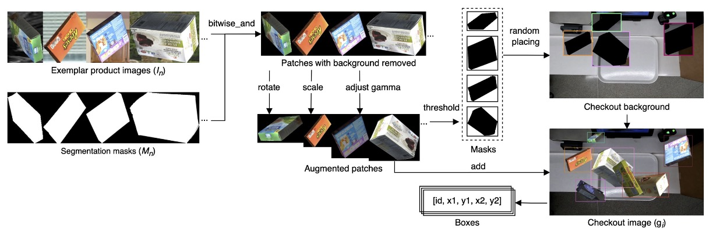
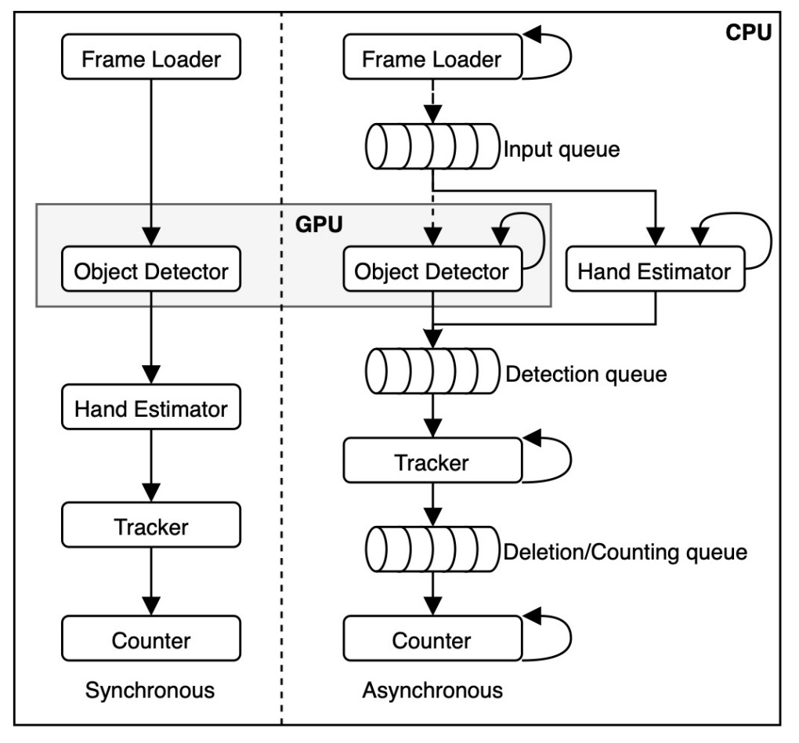
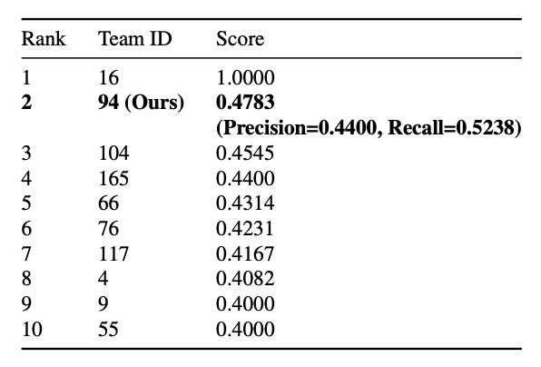

## The Overhead Hunter

[**DeepACO: A Robust Deep Learning-based Automatic Checkout System**](https://openaccess.thecvf.com/content/CVPR2022W/AICity/papers/Pham_DeepACO_A_Robust_Deep_Learning-Based_Automatic_Checkout_System_CVPRW_2022_paper.pdf)

---

This is a paper from a CVPR workshop. Let’s take a look together.

## Problem Definition

In recent years, the retail industry has been undergoing a profound transformation driven by artificial intelligence and computer vision technologies. Among them, **Automatic Checkout (ACO)** is regarded as one of the most revolutionary application scenarios.

An ideal ACO system should be able to, at the very moment a customer places items on the checkout counter:

> **Instantly recognize all products and accurately output the shopping list without any human intervention throughout the entire process!**

Is this really possible?

In reality, building such a system faces countless challenges:

- **Product occlusion and motion blur**;
- **Highly similar product appearances**;
- **The real cost caused by miss-detection and misclassification**;
- **A large variety of product categories with frequent restocking and replacement, making it difficult to collect training images that reflect real scenarios**.

Traditional methods such as background subtraction, SIFT, HOG features combined with SVM or random forest classifiers cannot effectively handle occlusion and lighting variations, resulting in limited accuracy.

Even with the advent of deep learning, models like Faster R-CNN, SSD, and YOLO series have made significant breakthroughs but still face many tough bottlenecks in practical deployment:

- Accurate detection on single images does not guarantee precise product counting across a video sequence;
- To enhance stability and consistency, it is necessary to introduce Multi-Object Tracking (MOT) techniques;

However, MOT itself faces challenges of high computational cost, real-time performance, and difficulty maintaining object IDs, especially under online tracking-by-detection schemes.

On the other hand, the data requirements for ACO differ from typical detection tasks, as it heavily relies on real-world scenes with “multiple objects in one frame,” “severe occlusion,” and “drastic viewpoint and lighting changes.” Existing datasets include:

- **RPC**: 80,000 static and checkout scene images covering 200 product categories;
- **RP2K**: Over 2,000 product categories and 350,000 real photographed images focusing on fine-grained classification;
- **AI City Challenge Checkout**: Synthetic data generated via 3D scanning simulating physical product display and lighting variations, producing 116,500 images.

Even so, these datasets still struggle to fully cover the constantly updating product appearances in real retail environments.

So, faced with this **high occlusion, high confusion, high update frequency** extreme scenario, is it possible to build a **full-process ACO system capable of stable tracking and accurate counting**?

The authors of this paper intend to solve this problem.

## Proposed Solution

### Data Synthesis

To do a good job, one must first sharpen the tools.

Therefore, solving the training data problem is the first step.

For an Automatic Checkout system (ACO), the core capability is:

> **Accurately predicting the category and quantity of every product in any arbitrary combination.**

However, if training relies solely on real checkout footage, it will face dual challenges of massive data scale and high maintenance cost: many product categories, short update cycles, and almost impossible coverage of all combinations and occlusion scenarios.

Therefore, the authors adopt a more practical strategy here: **Using single-product scans captured under controlled conditions, they synthesize realistic checkout images via data augmentation to train the model.**

The specific workflow is illustrated below:

<figure style={{"width": "90%"}}>

</figure>

They first collect a "single-sample" dataset for each product $S = \{(I_s, M_s, y_s)\}$, where:

- $I_s$: product image;
- $M_s$: corresponding binary mask;
- $y_s$: product category ID.

This study uses the `Saic` dataset provided by the 2022 AI City Challenge Track 4, covering:

- A total of **116,500 images**;
- From **116 product categories**;
- All products captured by 3D scanning.

Using these exemplars, the system can generate a large number of synthesized checkout scene images $\mathcal{G} = \{g_i\}$, constructed as follows:

$$
g_i = p(N, a, s, g, c)
$$

where the parameters mean:

- $N = \{(I_n, M_n, y_n)\} \subset Saic$: randomly selected $n$ exemplars;
- $(a, s, g)$: augmentation parameters applied to each exemplar including rotation angle, scale, and gamma correction;
- $c$: clutter ratio controlling the maximum IoU overlap among objects in the synthesis.

The complete process is:

1. Perform bitwise-and on each exemplar to remove background according to $M_n$;
2. Randomly apply data augmentation (rotation, scaling, brightness adjustment);
3. Generate masks via inverse thresholding;
4. Randomly paste these products onto background images extracted from real checkout video scenes;
5. Control occlusion so object overlaps do not exceed the IoU threshold defined by parameter $c$, avoiding excessive overlap.

This pipeline can quickly generate a large number of checkout scene samples simulating various angles, occlusions, and complex backgrounds.

The figure below shows synthesized results at three occlusion levels, demonstrating the flexibility and realism of this generation process to effectively support ACO model training.

<figure style={{"width": "90%"}}>

<figcaption>From left to right: synthesized results with low, medium, and high occlusion levels.</figcaption>
</figure>

### Model Architecture

<figure style={{"width": "90%"}}>

</figure>

The overall design of DeepACO is shown in the figure above. The system consists of three main components:

1. **Detector**
2. **Tracker**
3. **Counter**

Additionally, to meet the specific requirements of the 2022 AI City Challenge Track 4, the system integrates a **Hand Estimator module** to enhance its ability to recognize products handled by customers.

### Product Detection

DeepACO employs a flexible detection framework that supports multiple object detection models (hot-pluggable), as long as they comply with the **batch input/output format**:

- Input: RGB image sequence $I = \{I_i | t \leq i \leq t + B\} \in \mathbb{R}^{B \times C \times H \times W}$;
- Output: detection results $D = \{D_i \in \mathbb{R}^{P \times F}\}$, where $F = [x_1, y_1, x_2, y_2, \text{cls}, \text{conf}]$.

In this study, the authors select **Scaled-YOLOv4-P5** as the baseline, featuring:

- Continuation of the YOLOv4 architecture with CSPNet design;
- Support for different scales (P5, P6, P7), achieving up to **55.5% mAP** on MS-COCO;
- Deployable on cloud GPUs or low-power devices with good scalability.

The training data consists of 15,642 synthesized images generated as described previously, fine-tuning an MS-COCO pretrained model with an 8:2 train-test split.

Training setup includes:

- Data augmentation: basic (rotation, translation, cropping); advanced (RandAugmentation, Mosaic);
- Optimizer: SGD, trained for 50 epochs, selecting weights with best test performance.

Both synthesis and training apply augmentation strategies, forming a “double augmentation” effect that helps prevent overfitting and improves model robustness to scale and occlusion variations.

### Hand Estimation

<figure style={{"width": "80%"}}>

</figure>

To meet competition requirements, DeepACO introduces a hand perception module to detect **customer-held products**, enhancing detection accuracy and semantic understanding. This module uses Google MediaPipe framework and involves two stages, as shown above:

1. **Palm Detection**
   Uses an SSD-based network to detect palms over the entire image. This outperforms directly detecting flexible hands because palms are rigid, less occluded, easier to handle, and allow a reduction of anchor points by 3–5 times using fixed square anchors.

2. **Hand Landmark Regression**
   Estimates 21 hand keypoints within detected palm regions, providing high-precision 3D landmark information. The method is robust to self-occlusion and partial occlusion, allowing tracking of hand regions frame-to-frame.

This module runs in parallel with the detector, and their results are cross-validated to effectively **filter out false positives of non-handheld products**. Users may disable this module as needed to maintain system flexibility.

### Multi-Object Tracking

Stable recognition in video requires **tracking**, a key step.

DeepACO uses **SORT** (Simple Online and Realtime Tracking) as an online multi-object tracker. It assigns unique IDs to each object and continuously tracks their movement within the ROI (Region of Interest), ensuring each product is detected and counted only once.

- **SORT: Lightweight Tracking Solution**
  Given the fixed overhead camera angle in the application (stable planar movement, controllable occlusion), SORT is chosen for its high computational efficiency and low memory usage. Compared to the heavier DeepSORT, SORT better fits practical deployment.

  Core SORT workflow:

  - Uses **Kalman Filter** for motion prediction;
  - Uses **Hungarian Algorithm** for matching detections to existing tracks;
  - Matching cost between predicted and current detection boxes is measured by **IoU distance**, with a matching threshold of IoU ≥ 0.3.

  Each track’s state vector is $(u, v, s, r, \dot{u}, \dot{v}, \dot{s})$:

  - $(u, v)$: object center coordinates;
  - $s$: bounding box area;
  - $r$: aspect ratio;
  - $(\dot{u}, \dot{v}, \dot{s})$: corresponding velocities.

  Using the Kalman filter’s linear motion model, DeepACO effectively predicts object positions per frame and maintains stable ID assignment.

- **State Management and Counting Logic**

  

  <figure style={{"width": "60%"}}>
  
  </figure>
  

  DeepACO extends the original SORT framework by adding a **tracking state machine**. Each tracked object changes state over time from entering the ROI to final counting, as shown in the state transition diagram above.

  The most critical transition is from **“Counting” → “Counted”**, which only occurs if the object is **hand-held**. The determination is made by:

  - Using the 21 keypoints returned from the hand estimation module;
  - Checking if any keypoint lies inside the object bounding box;
  - Applying a **ray-casting algorithm** to verify if the point lies within the polygon.

  If conditions are met, the object transitions from “Counting” to “Counted” state, proceeding to the next statistical step.

### Product Counting

To satisfy the AI City Challenge evaluation criteria, DeepACO designs a simple yet effective counting module.

From the moment each object enters the ROI, its state is continuously monitored:

- When the object **fully enters the ROI** for the first time and is marked as “Confirmed,” the corresponding frame index is recorded;
- Later, when the object transitions to “Counted” state, its

$$
\text{Timestamp} = \frac{\text{frame index}}{60}
$$

is calculated as the final counting time (assuming 60 FPS). This counting mechanism balances accuracy and timeliness, ensuring each product is counted exactly once, avoiding duplicates or omissions.

## Discussion

To validate the practicality and performance of the DeepACO framework, this paper conducts comprehensive evaluations on the test set provided by the 2022 AI City Challenge Track 4, examining accuracy, latency, and implementation architecture.

The entire system was built and tested on the following environment:

- CPU: Intel Core i7-7700
- GPU: NVIDIA GeForce RTX 3090 24GB
- RAM: 32GB

The development platform is based on **OpenCV, PyTorch, and MediaPipe**, implementing two processing pipelines:

<figure style={{"width": "60%"}}>

</figure>

- **Synchronous pipeline**: modules process sequentially;
- **Asynchronous pipeline**: each module runs in an independent thread (4 CPU threads + 1 GPU thread), communicating via queues to reduce inter-module blocking.

The final competition version adopted the asynchronous pipeline, effectively improving overall performance, especially when multiple products appear simultaneously.

### Test Data and Evaluation Metrics

This study uses five test videos provided by the AI City Challenge, each recorded by a fixed overhead camera simulating customers naturally performing checkout.

The evaluation metric is the **F1 score**, calculated as:

$$
F_1 = \frac{TP}{TP + 0.5 \times (FP + FN)}
$$

- **TP (True Positive)**: correctly recognized products;

  - Defined as correct category, appearing within the ROI, and at the correct timing above the tray.

- **FP (False Positive)**: detections incorrectly labeled as correct;
- **FN (False Negative)**: true products not detected.

This metric balances precision and recall, providing a comprehensive measure of the ACO system’s practical performance.

### Quantitative Results

<figure style={{"width": "60%"}}>

</figure>

In the final challenge, DeepACO achieved **F1 = 0.4745**, securing second place with strong competitiveness.

Notably, the **recall was only 0.5238**, meaning roughly half of the products were successfully recognized. Possible causes include unnatural customer operation not considered valid “scanning” or timing misalignment causing counting failures.

Nonetheless, the results demonstrate clear potential for real-world deployment in complex scenes, validating the feasibility of the DeepACO architecture.

Beyond accuracy, **real-time processing capability** is a key design consideration.

Performance tests were conducted under the following conditions:

- GPUs: NVIDIA RTX 3090 and RTX A6000;
- Models: Scaled-YOLOv4-P5 / P7;
- Settings: resolution 448×448, batch size 16, queue size 1.

Results show the **asynchronous pipeline increases throughput by about 10 FPS on average**. Even with queue size set to 1, wait times were greatly reduced. Overall, the system meets real-time processing requirements, suitable for deployment in practical checkout systems.

## Conclusion

This paper proposes a plug-and-play detect-and-track pipeline supporting multiple model combinations, enhanced by a hand perception module to improve recognition accuracy in physical interaction scenarios. A data synthesis pipeline generates a large variety of checkout images to alleviate the shortage of real data.

In the 2022 AI City Challenge Track 4, DeepACO ranked second with an F1 score of 0.4783, achieving a good balance between accuracy and real-time performance, averaging 30 FPS, demonstrating strong potential for practical deployment.

For engineers interested in automatic checkout or retail vision applications, this work provides a valuable reference case.

:::info
This paper’s ending might leave you, as a reader, quite puzzled.

What? Not puzzled? Maybe you didn’t read carefully? 💢

Go back and check that benchmark table again — the first place’s F1 score is **1.0**! Achieving a perfect 1.0 in such a complex scenario means all predictions are flawless, with zero mistakes. It’s practically supernatural.

But in fact, that 1.0 is only for the **public test set (Test A)**, and that team was eventually **disqualified**.

For reference, see here:

- [**2022 AI CITY CHALLENGE Track 4**](https://www.aicitychallenge.org/2022-challenge-winners/)

The AI City Challenge rules state that only teams who complete the **Final Evaluation** (hidden test set Test B + efficiency benchmark) **and** release their code/paper publicly are counted in the final rankings.

That team with perfect public leaderboard score (Team 16) allegedly failed to submit reproducible code or comply with open-source requirements, so they were removed by the organizers.

The actual scores are as follows:

- Public Leaderboard: DeepACO’s F1 is about 0.478, temporarily ranked 2nd.
- Final Leaderboard:

  - The team ranked 1st, Team 55, didn’t submit a paper and was disqualified.
  - The 2nd place, Team 9, scored F1 = 0.0105 and secured 2nd place.

    - [**[22.07] Improving Domain Generalization by Learning without Forgetting: Application in Retail Checkout**](https://arxiv.org/pdf/2207.05422)

  - DeepACO (Team 94) scored F1 = 0.0047 and placed 5th.

The Final leaderboard scores are almost meaningless, as all teams’ scores dropped to 0.0x.

This is because in the final phase, the domain shifted drastically: camera position, product combinations, lighting all changed. Models without strong generalization ability basically fail.

Additionally, efficiency counts toward the final score; slower models get penalized.

So, when looking at the competition results, make sure to distinguish between the Public Leaderboard and the Final Leaderboard.

They mean very different things!
:::
