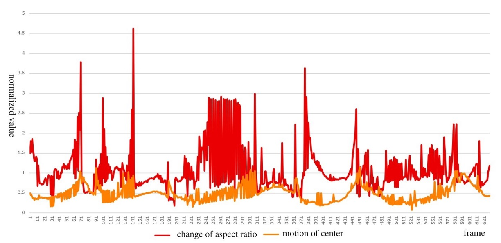
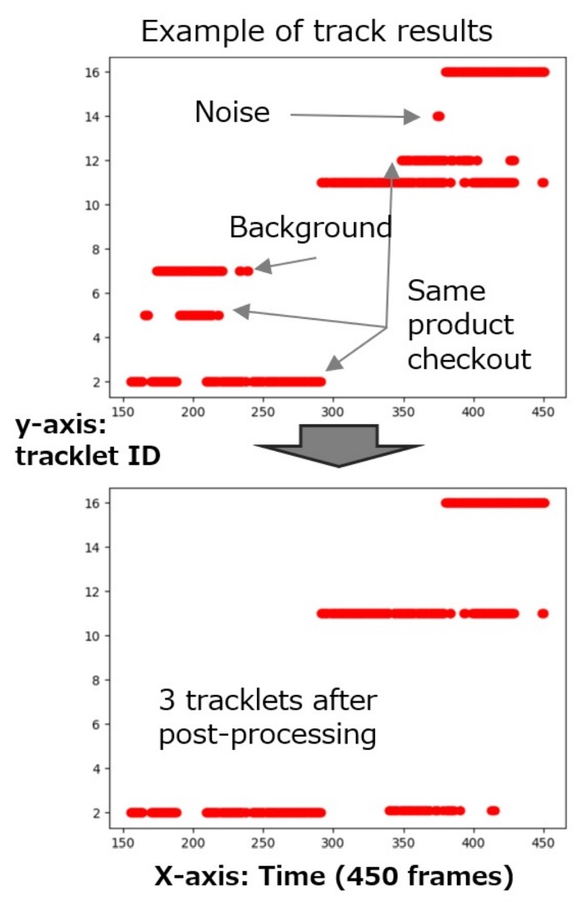
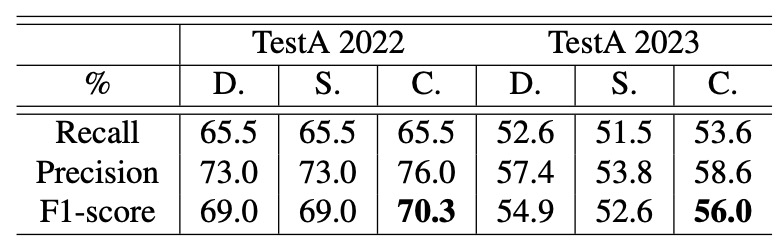

## Steadfast Trajectories

[**CheckSORT: Refined Synthetic Data Combination and Optimized SORT for Automatic Retail Checkout**](https://openaccess.thecvf.com/content/CVPR2023W/AICity/papers/Shi_CheckSORT_Refined_Synthetic_Data_Combination_and_Optimized_SORT_for_Automatic_CVPRW_2023_paper.pdf)

---

Remember the DeepACO system we saw from the 2022 AI CITY CHALLENGE Track 4?

Now let's look at the champion paper of the 2023 AI CITY CHALLENGE.

## Problem Definition

Self-checkout is gradually becoming a standard in retail environments. Whether in unmanned stores or the digital transformation of traditional markets, the goal is to use image recognition systems to **quickly and accurately identify products and quantities** without interrupting the user’s flow.

This task is generally formalized in computer vision as a multi-module system combining "multi-class product detection, classification, and counting."

At first glance, this task seems like simply combining existing object detection, tracking, and classification techniques.

However, when actually implementing it, many issues arise.

A complete image-based automatic checkout system includes at least the following five modules:

<figure style={{"width": "60%"}}>

</figure>

1. **Preprocessing**: How to generate training samples closer to real shots from clean synthetic data?
2. **Object Detection**: How to locate products and hands, and obtain masks for further processing?
3. **Object Tracking**: How to track short-lived and possibly overlapping product trajectories?
4. **Product Classification**: How to improve recognition accuracy and adapt to changes in viewpoint, occlusion, and lighting?
5. **Postprocessing**: How to integrate temporary results across multiple frames into a final checkout product list?

The authors believe each part must be carefully designed to meet practical deployment needs.

## Solution

In automatic checkout tasks, perhaps the most difficult part is obtaining representative training data, which not only involves on-site shooting but also requires labor-intensive frame-by-frame annotation.

Thus, the authors start with **synthetic data optimization**, proposing a controllable data synthesis pipeline that generates a large variety of synthetic images.

### Synthetic Data Optimization

Specifically, participants receive clean synthetic images and masks for each product, then generate backgrounds and composite them to create training synthetic images.

This process may seem simple, but the results of this competition show it is nearly the decisive factor for success.

Because the way products and backgrounds are composited directly determines the model’s upper bound performance. To enhance realism and diversity of synthetic images, the authors designed a controllable data synthesis pipeline centered around three hyperparameters:

- **Number of products**
- **Occlusion level (IoU)**
- **Scaling size**

These three are interdependent: too many products increase occlusion, while too small scaling may cause distortion.

Therefore, users can set parameter ranges, for example:

- Product count: 1 to 6
- Occlusion upper limit: IoU ≤ 0.3
- Scaling ratio: 0.15 to 0.5

Through systematic combinations, a large variety of synthetic data is produced.

Ablation studies found:

- Best results occur when **occlusion is controlled below 0.5** or no occlusion at all.
- **Scaling ratio around 0.5** yields more stable accuracy.

Besides parameter tuning, the authors compared impacts of different background sources.

Although external data use was prohibited by the official rules, the authors implemented a version with **real background images composited with products** within allowed limits, finding that **using real backgrounds generally benefits more than pure synthetic backgrounds** in most scenarios.

This also confirms an industry common sense:

> **Synthetic data is always a second-best option; whenever real data can be used, it is invariably more valuable.**

Regarding data usage strategy, the synthetic data was applied to train two major models:

1. **Product Detection**: Fine-tuning the COCO pretrained **DetectoRS** model, which supports both detection and segmentation, simultaneously locating products and occluding hands.
2. **Product Classification**: Extracting product images with varied backgrounds from synthetic data to train classification models.

### Model Architecture

CheckSORT’s architecture extends from DeepSORT and StrongSORT. Relevant papers can be referenced here:

- [**[17.03] Simple Online and Realtime Tracking with a Deep Association Metric**](https://arxiv.org/abs/1703.07402)
- [**[22.06] StrongSORT: Make DeepSORT Great Again**](https://arxiv.org/abs/2202.13514)

The authors introduced two key improvements into the tracking logic:

1. **Decomposed Kalman Filter (DKF)**
2. **Dynamic EMA Tracklet Gallery**

### SORT Algorithm Overview

Traditional SORT / DeepSORT / StrongSORT employ a two-stage "Tracking-by-detection" approach, where the input is detection results for each frame, and the output is corresponding product trajectories.

Inside the tracker, each bounding box initializes a tracklet and predicts future positions via a **Kalman filter**. Tracklets maintain three states based on matching:

- `tentative`: newly created tracks
- `confirmed`: upgraded after consecutive correct matches
- `deleted`: removed after long no-match periods

Per frame, the processing steps are:

1. **Predict**: Predict new bounding box positions for each confirmed tracklet.
2. **Match**: Compute distance matrix between detection boxes and tracklets, associate via Hungarian algorithm.
3. **Update**: Update Kalman states and internal descriptors of each tracklet according to matching.

### Decomposed Kalman Filter

The traditional Kalman filter models bounding box state as:

$$
\mathbf{x} = [x, y, a, h, \dot{x}, \dot{y}, \dot{a}, \dot{h}]
$$

where:

- $(x, y)$: center coordinates
- $a$: aspect ratio
- $h$: height
- "$\dot{\ }$": derivative (velocity)

The problem is that **motion patterns of center movement $(x, y)$ and appearance deformation $(a, h)$ differ significantly**, as shown below:

<figure style={{"width": "90%"}}>

</figure>

- **Orange curve**: smooth and continuous $(x, y)$ during product movement;
- **Red curve**: often violent jumps in $(a, h)$ during product flipping.

Therefore, the authors propose the Decomposed Kalman Filter (DKF), splitting the overall state into two independent Kalman computations:

- **Position vector**:

  $$
  \mathbf{p} = [x, y, \dot{x}, \dot{y}]
  $$

- **Shape vector**:

  $$
  \mathbf{b} = [a, h, \dot{a}, \dot{h}]
  $$

Both share the following transition matrix $A$ and observation matrix $H$:

$$
A =
\begin{bmatrix}
1 & 0 & 1 & 0 \\
0 & 1 & 0 & 1 \\
0 & 0 & 1 & 0 \\
0 & 0 & 0 & 1
\end{bmatrix}, \quad
H =
\begin{bmatrix}
1 & 0 & 0 & 0 \\
0 & 1 & 0 & 0
\end{bmatrix}
$$

Furthermore, to construct the **distance matrix**, the Mahalanobis distances for position and shape are computed as follows:

- **Position distance**:

  $$
  d^{(p)}(i,j) = (\mathbf{p}_j - \hat{\mathbf{p}}_i)^\top P_i^{-1} (\mathbf{p}_j - \hat{\mathbf{p}}_i)
  $$

- **Shape distance**:

  $$
  d^{(b)}(i,j) = (\mathbf{b}_j - \hat{\mathbf{b}}_i)^\top B_i^{-1} (\mathbf{b}_j - \hat{\mathbf{b}}_i)
  $$

### Dynamic Feature Sequences

Since DeepSORT, trajectory matching has incorporated appearance features instead of relying solely on position.

CheckSORT introduces an improved strategy:

- **StrongSORT** uses EMA-smoothed fixed-length feature vectors;
- **CheckSORT** adopts a **dynamic, non-continuous feature gallery**, adding new features only when sufficiently different from historical ones to avoid redundancy.

Defined as follows:

- Each track $i$ has a set of states (gallery):

  $$
  E_i = \{ e_i^t \}, \quad t = 1 \ldots L
  $$

- A new feature $e_i^T$ is added only if it differs enough from existing $E_i$;

- Appearance distance is defined as:

  $$
  d^{(a)}(i,j) = \min \{ 1 - e_i^T \cdot e_j^t \mid e_j^t \in E_j \}
  $$

The final cost matrix combines three signals, weighted by importance:

$$
c(i,j) = \lambda_p \cdot d^{(p)}(i,j) + \lambda_b \cdot d^{(b)}(i,j) + \lambda_a \cdot d^{(a)}(i,j)
$$

This enables the Hungarian algorithm to achieve optimal matching by jointly considering position, shape, and appearance.

### Postprocessing Optimization

Even with high-quality matching results, CheckSORT performs a final "trajectory correction" step addressing three common error types:

1. Short trajectories or those belonging to background classes → **deleted**
2. Trajectory breaks longer than 0.5 seconds → **split** into two tracks
3. Multiple tracks of the same class with time difference less than 3 seconds → **merged**

This part is heuristic and not a core contribution of the paper.

The figure below shows recognition differences before and after postprocessing:

<figure style={{"width": "60%"}}>

</figure>

## Discussion

The authors observed that the **AI CITY CHALLENGE 2023** Track 4 task differs slightly from the previous year: in 2023, the task requires predicting the frame where each product **first appears**, whereas in 2022, only the total duration of appearance was needed.

Although the authors intended to verify the algorithm directly on the 2023 test set, lack of ground truth forced them to manually annotate product appearance times (in seconds) on _TestA 2022_ and _TestA 2023_ as an alternative benchmark.

The evaluation follows 2022 rules, using **F1-score** as metric:

- **TP (True Positive)**: correctly recognized objects in the region of interest;
- **FN (False Negative)**: annotated objects not correctly recognized.

Additionally, the competition provided **116,500 synthetic images** and **116 3D product models**.

### Impact of Synthetic Data

<figure style={{"width": "60%"}}>

<figcaption>CheckSORT performance on _TestA 2022_ under varying IoUs</figcaption>
</figure>

<figure style={{"width": "60%"}}>

<figcaption>CheckSORT performance on _TestA 2023_ under varying IoUs</figcaption>
</figure>

The authors designed controlled experiments to study two hyperparameters affecting performance: the **IoU upper bound** and the **scaling range**. With fixed scaling of 0.15–0.5, they observed recognition results under different IoU limits as shown above.

Experiments show: **higher IoU upper bounds yield better overall performance**, implying that more occlusion in training data helps the model better handle complex multi-object detection and tracking scenarios.

Next, with IoU fixed at 0.1, the authors examined effects of varying scaling ranges:

<figure style={{"width": "60%"}}>

<figcaption>CheckSORT performance on _TestA 2022_ under varying scaling ranges</figcaption>
</figure>

<figure style={{"width": "60%"}}>

<figcaption>CheckSORT performance on _TestA 2023_ under varying scaling ranges</figcaption>
</figure>

Results indicate: **optimal performance is around scaling of 0.55**.

- Too large scaling causes insufficient samples;
- Too small scaling mismatches real application scenarios, harming generalization.

### Synthetic vs. Real Backgrounds

Based on the best parameter combinations, the authors further evaluated the influence of background style.

They tested two settings — "synthetic backgrounds" and "real backgrounds" — on _TestA 2022_ and _2023_ datasets with results as follows:

<figure style={{"width": "60%"}}>

<figcaption>Performance under IoU ≤ 0.5, scaling range 0.4–0.8</figcaption>
</figure>

<figure style={{"width": "60%"}}>

<figcaption>Performance under IoU ≤ 0.5, scaling range 0.3–0.75</figcaption>
</figure>

The authors noted: **real backgrounds consistently improve recognition**, especially under IoU ≤ 0.5 and scaling 0.4–0.8, where real backgrounds provide about **8% performance boost**.

### CheckSORT Performance Analysis

<figure style={{"width": "60%"}}>

<figcaption>Comparison of trackers under IoU ≤ 0.5, scaling 0.3–0.75</figcaption>
</figure>

<figure style={{"width": "60%"}}>

<figcaption>Comparison of trackers under IoU ≤ 0.5, scaling 0.4–0.8</figcaption>
</figure>

Finally, the authors compared three trackers — **DeepSORT**, **StrongSORT**, and their proposed **CheckSORT** — across different scenarios.

Results show that **CheckSORT outperforms others in all settings**, demonstrating strong stability and generalization.

According to the current public leaderboard, CheckSORT ranked **5th** on the official TestA evaluation.

<figure style={{"width": "60%"}}>

</figure>

## Conclusion

The final results are well known.

**CheckSORT won the championship at the 2023 AI CITY CHALLENGE Track 4.**

This achievement highlights that the greatest challenge in automatic checkout tasks is not merely improving tracking or recognition accuracy, but effectively **narrowing the domain gap between training data and real test environments**. In real-world settings, factors like lighting changes, occlusions, and object placement angles are highly complex, posing great challenges to model generalization.

This paper addresses this core issue with two main solutions:

- First, the authors designed a **synthetic data optimization pipeline**, controlling IoU upper bounds and scaling parameters to generate more representative training samples;
- Second, they proposed a **decomposed filtering approach** at the filtering level to separate position and shape information, enabling stable tracking under rotation, flipping, and occlusion.

These improvements not only enhance recognition accuracy in various complex scenarios but also provide a more solid foundation for practical automatic checkout systems.

:::info
Interested readers can check out the leaderboard at the following link:

- [**AI City Challenge 2023 Track 4 Leaderboard**](https://www.aicitychallenge.org/2023-challenge-winners/)

  
  :::
