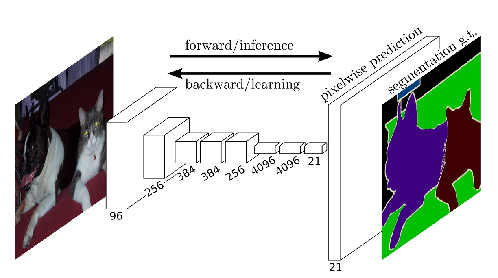

## Fully Convolutional Networks

[**Fully Convolutional Networks for Semantic Segmentation**](https://arxiv.org/abs/1411.4038)

---

This is one of the most influential papers in deep learning, especially for image segmentation, and it's definitely a must-read.

## Defining the Problem

Image segmentation has been an evolving field for several years. With the rise of convolutional networks (CNNs), more and more approaches have shifted towards using CNNs to solve the segmentation problem. Traditional methods would often break the system into separate stages, making the whole process disjointed and heavily reliant on manual design.

The authors of this paper introduced the concept of Fully Convolutional Networks (FCNs), enabling us to directly apply CNNs to the problem of image segmentation without needing additional processing steps.

## Solving the Problem

### Model Architecture

At the time, some of the most popular CNN architectures were AlexNet, VGG16, and GoogLeNet, mainly used for image classification tasks. To adapt these models for image segmentation, the authors modified the final "fully connected layers," replacing them with convolutional layers, as shown in the diagram above.

When using fully connected layers, the input image size is restricted, because although convolutional layers can handle images of arbitrary sizes, fully connected layers cannot. The authors solved this issue by replacing fully connected layers with convolutional ones. This modification allows the network to process images of any size.

The process is straightforward: for example, instead of using a fully connected layer of size 4096, they replaced it with a convolutional layer with a filter size of $1 \times 1 \times 4096$. If $1 \times 1$ is too small, the authors experimented with using a $10 \times 10$ convolutional filter instead.

Once the output is obtained, to match the original image size, the authors used an upsampling process to enlarge the output to the same size as the input image while adjusting the number of output channels accordingly.

In this paper, the final output contains 21 channels because they used the PASCAL VOC 2011 dataset, which has 20 classes plus one for the background, totaling 21 classes.

### Upsampling

In the paper, the authors mention a technique called **Shift-and-Stitch**, which allows dense predictions from coarse outputs without interpolation. This method was originally introduced in OverFeat:

- [**[13.12] Overfeat: Integrated recognition, localization and detection using convolutional networks**](https://arxiv.org/abs/1312.6229)

When the output is downsampled by a factor of $f$, the input can be shifted by $x$ pixels to the right and $y$ pixels down, and predictions are made for each pair $(x, y) \in \{0, \dots, f-1\} \times \{0, \dots, f-1\}$. The $f^2$ input sets are processed through the network, and the outputs are interleaved to align predictions with the center of the receptive field of each pixel.

Although the authors conducted preliminary experiments with Shift-and-Stitch, they ultimately chose **deconvolution** (or transposed convolution) for upsampling, finding it more efficient, especially when combined with the skip connection technique mentioned later.

The complete network architecture is shown below:

### Multi-Scale Fusion

Using only the deepest, lowest-resolution features results in coarse outputs when scaled back to the original image size. To improve this, the authors proposed **multi-scale fusion**.

As shown above, features from different resolutions were extracted. The smallest feature map is $1/32$ of the original size, and the largest is $1/8$. The fusion process involves upsampling the $1/32$ feature map to match the $1/16$ feature map, then summing them, followed by upsampling the result to match the $1/8$ feature map and summing them as well, before upsampling to the original size.

This technique is referred to as a "skip layer," and it helps the model achieve better results. Below is a comparison:

The left image shows the results when directly upsampling the $1/32$ feature map to the original size, while the middle image shows the result after using multi-scale fusion. By incorporating $1/16$ and $1/8$ feature maps, the middle output is smoother and contains more fine details.

:::tip
This technique is reminiscent of Feature Pyramid Networks (FPN)! It was truly ahead of its time.
:::

### Training Dataset and Strategy

The authors used the PASCAL VOC 2011 Segmentation Challenge dataset for training and validation. They trained using per-pixel multinomial logistic loss, and the evaluation metric was mean intersection-over-union (mean IU). All models were trained and tested using the Caffe framework on a single NVIDIA Tesla K40c.

1. **Learning Rate**: The model was trained with stochastic gradient descent (SGD) with momentum set to 0.9, and weight decay set to $5 \times 10^{-4}$ or $2 \times 10^{-4}$. The learning rates were set to $10^{-3}$, $10^{-4}$, and $5 \times 10^{-5}$ for FCN-AlexNet, FCN-VGG16, and FCN-GoogLeNet, respectively. These values were determined through a linear search. The classification convolutional layers were randomly initialized, and dropout was used, though it did not significantly impact performance or convergence speed.

2. **Training Data**: Each image was divided into overlapping patches, but they found that using whole-image training was more efficient, so they opted for that.

3. **Class Balancing**: Class balancing could be done through weighting or sampling, but results showed no need for balancing, even with some label imbalance (approximately 3/4 of the data was background).

4. **Dense Prediction**: Outputs were upsampled via learned deconvolution layers. The final layer’s deconvolution filters were initialized with bilinear interpolation and then learned. Shift-and-stitch and sparse filters were not used.

5. **Data Augmentation**: Random flipping and shifting (up to 32 pixels) were tried, but no significant improvements were observed.

6. **Additional Training Data**: Initially, 1,112 images from PASCAL VOC 2011 were used for training, but later, an additional 8,498 annotated images from Hariharan et al. were included, improving FCN-VGG16's mean IU by 3.4 points to 59.4.

### Evaluation Metrics

The paper reports four commonly used evaluation metrics from semantic segmentation and scene parsing tasks, including pixel accuracy and variations of Intersection over Union (IoU).

The formulas for the metrics are as follows:

- **Pixel Accuracy**:

  $$
  \sum_i \frac{n_{ii}}{\sum_i t_i}
  $$

  Where $n_{ii}$ represents the number of pixels correctly predicted for class $i$ (i.e., the number of pixels that belong to class $i$ and are predicted as class $i$), and $\sum_i t_i$ denotes the total number of pixels in the image.

  Pixel accuracy is the most basic evaluation metric. It directly reflects the proportion of correctly predicted pixels across the entire image. However, this metric can obscure prediction errors for smaller objects when certain categories (like background) dominate the pixel count in the dataset.

  ***

- **Mean Accuracy**:

  $$
  \frac{1}{n_{cl}} \sum_i \frac{n_{ii}}{t_i}
  $$

  Here, $t_i$ represents the total number of pixels that belong to class $i$, and $n_{ii}$ is the number of pixels correctly predicted as class $i$.

  Mean accuracy considers the prediction performance of each class and averages the accuracy across all classes. The advantage of this metric is that it evaluates the prediction performance for each class fairly, even for classes with fewer pixels. It is less affected by class imbalance and better reflects the consistency of the model's performance across different classes.

  ***

- **Mean Intersection over Union (Mean IoU)**:

  $$
   \frac{1}{n_{cl}} \sum_i \frac{n_{ii}}{t_i + \sum_j n_{ji} - n_{ii}}
  $$

  The numerator $n_{ii}$ represents the number of correctly predicted pixels, while the denominator $t_i + \sum_j n_{ji} - n_{ii}$ includes both the correctly predicted pixels and the incorrectly predicted pixels, forming the union set for the class.

  Mean IoU measures the classification performance by evaluating the overlap between predicted and actual class regions. It calculates the IoU for each class and averages the results to reflect the overall performance of the model. Compared to pixel accuracy, Mean IoU is more balanced in handling class imbalance, distinguishing between small and large objects in predictions.

  ***

- **Frequency Weighted Intersection over Union (Frequency Weighted IoU)**:

  $$
  \frac{1}{\sum_k t_k} \sum_i \frac{t_i n_{ii}}{t_i + \sum_j n_{ji} - n_{ii}}
  $$

  Frequency Weighted IoU considers the frequency of each class and uses the total number of pixels for each class $t_i$ as a weight to calculate the weighted average IoU for each class. The denominator $\sum_k t_k$ is the total number of pixels in the dataset, and each term $t_i n_{ii}$ represents the number of correctly predicted pixels for a given class multiplied by its total pixel count. This emphasizes classes with larger pixel counts (like background).

  This metric not only evaluates the prediction accuracy for each class but also weights the classes based on their proportions in the dataset. This helps address class imbalance issues, giving more influence to classes with higher pixel counts (like background). Frequency Weighted IoU is particularly sensitive to performance in real-world applications, where common classes are more influential.

## Discussion

### PASCAL VOC Results

The table above shows the performance of FCN-8s on the PASCAL VOC 2011 and 2012 test sets, compared to previous state-of-the-art systems SDS and the well-known R-CNN.

In terms of mean IoU, our results show a 20% improvement over the previous best results. Inference time has also significantly reduced, with the convolutional network computation being 114 times faster, and overall inference time being 286 times faster.

### NYUDv2 Results

Initially, the authors trained the unmodified coarse model (FCN-32s) using RGB images, then incorporated depth information to upgrade the model to handle four-channel RGB-D input (early fusion), but the improvements were limited.

Building on the work by Gupta et al., the authors employed HHA depth encoding and performed "late fusion" of RGB and HHA, eventually upgrading to the 16-stride version.

:::tip
The NYUDv2 dataset consists of 1,449 RGB-D images, each with pixel-level annotations, consolidated into a 40-class semantic segmentation task.
:::

### SIFT Flow Results

The authors trained a dual-headed FCN-16s model that simultaneously predicted semantic and geometric labels. The model's performance on both tasks was comparable to models trained separately, but with nearly the same learning and inference speed as a single model.

The table above shows the results on the standard data split (2,488 training images and 200 test images), achieving state-of-the-art performance in both tasks.

:::tip
The SIFT Flow dataset consists of 2,688 images with 33 semantic categories (such as "bridge," "mountain," "sun") and three geometric categories ("horizontal," "vertical," "sky").
:::

## Conclusion

The introduction of FCN represents a milestone contribution, extending the advantages of convolutional networks to semantic segmentation tasks and laying the groundwork for many subsequent image segmentation techniques. Its innovations, such as skip connections and a fully convolutional architecture, make semantic segmentation feasible as an end-to-end task.

While there is still room for improvement in output precision, resource consumption, and multi-scale feature fusion, the ideas and techniques proposed by FCN have significant implications for future research in image segmentation.
