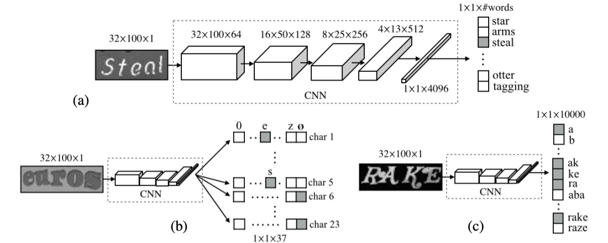
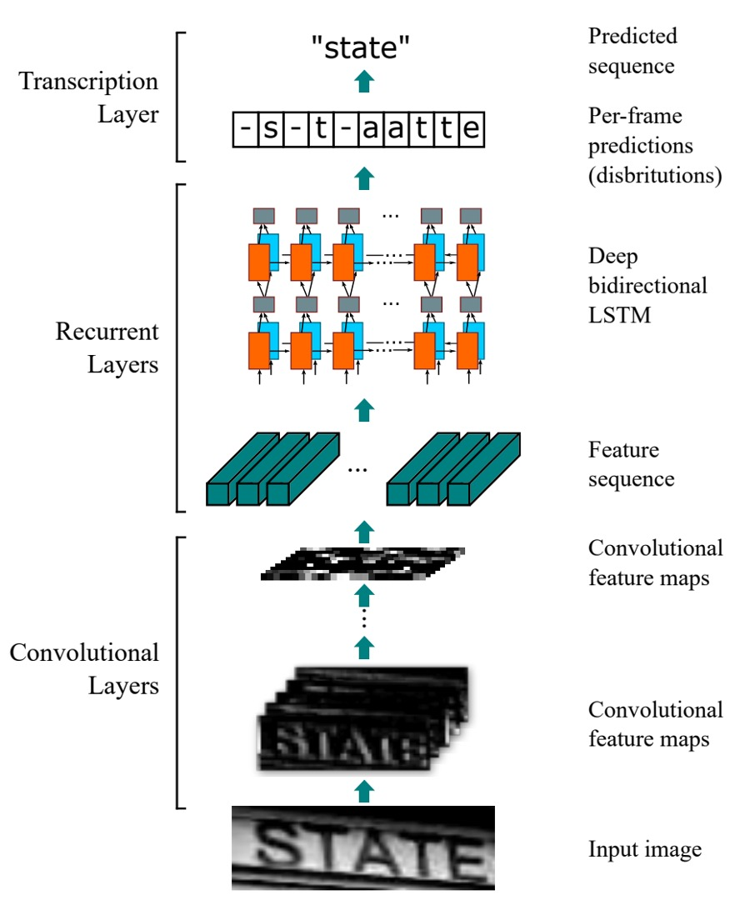
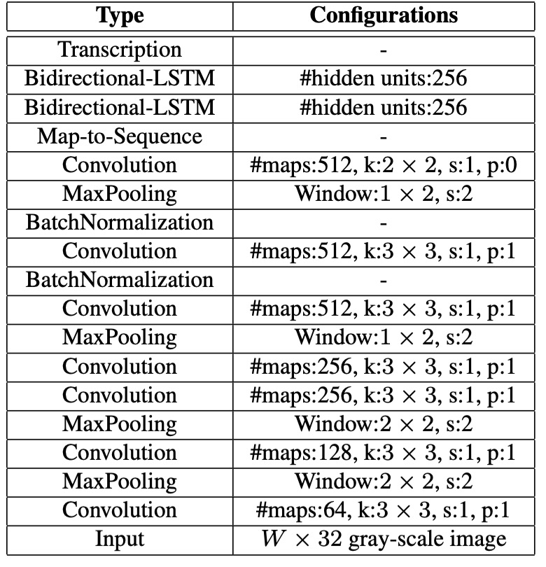
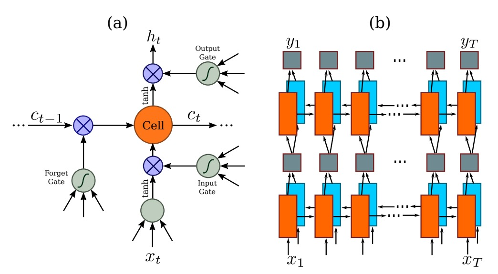
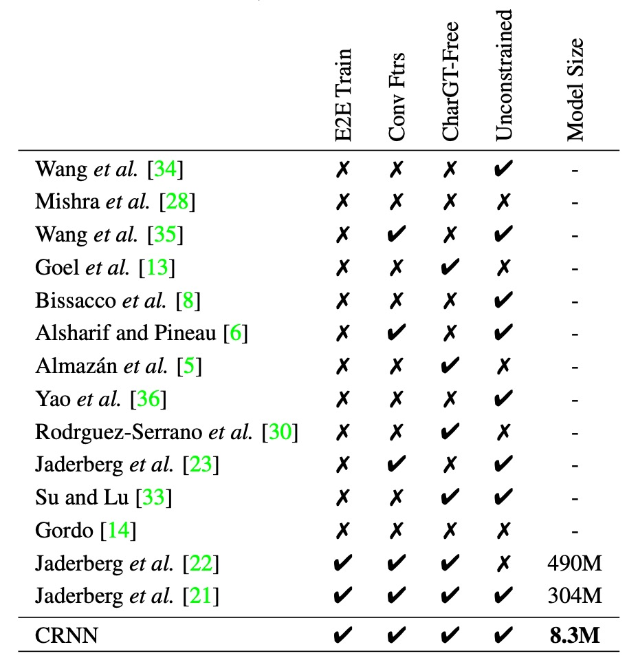
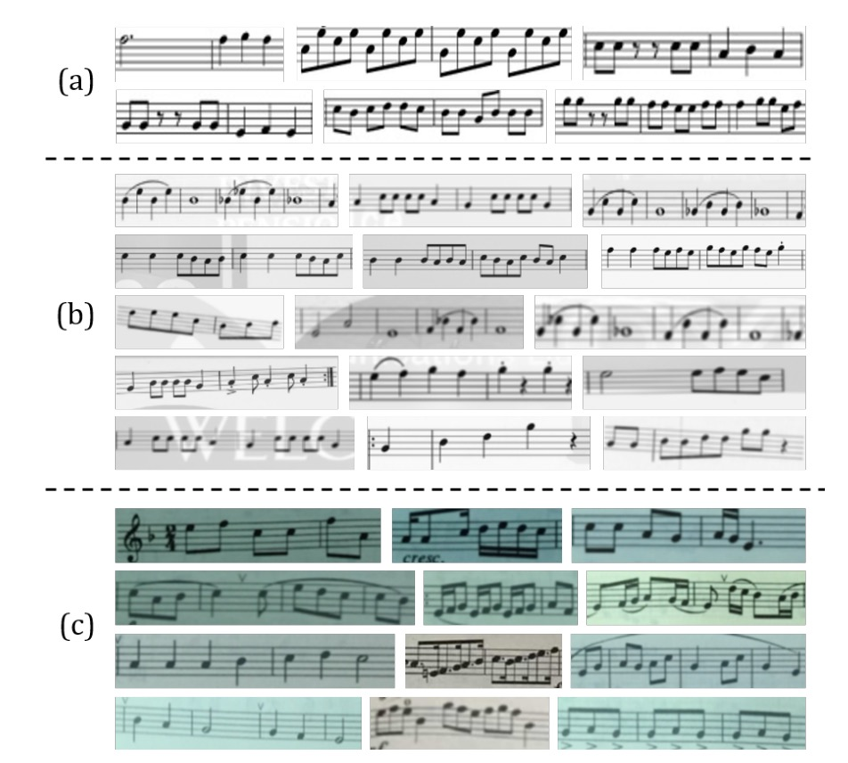
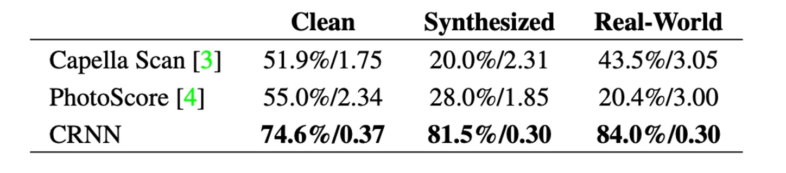

# [15.07] CRNN

## I Want It All!

[**An End-to-End Trainable Neural Network for Image-based Sequence Recognition and Its Application to Scene Text Recognition**](https://arxiv.org/abs/1507.05717v1)

---

OCR (Optical Character Recognition) is a long-established field, but deep learning has revitalized it.

## Problem Definition

With the rise of deep learning, OCR has experienced new growth opportunities. Compared to traditional methods based on handcrafted features, CNN-based OCR methods demonstrate superior performance and generalization capabilities.

One of the key advantages of CNNs is their ability to automatically learn features from images, eliminating the need for manual feature engineering. This not only saves significant human effort but also reduces computational costs.

However, a crucial challenge in text recognition remains: **How do we effectively classify the text?**

For the final step of text classification, several mainstream methods exist. Let’s borrow an image from the **CHAR** paper to explore these methods:

- [**[14.06] Synthetic Data and Artificial Neural Networks for Natural Scene Text Recognition**](https://arxiv.org/abs/1406.2227v4)

  

### 1. Dictionary Encoding

Dictionary Encoding is one of the simplest and most straightforward methods. In this approach, a dictionary is defined that contains all possible labels (usually words or phrases). When processing an image, the recognized text is classified into one of the dictionary entries. In simple terms, the model’s task is to choose the most suitable word from a pre-defined list.

However, if the text in the image is not present in the dictionary, this method fails, and the model cannot recognize out-of-vocabulary content. This limitation becomes problematic when dealing with random character strings (such as randomly generated passwords or phone numbers).

Moreover, if the dictionary is very large (e.g., hundreds of thousands of entries), the system’s efficiency is significantly impacted, and scalability becomes a challenge.

### 2. Character Sequence Encoding

Character Sequence Encoding is another common method, and unlike dictionary encoding, it doesn’t rely on a pre-defined dictionary. Instead, the text is directly classified into a sequence of characters. This means that the system doesn’t need to know specific words; rather, it classifies each character based on the image and constructs the complete sequence.

Character sequence encoding is more challenging because the model needs to learn the features of each character and be able to accurately combine the characters into a complete sequence. Since there are dependencies between characters in a sequence, the model requires strong contextual understanding, or it may generate incorrect character combinations.

### 3. N-gram Encoding

Bag-of-N-gram Encoding is a compromise solution, where the text in the image is classified into an N-gram sequence. This method can be seen as a hybrid between word and character methods.

An N-gram is a sequence of N characters, where N could be 2 (bi-gram), 3 (tri-gram), or even longer. This encoding method allows the recognition of both individual characters and combinations of characters, capturing more context information.

However, as N increases, the number of N-gram combinations grows exponentially, leading to higher computational costs. This is especially true when dealing with long text sequences, where efficiency may decrease. For certain words, N-gram encoding may not accurately capture the overall meaning of the word, particularly when N is small, leading to reduced accuracy compared to dictionary encoding or character sequence encoding.

---

In summary, the authors aim for a model that meets several demands:

1. **End-to-End Training**: No need for preprocessing or multi-step operations; the model learns directly from the image.
2. **Convolutional Features**: Use convolutional features learned from training images, rather than handcrafted ones.
3. **No Need for Character-level Annotations**: The model learns text sequences directly from images without character-level annotations.
4. **Unrestricted**: Able to handle arbitrary text sequences without being limited by a fixed dictionary.
5. **Compact Model**: Small storage size with high efficiency.

This might seem ambitious, but let’s see how the authors approached the problem.

## Solution

### Model Architecture

<div align="center">
<figure style={{"width": "70%"}}>

</figure>
</div>

The CRNN model is composed of three parts, illustrated in the diagram:

### Convolutional Layers

Starting from the bottom of the diagram, this part represents the convolutional neural network (CNN) used to extract features from the image.

Let’s assume the input image containing text has dimensions `32x128`. Viewing it by columns, it represents a sequence of length 128, with each row being a feature vector of size `3 x 32` (assuming an RGB image).

One potential approach is to send the raw image directly into a sequence model.

However, this could make the model overly complex, and training becomes difficult when sequence lengths are too long. Therefore, the authors first extract features from the image using a convolutional network, and these features are then sent into the sequence model.

But using a convolutional network introduces another issue: a significant amount of sequential information may be lost.

In the previous example, if the input image is `32x128`, after passing through common CNN backbones, the image is downsampled several times, resulting in a final feature map size of `1x4`.

This is far from ideal since there isn’t enough information to make predictions!

To address this, the authors modify the convolutional network by adjusting the `MaxPooling` operation: instead of using `kernel=2, stride=2`, they change it to `kernel=(2, 1), stride=(2, 1)`.

This way, the feature map’s width remains unchanged, while only the height is reduced. For instance, an input image of `32x128` will have a feature map size of `1x128` after downsampling five times.

:::tip
In practice, the authors choose to downsample the width twice and the height four times to control the sequence width.

<div align="center">
<figure style={{"width": "70%"}}>

</figure>
</div>
:::

### Recurrent Layers

Next is the middle Recurrent Layers section.

Once the input text image is converted into sequential data, the next step is to feed this data into a sequence model. The authors use a Bidirectional LSTM (BiLSTM) for this purpose.

LSTM (Long Short-Term Memory) is a variation of RNN (Recurrent Neural Networks) designed to address the issue of long-term dependencies. As time steps increase, RNNs struggle to retain earlier information, especially for long-range dependencies in sequences. LSTM overcomes this by using memory cells and gating mechanisms (such as input, forget, and output gates) to control the flow of information, allowing it to retain important information over extended time periods.

BiLSTM combines the strengths of LSTM and bidirectional networks. It uses two LSTM layers to process the data: one processes the sequence forward (from the start to the end), and the other processes it backward (from the end to the start). This ensures that each time step benefits from the context of both directions. BiLSTM improves the model’s prediction accuracy for tasks like language modeling, speech recognition, and machine translation.

<div align="center">
<figure style={{"width": "70%"}}>

</figure>
</div>

Returning to the problem at hand, after extracting features from the image using a CNN, the length of the sequence corresponds to the image’s width. Each time step can be seen as representing a block of the original image (as shown in the image below), and the receptive field of each time step depends on the design of the convolutional network.

<div align="center">
<figure style={{"width": "50%"}}>

</figure>
</div>

By feeding this feature sequence into the BiLSTM, we obtain a higher-level representation of the sequence, which can then be used for predicting the text in the image.

### Unaligned Sequence Labeling

As we discussed earlier, character-level labeling is a labor-intensive task.

To address the issue of aligning characters to sequences, the authors introduce the CTC (Connectionist Temporal Classification) technique for predicting text sequences.

- [**[06.06] Connectionist temporal classification: labelling unsegmented sequence data with recurrent neural networks**](https://dl.acm.org/doi/abs/10.1145/1143844.1143891)

CTC is designed to handle unaligned sequence labeling problems. It predicts the label sequence $l$ for a given input sequence $y = \{y_1, ..., y_T\}$, ignoring the specific alignment between time steps and labels. This makes it particularly suitable for tasks like speech recognition and handwriting recognition.

Unlike traditional sequence models, CTC doesn’t require an exact match between each time step and character position, simplifying the training process.

Given the input sequence $y = \{y_1, ..., y_T\}$, where $T$ is the sequence length, each $y_t \in \mathbb{R}^{|L'|}$ represents a probability distribution over the label set $L' = L \cup \{\text{blank}\}$, where $L$ includes all task-related labels (such as alphabet letters), and "blank" represents an empty label. The blank label is used to denote time steps where no character is produced, which helps handle irregular sequence lengths.

Since the model’s frame-by-frame predictions may produce repeated characters or blank labels over multiple time steps, CTC uses a mapping function $B$ to remove these redundant elements and obtain the final label sequence. The process involves collapsing repeated characters and removing blank labels.

For instance, if the model’s frame-wise output for the word "hello" is:

```
--hh-e-l-ll-oo--
```

Here, `-` represents the blank label. Repeated characters are collapsed, and the blanks are removed, yielding the final sequence:

```
hello
```

CTC excels at handling such redundancy and maps the output sequence to a more concise label sequence.

In CTC, to calculate the conditional probability of a label sequence $l$ given the frame-wise predictions $y = \{y_1, ..., y_T\}$, we sum the probabilities of all possible frame sequences $\pi$ that can be mapped to the same label sequence $l$. This is expressed as:

$$
p(l | y) = \sum_{\pi : B(\pi) = l} p(\pi | y),
$$

where the probability of each frame sequence $\pi$ is defined as:

$$
p(\pi | y) = \prod_{t=1}^{T} y^t_{\pi_t},
$$

This represents the probability of outputting label $\pi_t$ at each time step $t$.

:::tip
To help clarify, let’s consider an example for recognizing the word "cat."

Suppose the input is a speech sequence, and the model predicts the following probabilities at each time step:

| Time Step | c   | a   | t   | blank |
| --------- | --- | --- | --- | ----- |
| 1         | 0.6 | 0.1 | 0.1 | 0.2   |
| 2         | 0.1 | 0.7 | 0.1 | 0.1   |
| 3         | 0.1 | 0.2 | 0.6 | 0.1   |
| 4         | 0.2 | 0.2 | 0.2 | 0.4   |

At each time step, the model outputs a probability distribution over the labels, including the blank label. For example, at time step 1, the probability of `c` is the highest, while at time step 4, the blank label has the highest probability.

In this scenario, several different frame-wise sequences could map to the final label sequence "cat," such as:

- The sequence $\text{c--a-t}$ maps to "cat";
- The sequence $\text{-c-a--t}$ also maps to "cat."

CTC sums the probabilities of all possible frame-wise sequences that map to the label sequence "cat." During training, the model’s objective is to minimize the negative log likelihood of the correct label sequence "cat," pushing the model to generate more accurate frame-wise predictions as training progresses.

By handling this redundancy, CTC can learn and predict the correct label sequence without requiring precise alignment between time steps and characters.
:::

### Training Strategy

The authors used the synthetic dataset released by Jaderberg et al. for training on scene text recognition:

- [**Text Recognition Data**](https://www.robots.ox.ac.uk/~vgg/data/text/) The dataset contains 8 million training images along with corresponding annotated text, generated by a synthetic engine with high realism.

The model was trained solely on this synthetic data, and it was directly tested on all real-world test datasets without any fine-tuning.

Details of the network configuration are as follows:

- The convolutional layers are based on a modified VGG architecture to accommodate English text recognition.
- In the 3rd and 4th max-pooling layers, the authors used rectangular pooling windows with $w=1, h=2$ instead of the traditional square ones.
- Two batch normalization layers were inserted after the 5th and 6th convolutional layers, significantly accelerating the training process.
- The model was trained using the ADADELTA algorithm, with $\rho$ set to 0.9. All images were resized to $100 \times 32$ to speed up training.
- During testing, images were scaled to a height of 32, and the width was scaled proportionally while maintaining a minimum of 100 pixels.

### Evaluation Metrics

The authors evaluated the model's performance using four common scene text recognition benchmark datasets:

1. **ICDAR 2003 (IC03)**

   - The test set contains 251 scene images with labeled text bounding boxes.
   - For fair comparison with previous works, text images containing non-alphanumeric characters or less than three characters are usually ignored. After filtering, 860 cropped text images remain for testing.
   - Each test image is accompanied by a 50-word lexicon (dictionary). Additionally, a **full lexicon** is provided, which merges the lexicons of all images for evaluation.

2. **ICDAR 2013 (IC13)**

   - The test set inherits and corrects part of the IC03 data, resulting in 1,015 cropped text images with accurate annotations.
   - Unlike IC03, IC13 does not provide a lexicon, so evaluations are done without dictionary assistance (i.e., in a no-dictionary setting).

3. **IIIT 5K-Word (IIIT5k)**

   - The test set contains 3,000 cropped text images collected from the web, covering a wider range of fonts and languages.
   - Each image comes with two lexicons: a small dictionary containing 50 words and a large dictionary containing 1,000 words for dictionary-assisted evaluation.

4. **Street View Text (SVT)**

   - The test set comprises 249 scene images from Google Street View, cropped into 647 text images.
   - Each text image is accompanied by a 50-word lexicon for dictionary-assisted evaluation.

## Discussion

### Comprehensive Model Comparison

<div align="center">
<figure style={{"width": "70%"}}>

</figure>
</div>

To present a more comprehensive comparison of CRNN against other methods, the authors provide the following table:

- **E2E Train**: Does the model support end-to-end training without the need for preprocessing or multi-step operations?
- **Conv Ftrs**: Does the model use convolutional features learned from training images rather than handcrafted features?
- **CharGT-Free**: Does the model require character-level annotations for training?
- **Unconstrained**: Is the model restricted by a specific dictionary, or can it handle out-of-vocabulary words and random sequences?
- **Model Size**: The storage size of the model.

From the table, it’s clear that CRNN holds advantages in several areas, such as supporting end-to-end training, eliminating the need for character-level annotations, handling arbitrary sequences without being restricted by a dictionary, and being a compact model.

### Comparison with Previous Methods


The above table shows the recognition accuracy of the CRNN model on four public datasets, compared to the latest deep learning models at the time.

Under the constrained lexicon scenario, CRNN outperforms other methods in most benchmarks and surpasses the best text recognition model proposed in earlier work. The performance is particularly impressive on the IIIT5k and SVT datasets.

Since CRNN does not rely on a pre-defined dictionary, it can recognize random character sequences (e.g., phone numbers), sentences, and other text types (e.g., Chinese), making it competitive across all test datasets.

In the unconstrained lexicon scenario, CRNN achieves the best performance on the SVT dataset.

:::tip
It’s worth noting that papers at the time often listed models by author names, making it difficult to identify them easily. Interested readers can refer to the original paper for more details.
:::

### Broader Applications

<div align="center">
<figure style={{"width": "70%"}}>

</figure>
</div>

Who says OCR is only for text?

CRNN can be applied beyond text recognition to other domains, such as Optical Music Recognition (OMR).

Traditional OMR methods typically require image preprocessing (e.g., binarization), staff line detection, and individual note recognition. The authors reframed OMR as a sequence recognition problem, using CRNN to predict note sequences directly from images.

- **For simplicity, the task here focuses on pitch recognition, ignoring chords, and assumes all sheet music is in the key of C major.**

To prepare training data for CRNN, the authors collected 2,650 images from the Musescore website:

- [**https://musescore.com/sheetmusic**](https://musescore.com/sheetmusic)

Each image contains 3 to 20-note fragments, with manual annotations of the pitch sequences. Data augmentation techniques like rotation, scaling, and noise addition expanded the training samples to 265k images.

To evaluate the model, the authors compared it to two commercial OMR engines: [**Capella Scan**](https://www.capella-software.com/us/index.cfm/products/capella-scan/info-capella-scan/) and [**PhotoScore**](https://www.avid.com/sibelius).



As shown above, CRNN significantly outperforms both commercial systems across all datasets.

Capella Scan and PhotoScore perform relatively well on the "Clean" dataset but struggle on synthetic and real-world data.

This is mainly because these systems rely on robust binarization for detecting staff lines and notes. However, under suboptimal conditions, such as poor lighting, noise, or cluttered backgrounds, the binarization step often fails. In contrast, CRNN’s convolutional features are highly resilient to noise and distortion.

Additionally, CRNN’s recurrent layers can leverage the contextual information in sheet music. The recognition of each note is influenced not only by the note itself but also by its surrounding notes. For example, by comparing the vertical position of notes, certain notes can be recognized more accurately.

## Conclusion

Let’s revisit the authors’ initial goals:

1. **End-to-End Training**: No need for preprocessing or multi-step operations, the model learns directly from the image.
2. **Convolutional Features**: The model uses convolutional features learned from training images rather than handcrafted features.
3. **No Need for Character-level Annotations**: The model learns text sequences directly from images without character-level annotations.
4. **Unrestricted**: The model can handle arbitrary text sequences without being limited by a fixed dictionary.
5. **Compact Model**: Small storage size with high efficiency.

CRNN achieves all these goals. This paper is a classic work in the field, and anyone working on OCR should give it a read.
