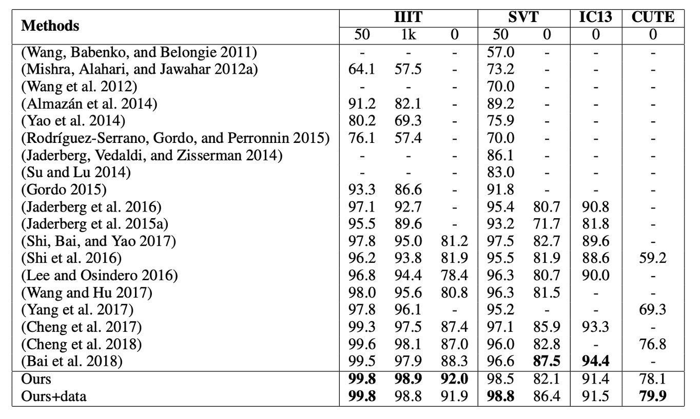

# [18.09] CA-FCN

## A New Dimension

[**Scene Text Recognition from Two-Dimensional Perspective**](https://arxiv.org/abs/1809.06508v2)

---

In recent years, CRNN and its various improvements have dominated the field of scene text recognition, making innovation quite challenging. The authors of this paper decided to take a different approach by reconsidering scene text recognition from a **two-dimensional perspective**, moving away from the conventional methods.

## Problem Definition

Previous works, such as CRNN, typically transform input images into one-dimensional sequential data. This approach works well for regular text but encounters difficulties with highly curved text.

As shown in the image above, in (a), we see an image containing highly curved text. When this image is compressed into one-dimensional sequential data, we observe that each sequence introduces significant background noise due to the curved text. This background noise can interfere with text recognition.

Furthermore, due to the curved nature of the text, each sequence (column) may cover multiple characters simultaneously. This forces the model to extract the correct character from overlapping features, which is a difficult task.

The authors argue that compressing images into one-dimensional sequential data is not well-suited for recognizing highly curved text. Therefore, they proposed a new approach:

- **Keep the image in its two-dimensional form and recognize text directly within this 2D space**.

Introducing a new dimension brings additional advantages: **there is no need to consider sequential information anymore!**. This allows for the entire recognition process to be completed using convolutional neural networks.

## Problem Solving

### Model Architecture

The authors propose the model architecture shown above.

By introducing the concept of FCN (Fully Convolutional Network), the problem of text recognition is transformed into a **pixel-wise classification problem**. The model classifies each pixel in the input image into predefined text categories.

In the "blue" block in the image above, VGG is used as the backbone network, from which feature maps at 1/2, 1/4, and 1/8 scales are extracted.

Moving upwards through the blue block, these feature maps are used to predict the text region map. Each resolution corresponds to a prediction, and these predictions are supervised during training.

Once the predictions are obtained, they form the **text region attention map**. This map is multiplied with the original feature map to obtain the **weighted** text region features.

The weighting formula is as follows:

$$
F_o = F_i \otimes (1 + A)
$$

Where $F_o$ is the weighted feature map, $F_i$ is the original feature map, and $A$ is the text region attention map.

These feature maps are progressively upsampled and finally output as a text feature map with $C$ channels, where $C$ represents the predefined number of text categories.

:::tip
In the diagram, the red lines indicate the use of **deformable convolution** instead of regular convolution. The authors expect this to capture text features more effectively.

The figure below illustrates the difference: the left side shows the receptive field of standard convolution, and the right side shows the receptive field of deformable convolution. You can see that deformable convolution has a more flexible receptive field, allowing it to focus more precisely on text features.

:::

### Training Data Design

The process of creating the training data involves several steps. The authors first prepare training data with **character-level** annotations, and then use these annotations to create binary text region maps, as shown in (b) above.

Let $b = (x_{min}, y_{min}, x_{max}, y_{max})$ represent the original bounding box of the text, defined as the smallest axis-aligned rectangle covering the text.

The actual text region annotation $g = (x^g_{min}, y^g_{min}, x^g_{max}, y^g_{max})$ can be calculated as:

$$
w = x_{max} - x_{min}
$$

$$
h = y_{max} - y_{min}
$$

$$
x^g_{min} = \frac{x_{min} + x_{max} - w \times r}{2}
$$

$$
y^g_{min} = \frac{y_{min} + y_{max} - h \times r}{2}
$$

$$
x^g_{max} = \frac{x_{min} + x_{max} + w \times r}{2}
$$

$$
y^g_{max} = \frac{y_{min} + y_{max} + h \times r}{2}
$$

Where $r$ is the scaling factor for the text region.

The reason for shrinking the text region is to reduce the likelihood of overlapping regions between adjacent characters, simplifying the task of forming distinct text regions.

In practice, the authors set $r$ to 0.5 for the attention supervision and 0.25 for the final output supervision.

### Loss Function

The overall loss is a weighted combination of the character prediction loss $L_p$ and the character attention loss $L_a$:

$$
L = L_p + \alpha \sum_{s=2}^{5} L^s_a
$$

Where $s$ represents the stage index, and $\alpha$ is empirically set to 1.0.

The final output of CA-FCN has a shape of $H/2 \times W/2 \times C$, where $H$ and $W$ are the height and width of the input image, and $C$ is the number of character categories (including background).

Let $X_{i,j,c}$ represent an element in the output map, where $i \in \{1, ..., H/2\}$, $j \in \{1, ..., W/2\}$, and $c \in \{0, 1, ..., C-1\}$; and $Y_{i,j} \in \{0, 1, ..., C-1\}$ represents the corresponding label.

The prediction loss can be computed as:

$$
L_p = - \frac{4}{H \times W} \sum_{i=1}^{H/2} \sum_{j=1}^{W/2} W_{i,j} \left( \sum_{c=0}^{C-1} (Y_{i,j} == c) \log\left(\frac{e^{X_{i,j,c}}}{\sum_{k=0}^{C-1} e^{X_{i,j,k}}}\right) \right),
$$

Where $W_{i,j}$ is the weight assigned to each pixel.

Let $N = H/2 \times W/2$ and $N_{neg}$ be the number of background pixels. The weight is calculated as:

$$
W_{i,j} =
\begin{cases}
\frac{N_{neg}}{N - N_{neg}} & \text{If} \ Y_{i,j} > 0, \\
1 & \text{Otherwise}
\end{cases}
$$

---

The character attention loss is a binary cross-entropy loss, where all character labels are treated as 1 and background labels are treated as 0:

$$
L^s_a = - \frac{4}{H_s \times W_s} \sum_{i=1}^{H_s/2} \sum_{j=1}^{W_s/2} \left( \sum_{c=0}^{1} (Y_{i,j} == c) \log\left(\frac{e^{X_{i,j,c}}}{\sum_{k=0}^{1} e^{X_{i,j,k}}}\right) \right),
$$

Where $H_s$ and $W_s$ are the height and width of the feature map at stage $s$.

:::tip
The mathematical formulas above may seem daunting, but they are essentially just full representations of the Cross Entropy loss, applied to every pixel. The sums and averages ensure it is calculated across all pixels.

An important detail is the distinction between foreground and background weights in $L_p$, which ensures the model focuses more on predicting text regions and is less distracted by the background.
:::

### Word Formation Module

The word formation module converts the precise 2D character map predicted by CA-FCN into a character sequence.

- First, the predicted character map is converted into a binary map, extracting the corresponding character regions based on a threshold.
- Next, the average value of each region is calculated across the $C$ categories, and the region is assigned to the category with the highest average value.
- Finally, these regions are arranged from left to right to form a word.

This approach can generate both the word and the position of each character.

The word formation module assumes that words are generally arranged from left to right, but this may not always be applicable. If necessary, a learnable component can be inserted into CA-FCN to handle more complex cases.

The word formation module is simple yet effective, with only one hyperparameter (the threshold for forming the binary map), which was set to 240/255 in all experiments.

### Evaluation Metrics

The authors used four commonly used benchmarks for scene text recognition to evaluate their model's performance:

1. **ICDAR 2003 (IC03)**

   - The test set contains 251 scene images with annotated text bounding boxes.
   - To ensure fair comparison with previous work, images containing non-alphanumeric characters or fewer than three characters are typically ignored. After filtering, 860 cropped text images are used as the test set.
   - Each test image is provided with a lexicon of 50 words. Additionally, a **full lexicon** is created by combining all test image lexicons for evaluation.

2. **ICDAR 2013 (IC13)**

   - The test set is a corrected version of IC03, containing 1,015 cropped text images with accurate annotations.
   - Unlike IC03, IC13 does not provide lexicons, so evaluations are conducted without lexicon assistance (no-lexicon setting).

3. **IIIT 5K-Word (IIIT5k)**

   - The test set contains 3,000 cropped text images collected from the internet, covering a wide range of fonts and languages.
   - Each image is accompanied by two lexicons: one with 50 words (small lexicon) and one with 1,000 words (large lexicon) for lexicon-assisted evaluation.

4. **Street View Text (SVT)**

   - The test set consists of 249 scene images from Google Street View, from which 647 cropped text images are extracted.
   - Each text image is provided with a 50-word lexicon for lexicon-assisted evaluation.

5. **CUTE**

   - The test set contains 288 images, with many curved text images. No lexicon is provided for this dataset.

### Training Strategy

Since CA-FCN is a fully convolutional architecture, it imposes no restrictions on input image size.

The authors adopted multi-scale training to enhance model robustness, with input images randomly adjusted to:

- $32 \times 128$
- $48 \times 192$
- $64 \times 256$

In addition, data augmentation techniques were applied during training, including random rotation, hue, brightness, contrast, and blurring adjustments. The rotation angle ranged between $[-15^\circ, 15^\circ]$.

Other parameters include:

- The Adam optimizer was used for training, with an initial learning rate of $10^{-4}$.
- The learning rate was reduced to $10^{-5}$ in the 3rd epoch and to $10^{-6}$ in the 4th epoch.
- The model was trained for 5 epochs in total.
- The number of character categories was set to 38, including 26 letters, 10 digits, 1 special character (representing non-alphanumeric characters), and 1 background class.

During testing, the images were resized to a fixed height of 64 ($H_t = 64$), and the width ($W_t$) was calculated as follows:

$$
W_t =
\begin{cases}
W \times \frac{H_t}{H} & \text{If} \ W/H > 4, \\
256 & \text{Otherwise}
\end{cases}
$$

Where $H$ and $W$ are the original height and width of the image.

## Discussion

### Comparison with Other Methods

CA-FCN achieves state-of-the-art performance across multiple benchmark tests.

- On the **IIIT dataset** (without lexicon), it improves upon the previous best method by **3.7%**.
- On the irregular text dataset **CUTE**, it achieves a **3.1%** improvement (without using additional curved text training data).
- It also performs well on other datasets like **SVT** and **IC13**.

To ensure a fair comparison with (Cheng et al., 2017), the authors generated **4 million synthetic images** using the SynthText algorithm and trained the model using the same lexicon as Synth90k. After fine-tuning with additional data, CA-FCN outperforms (Cheng et al., 2017) on **SVT**.

(Bai et al., 2018) achieved good results for regular text recognition, but their one-dimensional approach may struggle with datasets like **CUTE**, which contain irregular, curved text. Our method not only outperforms (Bai et al., 2018) on most benchmarks, but it also shows significant improvements on IIIT and CUTE.

:::tip
The comparison table only includes authors and years, which makes it harder to read. However, this has become a common practice in papers. Interested readers can refer to the original paper for more detailed tables.
:::

### Visualization Results

The authors provide visualization results from the CA-FCN model, as shown above, applied to the IIIT and CUTE80 datasets.

## Conclusion

CA-FCN addresses the text recognition problem using a two-dimensional approach. By performing character classification at each pixel, the algorithm effectively recognizes both regular and irregular text.

Experimental results demonstrate that this model outperforms existing methods on datasets containing both regular and irregular text, showcasing its strong performance across various scenarios.

:::tip
In practical applications, it may be difficult to deploy this model for languages like Chinese, where the number of character categories is close to 100,000. This would significantly increase the size of the prediction branch, making both training and inference computationally expensive.
:::
