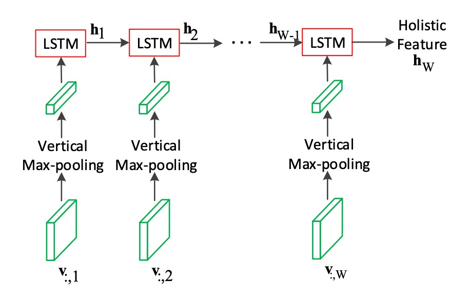

# [18.11] SAR

## 2D Attention Mechanism

[**Show, Attend and Read: A Simple and Strong Baseline for Irregular Text Recognition**](https://arxiv.org/abs/1811.00751v2)

---

Recognizing heavily distorted or curved text is a significant challenge for text recognition models. Although some previous approaches have tried to address this issue, such as using spatial transformation networks (STN) for geometric correction, these methods have had limited success.

## Problem Definition

When tackling irregular text recognition, we can categorize previous approaches into three main directions:

1. **Correction Algorithms**: A representative method in this category is RARE, which uses STN to apply geometric corrections. However, severely distorted text remains difficult to handle.

   - [**[16.03] RARE: Full Automatic Rectification**](../1603-rare/index.md)

2. **Attention Mechanisms**: These methods allow the model to focus on localized 2D features while decoding the text. However, they require character-level supervision during training, making the training data more restrictive.

   - [**[17.11] AON: Towards Arbitrarily-Oriented Text Recognition**](https://arxiv.org/pdf/1711.04226)

3. **Multi-Directional Encoding**: This approach encodes text from four different orientations to handle arbitrarily oriented text. However, it requires a more complex architecture.
   - [**[17.08] Learning to Read Irregular Text with Attention Mechanisms**](https://www.ijcai.org/proceedings/2017/0458.pdf)

---

The authors prefer a simpler method.

Returning to an attention-based encoder-decoder framework, they propose a model based on ResNet and LSTM, combined with a custom 2D attention module to tackle irregular text recognition.

## Solution

### Model Architecture

As shown in the architecture diagram, the authors use ResNet-31 as the feature extractor in the backbone. Since the model directly uses 2D feature maps later on, there's no need for downsampling with inconsistent height and width like in RCNNs.

:::tip
Previous studies mostly used VGG networks.
:::

### Encoder

<figure style={{ "width": "90%"}}>

</figure>

Once the feature map is obtained, the model uses an LSTM to encode the image.

We know that LSTM is designed for processing one-dimensional sequential data, so here, the authors apply max pooling along the "height" of the feature map to compress it into a one-dimensional sequence, which is then fed into the LSTM.

The LSTM consists of two layers, each with 512 hidden units, and from the diagram, it appears to be a unidirectional LSTM.

### Decoder

<figure style={{ "width": "90%"}}>

</figure>

The decoder also uses an LSTM.

As shown in the diagram, the main contribution of the authors is this: if you remove the "2D convolution feature map V" part, it becomes a basic LSTM decoder.

Instead of using just the encoder output features as input, at each decoding step, the decoder recalculates attention weights from the attention map, selecting encoder features.

The LSTM in the decoder also has two layers with 512 hidden units each. The parameters between the encoder and decoder are not shared. During training, teacher forcing is used, but during inference, the model relies on the predictions from the previous timestep.

:::tip
**Teacher Forcing**

Teacher forcing is a training technique where, at each time step, the model is fed the actual target output (ground truth) as input for the next time step, rather than the model's own predictions.

This helps prevent the model from compounding errors when it makes incorrect predictions early in training. However, models that rely too much on teacher forcing can perform poorly during inference since they won’t have access to ground truth inputs. Gradually reducing the use of teacher forcing during training helps the model learn to generate sequences based on its own predictions.
:::

### 2D Attention Mechanism

<figure style={{ "width": "70%"}}>

</figure>

To compensate for the limitations of traditional 2D attention mechanisms, the authors propose a novel attention mechanism that takes into account the spatial relationships in 2D space:

For each position $(i, j)$, the attention score incorporates information from **neighboring positions**. These neighboring positions are from the **8-connected neighborhood** of $(i, j)$.

The attention score $e_{ij}$ is calculated using the following formula:

$$
e_{ij} = \tanh(W_v v_{ij} + \sum_{p,q \in N_{ij}} \tilde{W}_{p-i, q-j} \cdot v_{pq} + W_h h'_t)
$$

Where:

- $v_{ij}$ is the local feature vector at position $(i, j)$.
- $N_{ij}$ represents the 8-connected neighborhood around position $(i, j)$.
- $h'_t$ is the hidden state of the decoder LSTM at time step $t$, which serves as the attention guide.
- $W_v, W_h$, and $\tilde{W}$ are learnable weight matrices.

The attention weights $\alpha_{ij}$ are computed using the softmax function:

$$
\alpha_{ij} = \text{softmax}(w_e^T \cdot e_{ij})
$$

The attention-weighted sum (glimpse) $g_t$ at time step $t$ is computed as:

$$
g_t = \sum_{i,j} \alpha_{ij} v_{ij}, \quad i = 1, \ldots, H, \quad j = 1, \ldots, W
$$

Where $H$ and $W$ are the height and width of the feature map, respectively.

Compared to traditional attention mechanisms, this approach adds a weighted sum term for the 8-connected neighborhood, allowing the model to capture spatial relationships between local features.

:::tip
The formula may seem complex, but this is essentially just applying a convolution operation on the feature map, calculating a softmax, and then computing a weighted sum.

The reason why the 8-connected neighborhood is mentioned is that the convolution kernel size is $3 \times 3$, so each position considers its eight surrounding neighbors.
:::

## Discussion

### Comparison with Other Methods

For irregular text datasets such as **IC15**, **SVTP**, **CT80**, and **COCO-T**, SAR significantly outperforms other methods.

- On **SVTP-None**, accuracy improved by **7.5%** (from 78.9% to 86.4%).
- On **CT80**, accuracy improved by **10.1%** (from 79.5% to 89.6%).

At the same time, SAR also achieved **state-of-the-art performance** on regular text datasets such as **IIIT5K**, **SVT**, and **IC13**.

The advantage of this method is particularly evident when **no lexicon** is provided, especially on **IIIT5K** and **SVTP**, demonstrating the model's robustness in real-world scenarios where lexicons are typically unavailable.

### Visualization

The authors compare the SAR 2D attention model with a traditional 2D attention model.

The decoded characters are shown on the left side of the corresponding attention heatmaps, with incorrect characters marked in red. SAR shows more accurate localization and better recognition results.

## Conclusion

SAR demonstrates excellent performance in both regular and irregular text recognition tasks. It also opens up multiple potential directions for future improvements, particularly in speeding up the training process and handling more complex text structures.

Several later studies use SAR as a baseline for comparison, which we'll explore in future discussions.
