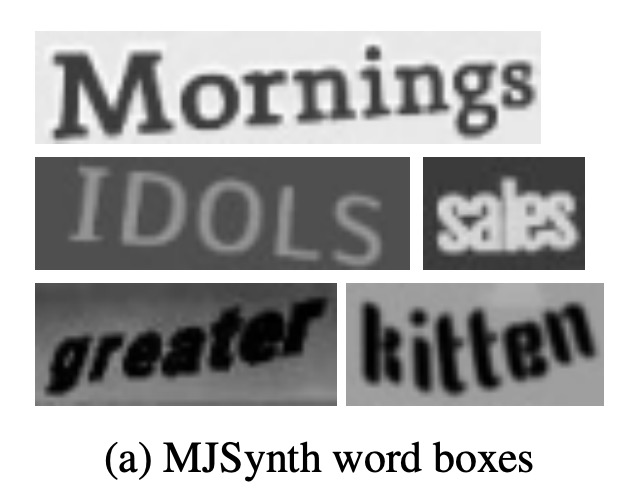
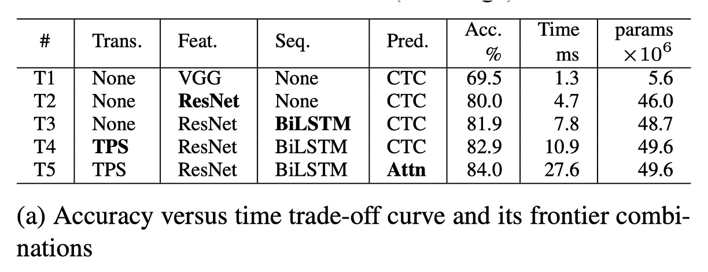

# [19.04] WWWSTR

## Data and Model Analysis

[**What Is Wrong With Scene Text Recognition Model Comparisons? Dataset and Model Analysis**](https://arxiv.org/abs/1904.01906v4)

---

This paper, published by Clova AI, does not propose new techniques but instead presents a comprehensive analysis of existing algorithms and datasets, as well as an exploration of the best combinations of different modules to find the optimal solution.

## Dataset Analysis

Different studies have used various dataset combinations for training, which may result in unclear performance improvements. It becomes difficult to determine if the improvement is due to the proposed new model or the usage of a better or larger dataset.

This inconsistency in datasets affects the fairness of results.

### Training Datasets

Due to the high cost of annotating scene text images, it's challenging to acquire sufficient labeled data, and most STR (Scene Text Recognition) models opt for synthetic datasets for training.

Below are two widely used synthetic datasets in STR research:

- **MJSynth (MJ)**

  - [**Synthetic Word Dataset**](https://www.robots.ox.ac.uk/~vgg/data/text/)

    

    <figure style={{ "width": "60%"}}>
    
    </figure>
    

    MJSynth is a synthetic dataset specifically designed for STR, containing 8.9 million word-box images. The generation process involves font rendering, border and shadow rendering, background coloring, merging fonts and backgrounds, applying perspective distortions, mixing with real images, and adding noise.

- **SynthText (ST)**

  - [**SynthText in the Wild Dataset**](https://www.robots.ox.ac.uk/~vgg/data/scenetext/)

    

    <figure style={{ "width": "60%"}}>
    
    </figure>
    

    SynthText was originally created for scene text detection but has also been used in STR research. Researchers cropped word boxes from this dataset for STR training. After cropping, the SynthText dataset contains about 5.5 million training samples.

### Testing Datasets

Different versions of benchmark datasets have certain differences.

For example, in IC03, a difference of 7 samples can lead to a 0.8% performance gap, which is a significant difference when comparing prior research results.

The sample number differences in IC13 and IC15 are even larger than those in IC03.

Seven real-scene STR datasets are widely used for post-training model evaluation. These datasets can be categorized into "regular datasets" and "irregular datasets" based on the difficulty of the text and its geometric layout:

- **Regular Datasets**: These contain text images where characters are evenly spaced and arranged horizontally, making them relatively easier to process:

    

    <figure style={{ "width": "60%"}}>
    
    </figure>
    

  - **IIIT5K-Words (IIIT)**: A dataset from Google image search containing 2,000 training images and 3,000 evaluation images.
  - **Street View Text (SVT)**: Collected from Google Street View, this dataset contains outdoor street scenes, with some images affected by noise, blur, or low resolution. It includes 257 training images and 647 evaluation images.
  - **ICDAR2003 (IC03)**: Used in the ICDAR 2003 Robust Reading competition, it contains 1,156 training images and 1,110 evaluation images. There are two versions (860 and 867 images) due to the exclusion of words that are too short or contain non-alphanumeric characters.
  - **ICDAR2013 (IC13)**: This dataset inherits most of the images from IC03 and was created for the ICDAR 2013 Robust Reading competition. It contains 848 training images and 1,095 evaluation images. Two versions are available for evaluation, one with 857 images and the other with 1,015.

---

- **Irregular Datasets**: These contain more challenging scene text, such as curved, rotated, or distorted text:

    

    <figure style={{ "width": "60%"}}>
    
    </figure>
    

  - **ICDAR2015 (IC15)**: This dataset, used in the ICDAR 2015 Robust Reading competition, contains 4,468 training images and 2,077 evaluation images. The images are captured from a natural movement perspective using Google Glass, resulting in many images with noise, blur, and rotation. Evaluation versions include 1,811 and 2,077 images.
  - **SVT Perspective (SP)**: Collected from Google Street View, it includes 645 evaluation images, many with perspective distortions due to non-frontal views.
  - **CUTE80 (CT)**: A dataset collected from natural scenes, containing 288 cropped evaluation images, many of which feature curved text.

### Version Differences

Based on the table above, different studies have used different versions of benchmark datasets for model evaluation, particularly in the IC03, IC13, and IC15 datasets.

For example, in IC03, a difference of 7 samples can lead to a 0.8% performance gap, which is significant when comparing results. The differences in sample sizes between IC13 and IC15 are even larger. These dataset version differences can lead to significant errors when evaluating model performance, which must be carefully considered when comparing different models.

:::tip
Version errors can lead to major issues—be cautious!
:::

## Architecture Analysis

STR (Scene Text Recognition) is similar to "object detection" tasks and "sequence prediction" tasks, benefiting from both Convolutional Neural Networks (CNNs) and Recurrent Neural Networks (RNNs).

The earliest model to combine CNN and RNN for STR was CRNN, which used CNNs for feature extraction and RNNs for sequence prediction. Many variants have since been proposed to improve performance, introducing different modules to handle complex features like font styles and backgrounds.

Some methods even omitted the RNN stage to reduce inference time. Subsequent research has introduced attention-based decoders to improve character sequence prediction.

The STR architecture typically follows these four stages:

1. **Transformation**: Spatial transformation networks (STN) are used to normalize input text images, reducing the burden on subsequent stages.
2. **Feature Extraction**: This stage converts input images into representations focused on character recognition while suppressing features irrelevant to fonts, colors, sizes, and backgrounds.
3. **Sequence Modeling**: This stage captures contextual information in the character sequence, improving the accuracy of each character's prediction.
4. **Prediction**: The final character sequence is predicted based on the extracted features.

### Transformation Stage

This stage transforms input images X into normalized images X'.

Since text images in natural scenes vary in shape (such as curved or slanted text), if passed directly to later stages, the feature extraction stage would need to learn representations invariant to these geometric distortions.

To alleviate this burden, some research has employed Thin-Plate Spline (TPS) transformation, a variant of spatial transformation networks (STN). TPS normalizes text regions by performing smooth spline interpolation between a set of control points.

TPS is flexible in handling varying scales of text images and standardizes text regions into predetermined rectangles.

### Feature Extraction Stage

In this stage, CNNs abstract the input image (X or X') into visual feature maps.

Each column of the feature map corresponds to a distinguishable receptive field in the horizontal direction of the input image, and these features are used to predict the character within each receptive field.

Three common architectures are studied: VGG, RCNN, and ResNet:

- **VGG**: A simple architecture composed of multiple convolutional layers and a few fully connected layers.
- **RCNN**: A variant of CNN that recursively adjusts the receptive fields, adapting to character shapes.
- **ResNet**: Incorporates residual connections to alleviate the difficulties of training deep CNNs.

### Sequence Modeling Stage

The output from the feature extraction stage is reshaped into a feature sequence V, where each column $v_i \in V$ is treated as one frame in the sequence.

However, this sequence may lack contextual information, so previous studies have used Bidirectional Long Short-Term Memory (BiLSTM) networks to enhance the sequence $H = Seq.(V)$, capturing contextual relationships in the character sequence.

### Prediction Stage

In this stage, the character sequence $Y = y_1, y_2, …$ is predicted from sequence $H$.

Based on previous research, the authors provide two prediction options:

1. **Connectionist Temporal Classification (CTC)**: This method predicts sequences of variable length with a fixed number of features. By removing repeated characters and blanks, the final character sequence is produced.
2. **Attention-based Sequence Prediction (Attn)**: This method automatically captures the information flow in the input sequence, learning a character-level language model that represents the dependencies between output classes.

These modules can be selected or adjusted as needed to suit different STR applications.

## Experimental Setup

As previously mentioned, the dataset significantly affects STR model performance. To ensure a fair comparison, the authors standardized the training, validation, and evaluation datasets used.

- **Training Dataset**: A combined dataset of MJSynth (8.9 million samples) and SynthText (5.5 million samples), totaling 14.4 million samples.
- **Validation Dataset**: A combination of the training sets from IC13, IC15, IIIT, and SVT, used as the validation dataset.
- **Training Parameters**: AdaDelta optimizer, decay rate ρ=0.95, batch size 192, total iterations 300,000, gradient clipping at 5, He initialization method, and model validation every 2,000 steps.
- **Duplicate Data Handling**: Part of the IC03 training data was excluded due to 34 scene images (containing 215 word boxes) overlapping with the IC13 evaluation dataset.
- **Evaluation Metrics**:
  - **Accuracy**: Success rate of word prediction for the nine evaluation datasets.
  - **Speed**: Average processing time per image (in milliseconds).
  - **Memory**: The number of trainable floating-point parameters in the entire STR model.
- **Experimental Environment**: Intel Xeon(R) E5-2630 v4 2.20GHz CPU, NVIDIA TESLA P40 GPU, 252GB RAM.

## Discussion

The authors analyzed the accuracy-speed and accuracy-memory trade-offs for different module combinations.

The graph below shows the trade-off curves for all module combinations, including six previously proposed STR models (marked with asterisks).

### Accuracy-Time Trade-off Analysis

<figure style={{ "width": "80%"}}>

</figure>

According to chart (a), T1 is the fastest model as it does not include any transformation or sequence modules.

From T1 to T5, the modules are progressively added (in **bold**): **ResNet**, **BiLSTM**, **TPS** (Thin-Plate Spline), and **Attn** (Attention mechanism).

Through these changes from T1 to T5, only one module is altered each time, providing a smooth transition between performance and computational efficiency, allowing minimal trade-offs between performance and efficiency depending on the application scenario.

**ResNet, BiLSTM, and TPS** significantly improve accuracy (69.5%→82.9%) with a moderate speed drop overall (1.3 ms → 10.9 ms).

**Attn** further increases accuracy by 1.1%, but efficiency is drastically reduced (27.6 ms), showing a high efficiency cost.

### Accuracy-Memory Trade-off Analysis

<figure style={{ "width": "80%"}}>

</figure>

According to chart (b), P1 is the model with the least memory consumption. As modules are progressively added from P1 to P5, accuracy improves while memory increases.

In terms of accuracy-memory trade-offs, one module is also altered at a time, and accuracy gradually improves with modules added in this order: **Attn**, **TPS**, **BiLSTM**, and **ResNet**.

Compared to VGG used in T1, **RCNN** is more lightweight in P1-P4, offering good accuracy-memory trade-offs. RCNN uses fewer standalone CNN layers, which are recursively applied, providing lightweight and efficient performance.

Transformation, sequence, and prediction modules have minimal impact on memory consumption (1.9M→7.2M parameters) but can significantly boost accuracy (75.4%→82.3%).

**ResNet** is introduced in the final stage, improving accuracy by 1.7% but substantially increasing memory consumption to 49.6M floating-point parameters. Therefore, memory-sensitive applications can freely choose transformation, sequence, and prediction modules but should avoid high-load feature extractors like ResNet.

### Module Analysis

The authors analyzed the performance of each module in terms of accuracy, speed, and memory requirements.

- **Accuracy Improvement**: Compared to regular benchmark datasets, performance improvements on irregular datasets are approximately double. When comparing accuracy improvement and time usage, the optimal module upgrade order is: **ResNet, BiLSTM, TPS, Attn**. This is the most effective order for upgrading from the baseline combination (None-VGG-None-CTC) and aligns with the accuracy-time trade-off upgrade sequence (T1→T5).
- **Accuracy-Memory Perspective**: From a memory consumption standpoint, the most effective module upgrade order is: **RCNN, Attn, TPS, BiLSTM, ResNet**. This matches the accuracy-memory trade-off upgrade sequence (P1→P5). However, the most efficient module upgrade orders for time and memory are exactly opposite.

### Failure Case Analysis

The authors also analyzed all failure cases.

The chart shows six common types of failures. Of the 8,539 examples in the benchmark datasets, 644 images (7.5%) were not correctly recognized by any model.

1. **Calligraphy Fonts**:

   - Special fonts for brands (e.g., "Coca Cola") or street store names (e.g., "Cafe") remain a challenge. These diverse font styles require a new feature extractor to provide more adaptable visual features.
   - **Future Research**: Regularization may help prevent the model from overfitting to the font styles in the training dataset.

2. **Vertical Text**:

   - Most current STR models assume that the text images are oriented horizontally, making it difficult to handle vertical text. Some models have attempted to utilize vertical information, but handling vertical text remains underdeveloped.
   - **Future Research**: Further research may need to focus on recognizing vertical text more effectively.

3. **Special Characters**:

   - Since current benchmark tests do not evaluate special characters, existing research excludes them during training, causing models to misclassify these characters as alphabetic or numeric.
   - **Future Research**: Including special characters in training could improve the accuracy of the IIIT dataset from 87.9% to 90.3%.

4. **Severe Occlusion**:

   - Current methods do not fully utilize contextual information to overcome occlusion issues.
   - **Future Research**: Using stronger language models to maximize the use of contextual information could help.

5. **Low Resolution**:

   - Existing models do not explicitly address low-resolution cases.
   - **Future Research**: Using image pyramids or super-resolution modules may improve performance.

6. **Label Noise**:

   - Some failure cases are due to mislabeled data in the datasets. Upon examination, all benchmark datasets contain noisy labels.
   - **Label Noise Statistics**:
     - The proportion of incorrect labels without considering special characters is 1.3%.
     - The proportion of incorrect labels considering special characters is 6.1%.
     - The proportion of incorrect labels considering case sensitivity is 24.1%.

## Conclusion

This paper provides an in-depth and comprehensive analysis of the scene text recognition field, offering a unified framework for fairly comparing the performance of different models.

If you don’t have time to read other papers, at least read this one!

It will help you quickly understand the state of the text recognition field as of 2019 and provide clear directions for your research, avoiding many potential pitfalls.
