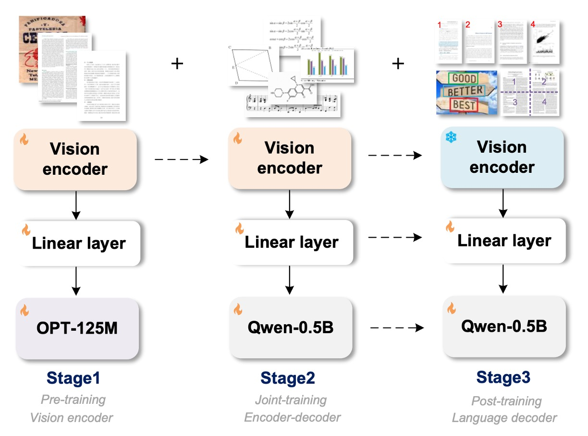
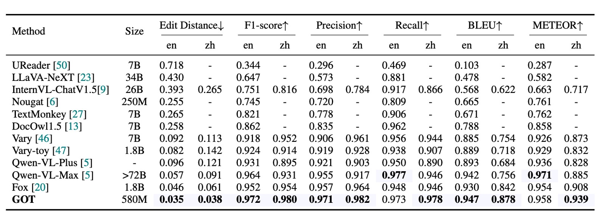
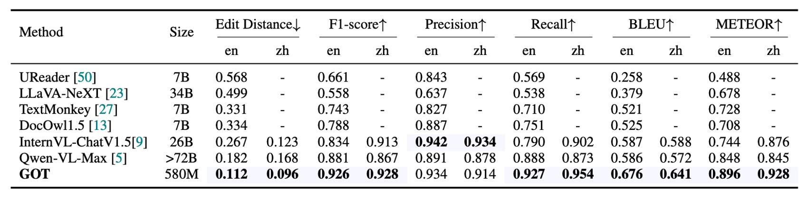
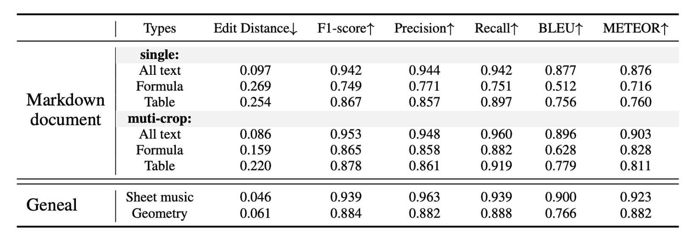
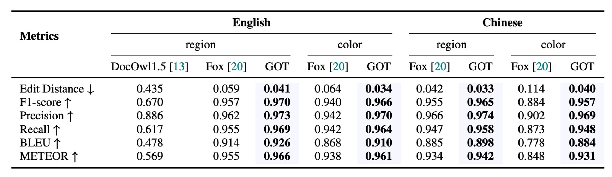
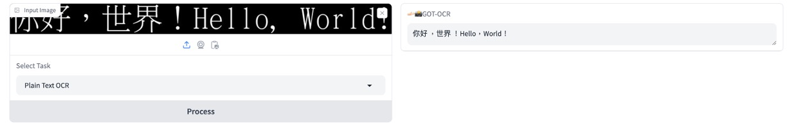
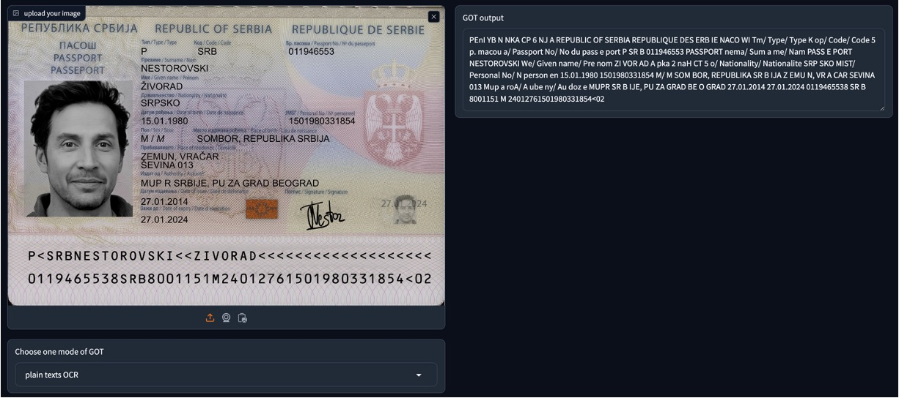

# [24.09] GOT

## All-encompassing OCR

[**General OCR Theory: Towards OCR-2.0 via a Unified End-to-end Model**](https://arxiv.org/abs/2409.01704)

---

This is an end-to-end OCR paper proposed by China's Megvii Technology.

## Problem Definition

OCR (Optical Character Recognition) is a widely used technology, with traditional systems typically relying on a multi-modular pipeline design, involving detection, cropping, and recognition modules. Each module has its specific function, and models are often developed for specific tasks, which can result in suboptimal overall performance and complicated maintenance.

The authors of this paper believe that the models based on these pipeline systems belong to the "OCR 1.0" category. They propose an "All-In-One" model with the following features:

1. It is a unified end-to-end model.
2. It addresses the bottlenecks faced by traditional and LVLM models in OCR tasks.
3. It can handle various generalized OCR tasks.

This model is named **GOT-OCR2.0**!

### Problem Solving

### Model Architecture

The figure above not only illustrates the model architecture but also the training process.

The model architecture consists of three components:

- **Vision Encoder**: This is the image encoding layer responsible for feature extraction from images.
- **Linear**: This is the linear transformation layer that bridges the encoder and decoder feature dimensions.
- **Text Decoder**: This is the text decoding layer, which takes the image information and generates text.

The training process is divided into three phases:

### Phase 1 Training

The authors used the ViTDet architecture as the encoder, benefiting from its local attention mechanism that significantly reduces the computational cost for high-resolution images. The encoder has around 80 million parameters, and the model was trained using 5 million image-text pairs.

- [**[22.03] Exploring Plain Vision Transformer Backbones for Object Detection**](https://arxiv.org/abs/2203.16527)

The encoder's last two layers follow the **Vary** setup, transforming a 1024×1024×3 input image into 256×1024 image tokens. These tokens are projected through a 1024×768 linear layer to match the dimension of the language model (OPT-125M).

- [**[23.12] Vary: Scaling up the vision vocabulary for large vision-language models**](https://arxiv.org/abs/2312.06109)

During preprocessing, images of varying shapes are resized to a 1024×1024 square, balancing the need for different aspect ratios.

#### Training Data

The training data is categorized into two types:

- **Natural Scene Data**

  English images were sampled from the Laion-2B dataset, while Chinese images were taken from the Wukong dataset. The text in these scenes was pseudo-labeled using the PaddleOCR tool. In this step, the authors collected 2 million data samples, evenly split between English and Chinese.

- **Document-level Data**

  The authors collected open-source PDF-type documents from Common Crawl and extracted dense text content using the Fitz Python package. They acquired 1.2 million full-page image-text pairs and 800,000 image fragments of line and paragraph-level data by cropping PDF images based on parsed bounding boxes.

Finally, the text annotation was processed in two ways:

1. Removing the bounding box and assembling the text content in a top-to-bottom, left-to-right sequence.
2. Cropping text regions from the original image based on bounding boxes, stored as image fragments, resulting in 1 million fragment-type image-text pairs.

### Phase 2 Training

After pretraining the vision encoder, the model's knowledge was expanded through "multi-task joint training."

At this stage, the authors replaced the OPT-125M model used in Phase 1 with the Qwen-0.5B model, which has 500 million parameters and contains multilingual priors. The linear embedding layer's dimensions were adjusted to 1024×1024 to match Qwen-0.5B's input channels. GOT adopts an encoder-decoder paradigm, with a total parameter count of approximately 580 million.

The input image for GOT is 1024×1024 pixels, compressed into 256 tokens. The decoder references these tokens to predict OCR results, with a maximum length of up to 8K.

#### Training Data

In this phase, the authors aimed to inject more OCR knowledge by exploring various data generation methods and engines:

- **Pure OCR Data**

  80% of the data from section 3.2.2 was used as pure OCR data, and a handwritten text recognition subtask was added, covering multiple languages and handwriting styles. Datasets included Chinese CASIA-HWDB2, English IAM, and Norwegian NorHand-v3.

- **Mathpix-markdown Format Data**

  To maintain high readability of outputs, especially for mathematical formulas and tables, the authors used various methods to collect a large amount of formatted data:

  - **Math Formulas**: Extracted .tex source files from Arxiv, obtaining around 1 million formula segments, which were converted to Mathpix format and rendered into PNG images.
  - **Molecular Formulas**: Extracted 2 million smiles sources from ChEMBL_25 and generated about 1 million molecular formula image-text pairs using Mathpix and rdkit.Chem tools.
  - **Tables**: Extracted 300,000 table sources from .tex files and rendered them into images using LATEX.
  - **Full-page Data**: Obtained 500,000 pairs of English Markdown PDF-text data and 500,000 pairs of Chinese Markdown data using the Nougat method. Additionally, the authors directly labeled 200,000 internal data points, including books, papers, and financial reports, using Mathpix.

- **Broader OCR Data**

  To enable GOT to handle more general optical character recognition tasks, the authors collected data for three related challenge tasks:

  - **Sheet Music**: Rendered approximately 500,000 single-system sheet music data points using the GrandStaff dataset.
  - **Geometric Figures**: Constructed basic geometric figures (e.g., circles, rectangles, triangles, simple function curves) using TikZ, resulting in about 1 million geometric TikZ data points.
  - **Charts**: Referenced OneChart, rendering chart data using Matplotlib and Pyecharts, generating 2 million chart data points, with half from Matplotlib and the other half from Pyecharts.

### Phase 3 Training

After Phase 2, the model is already capable of handling various OCR tasks. In the final phase, the authors aimed to add more functionality to the model, introducing three new features:

- **Fine-grained Interactive OCR Data Engine**

  Fine-grained OCR is a highly interactive feature that allows for region-level visual perception controlled by spatial coordinates or color. Users can specify regions of interest (RoI) by adding bounding boxes (box-guided OCR) or color-coded text (color-guided OCR) in the query prompt, avoiding unnecessary character output.

  Natural scene fine-grained OCR data comes from open datasets such as RCTW, ReCTS, ShopSign, and COCO-Text. These datasets provide text bounding boxes, used to generate fine-grained OCR data directly. Document-level fine-grained data is obtained by filtering out scanned-format PDF files and using the Fitz/PDFminer Python packages to parse the rest.

- **Large Image OCR with Multi-cropping Data Engine**

  GOT supports a 1024×1024 input resolution, which is sufficient for most common OCR tasks such as scene OCR or A4 page PDF OCR. For cases requiring extremely large images (e.g., two-page PDF spreads), GOT uses a large sliding window to achieve dynamic resolution.

- **Batch OCR for Multi-page PDF Files**

  GOT’s multi-page OCR feature can directly process multi-page PDFs in batches, eliminating the need for a "for loop." This ensures that researchers do not have to worry about annotation interruptions caused by pagination.

  To implement this feature, the authors randomly selected 2-8 pages from Mathpix-format PDF data and merged them into a single OCR task. The overall length was limited to 8K to ensure efficient processing. The authors generated about 200,000 multi-page OCR data points, with many containing mixed English and Chinese pages.

### Training Strategy

The authors used 8×8 L40s GPUs for training, adopting a three-phase training approach:

- **Pretraining Phase**: The entire model was trained using the AdamW optimizer, with a global batch size of 128, over 3 epochs. The initial learning rate was 1e-4, and the maximum token length was set to 4096.
- **Joint Training Phase**: The maximum token length was increased to 6000, using the same optimizer setup as in pretraining, and trained for 1 epoch.
- **Post-training Phase**: The maximum token length was extended to 8192, with an initial learning rate of 2e-5, and trained for 1 epoch to support multi-block/page OCR functionality.

## Discussion

### Plain Text Document OCR Performance

As shown in the table, the main evaluation metrics are Edit Distance, F1 Score, Precision, Recall, BLEU, and METEOR, with word-level segmentation used for calculations. GOT (580M) exhibits outstanding performance in pure text OCR tasks, demonstrating its excellent PDF text recognition capabilities.

### Scene Text OCR Performance

The authors collected 400 natural images, split evenly between Chinese and English, as a benchmark test for scene text OCR. Due to the shorter text in scene images, character-level segmentation was used to calculate the metrics.

GOT also performed remarkably well in natural images, showcasing its superior performance in most fundamental OCR tasks.

### Formatted Document OCR Performance

The data source consists of 90 sample pages, generated using Mathpix pseudo-labeling and manually corrected errors. GOT provided satisfactory results at a single resolution (1024×1024), while the dynamic resolution strategy further improved its performance in small text formulas and tables.

### Fine-grained OCR Performance

GOT demonstrated exceptional performance in fine-grained OCR tasks (including box-guided and color-guided OCR), surpassing Fox, which indicates its strong interactive OCR capabilities.

## Conclusion

GOT is relatively simple in structure and focuses specifically on pure OCR tasks, demonstrating excellent performance across multiple tasks. Its ability to integrate various OCR tasks, including document-level text recognition, scene text recognition, fine-grained interactive OCR, formatted document recognition, and more general character recognition, makes it a highly flexible model with future potential.

The model is available on Hugging Face: [**GOT-OCR2.0**](https://huggingface.co/stepfun-ai/GOT-OCR2_0)

You can test its capabilities on the online demo: [**Online Demo**](https://huggingface.co/spaces/stepfun-ai/GOT_official_online_demo)

:::tip
We conducted our own test, and when inputting a PDF research paper, GOT-OCR2.0 was able to directly extract the text content, supporting multiple languages with impressive results!

However, when the model encounters an unfamiliar format, there might be some issues. For instance, when we input an image of a passport from the MIDV-2020 dataset, GOT-OCR2.0 couldn't fully comprehend the passport's format and could only extract some scattered text.

To use the model effectively, you need to prepare your own fine-tuning data or use the data engines provided by the authors for fine-tuning.

:::
