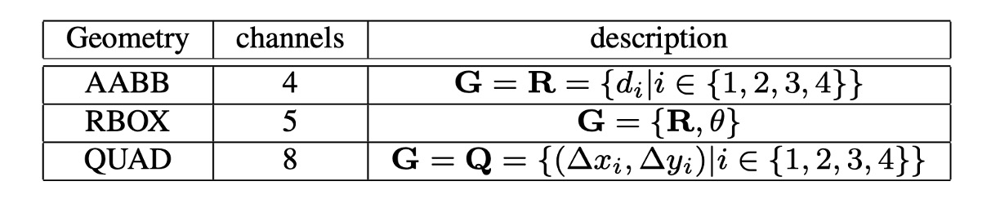
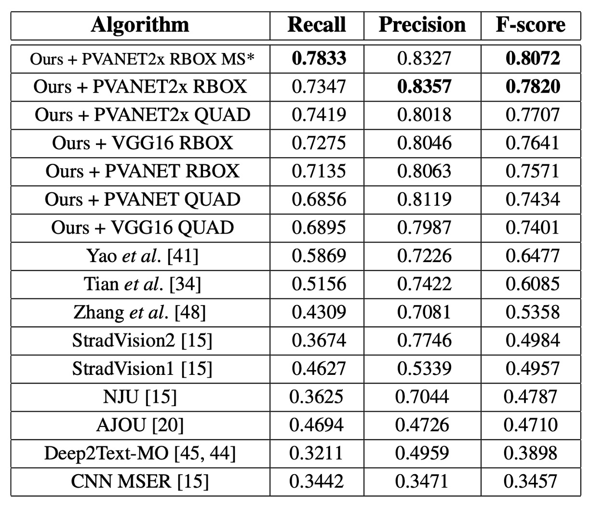
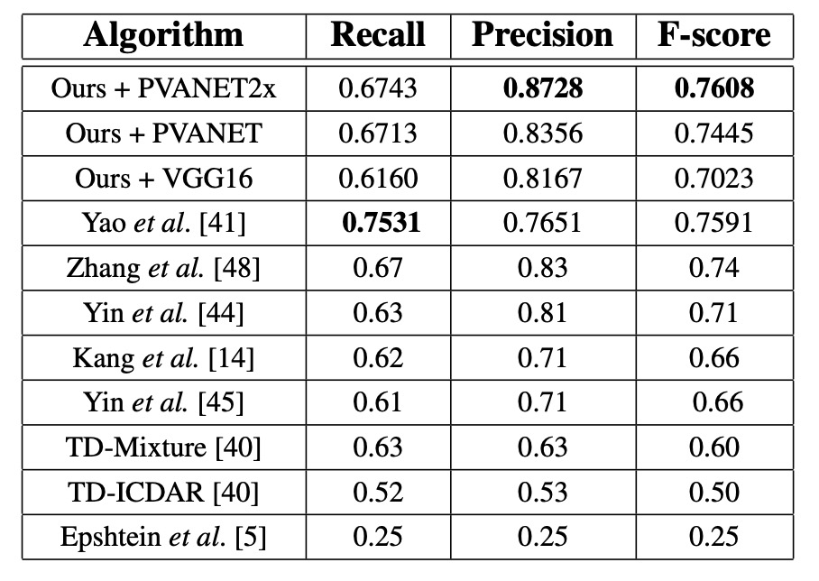

## Simplifying Text Detection

[**EAST: An Efficient and Accurate Scene Text Detector**](https://arxiv.org/abs/1704.03155)

---

With the rise of Fully Convolutional Networks (FCN), dense prediction methods have helped solve the problem of large variations in text sizes.

Soon after, the concept of multi-scale feature fusion also came into focus. The U-Net introduced a way to combine features from different layers, significantly improving the accuracy of object detection.

Naturally, these advancements were applied to text detection, too.

## Defining the Problem

The image above summarizes the various text detection methods explored in previous studies. Most approaches require multiple steps, such as computing text region features, determining text direction, merging regions, or relying on handcrafted features like stroke width or maximally stable extremal regions.

But just as you might dislike these methods for being too complex, so do the authors of this paper. Their goal was to develop a simpler and more efficient approach to text detection.

## Solving the Problem

Since the size of text regions varies greatly, detecting large text areas requires high-level features from deeper layers of a neural network, while accurately predicting the geometry of small text areas relies on low-level features from earlier layers. Thus, a model needs to fuse multi-scale features.

### Model Architecture

In the above diagram, the yellow block on the far left is the Backbone network, which can be replaced with any architecture. In this paper, the authors used VGG16 as the Backbone.

The green block represents the U-Net. The authors utilized U-Net to handle multi-scale feature fusion, but they didn’t go into detail about U-Net in this paper. If you're interested, you can refer to:

- [**[15.05] U-Net: The Dawn of Integration**](../../feature-fusion/1505-unet/index.md)

Finally, there's the detection head, where the authors predict using the "highest resolution" feature map output by the FPN. The detection head is divided into three parts:

1. **RBOX**: Outputs 5 channels representing 4 axis-aligned bounding box edges and a rotation angle. Four of these channels represent the distance from each pixel to the top, bottom, left, and right edges of the rectangle.
2. **QUAD**: Outputs 8 channels representing the offset between each pixel and the four corners of a quadrilateral. Since both $\Delta x$ and $\Delta y$ are required, 8 channels are needed.
3. **SCORE**: Outputs a score indicating whether a region contains text, with a single output channel.

The concept is illustrated in the following image:

### Label Generation

1. **Generating the Score Map for Quadrilaterals**

   In the case of quadrilateral-shaped text areas, the score map's positive region is designed as a smaller version of the original quadrilateral, as shown in image (a) above. For a quadrilateral $Q = \{p_i | i ∈ \{1, 2, 3, 4\} \}$, where $p_i = \{x_i, y_i\}$ are the vertices arranged in clockwise order:

   The quadrilateral shrinking process is as follows:

   1. Calculate the reference length $r_i$ for each vertex $p_i$ using the formula:

      $$
      r_i = \min(D(p_i, p_{(i \mod 4)+1}), D(p_i, p_{((i+2) \mod 4)+1}))
      $$

      Where $D(p_i, p_j)$ is the L2 distance between two vertices.

   2. Shrink the longer sides first, then the shorter sides.
   3. For each pair of opposite sides, the longer one is determined by comparing their mean lengths.
   4. For each side, $p_i$ and $p_{(i \mod 4)+1}$ are shrunk by moving their endpoints inward by $0.3r_i$ and $0.3r_{(i \mod 4)+1}$, respectively.

2. **Generating the Geometry Maps**

   The geometry maps can represent either RBOX or QUAD. The process for generating RBOX is shown in images (c-e) above.

   For datasets that use quadrilateral annotations (e.g., ICDAR 2015), the authors first generate a minimal area rotated rectangle to cover the region. For each pixel with a positive score, the distance to the four boundaries of the text box is calculated and placed into the 4 channels of the RBOX geometry.

   For QUAD, each pixel with a positive score will have values in the 8-channel geometry map, representing the offset from the pixel to the four vertices of the quadrilateral.

### Loss Function

The total loss function is given by:

$$
L = L_s + λ_g L_g
$$

Where $L_s$ represents the score map loss, $L_g$ represents the geometry map loss, and $λ_g$ balances the two, with $λ_g = 1$ used in experiments.

- **Score Map Loss**

  Many detection methods use balanced sampling and hard negative mining to address the imbalance in object distribution. While these techniques improve performance, they introduce non-differentiable processes and additional hyperparameters. To simplify training, the authors used a class-balanced cross-entropy loss:

  $$
  L_s = \text{balanced-xent}( \hat{Y}, Y^* )
  $$

  $$
  = -β Y^* \log \hat{Y} - (1 - β)(1 - Y^*) \log(1 - \hat{Y})
  $$

  Where $\hat{Y}$ is the predicted score map, $Y^*$ is the ground truth, and $β$ is the balancing factor for positive and negative samples:

  $$
  β = 1 - \frac{\sum_{y^* \in Y^*} y^*}{|Y^*|}
  $$

  This balanced cross-entropy was first used by Yao et al. for text detection and proved effective.

  - [**[16.06] Scene Text Detection via Holistic, Multi-Channel Prediction**](https://arxiv.org/abs/1606.09002)

- **RBOX Loss**

  A major challenge in text detection is the wide variation in text sizes. Using $L_1$ or $L_2$ losses directly can result in larger loss values for larger text areas. To ensure scale-invariant geometric predictions, the authors used an IoU loss for the axis-aligned bounding box (AABB) part of RBOX:

  $$
  L_{\text{AABB}} = -\log \text{IoU}( \hat{R}, R^* ) = -\log \frac{| \hat{R} \cap R^* |}{| \hat{R} \cup R^* |}
  $$

  Where $\hat{R}$ is the predicted AABB geometry and $R^*$ is the ground truth.

  The loss for the rotation angle is:

  $$
  L_{\theta}( \hat{\theta}, \theta^* ) = 1 - \cos( \hat{\theta} - \theta^* )
  $$

  The total geometry loss is the weighted sum of the AABB and angle losses:

  $$
  L_g = L_{\text{AABB}} + λ_{\theta} L_{\theta}
  $$

  With $λ_{\theta}$ set to 10 in experiments.

- **QUAD Loss**

  For QUAD, the authors used a Smooth L1 loss with a regularization term to handle the typically longer side in one direction of the quadrilateral.

  The ordered set of quadrilateral coordinates is:

  $$
  C_Q = \{x_1, y_1, x_2, y_2, ..., x_4, y_4\}
  $$

  The loss function is:

  $$
  L_g = L_{\text{QUAD}}( \hat{Q}, Q^* )
  $$

  $$
  = \min_{Q' \in P_{Q^*}} \sum_{c_i \in C_Q, c'_i \in C_{Q'}} \frac{\text{smooth L1}( c_i - c'_i )}{8 \times N_{Q^*}}
  $$

  Where $N_{Q^*}$ is the length of the shortest side of the quadrilateral:

  $$
  N_{Q^*} = \min_{i=1}^{4} D( p_i, p_{(i \mod 4)+1} )
  $$

  $P_Q$ represents all possible vertex orderings, accounting for inconsistent annotation orders in public datasets.

### Training Strategy

The network is trained end-to-end using the ADAM optimizer. To accelerate learning, 512x512 image patches are sampled uniformly, with a batch size of 24. The learning rate starts at $1 \times 10^{-3}$, decaying every 27,300 batches until it reaches $1 \times 10^{-5}$.

**Training continues until no further performance improvement is observed.**

:::tip
This is a "train till the end" approach.
:::

### Locally Aware NMS

After thresholding, the remaining geometries need to be merged using Non-Maximum Suppression (NMS).

Traditional NMS has a time complexity of $O(n^2)$, where $n$ is the number of candidate geometries. This is impractical for dense predictions, which can involve thousands of geometries.

---

Assuming that geometries in nearby pixels are highly correlated, the authors proposed a "row-wise merging" method.

For geometries in the same row, the current geometry is iteratively merged with the previously merged geometry. This method has a time complexity of $O(n)$ in the best case. While the worst case remains $O(n^2)$ like traditional NMS, the method runs efficiently in practice due to the locality assumption.

The detailed process is as follows:

- [**LA-NMS Code Implementation**](https://github.com/foamliu/EAST/blob/master/lanms/lanms.h)

Unlike traditional NMS, this method uses "weighted averaging" to merge geometries, rather than "selecting" one geometry, essentially creating a voting mechanism. However, for simplicity, the authors still use the term "NMS" since the core functionality remains the merging and suppression of redundant geometries.

In the `WEIGHTEDMERGE(g, p)` function, the vertex coordinates of two polygons $g$ and $p$ are averaged based on their scores. If the merged polygon is denoted as $a$, the coordinates of each vertex $a_i$ are calculated as the weighted average of the original vertices $g_i$ and $p_i$, using the formula:

$$
a_i = V(g)g_i + V(p)p_i
$$

Where:

- $V(g)$ and $V(p)$ are the scores of polygons $g$ and $p$, respectively.
- $g_i$ and $p_i$ are the coordinates of the $i$-th vertex of the polygons.
- $a_i$ is the coordinate of the $i$-th vertex of the merged polygon.

The total score $V(a)$ of the merged polygon $a$ is the sum of the scores of the two original polygons:

$$
V(a) = V(g) + V(p)
$$

### Benchmark Datasets

To evaluate the proposed algorithm, the authors conducted experiments on three public benchmark datasets: ICDAR 2015, COCO-Text, and MSRA-TD500.

- **ICDAR 2015**:

  - Contains 1,500 images, with 1,000 for training and 500 for testing.
  - Text regions are annotated using quadrilaterals, which correspond to the QUAD geometry format used in this paper.
  - The images are captured by Google Glass, and the text can appear in any orientation, potentially suffering from motion blur or low resolution.
  - Additionally, 229 training images from ICDAR 2013 were used.

- **COCO-Text**:

  - Currently the largest text detection dataset, containing 63,686 images, with 43,686 for training and 20,000 for testing.
  - Text regions are annotated with axis-aligned bounding boxes (AABB), which is a special case of RBOX.
  - For this dataset, the angle $θ$ is set to 0, and the same data processing and evaluation methods as in ICDAR 2015 are used.

- **MSRA-TD500**:
  - Contains 300 training images and 200 testing images, with text regions in any orientation and annotated at the sentence level.
  - The annotation format is RBOX, and the dataset includes both English and Chinese text.
  - Due to the small number of training images, 400 images from the HUST-TR400 dataset were used for supplementary training.

## Discussion

### ICDAR 2015

For a single scale, the F-score is 0.7820, which improves to 0.8072 with multi-scale testing, significantly outperforming the previous best method (0.8072 vs. 0.6477). Using QUAD output, the proposed method exceeds the previous best method by 0.0924, and using RBOX output, it outperforms the previous method by 0.116.

### COCO-Text

In all configurations, the proposed method achieves the best performance, with the F-score increasing by 0.0614 and the recall by 0.053.

### MSRA-TD500

Using PVANET2x, the F-score is 0.7608, which is 0.0208 higher than the previous state-of-the-art system, with precision improving by 0.0428. The performance of VGG16 is lower (F-score 0.7023 vs. 0.7608 for PVANET2x) because MSRA-TD500 evaluates sentence-level predictions, and VGG16’s receptive field is smaller.

### Visualization Results

## Conclusion

This paper presents a simple and efficient text detection framework that can detect text regions and generate accurate geometric predictions using a single neural network. This approach eliminates the need for complex multi-step processing, resulting in a lightweight and easily implemented model.

While the paper does not extensively discuss the impact of different training techniques, it is unclear which component of the architecture contributes most to the final performance. However, the experimental results demonstrate that the proposed method achieves state-of-the-art performance across three benchmark datasets, highlighting its effectiveness in text detection tasks.
