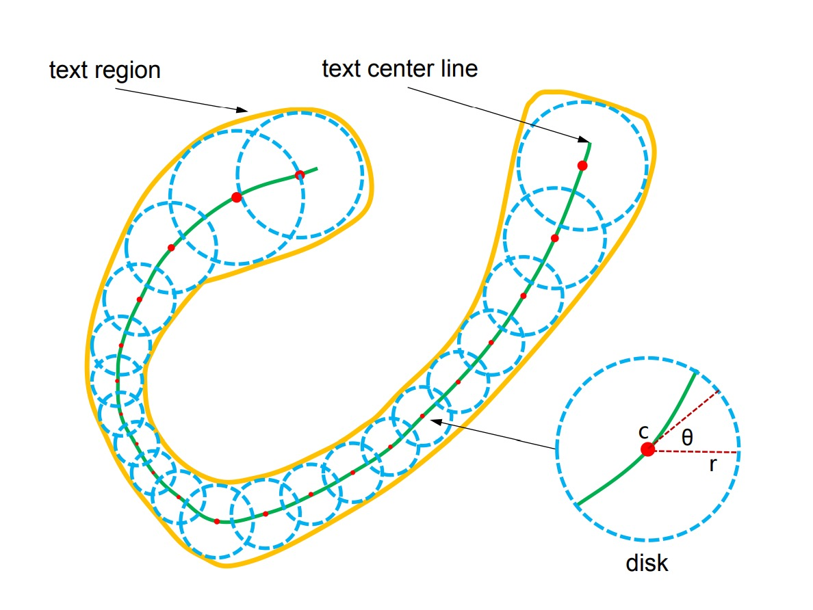
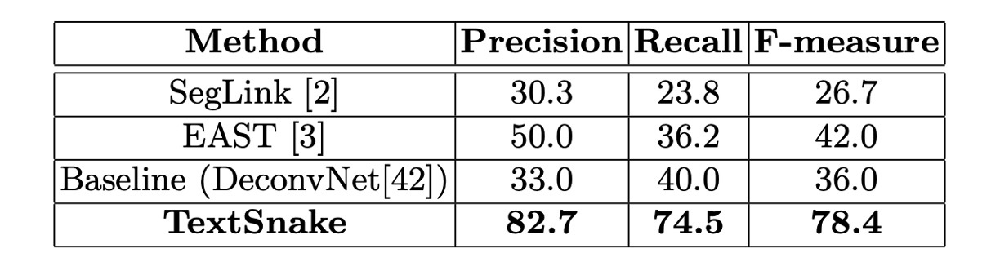
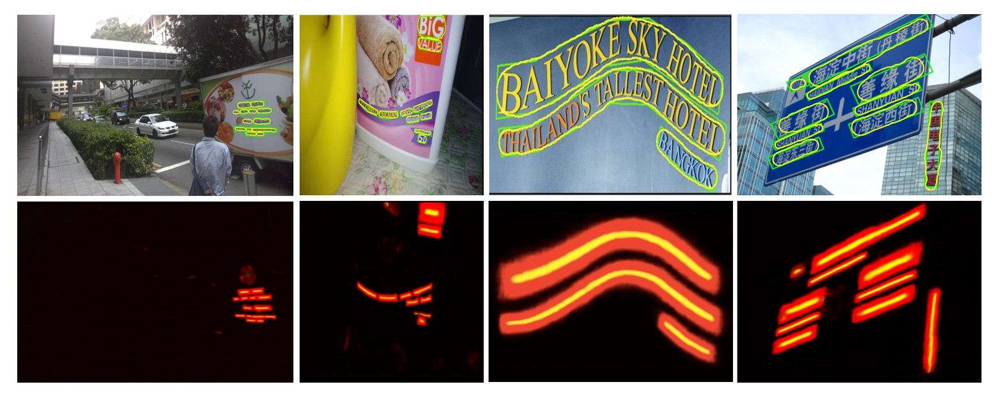
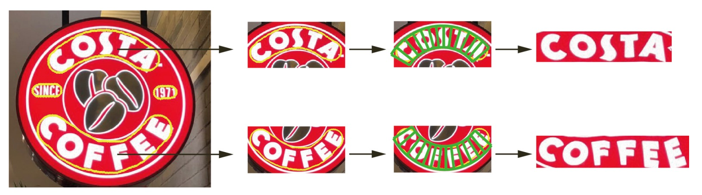

# [18.07] TextSnake

## A snake of text

[**TextSnake: A Flexible Representation for Detecting Text of Arbitrary Shapes**](https://arxiv.org/abs/1807.01544v2)

---

We found this paper particularly interesting, so let's dive into it!

## Problem Definition

Text can appear in a variety of complex and irregular shapes.

Most existing text detection methods assume that text instances are roughly linear in shape and, as a result, often use simpler representations such as axis-aligned rectangles, rotated rectangles, or quadrilaterals to describe them. While these methods have achieved progress on standard benchmarks, they tend to struggle with irregularly shaped text instances, such as curved text. Regardless of the representation, none can fully capture the diversity of text shapes.

To address this challenge, the authors propose a bold new method that represents text through a sequence of overlapping discs, arranged along the centerline of the text region, each associated with a variable radius and orientation. This snake-like structure is named **TextSnake** due to its resemblance to a snake.

## Solution

### Representation

TextSnake represents text through a sequence of overlapping discs that are robust against changes in rotation, scale, and curvature. Each disc is centered along the text's central axis and has geometric attributes, such as radius and direction, to adapt to the text's rotation, scale, and bending. A text instance $t$ consists of multiple characters and can be viewed as a sequence of ordered discs $S(t)$:

$$
S(t) = \{D_0, D_1, \cdots, D_i, \cdots, D_n\}
$$

where $D_i$ represents the $i$-th disc, and there are $n$ total discs. Each disc $D$ is defined by its geometric properties: $D = (c, r, \theta)$, where $c$ is the disc's center, $r$ is its radius, and $\theta$ is its direction.

The radius $r$ is half the width of the text, and $\theta$ is the tangential direction at the centerline near $c$. The text region $t$ can be reconstructed by calculating the union of all discs in the sequence $S(t)$.

:::tip
**Important note**: These discs do not correspond to individual text characters but rather help normalize irregularly shaped text, transforming them into rectangular or linear image regions for easier recognition.
:::

### Model Architecture

The model design begins with standard procedures.

First, a Backbone network is chosen, such as VGG16 or ResNet, which is combined with feature fusion techniques. Here, the authors adopt an FPN (Feature Pyramid Network) approach, merging feature maps at different scales.

In essence, this model follows an FCN (Fully Convolutional Network) approach—performing end-to-end pixel prediction without any linear layers, directly outputting pixel-level predictions.

:::tip
The model doesn't follow FPN exactly, but the general approach of merging features from different scales is preserved.
:::

---

Next, let's talk about the design of the prediction head.

The model uses the highest-resolution feature map from the FPN to predict several geometric attributes of text:

1. **TCL (Text Center Line)**: The text centerline, which distinguishes text areas, with 2 channels.
2. **TR (Text Region)**: The text region, which defines the extent of the text, with 2 channels.
3. **Radius**: The radius of the disc, describing the text's width, with 1 channel.
4. **cos($\theta$) and sin($\theta$)**: The direction of the disc, describing the text's orientation, each using 1 channel (2 channels total).

Thus, the output consists of 7 channels, which collectively describe the shape of the text. Multiplying TCL and TR gives the core area of the text and distinguishes each text instance.

### TextSnake Inference

The authors propose a **striding algorithm** to accurately predict the shape and path of the text.

As shown in the image above, the process begins by randomly selecting a pixel as the starting point and **centralizing** it. Then, a search is performed in two opposite directions through **striding** and centralizing until both ends of the text are reached.

This generates two ordered point lists that represent both ends of the text instance. These lists are merged to create a central axis that accurately describes the shape of the text.

---

Here’s a detailed explanation of the three key actions:

- **Act(a) Centralizing**:
  Given a point on the TCL, the algorithm draws a tangent and normal line (dashed for tangent, solid for normal). The intersection of the normal line with the TCL area is calculated, and the midpoint of the intersection is defined as the **centralized point**.

- **Act(b) Striding**:
  The algorithm strides to the next point by calculating the offset for each step based on geometry:

  $$\left( \frac{1}{2}r \cos\theta, \frac{1}{2}r \sin\theta \right)$$ and $$\left( -\frac{1}{2}r \cos\theta, -\frac{1}{2}r \sin\theta \right)$$

  If the next step exceeds the TCL area, the stride length is reduced until it falls within the TCL area or reaches the end of the text.

- **Act(c) Sliding**:
  The algorithm iterates along the central axis, drawing circles with radii obtained from the geometric map. The area covered by these circles represents the predicted text instance.

By leveraging geometric features and a striding algorithm, the authors efficiently detect and reconstruct the shape of text instances, avoiding the inefficiency of scanning every pixel.

### Label Generation

Assuming the text instance follows a snake-like structure and does not fork into multiple paths, its two end edges will be parallel but in opposite directions.

For a text instance composed of vertices $\{v_0, v_1, v_2, \dots, v_n\}$, arranged either clockwise or counterclockwise, define a metric for each edge $e_{i,i+1}$ as follows:

$$
M(e_{i,i+1}) = \cos\langle e_{i+1,i+2}, e_{i-1,i}\rangle
$$

The two edges with $M$ values closest to $-1$ are considered the endpoints (e.g., AH and DE in the image).

:::tip
The angle between two edges can be calculated using their inner product. The value of the inner product ranges from $[-1, 1]$: it is 1 when the edges are parallel, 0 when perpendicular, and -1 when opposite.
:::

Anchor points are evenly sampled on both end edges, and the TCL points are defined as the midpoints between corresponding anchor points. The TCL is shortened by $\frac{1}{2} r_{end}$ pixels at both ends to ensure it stays within the TR, helping the network separate adjacent text instances. Here, $r_{end}$ is the radius of the TCL endpoints. To avoid the TCL becoming a single-line segment susceptible to noise, the TCL region is expanded by $\frac{1}{5} r$.

For each TCL point:

1. $r$ is the distance from the point to the corresponding edge.
2. $\theta$ is calculated by fitting a straight line to the neighborhood points.

Non-TCL pixels are assigned geometric properties of zero to handle them effectively.

### Loss Function

The overall loss function is defined as:

$$
L = L_{\text{cls}} + L_{\text{reg}}
$$

Where $L_{\text{cls}}$ is the classification loss, and $L_{\text{reg}}$ is the regression loss.

- **Classification Loss ($L_{\text{cls}}$)**:
  $L_{\text{cls}}$ includes classification losses for both TR (Text Region) and TCL (Text Center Line):

  $$
  L_{\text{cls}} = \lambda_1 L_{\text{tr}} + \lambda_2 L_{\text{tcl}}
  $$

  Here, $L_{\text{tr}}$ and $L_{\text{tcl}}$ are cross-entropy losses for TR and TCL, respectively.

  To enhance model performance, the authors apply **Online Hard Negative Mining** for the TR loss, ensuring the ratio of negative to positive samples does not exceed 3:1. For the TCL loss, only pixels within the TR area are considered, and sample balancing is not applied.

- **Regression Loss ($L_{\text{reg}}$)**:
  The regression loss covers the radius $r$, $\cos\theta$, and $\sin\theta$:

  $$
  L_{\text{reg}} = \lambda_3 L_r + \lambda_4 L_{\sin} + \lambda_5 L_{\cos}
  $$

  Smoothed-L1 loss is used for regression:

  $$
  \begin{pmatrix}
  L_r \\
  L_{\cos} \\
  L_{\sin}
  \end{pmatrix} = \text{SmoothedL1} \begin{pmatrix}
  \frac{\hat{r} - r}{r} \\
  \hat{\cos\theta} - \cos\theta \\
  \hat{\sin\theta} - \sin\theta \end{pmatrix}
  $$

  Here, $\hat{r}$, $\hat{\cos\theta}$, and $\hat{\sin\theta}$ are the predicted values, while $r$, $\cos\theta$, and $\sin\theta$ are the ground truth.

The constants $\lambda_1, \lambda_2, \lambda_3, \lambda_4, \lambda_5$ are all set to 1 during experiments.

### Training Datasets

1. **SynthText**:

   - Used for pretraining the model.
   - A large-scale dataset with around 800,000 synthetic images containing text in random fonts, sizes, colors, and orientations.

2. **TotalText**:

   - Includes horizontal, multi-directional, and curved text instances.
   - It features 1,255 training images and 300 test images, focusing on curved text, which is rare in other benchmarks but common in real-world scenarios.

3. **CTW1500**:

   - Mainly composed of curved text.
   - Contains 1,000 training images and 500 test images, with text instances annotated as 14-point polygons.

4. **ICDAR 2015**:

   - Captured using Google Glass, without considering image quality or viewpoint.
   - Includes many small, blurry, multi-directional text instances, with 1,000 training and 500 test images.

5. **MSRA-TD500**:
   - A multilingual dataset with long text lines in various directions.
   - Contains 300 training images and 200 test images, with line-level annotations.
   - The HUST-TR400 dataset is also used in the experiments to augment the training data due to the small training set size.

In ICDAR 2015 and MSRA-TD500, the predicted text regions are fitted with the minimum bounding rectangle.

## Discussion

### Curved Text Results

<figure>

<figcaption>Total-Text Results</figcaption>
</figure>

<figure>

<figcaption>CTW1500 Results</figcaption>
</figure>

---

The model was fine-tuned for around 5,000 iterations on both datasets. For Total-Text, the thresholds $T_{\text{tr}}$ and $T_{\text{tcl}}$ were set to 0.4 and 0.6, respectively, while for CTW1500, they were set to 0.4 and 0.5.

During testing, all Total-Text images were resized to 512 × 512, whereas CTW1500 images were left unchanged due to their smaller size (maximum 400 × 600).

On Total-Text, the method achieved a precision of 82.7%, recall of 74.5%, and F-score of 78.4%, significantly outperforming methods like EAST and SegLink.

On CTW1500, the method achieved a precision of 67.9%, recall of 85.3%, and F-score of 75.6%, surpassing the previous CTD+TLOC method by 2.2% (75.6% vs. 73.4%).

These results demonstrate the effectiveness of the method in handling curved text in natural scenes.

### ICDAR 2015 Results

The fine-tuned model on ICDAR 2015 stopped after about 30,000 iterations.

During testing, all images were resized to 1280 × 768, and the thresholds $T_{\text{tr}}$ and $T_{\text{tcl}}$ were set to 0.4 and 0.9. Since ICDAR 2015 contains many small, unannotated text instances, predicted rectangles with a short side of less than 10 pixels or an area smaller than 300 pixels were filtered out.

The results on ICDAR 2015 showed that this method, even using single-scale testing, outperformed most competitors, demonstrating the general applicability of TextSnake for multi-directional text detection.

### MSRA-TD500 Results

The fine-tuned model stopped after about 10,000 iterations on MSRA-TD500.

During testing, all images were resized to 1280 × 768, and the thresholds $T_{\text{tr}}$ and $T_{\text{tcl}}$ were set to 0.4 and 0.6.

This method achieved an F-score of 78.3%, outperforming other methods. The performance across TotalText, CTW1500, ICDAR 2015, and MSRA-TD500 shows that TextSnake is capable of handling curved, multi-directional, and long straight text lines.

:::tip
The results are promising, but the process is a bit slow.
:::

### Visualization Results

## Conclusion

Traditional methods often lose geometric details when dealing with curved text, resulting in lower recognition accuracy.

TextSnake's primary contribution lies in its ability to locate irregularly shaped text. Its flexibility and geometric descriptions offer a more precise foundation for subsequent text recognition. By accurately tracking curves and locating the centerline, the method generates well-structured text regions, which significantly aids end-to-end text recognition in natural scenes.

The authors also presented results of flattening text based on TextSnake:

Future research will likely focus on developing end-to-end text detection and recognition systems, a natural extension of TextSnake.

If this model can be combined with strong recognition algorithms, it will not only be able to handle more types of scene text but also further improve recognition accuracy and efficiency.
