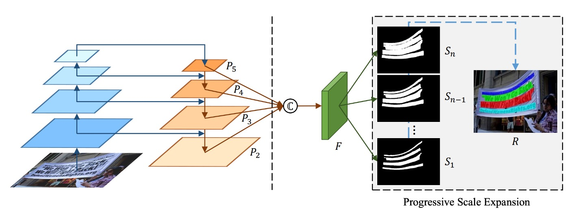
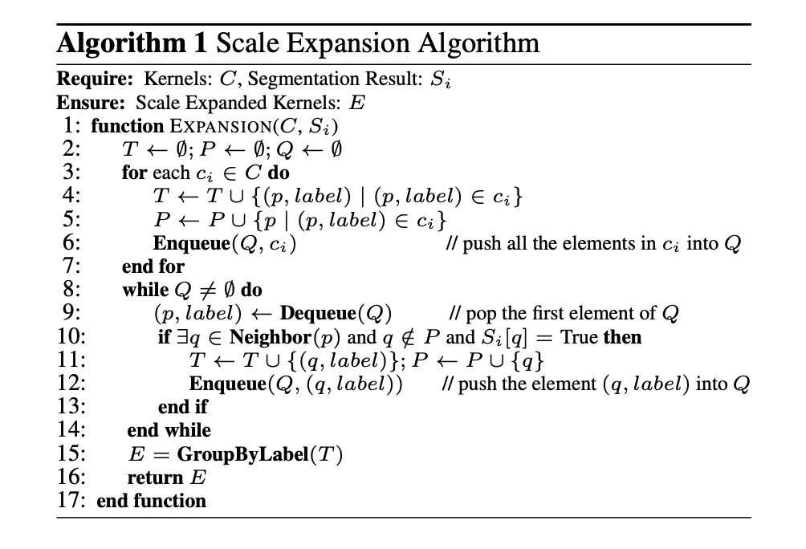
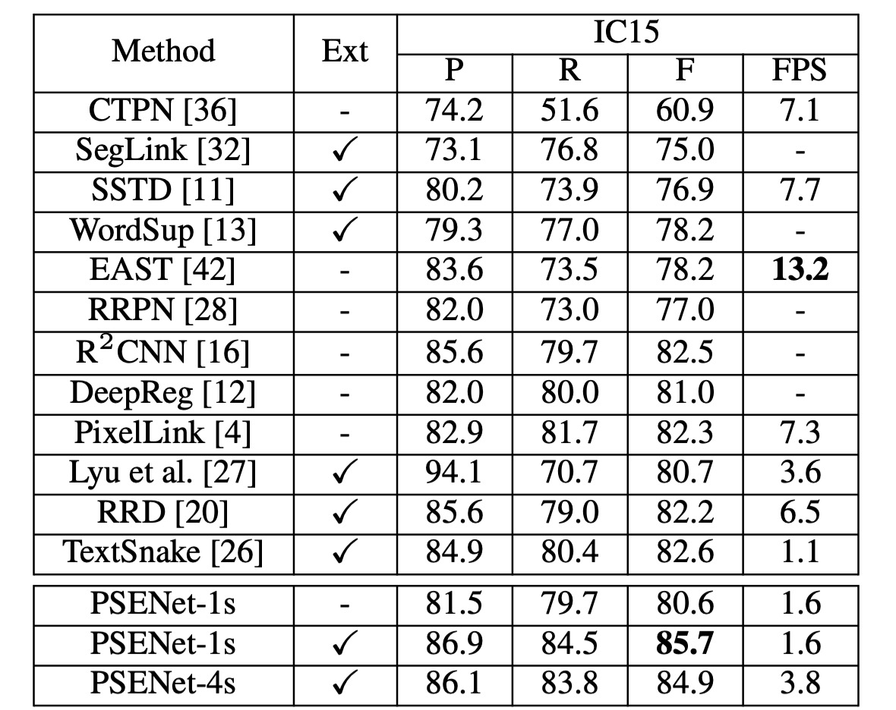

## Progressive Scale Expansion Strategy

[**Shape Robust Text Detection with Progressive Scale Expansion Network**](https://arxiv.org/pdf/1903.12473)

---

With the increasing maturity of convolutional neural networks (CNNs), various applications have been developed. One of the most crucial applications is text detection, as it serves as a foundation for many others, such as OCR, autonomous driving, and image retrieval. However, designing a universal text detection model is highly challenging due to the wide variation in text shapes and sizes.

## Problem Definition

In the early stages of development, object detection was the primary focus of researchers, leading to many text detection methods based on object detection techniques. However, these approaches faced several challenges when applied to text detection:

1. **Dramatic Variations in Text Shape**

   While variations in size are not a significant issue—since multi-scale feature detection is a common approach in object detection—the real problem lies in the drastic changes in text shapes. For instance, as text length increases, the bounding box becomes elongated, and the aspect ratio grows significantly. This poses a challenge for anchor-based methods, as predefined aspect ratios may not cover the wide range of text shapes encountered. Adding unlimited anchor boxes is impractical.

2. **Rectangular Boxes Do Not Fit Well**

   As shown in (b) of the figure above, text is often not neatly rectangular. For example, text on banners or street signs may be curved or irregular, and using rectangular boxes can fail to adequately capture the shape. Poorly fitting detection boxes make subsequent classification difficult and can render the detection itself meaningless.

3. **Segmentation Struggles to Separate Close Text**

   As shown in (c), segmentation-based methods also have significant limitations. Text is often close together or overlapping, and pixel-based segmentation methods struggle to define the boundaries between adjacent characters.

To address these challenges, the authors propose a new idea: rather than directly detecting text, find the core of the text and progressively expand it until reaching the text boundaries.

## Solution

### Model Architecture

The model architecture is straightforward, consisting of a Backbone + Neck (FPN) structure, as shown on the left side of the figure. After obtaining multi-scale feature maps, they are concatenated and passed through a prediction head. The goal of this head is to predict a series of text blocks.

As shown in the figure, $S_1$ represents the smallest text core, $S_2$ expands upon $S_1$, $S_3$ expands upon $S_2$, and so on, until $S_n$. These different scales are generated by applying the Vatti clipping algorithm to progressively shrink the original polygon mask representing the text.

For a given shrink ratio $r_i$, the margin $d_i$ for scaling can be calculated by:

$$
d_i = \frac{Area(p_n) \times (1 - r_i^2)}{Perimeter(p_n)}
$$

The scale ratio $r_i$ is defined as:

$$
r_i = 1 - \frac{(1 - m) \times (n - i)}{n - 1}
$$

Where $m$ is the smallest scale ratio and $n$ is the number of scales. The ground truth masks generated in this way correspond to PSENet’s multi-scale predictions.

### Progressive Expansion

To solve the problem of varying text shapes, the authors introduce a progressive expansion strategy based on the concept of breadth-first search (BFS).

- **Initial Stage**: As shown above, the smallest cores ($S_1$) are identified as connected components ($c_1$, $c_2$, $c_3$, $c_4$).
- **Expansion Stage**: These cores are progressively expanded to $S_2$, then to $S_3$, until reaching the final connected components representing complete text instances.

During expansion, conflicts between pixels from different cores are resolved using a "first-come, first-served" approach, ensuring that each pixel is assigned to only one core.

The algorithm’s steps are as follows:

- **Input**: Core block set $C$, segmentation result $S_i$
- **Output**: Expanded core blocks $E$

1. Initialize empty sets $T$, $P$, and queue $Q$.
2. Add all elements of core blocks $c_i$ to $T$ and $P$, and enqueue $c_i$.
3. Process each element in the queue, checking its neighboring pixels for expansion.
4. Group the expanded results to form the final expanded core blocks $E$.

### Loss Function

The loss function for PSENet is defined as:

$$
L = \lambda L_c + (1 - \lambda)L_s
$$

Where $L_c$ represents the loss for the complete text instance, and $L_s$ represents the loss for the shrunken text instance, with $\lambda$ balancing their importance.

The Dice coefficient is used to calculate the loss instead of binary cross-entropy, which tends to bias predictions towards non-text regions due to text instances occupying small areas in natural images. The Dice coefficient is given by:

$$
D(S_i, G_i) = \frac{2 \sum_{x,y}(S_{i,x,y} \times G_{i,x,y})}{\sum_{x,y} S_{i,x,y}^2 + \sum_{x,y} G_{i,x,y}^2}
$$

Here, $S_{i,x,y}$ and $G_{i,x,y}$ represent the predicted and ground truth values for pixel $(x, y)$. For $L_c$, the formula is:

$$
L_c = 1 - D(S_n \cdot M, G_n \cdot M)
$$

Where $M$ is the mask provided by online hard example mining (OHEM). For $L_s$, the formula is:

$$
L_s = 1 - \frac{\sum_{i=1}^{n-1} D(S_i \cdot W, G_i \cdot W)}{n - 1}
$$

Where $W$ is a mask that ignores non-text areas, defined as:

$$
W_{x,y} =
\begin{cases}
1, & \text{If } S_{n,x,y} \geq 0.5; \\
0, & \text{Otherwise}.
\end{cases}
$$

### Training Datasets

- **CTW1500**

  CTW1500 is a challenging dataset designed for detecting long, curved text. Created by Yuliang et al., it contains 1,000 training images and 500 test images. Unlike traditional text datasets like ICDAR 2015 and ICDAR 2017 MLT, CTW1500 annotates text instances using 14-point polygons, allowing it to describe arbitrarily shaped curved text.

- **Total-Text**

  Total-Text is a newly released curved text detection dataset that includes horizontal, multi-oriented, and curved text instances. The dataset contains 1,255 training images and 300 test images.

- **ICDAR 2015**

  ICDAR 2015 is a widely-used dataset in text detection, consisting of 1,500 images, with 1,000 for training and 500 for testing. Text regions are annotated as quadrilaterals with four vertices.

- **ICDAR 2017 MLT**

  IC17-MLT is a large-scale multi-lingual text dataset that includes 7,200 training images, 1,800 validation images, and 9,000 test images. It contains full scene images across nine languages, making it a comprehensive dataset for multi-lingual text detection.

### Training Strategy

A pre-trained ResNet on ImageNet is used as the backbone, and the optimization is performed using Stochastic Gradient Descent (SGD).

The training strategy for the IC17-MLT dataset differs from others:

For IC17-MLT training, no additional data (e.g., SynthText) was used. The model is trained with a batch size of 16 using 4 GPUs, running for 180K iterations. The initial learning rate is set to $1 \times 10^{-3}$, which is decreased by a factor of 10 at 60K and 120K iterations.

---

For datasets other than IC17-MLT, the training strategy is as follows:

The batch size remains at 16, using 4 GPUs for 36K iterations. The initial learning rate is set to $1 \times 10^{-3}$, and reduced by a factor of 10 at 12K and 24K iterations.

The model is then fine-tuned on the IC17-MLT dataset for 24K iterations, starting with an initial learning rate of $1 \times 10^{-4}$, which is decreased by a factor of 10 after 12K iterations.

- **Optimization and Parameter Settings**

  - Weight decay is set to $5 \times 10^{-4}$, Nesterov momentum is 0.99, and no damping is applied.
  - During training, blurry text regions labeled as "DO NOT CARE" across all datasets are ignored.
  - The balancing parameter $\lambda$ for the loss function is set to 0.7, and the negative-positive sample ratio for OHEM is 3.

- **Data Augmentation Strategy**

  - Images are scaled randomly with ratios of [0.5, 1.0, 2.0, 3.0].
  - Random horizontal flips and rotations are applied, with a range of ±10 degrees.
  - A $640 \times 640$ patch is randomly cropped from the transformed image.

- **Result Generation**

  - For quadrilateral text datasets, the minimum area rectangle is computed to extract the bounding box.
  - For curved text datasets, the PSE output is applied to generate the final results.

## Discussion

### Impact of Component Design

1. **Can the Kernel Block Serve as the Final Output?**

   The answer is no.

   The kernel block's purpose is to roughly locate text instances and distinguish adjacent text. However, the smallest-scale kernel block cannot cover the full text region, negatively impacting text detection and recognition. As shown in figure (a), using only the smallest kernel block as the final result leads to poor F-measure performance on both the ICDAR 2015 and CTW1500 datasets.

2. **Effect of Minimum Kernel Size**

   The authors study the impact of the minimum kernel size $m$ by setting the number of kernels $n = 2$ and varying $m$ from 1 to 0.1.

   As shown in figure (a), when $m$ is too large or too small, the F-measure on the test set decreases. At $m = 1$, only the text segmentation map is used as the final result, without using the Progressive Scale Expansion (PSE) algorithm. Results show that without PSE, the baseline performance is unsatisfactory, as the network fails to distinguish between adjacent text instances.

   When $m$ is too large, PSENet struggles to separate closely located text instances. Conversely, when $m$ is too small, PSENet tends to incorrectly split entire lines of text into different segments, making training harder to converge.

3. **Effect of Kernel Count**

   The authors examine the effect of varying the number of kernels $n$ while keeping the minimum size $m$ constant. For ICDAR 2015, $m = 0.4$, and for CTW1500, $m = 0.6$. The value of $n$ is increased from 2 to 10.

   As shown in figure (b), as $n$ increases, the F-measure on the test set rises steadily and stabilizes when $n \geq 5$. The advantage of multiple kernels is their ability to accurately reconstruct two adjacent text instances with significant size differences.

### Results for Curved Text

To evaluate the curved text detection ability, PSENet was tested on the Total-Text dataset, which focuses on curved text instances.

During testing, the longer side of each image is scaled to 1280, and ResNet50 is used as the backbone network.

- **CTW1500**

  

  PSENet surpasses all other methods on the CTW1500 dataset without using any external data. It achieves an F-measure of 82.2%, which is 8.8% higher than CTD+TLOC and 6.6% higher than TextSnake.

- **Total-Text**

  

  On the Total-Text dataset, PSENet's precision (84.02%), recall (77.96%), and F-measure (80.87%) outperform existing methods, with an F-measure improvement of over 2.47%. Notably, PSENet’s F-measure on Total-Text exceeds the baseline methods by over 40%.

---

The authors also show several challenging results, visually comparing them with existing CTD+TLOC methods, as seen below:

### Results on ICDAR2015

The authors evaluate PSENet on the ICDAR 2015 (IC15) dataset to test its ability to detect oriented text. ResNet50 is used as the backbone for PSENet, and during inference, the longer side of the input image is scaled to 2240.

Under a single-scale setting, PSENet achieves an F-measure of 85.69%, outperforming the previous best result by over 3%.

### Speed Analysis

The authors conducted speed experiments on the CTW1500 test set, evaluating all test images and calculating the average speed. Images were scaled to [1280, 960, 640] along the long side for speed testing. All results were tested using PyTorch on a single 1080Ti GPU.

To balance speed and accuracy, both ResNet50 and ResNet18 were used as backbone networks.

- When the output feature map size is the same as the input image (1/1), PSENet achieves the best performance. However, due to the large feature map size, the PSE stage consumes more than half of the total inference time.
- When the output feature map size is reduced to 1/4 of the input image, the FPS increases from 3.9 to 8.4, with a slight drop in performance from 82.2% to 79.9%.
- When scaling the long side of the image to 640, the FPS further increases to 22, while the detector’s performance remains fairly good (75.6%).

With ResNet18 as the backbone, PSENet's speed reaches near real-time levels (27 FPS), while maintaining competitive performance.

## Conclusion

PSENet’s core idea is to tackle irregular-shaped scene text by progressively expanding detected areas. However, post-processing is still necessary to finalize text regions, which adds computational complexity in real-world applications.

Moreover, the progressive expansion strategy heavily relies on the initial text core region detection. If the core region is inaccurately detected, the subsequent expansion steps will be affected, thereby influencing the final detection result.

In summary, PSENet strikes a good balance between accuracy and speed, making it suitable for many practical applications. Compared to other methods based on semantic segmentation or object detection, PSENet offers a novel approach to detecting challenging text, pushing the field forward significantly.
