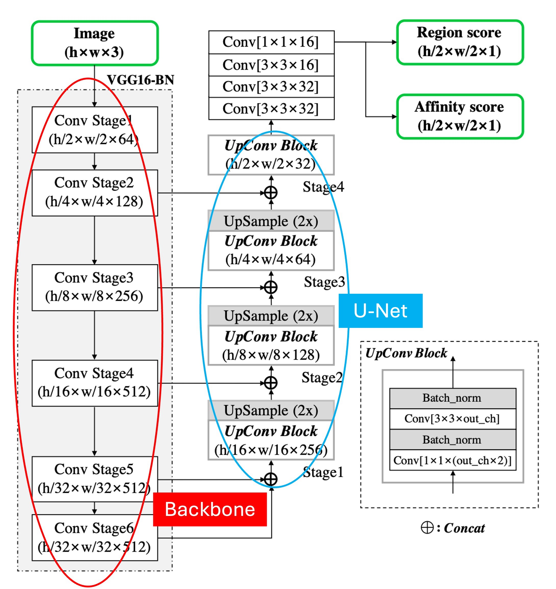
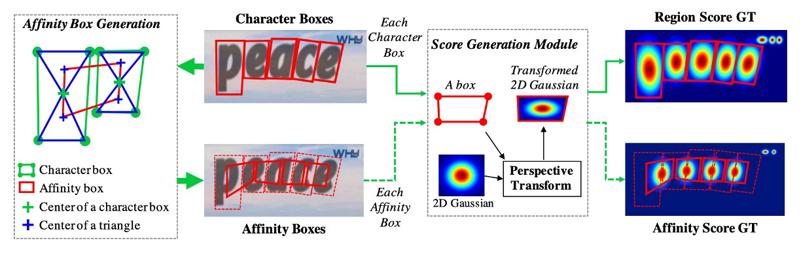
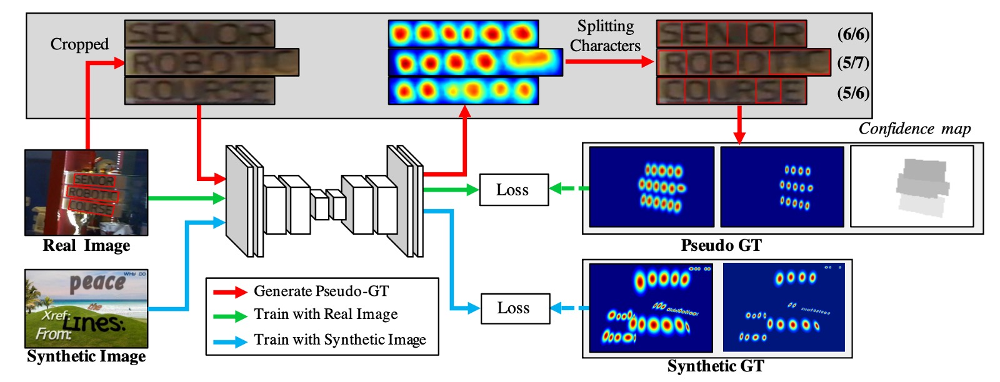
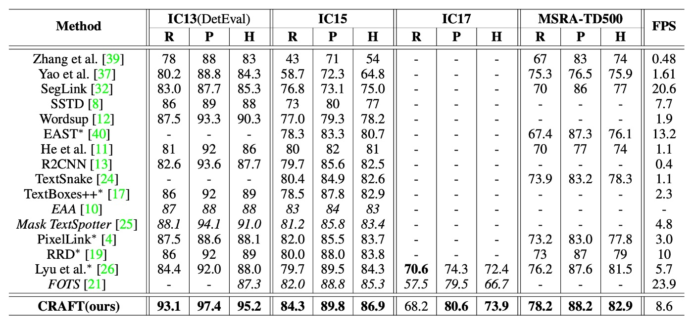

# [19.04] CRAFT

## The Craft of Text

[**Character Region Awareness for Text Detection**](https://arxiv.org/abs/1904.01941)

---

Today, let's explore a well-known text detection paper, **CRAFT**.

Unlike most text detection methods, CRAFT focuses on **character-level** text detection.

## Problem Definition

Character-level text detection is not a common approach, primarily due to the lack of available data.

A previous paper, **Wordsup**, attempted to train a character-level text detector using a weakly supervised framework, but it relied on rectangular anchors to locate characters.

- [**[17.08] Wordsup: Exploiting word annotations for character based text detection**](https://arxiv.org/abs/1708.06720)

The authors of CRAFT believed this method to be insufficiently precise, so they proposed an improved approach based on this inspiration.

## Solution Approach

### Model Architecture

The model architecture follows a conventional **Backbone + Neck** structure.

As shown above, we have labeled the diagram: the Backbone, marked in red, uses **VGG16**. The Neck, marked in blue, adopts a **U-Net** structure, where feature maps are fused via concatenation rather than addition.

:::tip
In the up-sampling stage, if addition is used, it is an FPN-like structure; if concatenation is used, it is a U-Net-like structure.
:::

One unusual aspect of this model is that the Backbone extends to **Stage 6**. This is likely to increase the model's receptive field, but in our experience, text detection, being focused on small objects, typically relies on shallow feature maps for prediction. Stage 6 may be necessary to accommodate particularly large text instances within the dataset.

Lastly, the prediction head uses the highest resolution output feature map to predict two types of score maps: **Region Scores** and **Affinity Scores**.

But what are Region Scores and Affinity Scores? Let’s dive into that next.

### Label Generation

Before discussing the prediction head, we need to explain how the labels are generated.

The authors use datasets with character-level annotations, where the labels are typically masks or text boxes.

For each training image, the character-level boundary boxes are used to generate:

1. **Region Score**: representing the likelihood that a given pixel is at the center of a character.
2. **Affinity Score**: representing the likelihood that a given pixel lies between adjacent characters.

Instead of binary segmentation masks, the authors encode these scores using **Gaussian heatmaps** to represent character center probabilities. The process of calculating these Gaussian values is complex, especially for characters under perspective distortions. To improve efficiency, the following steps are used to generate the ground-truth labels:

1. Prepare a **2D isotropic Gaussian map**.
2. Compute a **perspective transformation** between the Gaussian map and each character box.
3. **Warp the Gaussian map** to match the character box region.

Affinity scores are generated by splitting the diagonal between adjacent character boxes into upper and lower triangles, and using the center of these triangles to generate the affinity box.

:::tip
This heatmap-based representation is common in applications like pose estimation, where it offers flexibility when dealing with non-rigid boundaries.
:::

### Weak Supervision Learning

The authors address the issue of insufficient training data by employing a weakly supervised method to generate character boxes from word-level annotations.

Referring to the diagram above, the blue line shows the process for fully annotated training images. These are simply fed into the model for loss calculation.

For images without character annotations, the green and red lines come into play.

The green line shows how the model outputs region scores for images, but since there are no ground-truth labels for these, the red line kicks in. The authors crop word images from these unannotated images based on word-level annotations, feed them into the model, and let it predict region scores.

Like this:

Then, the **watershed algorithm** is applied to segment the region score into character areas, generating character-level bounding boxes. These coordinates are then mapped back to the original image to create character-level labels, as shown below:

Once the labels are obtained, the standard loss calculation process resumes.

---

For each word-level training sample $w$, the confidence score $s_{\text{conf}}(w)$ is defined as:

$$
s_{\text{conf}}(w) = \frac{l(w) - \min(l(w), |l(w) - l_c(w)|)}{l(w)}
$$

Where $l(w)$ is the length of the word and $l_c(w)$ is the predicted character length.

The pixel-wise confidence map $S_c(p)$ is defined as:

$$
S_c(p) = \begin{cases}
s_{\text{conf}}(w), & p \in R(w) \\
1, & \text{otherwise}
\end{cases}
$$

The training loss function $L$ is defined as:

$$
L = \sum_p S_c(p) \cdot \left( \|S_r(p) - S^*_r(p)\|^2_2 + \|S_a(p) - S^*_a(p)\|^2_2 \right)
$$

Where $S^*_r(p)$ and $S^*_a(p)$ are the ground-truth region and affinity maps, and $S_r(p)$ and $S_a(p)$ are the predicted region and affinity maps.

As the training progresses, the model becomes better at predicting characters, and the confidence score $s_{\text{conf}}(w)$ increases. Early in training, region scores for unfamiliar text in natural images tend to be lower.

---

What happens when the confidence score is below 0.5?

The authors set a rule: **ignore the predicted character boxes in this case, as they would negatively impact training!**

Instead, the authors assume a constant character width and uniformly divide the word region into character-level predictions. Although this results in imprecise character boxes, it helps the model learn the appearance of previously unseen text.

### Word-Level Bounding Boxes

The final output during inference can be in various forms, including word boxes, character boxes, or polygons. For datasets like **ICDAR**, the evaluation is based on word-level Intersection-over-Union (IoU).

Here’s a simplified description of how word-level bounding boxes (QuadBoxes) are generated based on the predicted region and affinity scores.

First, initialize a binary image $M$, which covers the entire image, with all pixels set to 0.

If

$$
S_r(p) > \tau_r
$$

or

$$
S_a(p) > \tau_a
$$

then set $M(p)$ to 1, where $\tau_r$ is the region threshold and $\tau_a$ is the affinity threshold.

Second, perform **connected component labeling (CCL)** on $M$. Finally, using the minimum bounding rectangle that encloses each connected component, the QuadBox is formed. This can be achieved using OpenCV functions like `connectedComponents` and `minAreaRect`.

:::tip
CRAFT doesn't require post-processing methods like non-maximum suppression (NMS). The connected component labeling (CCL) already segments word regions, and the bounding box for each word is simply defined by the minimum enclosing rectangle around those regions.
:::

### Curved Text Polygons

To handle curved text effectively, polygons can be generated to enclose entire character regions. The steps for generating these polygons are as follows:

1. Identify the local maxima along the scan direction of the character region and connect them to form the yellow central lines shown in the diagram.
2. To prevent uneven polygon results, set all local maxima lines to an equal maximum length.
3. Rotate the local maxima lines to be perpendicular to the centerline, reflecting the character's slant (indicated by the red arrows). These local maxima endpoints become candidate control points for the polygon.
4. Finally, extend the two outermost slanted local maxima lines outward along the centerline to fully enclose the text area, forming the final control points (green points).

### Training Datasets

- **SynthText**

  This dataset is used for pre-training the model. It is a large-scale dataset containing about 800,000 synthetic images. These images consist of natural scenes blended with text in random fonts, sizes, colors, and orientations, giving them a realistic appearance.

- **CTW1500**

  CTW1500 is a challenging dataset for detecting long curved texts, constructed by Yuliang et al. It consists of 1000 training images and 500 testing images. Unlike traditional datasets (such as ICDAR 2015, ICDAR 2017 MLT), CTW1500 uses 14-point polygons to annotate text instances, which can describe arbitrary-shaped curved text.

- **Total-Text**

  Total-Text is a newly released curved text detection dataset, containing horizontal, multi-directional, and curved text instances. This benchmark consists of 1255 training images and 300 test images.

- **ICDAR 2013**

  ICDAR 2013 was released during the reading competition, used for focused scene text detection. It contains high-resolution images, with 229 for training and 233 for testing, including English text. The annotations are at the word level using rectangular boxes.

- **ICDAR 2015**

  This is a widely used dataset for text detection, consisting of 1500 images, with 1000 used for training and the rest for testing. The text regions are annotated as quadrilaterals.

- **MSRA-TD500**

  This dataset contains multi-language, arbitrary-direction, long text lines. It includes 300 training images and 200 testing images, annotated at the line level. Due to the small training set, images from the **HUST-TR400** dataset are added for training in the experiments.

- **ICDAR 2017 MLT**

  IC17-MLT is a large-scale multi-lingual text dataset containing 7200 training images, 1800 validation images, and 9000 testing images. The dataset consists of scene images in 9 different languages.

### Training Strategy

1. Initial training is conducted on the **SynthText** dataset, for 50,000 iterations.
2. The model is fine-tuned on the benchmark datasets. For text regions labeled "DO NOT CARE", the confidence score $s_{\text{conf}}(w)$ is set to 0 to ignore them during training.
3. All training is performed using the **ADAM** optimizer.
4. During fine-tuning, the SynthText dataset is mixed at a 1:5 ratio to ensure proper separation of character regions.
5. **Online Hard Negative Mining** is applied at a ratio of 1:3.
6. Basic data augmentation techniques, such as cropping, rotation, and color variations, are also applied.

---

The weakly supervised learning component requires two types of data: quadrilateral annotations and word length.

Datasets that meet these conditions include **IC13**, **IC15**, and **IC17**.

Other datasets, like **MSRA-TD500**, **Total-Text**, and **CTW-1500**, do not meet these requirements:

- MSRA-TD500 does not provide transcripts.
- Total-Text and CTW-1500 only provide polygon annotations.

---

**CRAFT** was trained solely on **ICDAR** datasets and tested on other datasets without additional fine-tuning.

Two models were trained by the authors. The first model was trained exclusively on **IC15** and used to evaluate the IC15 dataset. The second model was jointly trained on **IC13** and **IC17** and used to evaluate the remaining five datasets. The number of fine-tuning iterations was set to 25,000, and no additional images were used for training.

## Discussion

### Comparison with Other Methods

The table above lists **h-mean** scores of various methods on **ICDAR** and **MSRA-TD500** datasets. To ensure fair comparison with end-to-end methods, the paper includes results for detection-only performance as reported in the original papers.

**CRAFT** achieved **state-of-the-art performance** across all datasets, and it runs at **8.6 FPS** on the **IC13** dataset, thanks to its simple and effective post-processing steps.

For the **MSRA-TD500** dataset, the annotations are line-based and include spaces between words. Therefore, a post-processing step is employed to merge word boxes: if the right side of one box is sufficiently close to the left side of another, the boxes are merged. Despite not fine-tuning on the **TD500** training set, **CRAFT** outperformed all other methods on this dataset.

### Visualization

## Conclusion

This paper highlights two key takeaways:

1. **Weak Supervision Learning**: This is an effective approach to address the issue of insufficient data, but it requires certain techniques to enhance model reliability. The confidence score mechanism helps evaluate the accuracy of model predictions, preventing inaccurate labels from negatively affecting training. This is particularly useful for handling limited labeled data in real-world scenarios.

2. **Effective Post-Processing**: In text detection tasks, simple yet efficient post-processing steps can significantly enhance model performance. CRAFT’s post-processing, such as connected component labeling (CCL) and the use of rotating rectangles, reduces reliance on complex post-processing methods like non-maximum suppression (NMS) while effectively handling curved text in polygon generation.

:::tip
From our practical experience, CRAFT’s speed is not the fastest, but it is tolerable. Applying it to private datasets can be challenging and requires considerable effort, especially since the weakly supervised learning component demands specific annotated data and training procedures. Moreover, the authors did not release the training code, which presents an additional barrier for typical users.
:::
