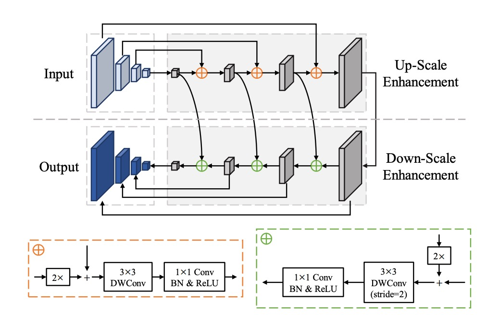
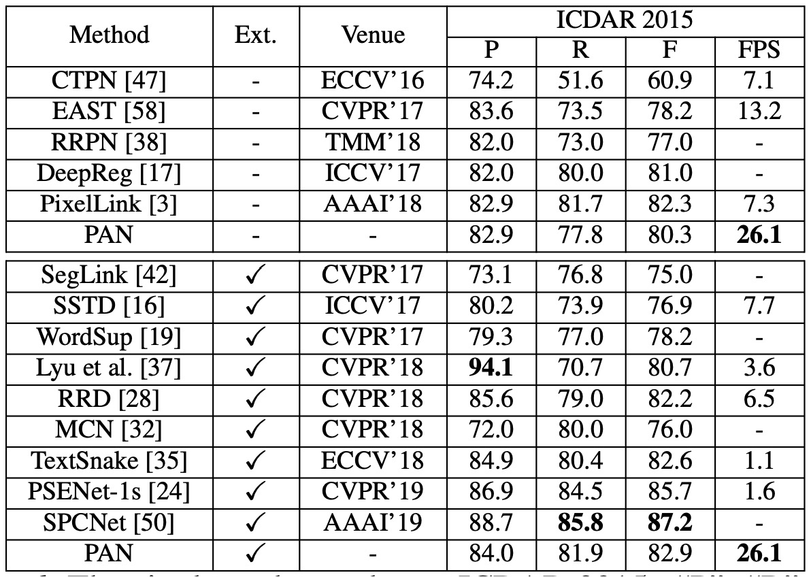
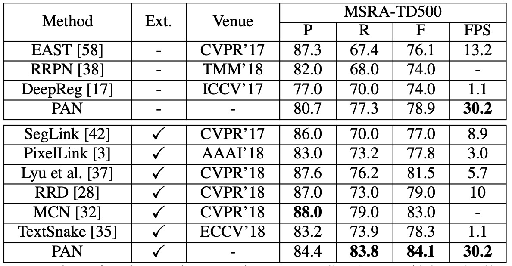

# [19.08] PAN

## Pixel Aggregation Strategy

[**Efficient and Accurate Arbitrary-Shaped Text Detection with Pixel Aggregation Network**](https://arxiv.org/abs/1908.05900)

---

The authors, after recently publishing PSENet, have swiftly followed up with the release of PAN.

- [**[19.03] PSENet: Progressive Expansion Strategy**](../1903-psenet/index.md)

## Problem Definition

This time, the goal is straightforward: the authors felt that the previous model architecture was too slow.

The solution? Replace **ResNet50** and **VGG16** with **ResNet18**!

Also, modify the **FPN** by switching it to **depthwise separable convolutions**!

In short, the focus is on lightweight design—whatever makes the model faster and more efficient!

## Solution

### Model Architecture

The image above shows the model architecture of PAN, which looks quite similar to PSENet. To improve speed, the authors propose several modifications.

First, they reduced the parameters of the Feature Pyramid Network (FPN), but since this reduction would lower feature expression capability, they introduced a new fusion strategy to compensate.

The paper introduces several abbreviations, so let’s familiarize ourselves with them first:

- **FPEM**: Feature Pyramid Enhancement Module
- **FFM**: Feature Fusion Module

Let's break these down in sequence.

### FPEM

This is essentially an FPN, but the convolution layers have been modified. The standard convolutions have been replaced with depthwise separable convolutions to reduce parameters and increase speed.

The authors emphasize that this is a stackable module, where stacking multiple layers enhances feature expression, compensating for the shortcomings of lightweight backbone networks.

:::tip
Stacking multiple feature fusion modules was a common theme in 2019 papers, such as NAS-FPN and BiFPN.
:::

### FFM

After stacking several FPEM modules, you’ll end up with many feature maps.

For example, a single FPEM in the paper produces four feature maps of different scales, with each scale outputting 128 channels. Thus, you have a total of 512 channels. If you stack **N** layers, you'll end up with 512\*N channels, which would be computationally expensive for subsequent processing.

The authors address this by adding up the output feature maps from each FPEM layer, as shown in the image. This means that regardless of how many layers are stacked, you will still only have $4 \times 128$ channels in the final output.

### Pixel Aggregation Strategy

Once the backbone and neck parts are completed, the final stage is the prediction head.

Pixel aggregation aims to correctly merge the pixels in the text region with their corresponding kernel to reconstruct the complete text instance. This method borrows from clustering concepts, where a text instance is treated as a cluster, the kernel as the cluster center, and the pixels in the text region as the samples to be clustered.

During training, pixel aggregation uses an aggregation loss to guide the pixels of text towards their kernel and a discrimination loss to maintain distance between different kernels.

- **(1) Aggregation Loss $L_{\text{agg}}$**

  - The goal of the aggregation loss is to minimize the distance between the pixels of the same text instance and its kernel.
  - For each text instance $T_i$, the loss function is defined as:

  $$
  L_{\text{agg}} = \frac{1}{N} \sum_{i=1}^{N} \frac{1}{|T_i|} \sum_{p \in T_i} \ln(D(p, K_i) + 1),
  $$

  where $N$ is the total number of text instances, $T_i$ is the $i$-th text instance, $K_i$ is its kernel, and $p$ is a pixel within the text instance.

  - The distance function $D(p, K_i)$ is defined as:

  $$
  D(p, K_i) = \max \left( \|F(p) - G(K_i)\| - \delta_{\text{agg}}, 0 \right)^2,
  $$

  where $F(p)$ is the similarity vector of pixel $p$, and $G(K_i)$ is the similarity vector of kernel $K_i$, defined as:

  $$
  G(K_i) = \frac{\sum_{q \in K_i} F(q)}{|K_i|},
  $$

  $\delta_{\text{agg}}$ is set to 0.5, filtering out easily classified samples.

- **(2) Discrimination Loss $L_{\text{dis}}$**

  - The discrimination loss aims to ensure sufficient distance between the kernels of different text instances.
  - The discrimination loss is defined as:

  $$
  L_{\text{dis}} = \frac{1}{N(N - 1)} \sum_{i=1}^{N} \sum_{\substack{j=1 \\ j \neq i}}^{N} \ln(D(K_i, K_j) + 1),
  $$

  where $D(K_i, K_j)$ is the distance between kernels $K_i$ and $K_j$, defined as:

  $$
  D(K_i, K_j) = \max \left( \delta_{\text{dis}} - \|G(K_i) - G(K_j)\|, 0 \right)^2,
  $$

  $\delta_{\text{dis}}$ is set to 3, ensuring that the distance between different kernels is no less than this threshold.

---

During inference, the predicted similarity vectors guide the merging of text pixels with the corresponding kernel. The steps are as follows:

1. **Find kernel connected components**: Identify the connected components in the kernel segmentation results. Each connected component represents a kernel.
2. **Merge neighboring text pixels**: For each kernel $K_i$, merge neighboring text pixels $p$ (using 4-connectivity) if the Euclidean distance between pixel $p$ and kernel $K_i$’s similarity vector is below a threshold $d$.
3. **Repeat merging**: Repeat step 2 until no more neighboring text pixels can be merged.

This method leverages aggregation and discrimination losses to guide the correct merging of kernels and text pixels, ultimately reconstructing the complete text instance.

### Loss Function

The overall loss function is:

$$
L = L_{\text{tex}} + \alpha L_{\text{ker}} + \beta (L_{\text{agg}} + L_{\text{dis}}),
$$

where:

- $L_{\text{tex}}$ represents the text region loss.
- $L_{\text{ker}}$ represents the kernel region loss.
- $L_{\text{agg}}$ and $L_{\text{dis}}$ are the aggregation and discrimination losses.
- The parameters $\alpha = 0.5$ and $\beta = 0.25$ are used to balance the importance of these losses.

To handle the imbalance between text and non-text pixels, the paper uses Dice Loss for supervising the segmentation of text regions $P_{\text{tex}}$ and kernel regions $P_{\text{ker}}$.

The kernel region's ground truth $G_{\text{ker}}$ is obtained by shrinking the original polygon ground truth, following the approach used in PSENet, which shrinks polygons by a ratio $r$.

When calculating $L_{\text{tex}}$, Online Hard Example Mining (OHEM) is employed to ignore easy non-text pixels. When calculating $L_{\text{ker}}$, $L_{\text{agg}}$, and $L_{\text{dis}}$, only text pixels in the ground truth are considered.

### Training Datasets

- **SynthText**

  Used for pre-training the model, SynthText is a large-scale dataset containing approximately 800,000 synthetic images, blending natural scenes with random fonts, sizes, colors, and orientations to create highly realistic images.

- **CTW1500**

  A challenging dataset for long curved text detection, CTW1500 contains 1,000 training images and 500 test images. Unlike traditional datasets (e.g., ICDAR 2015, ICDAR 2017 MLT), the text instances in CTW1500 are labeled with polygons of 14 points, allowing the description of arbitrary curved text shapes.

- **Total-Text**

  Total-Text is a newly released dataset for curved text detection, containing horizontal, multi-directional, and curved text instances. The dataset includes 1,255 training images and 300 test images.

- **ICDAR 2015**

  A commonly used dataset for text detection, ICDAR 2015 contains 1,500 images, with 1,000 for training and the remainder for testing. Text areas are annotated using quadrilateral bounding boxes.

- **MSRA-TD500**

  This dataset features multi-language, arbitrarily oriented, long text lines. It contains 300 training images and 200 test images, with line-level annotations. Due to the small training set, images from the HUST-TR400 dataset were added as training data.

### Training Strategy

PAN uses ResNet or VGG16 as the backbone, pre-trained on ImageNet.

All networks are optimized using Stochastic Gradient Descent (SGD). Pre-training on SynthText involved 50K iterations with a fixed learning rate of $1 \times 10^{-3}$. For other experiments, training lasted 36K iterations, starting with a learning rate of $1 \times 10^{-3}$. Weight decay was set to $5 \times 10^{-4}$, with Nesterov momentum at 0.99.

During training, blurred text regions marked as "DO NOT CARE" were ignored. The OHEM positive-to-negative sample ratio was set to 3. Data augmentation included random scaling, horizontal flipping, rotation, and cropping.

## Discussion

### Ablation Studies

Ablation experiments were conducted on the ICDAR 2015 and CTW1500 datasets to analyze the impact of different modules on PAN’s performance.

- **Effect of stacking FPEMs**

  

  The number of FPEMs was varied by adjusting the value of $n_c$. As shown in the table, as $n_c$ increases, the F-measure on the test set continues to rise, stabilizing at $n_c \geq 2$.

  Although the computational cost of FPEMs is low, adding too many layers slows down inference speed. Each additional FPEM reduces FPS by approximately 5. For a balance between performance and speed, $n_c$ was set to 2 in subsequent experiments.

- **Effectiveness of FPEM**

  

  The experiment compared:

  - ResNet18 + 2 FPEMs + FFM
  - ResNet50 + PSPNet

  The table shows that even though "ResNet18 + 2 FPEMs + FFM" uses a lightweight backbone, its performance is comparable to "ResNet50 + PSPNet" and achieves over five times the inference speed with only 12.25M model size.

- **Effectiveness of FFM / PA**

  

  Removing FFM and concatenating feature maps in the final feature pyramid $F_{nc}$ for the final segmentation led to a 0.6%-0.8% drop in F-measure (see table #1 and #2), indicating the importance of shallow features in addition to deep features for semantic segmentation.

  Removing PA during training reduced the F-measure by over 1% (see table #4), demonstrating the significant impact of PA on model performance.

  Using heavier backbones like ResNet50 and VGG16 improved F-measure on ICDAR 2015 by over 1% and CTW1500 by over 0.5% compared to ResNet18 (see table #5 and #6). However, these heavier backbones significantly slowed inference speed.

### Curved Text Detection Results

- On **CTW1500**:

    <figure>
    
    <figcaption>CTW1500 experiment results</figcaption>
    </figure>

  ***

  - **PAN-320** (input image with a short side of 320) achieved an F-measure of **77.1%** at **84.2 FPS** without pre-training on external data. This F-measure surpassed most methods (even those pre-trained on external data), and PAN-320 was **4 times** faster than the fastest method.
  - With fine-tuning on SynthText, PAN-320’s F-measure increased to **79.9%**, while PAN-512 surpassed all other methods by at least **1.2%**, maintaining near real-time speed at **58 FPS**.

- On **Total-Text**:

    <figure>
    
    <figcaption>Total-Text experiment results</figcaption>
    </figure>

  ***

  - Without external pre-training, **PAN-320** achieved real-time speed (**82.4 FPS**) with an F-measure of **77.1%**, while **PAN-640** achieved an F-measure of **83.5%**, outperforming all other state-of-the-art methods by at least **0.6%**.
  - With SynthText pre-training, PAN-320’s F-measure improved to **79.9%**, and PAN-640’s best F-measure was **85.0%**, **2.1%** higher than the second-best method, SPCNet [50], while maintaining **40 FPS**.

### CTW1500 Experiment Results

**PAN**, without pre-training on external data, achieved an F-measure of **80.4%** at **26.1 FPS**. Compared to EAST, PAN’s F-measure improved by **2.1%**, and it was **2 times** faster.

With fine-tuning on SynthText, the F-measure improved to **82.9%**, comparable to TextSnake, but PAN ran **25 times** faster. While PAN’s performance was slightly lower than PSENet and SPCNet, its speed was at least **16 times** faster at **26.1 FPS**.

### MSRA-TD500 Experiment Results

Without external data, PAN achieved an F-measure of **78.9%**, and with external data, it improved to **84.1%**. Compared to other state-of-the-art methods, PAN performed better and was faster at **30.2 FPS**.

### Visualization Results

## Conclusion

PAN performs exceptionally well in detecting curved, oriented, and long straight text, achieving high F-measure scores with or without pre-training on external data, while maintaining relatively fast inference speeds. This makes PAN a robust text detection method applicable in various scenarios.
