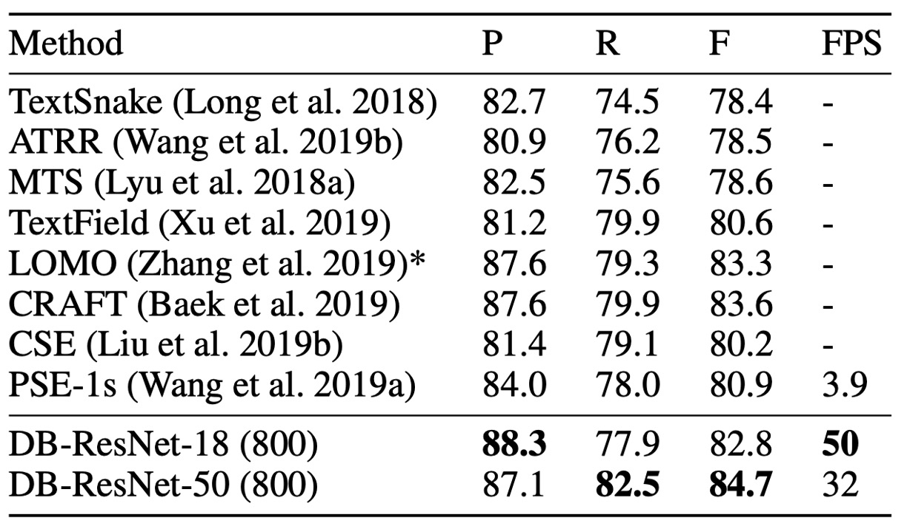
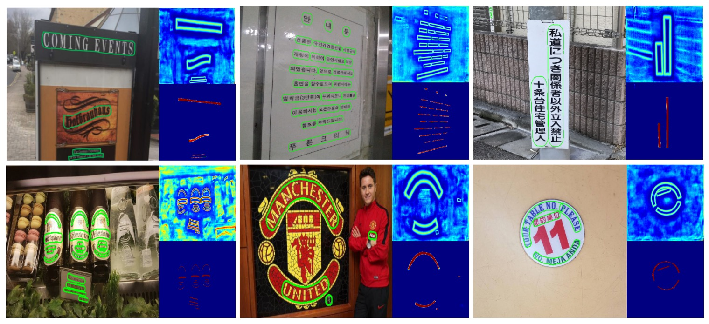

## Differentiable Binarization Function

[**Real-time Scene Text Detection with Differentiable Binarization**](https://arxiv.org/abs/1911.08947)

---

After reviewing several papers on text detection, it's clear that most of the mainstream models are based on segmentation approaches to accomplish the task.

Segmentation essentially predicts pixel values for text regions. However, this approach has an inherent flaw:

- **It struggles to handle overlapping text regions.**

In image classification tasks based on segmentation, a common method is to assign each class to a separate channel. This helps in resolving overlaps between different classes. But in text detection, all the text areas belong to the same class — whether it's region A or region B, both are still text. We can't separate overlapping text regions by simply adding more channels.

Theoretically, it's possible by assigning a large number of channels (say 1000) and allowing the model to decide which text region belongs to which channel. This would solve the overlapping problem.

However, dedicating one channel to represent just one text region seems extremely wasteful. Also, with segmentation outputs being high-resolution images, handling so many channels efficiently would be a massive challenge. On top of that, how would we even determine the number of channels needed?

Given the computational inefficiency, this route is clearly not viable.

## Defining the Problem


Some mainstream research approaches attempt to resolve this problem by first identifying the text kernel and then working around it, as shown by the "blue line" in the diagram above.

For instance, PSENet detects text kernels and then expands outwards to define the text region. PAN, on the other hand, identifies the text kernel and clusters the surrounding pixels. TextSnake also starts with text kernels and then uses directional predictions to define the text regions.

However, the authors of this paper argue that these methods share a common shortcoming: **they are too slow!**

Instead, the authors propose that we should let the model learn to separate different text instances by itself, without relying on complicated post-processing.

## Solving the Problem

### Model Architecture


The architecture itself is not the main focus of this paper, and as far as we can tell, it doesn't present anything particularly novel.

As shown above, the part outlined in red is the Backbone, which in the paper is either ResNet-18 or ResNet-50. The part outlined in green is the FPN, which extracts features at multiple scales.

Once we have the multi-scale feature maps, they are upscaled to the same resolution and concatenated for the final prediction head.

---

The prediction head consists of two branches:

1. The first branch predicts the text region at the pixel level, similar to other segmentation-based methods.
2. The second branch, and the focus of this paper, predicts the **Threshold Map**, which is used to "cut" the text region and separate different text areas.

As seen in the diagram, the text region map and threshold map are combined later to produce the final result.

---

This part of the process is not explained in great detail in the paper, so let's take a look at the code implementation: [**MhLiao/DB**](https://github.com/MhLiao/DB/blob/master/decoders/seg_detector.py).

First, let's look at the text region prediction branch:

```python
self.binarize = nn.Sequential(
    nn.Conv2d(inner_channels, inner_channels //
                4, 3, padding=1, bias=bias),
    BatchNorm2d(inner_channels//4),
    nn.ReLU(inplace=True),
    nn.ConvTranspose2d(inner_channels//4, inner_channels//4, 2, 2),
    BatchNorm2d(inner_channels//4),
    nn.ReLU(inplace=True),
    nn.ConvTranspose2d(inner_channels//4, 1, 2, 2),
    nn.Sigmoid())
```

Here, the input feature maps from FPN are processed through a series of convolutions and transposed convolutions. The final output is a `Sigmoid` value between 0 and 1, representing the probability of each pixel being part of a text region.

Next is the threshold map prediction branch:

```python
self.thresh = nn.Sequential(
    nn.Conv2d(in_channels, inner_channels //
                4, 3, padding=1, bias=bias),
    BatchNorm2d(inner_channels//4),
    nn.ReLU(inplace=True),
    self._init_upsample(inner_channels // 4, inner_channels//4, smooth=smooth, bias=bias),
    BatchNorm2d(inner_channels//4),
    nn.ReLU(inplace=True),
    self._init_upsample(inner_channels // 4, 1, smooth=smooth, bias=bias),
    nn.Sigmoid())
```

Again, input feature maps from FPN go through convolutions and upsampling operations. The final output is a `Sigmoid` value between 0 and 1, representing the threshold map.

Finally, the text region map and threshold map are combined to produce the final result:

```python
def forward(self, features, gt=None, masks=None, training=False):

    # Skip Backbone + Neck code

    # Compute text region map
    binary = self.binarize(fuse)

    if self.training:
        result = OrderedDict(binary=binary)
    else:
        # In inference mode, return only the text region map
        return binary

    # In training mode
    if self.adaptive and self.training:
        if self.serial:
            fuse = torch.cat(
                    (fuse, nn.functional.interpolate(
                        binary, fuse.shape[2:])), 1)

        # Compute threshold map
        thresh = self.thresh(fuse)

        # Apply the step function to threshold the map
        thresh_binary = self.step_function(binary, thresh)

        # Return both results for supervision during training
        result.update(thresh=thresh, thresh_binary=thresh_binary)

    return result

# Binarization function
def step_function(self, x, y):
    return torch.reciprocal(1 + torch.exp(-self.k * (x - y)))
```

Here, the `step_function` implements the differentiable binarization mentioned in the paper. It takes the text region map and threshold map as inputs and produces a final binary result by subtracting the two maps.

This might look familiar:

`torch.reciprocal(1 + torch.exp(-self.k * (x - y)))` ...

Hey! That's just the **Sigmoid function**!

---

The standard Sigmoid function is defined as:

$$
\sigma(x) = \frac{1}{1 + e^{-x}}
$$

---

The difference here is that the function includes a parameter $k$, which controls the steepness of the binarization. In the paper, this parameter is set to 50.

So, the function becomes:

$$
\sigma(x) = \frac{1}{1 + e^{-50(x - y)}}
$$

If you plug in some values, you'll see that with $k = 50$, the function forms a very steep step, making it **almost** like a binarization function, but still differentiable.

---

### Label Generation


This part of the algorithm is inspired by PSENet:

- [**[19.03] PSENet: Progressive Expansion Strategy**](../1903-psenet/index.md)

Given a text image, each text region's polygon is described by a set of lines:

$$
G = \{S_k\}_{k=1}^{n}
$$

Where $n$ is the number of vertices. Different datasets may have different vertex counts, for example, ICDAR 2015 uses 4 vertices, while CTW1500 uses 16.

Then, the positive text region is generated by shrinking the polygon $G$ into $G_s$ using the Vatti clipping algorithm.

The shrinkage distance $D$ is calculated based on the perimeter $L$ and area $A$ of the original polygon:

$$
D = \frac{A(1 - r^2)}{L}
$$

Where $r$ is the shrinkage ratio, empirically set to 0.4.

---

A similar process is used to generate labels for the threshold map.

First, the text polygon $G$ is expanded to $G_d$ using the same offset $D$. The region between $G_s$ and $G_d$ is considered the text boundary, and within this region, the threshold map label is generated by calculating the distance to the nearest segment in $G$.

### Loss Function

<div align="center">

</div>

The total loss function $L$ is defined as the weighted sum of the probability map loss $L_s$, the binary map loss $L_b$, and the threshold map loss $L_t$:

$$
L = L_s + \alpha \times L_b + \beta \times L_t
$$

Where $L_s$ is the loss for the probability map, and $L_b$ is the loss for the binary map. Empirically, $\alpha$ and $\beta$ are set to 1.0 and 10, respectively.

For the probability map loss $L_s$ and binary map loss $L_b$, binary cross-entropy (BCE) loss is applied. To address the imbalance between positive and negative samples, hard negative mining is used to balance the sample ratio.

The specific loss calculation is as follows:

$$
L_s = L_b = \sum_{i \in S_l} \left[ y_i \log x_i + (1 - y_i) \log (1 - x_i) \right]
$$

Where $S_l$ is the sampled set, with a positive to negative sample ratio of 1:3.

---

The threshold map loss $L_t$ is the sum of $L_1$ distances between the predicted and labeled threshold values within the expanded text polygon $G_d$:

$$
L_t = \sum_{i \in R_d} | y_i^* - x_i^* |
$$

Where $R_d$ is the set of pixel indices inside the expanded polygon $G_d$, and $y_i^*$ represents the threshold map label.

---

During inference, to improve efficiency, the authors use the probability map to generate bounding boxes, bypassing the need for the threshold branch.

The bounding box generation involves three steps:

1. Binarizing the probability map with a fixed threshold of 0.2 to obtain the binary map.
2. Extracting connected components (shrunk text regions) from the binary map.
3. Expanding these shrunk regions using the Vatti clipping algorithm, with the expansion offset $D_0$ calculated as:

   $$
   D_0 = \frac{A_0 \times r_0}{L_0}
   $$

   Where $A_0$ is the area of the shrunk polygon, $L_0$ is its perimeter, and $r_0$ is empirically set to 1.5.

### Training Datasets

- **SynthText**

  This dataset is used for pre-training the model. It contains around 800,000 synthetic images where text is blended into natural scenes with random fonts, sizes, colors, and orientations.

- **CTW1500**

  CTW1500 is a challenging dataset for long, curved text detection, containing 1000 training and 500 test images. Unlike traditional datasets like ICDAR 2015 and ICDAR 2017 MLT, CTW1500 annotates text instances using 14-point polygons, which can describe arbitrary-shaped curved text.

- **Total-Text**

  Total-Text is a newly released curved text detection dataset, including horizontal, multi-oriented, and curved text instances. It consists of 1255 training images and 300 test images.

- **ICDAR 2015**

  ICDAR 2015 is a widely-used dataset for text detection, containing 1500 images (1000 for training and 500 for testing). Text regions are annotated with quadrilateral vertices.

- **MSRA-TD500**

  This dataset includes multi-language, arbitrary-oriented, and long text lines. It contains 300 training and 200 test images, with text lines annotated at the line level. Due to the small size of the training set, images from the HUST-TR400 dataset were added to augment training data.

- **ICDAR 2017 MLT**

  IC17-MLT is a large-scale multi-lingual text dataset that includes 7,200 training images, 1,800 validation images, and 9,000 test images. It contains full scene images across nine languages, making it a comprehensive dataset for multi-lingual text detection.

## Discussion

### Ablation Study


From the table above, the use of differentiable binarization significantly improves performance on both the MSRA-TD500 and CTW1500 datasets. For the ResNet-18 backbone, DB improves the F-score by 3.7% on MSRA-TD500 and 4.9% on CTW1500.

Deformable convolution brings a 1.5% to 5.0% performance boost by providing flexible receptive fields with minimal extra computation. On the CTW1500 dataset, ResNet-18's performance increased by 3.6%, while ResNet-50 saw a 4.9% improvement.

---


Although unsupervised threshold maps visually resemble the supervised ones, supervision leads to better performance. The table shows that threshold map supervision improves ResNet-18's performance by 0.7% and ResNet-50's by 2.6% on the MLT-2017 dataset.

Among backbone networks, ResNet-50 outperforms ResNet-18 but runs at a slower speed.

### Curved Text Detection Results

<figure>

<figcaption>Total-Text Results</figcaption>
</figure>

<figure>

<figcaption>CTW1500 Results</figcaption>
</figure>

---

DB model achieves state-of-the-art accuracy and speed on both Total-Text and CTW1500 curved text datasets.

DB-ResNet-50 improves over the previous best methods by 1.1% on Total-Text and 1.2% on CTW1500. Additionally, DB-ResNet-50 runs faster than all previous methods, and using the ResNet-18 backbone further increases speed with only a slight performance drop.

### ICDAR 2015 Results

<figure>

<figcaption>ICDAR 2015 Results</figcaption>
</figure>

---

ICDAR 2015 is a multi-oriented text dataset containing many small and low-resolution text instances.

According to the table above, DB-ResNet-50 (1152) achieves state-of-the-art accuracy. Compared to the previous fastest method, DB-ResNet-50 (736) surpasses it by 7.2% in accuracy and doubles the speed.

With the ResNet-18 backbone, DB-ResNet-18 (736) runs at 48 FPS and achieves an F-score of 82.3.

### Visualization of Results



## Conclusion

DB introduces a new differentiable binarization technique that allows for generating binary maps directly from probability maps without the need for post-processing. This technique improves text detection performance and achieves state-of-the-art results on multiple benchmark datasets.

In practice, DB is widely used for deployment primarily due to its speed. Moreover, its simple architecture makes it easy to train. The model has been implemented in various OCR frameworks such as PaddleOCR and MMOCR.

As we have seen, the most challenging part of the paper lies in the implementation of the binarization function.

Finally, this architecture only alleviates the problem of overlapping text, making the text areas that can be segmented more obvious, but fundamentally does not solve the problem of overlapping text, and let us continue to look forward to subsequent research.
