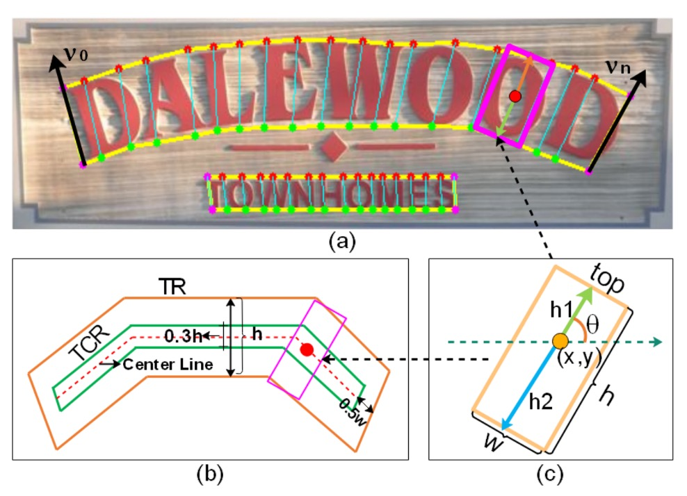
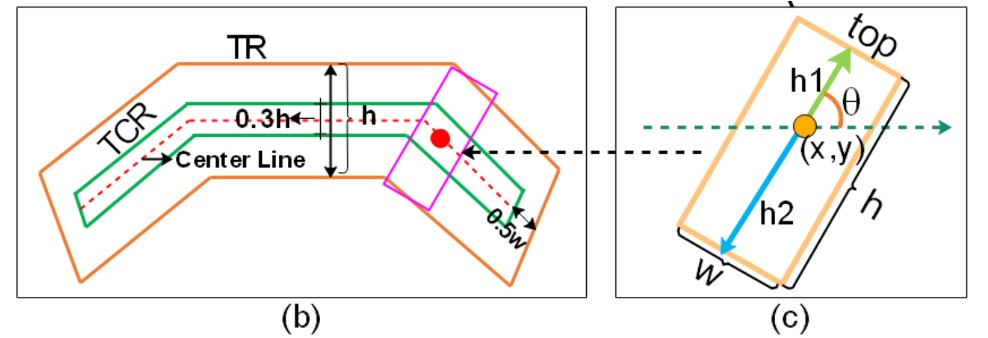
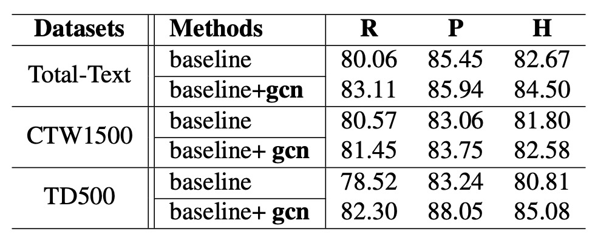
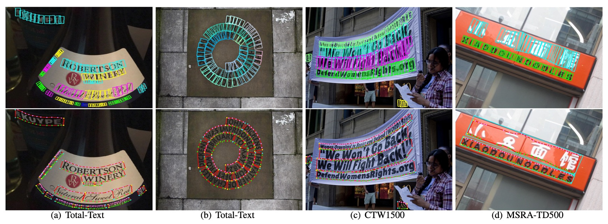

# [20.03] DRRG

## A first look at GCN

[**Deep Relational Reasoning Graph Network for Arbitrary Shape Text Detection**](https://arxiv.org/abs/2003.07493)

---

Around 2020, Graph Convolutional Networks (GCN) became highly popular.

At a time when Transformer had not yet been widely applied to the image domain, GCN was an excellent choice, as it could handle irregular data and capture relationships between data points.

Unfortunately, just as graph convolution was about to gain traction in the computer vision field, it was prematurely overshadowed by the rise of Transformer.

:::tip
If you're not familiar with Graph Convolutional Networks, you can check out our other article:

- [**A Brief Introduction to Graph Convolutional Networks**](https://docsaid.org/en/blog/graph-convolutional-networks/)
  :::

## Defining the Problem

With a new tool available, it was surprising that no one had used it to tackle the problem of text detection — this was clearly the biggest issue!

Thus, the author decided to use Graph Convolutional Networks to address the problem of text detection, leading to the "first" paper that applied graph convolutional networks to text detection.

Therefore, the most difficult part of the entire paper is understanding what Graph Convolutional Networks are. If you've already mastered this concept, then this paper should pose no difficulty.

## Solving the Problem

### Model Architecture

<figure style={{"width": "90%"}}>

</figure>

The entire model architecture consists of many components. We can break it down into a few parts:

1. **Feature Extractor**: Uses VGG-16 as the backbone network and adds FPN (Feature Pyramid Network).
2. **Text Component Definition**: Cuts the text instances into a series of ordered, near-rectangular fragments.
3. **Text Component Prediction**: Uses convolution operations to predict the text components.
4. **Loss Function Calculation**: Computes the loss between predicted results and ground truth labels.
5. **Graph Convolutional Network**: Represents the relationships between text components as a graph and uses GCN for inference.

### Feature Extraction

<figure style={{"width": "60%"}}>

</figure>

First, we need a feature extractor. Here, VGG-16 is used as the backbone network, with FPN (Feature Pyramid Network) added.

Although the paper mentions FPN, from the diagram, we can see that when combining features from different layers, concatenation is used instead of the addition used in FPN, making this structure more similar to U-Net rather than FPN.

### Text Component Definition

<figure style={{"width": "60%"}}>

</figure>

:::tip
Here, some terminology corresponds with the diagram above.
:::

In this paper, the author cuts the complete text instance (such as a line or a word area) into a series of ordered, near-rectangular fragments.

By using these small fragments, the prediction can more finely describe the shape, size, and orientation of the text, ultimately reassembling the fragments to form the complete text.

Each text component $D$ is represented by a set of geometric properties:

$$
D = (x, y, h, w, \cos\theta, \sin\theta)
$$

- $x, y$: The center coordinates of the component, i.e., the position of the text component in the image.
- $h, w$: Represent the height and width of the component.
- $\cos\theta, \sin\theta$: Used to represent the orientation of the text component.

Since angles are periodic in mathematics, using $\cos\theta$ and $\sin\theta$ avoids the complexities of directly using angles, while ensuring smooth changes in direction.

- **Definition of $h$**:

  In the paper, the height $h$ of the text component is composed of the upper part $h_1$ and the lower part $h_2$.

- **Relationship between width $w$ and height $h$**:

  The width $w$ is obtained through a linear rule based on the height $h$.

  In the experiment, a minimum width $w_{\min}$ and maximum width $w_{\max}$ are set. The rule is as follows:

  $$
  w_i =
  \begin{cases}
  w_{\min}, & h_i \leq 2 \cdot w_{\min} \\
  \frac{h_i}{2}, & 2 \cdot w_{\min} < h_i < 2 \cdot w_{\max} \\
  w_{\max}, & h_i \geq 2 \cdot w_{\max}
  \end{cases}
  $$

  The meaning is:

  - When the component is short ($h_i$ is small), the width is fixed to a minimum value $w_{\min}$ to avoid components being too narrow to recognize.
  - When the component height is within a middle range, the width is proportional to the height ($w = h/2$) to maintain a reasonable aspect ratio.
  - If the component height is too large, the width is locked to the maximum value $w_{\max}$ to prevent excessive elongation.

  In the experiment, the author set $w_{\min} = 8$ and $w_{\max} = 24$.

---

To clearly define the orientation of the text (such as italic or horizontal) and to facilitate the extraction of the "Text Center Region (TCR)," the author uses the method of TextSnake.

:::tip
If you're interested in the details of TextSnake, you can refer to our other article:

- [**[18.07] TextSnake: A snake of text**](../1807-textsnake/index.md)
  :::

The steps are as follows:

1. **Obtain the top and bottom point sequences**:

   The text area is divided along its long side into a series of quadrilaterals (just like breaking a long line of text into smaller segments). As a result, we obtain two sets of points:

   - $P_1 = \{tp_0, tp_1, ..., tp_n\}$: A sequence of points corresponding to the top line of the text.
   - $P_2 = \{bp_0, bp_1, ..., bp_n\}$: A sequence of points corresponding to the bottom line of the text.

   Here, $tp_i$ and $bp_i$ can be considered as the upper and lower boundary points of the same vertical cut.

2. **Determine which is the top line and which is the bottom line**:

   With $P_1$ and $P_2$, we need to know which set of points is the top and which is the bottom.

   Thus, a set of vectors $V$ is defined:

   $$
   V = \{ tp_0 - bp_0, tp_1 - bp_1, \ldots, tp_n - bp_n \}
   $$

   This is a set of vertical vectors formed by subtracting the corresponding points of the top line from the bottom line. We then compute

   $$
   p = \sum_{i=0}^{n} \sin(v_i)
   $$

   where $v_i = tp_i - bp_i$. If $p \geq 0$, it means $P_1$ is the top line and $P_2$ is the bottom line; otherwise, the opposite.

   This method uses the direction of the vectors to determine the top and bottom lines, allowing us to identify the orientation of the text region and infer the text's tilt angle $\theta$.

3. **Obtain the Text Center Region (TCR)**:

    

    <figure style={{"width": "90%"}}>
    
    </figure>
    

   After determining the orientation of the text, the text region (Text Region, TR) is "shrunk" to obtain a smaller and more precise Text Center Region (TCR).

   Looking closely at the image above, the method can be divided into three steps:

   - Calculate the center line of the text, which is the line in the middle of the top and bottom lines.
   - Shorten each end of the center line by $0.5w$ pixels to prevent overlap with adjacent text instances.
   - Expand the center line in the vertical direction by $0.3h$, forming a thicker center band region, which is the desired TCR.

   The existence of TCR helps the network focus more easily on the true core position of the text during subsequent predictions, and provides greater flexibility when distinguishing adjacent text (e.g., consecutive words in the same line).

### Text Component Prediction

We already know the text components defined by the author, and next we use the feature maps processed through the Backbone and FPN to predict the text components. This is achieved through the following convolution operation to obtain the CR:

$$
CR = \text{conv}_{1\times1}(\text{conv}_{3\times3}(F_{\text{share}}))
$$

This means performing a $3\times3$ convolution on the feature map first, followed by a $1\times1$ convolution.

The final $CR$ tensor has dimensions of $(h \times w \times 8)$, where $h \times w$ is the spatial size of the feature map, and the last dimension has 8 channels, which correspond to:

- 4 channels for the classification logits (to determine if a pixel belongs to TR / TCR or other categories, such as background). By applying softmax to these 4 channels, we obtain the probability distribution of each pixel being in TR or TCR.
- 4 channels for regression output: including $h_1, h_2, \cos\theta, \sin\theta$.

Here, the softmax operation is used to classify each pixel, deciding whether it belongs to the "text region" or "text center region". Additionally, by normalizing $\cos\theta$ and $\sin\theta$ to ensure that $\cos^2\theta + \sin^2\theta = 1$, we maintain the validity of the orientation values.

Finally, by setting a threshold and applying Non-Maximum Suppression (NMS) in local regions, redundant overlapping components can be removed, resulting in cleaner and more precise text component detection.

### Loss Function Calculation

The overall detection loss $L_{\text{det}}$ consists of two parts:

$$
L_{\text{det}} = L_{\text{cls}} + L_{\text{reg}}
$$

- $L_{\text{cls}}$: Classification loss, used to determine which pixels belong to the text region (TCR/TR) or the background.
- $L_{\text{reg}}$: Regression loss, used to accurately predict the geometric properties of the text, such as height and orientation.

---

The classification loss $L_{\text{cls}}$ is a cross-entropy loss.

The paper divides the entire text-related region into two areas:

- **TR (Text Region)**: The entire text area, including the range between the upper and lower boundaries of the text.
- **TCR (Text Center Region)**: The "text center region" obtained by shrinking/adjusting from the TR, used to more precisely locate the text's core position and avoid interference.

It is defined as:

$$
L_{\text{cls}} = L_{\text{tr}} + \lambda_1 L_{\text{tcrp}} + \lambda_2 L_{\text{tcrn}}
$$

There are three sub-losses here:

1. $L_{\text{tr}}$:
   Classification error for determining which pixels belong to the text region TR.

2. $L_{\text{tcrp}}$:
   Calculated only for pixels inside TR, ensuring that in the true text region, TCR (the center of the text) is correctly distinguished.
   In other words, $L_{\text{tcrp}}$ specifically distinguishes pixels inside the "text" region as either "text center region" or "non-center text region."

3. $L_{\text{tcrn}}$:
   Calculated only for pixels outside the TR region, used to suppress the noise of TCR appearing in the background.
   In brief, if TCR is incorrectly predicted in the background (areas without text), this loss is increased to force the network not to incorrectly label TCR in the background.

To stabilize training, the paper uses the OHEM (Online Hard Example Mining) method. OHEM selects difficult negative samples (pixels that do not belong to the text region) for loss computation, preventing an excess of easy-to-classify negative samples from affecting training. The ratio of negative to positive samples is set to 3:1.

In the experiment, hyperparameters are set to $\lambda_1 = 1.0$ and $\lambda_2 = 0.5$, which represent the weights of $L_{\text{tcrp}}$ and $L_{\text{tcrn}}$ in the overall classification loss.

---

Regression loss is used to teach the model to estimate text properties such as height and orientation accurately.

However, since only the TCR provides clear height and orientation information (TCR is a region that precisely falls at the center of the text, allowing stable acquisition of text direction and height annotations), regression loss is only calculated within the TCR region.

It is defined as:

$$
L_{\text{reg}} = L_{h} + \beta(L_{\sin} + L_{\cos})
$$

This includes three parts:

1. **$L_h$: Height regression loss**

   Used to measure the difference between the predicted and actual height.

   Here, the height $h$ is composed of $h_1$ and $h_2$ (as previously defined, $h = h_1 + h_2$).

   The loss is computed as:

   $$
   L_{h} = \frac{1}{\Omega} \sum_{i \in \Omega} \left( \log(h + 1) \sum_{k=0}^{2} \text{smoothL1}\left(\frac{\hat{h}_{ki}}{h_{ki}} - 1\right) \right)
   $$

   Where:

   - $\Omega$: The set of all positive samples in the TCR (pixels with corresponding annotations).
   - $h_{ki}$: The real height-related parameters ($h_0, h_1, h_2$, etc., actually referring to the regression of the height components).
   - $\hat{h}_{ki}$: The predicted values from the model.

     ***

   :::tip
   **Why is there a $\log(h+1)$ weighting term?**

   Because for larger texts (higher heights), the impact of prediction errors may be more significant. By using $\log(h+1)$, we give higher weight to larger text components, helping the model maintain accuracy across various text sizes.
   :::

2. **$L_{\sin}$ and $L_{\cos}$: Direction regression loss**

   Used to measure how accurately the predicted text direction (represented by $\sin \theta$ and $\cos \theta$) matches the actual direction:

   $$
   L_{\sin} = \text{smoothL1}(\hat{\sin\theta} - \sin\theta)
   $$

   $$
   L_{\cos} = \text{smoothL1}(\hat{\cos\theta} - \cos\theta)
   $$

   Smooth L1 loss is used to reduce the impact of extreme errors, making the training more stable.

3. **$\beta$: A balancing factor**

   Used to control the weight of the direction losses $L_{\sin}$ and $L_{\cos}$ within the overall $L_{\text{reg}}$. The paper sets $\beta = 1.0$.

### Generating Local Graphs

<figure style={{"width": "70%"}}>

</figure>

Since the author aims to use Graph Convolutional Networks (GCN) to solve the text detection problem in this paper, the relationships between text components need to be represented as a graph.

In an image, many text components may be detected, and generating a large graph structure for the entire image (i.e., fully connecting all nodes) would be highly inefficient.

In practice, each text component is only likely to have relationships with a few nearby components, so it is unnecessary to establish relationships with all components in the image. Therefore, the author chooses to create a "local graph" for each "pivot" text component, containing only a few neighboring components, avoiding the complexities of a global graph.

A local graph is centered around a specific text component (called the "pivot") and considers only the neighboring components within a small region, forming a smaller graph structure. This limits the size of the graph and speeds up the subsequent relational inference process.

To create the local graph, the author refers to prior works (as listed below). From the detected text components, one component is selected as the "pivot," and around this pivot, its neighboring nodes are found to form a local graph $G_p$. The neighboring nodes are divided into "1-hop" and "2-hop" ranges:

- 1-hop neighbors: Starting from the pivot, the 8 closest components (in terms of some similarity measure) are selected as first-order neighbors (i.e., the components closest to the pivot).
- 2-hop neighbors: On top of the 1-hop neighbors, 4 more distant components are selected as second-order neighbors.

:::tip
Reference: [**[19.03] Linkage Based Face Clustering via Graph Convolution Network**](https://arxiv.org/abs/1903.11306)
:::

According to this logic, a local graph $G_p$ of a pivot contains the pivot node $p$ itself, 8 1-hop neighbors, and 4 2-hop neighbors, totaling no more than a few dozen nodes. This is much smaller than the potentially hundreds or thousands of components in the entire image.

Finally, to decide which components are the closest neighbors of the pivot, a "similarity" or "distance" measure is required.

In the paper, the relative Euclidean distance is used to define the similarity:

$$
E_s = 1 - \frac{D(p, v_i)}{\max(H_m, W_m)}
$$

- $D(p, v_i)$ is the L2 Euclidean distance between the pivot $p$ and the node $v_i$ (the distance in image coordinate space).
- $H_m$ and $W_m$ are the height and width of the entire image.

### Filtering Redundant Samples

During training, if the local graphs corresponding to different pivots selected from the same text instance are too similar (for example, selecting adjacent characters from the same line of text as pivots, leading to overlapping nodes in the local graphs), the model may keep learning "easy samples," making the training inefficient.

To address this, the author proposes a filtering criterion:

$$
G_{\text{iou}} = \frac{G_p \cap G_q}{G_p \cup G_q} < \xi
$$

Where $G_p$ and $G_q$ are the two local graphs formed by different pivots within the same text instance $T$. The intersection ($\cap$) and union ($\cup$) of their 1-hop neighbor sets are computed to measure the "overlap ratio" between the two local graphs.

If the overlap ratio $G_{\text{iou}}$ is too high (e.g., close to 1, indicating the two local graphs are nearly identical), the pivot is not used to avoid generating redundant, easy samples.

In the experiment, the author sets $\xi = 0.75$, meaning that a pivot is only used if the overlap ratio is less than 0.75. This strategy ensures that both "easy" and "hard" samples are included in the training process, improving the model's learning efficiency and stability.

### Graph Convolutional Network

In the previous steps, the author built multiple "local graphs" for each image, with each local graph containing a "pivot node" and its 1-hop and 2-hop neighboring nodes. These local graphs capture preliminary connection information between nodes, but they provide only rough estimates of relationships.

To make more in-depth inferences about the true connection probabilities between nodes—especially in determining the relationships between pivot nodes and their 1-hop neighbors—the author introduces the "Graph Convolutional Network (GCN)" model.

Through GCN, neighboring information can be aggregated layer by layer within the graph structure, allowing for higher-order relational reasoning.

:::tip
All the prior setup is to introduce "Graph Convolutional Networks" here!
:::

A graph (denoted as $g(X, A)$) is typically represented as:

- $X$: The node feature matrix, where each row represents the feature vector of a node.
- $A$: The adjacency matrix, which describes the connectivity between nodes. If the $i$-th node is connected to the $j$-th node, then $A_{ij} = 1$; otherwise, it is 0 (or another weight).

In this case, we need to build the node feature matrix $X$ and the adjacency matrix $A$ for the local graph $G_p$ (the local graph centered around pivot $p$) and then input them into the graph convolution network for relational inference.

The node features consist of two main parts:

1. **RROI Features (RROI features)**
2. **Geometric Features (geometric features)**

RRoI-Align (RRoI stands for Rotated Region of Interest, which is a RoI standard that considers rotated text boxes) is used to extract feature blocks for each text component from the image feature map. These feature vectors are denoted as $F_r$.

:::tip
For details on RRoI-Align, refer to:

- [**[17.03] Arbitrary-oriented scene text detection via rotation proposals**](https://arxiv.org/abs/1703.01086)
  :::

These features primarily come from the appearance information of the image. While they capture textures and shapes within the text region, they lack "geometric properties" (such as the position, scale, and orientation of the text component in the overall image).

Therefore, to make the node features more comprehensive, the author directly uses Transformer’s positional encoding to embed the geometric information of the text components into a high-dimensional space:

$$
\varepsilon_{2i}(z) = \cos\left(\frac{z}{1000^{2i/C_{\varepsilon}}}\right), \quad i \in [0, C_{\varepsilon}/2 - 1]
$$

$$
\varepsilon_{2i+1}(z) = \sin\left(\frac{z}{1000^{2i/C_{\varepsilon}}}\right), \quad i \in [0, C_{\varepsilon}/2 - 1]
$$

For each text component, there are 6 geometric properties (e.g., $x, y, h, w, \cos\theta, \sin\theta$). Each property is transformed into $C_{\varepsilon}$ dimensions using the above embedding, so the total dimensionality is $6 \cdot C_{\varepsilon}$, which is denoted as $F_g$.

Finally, $F_r$ (RROI features) and $F_g$ (geometric features embeddings) are concatenated together to form the complete feature vector for the node, denoted as $x_q = [F_r; F_g]$.

---

After preparing the node features, the next step is to construct the adjacency matrix $A$.

To control the sparsity of the graph and the computation load, the author selects only the $u$ closest neighbors for each node, ensuring that each node does not connect to too many other nodes. If node $n_j$ is one of the $u$ nearest neighbors of node $n_i$, then $A_p(n_i, n_j) = 1$, otherwise it is 0. In the experiment, $u$ is set to 3.

The resulting adjacency matrix $A \in \mathbb{R}^{N \times N}$ defines the topological structure of the local graph.

---

With the node feature matrix $X$ and adjacency matrix $A$ in hand, the author stacks one layer of Batch Normalization and four graph convolution layers, each followed by a ReLU activation. The model is trained using softmax cross-entropy loss to predict the connection between 1-hop nodes and the pivot.

During training, the backpropagation process only optimizes the classification error for the 1-hop nodes, as the key decision is whether the pivot is connected to its nearest neighbors. The 2-hop nodes provide supplementary information to allow the graph convolution to capture broader contextual features but are not directly optimized for 2-hop connections.

During testing, the trained model is used to determine the connections between the pivot and its 1-hop neighbors, reconstructing the entire text instance. Let's take another look at the graph we discussed earlier:

<figure style={{"width": "70%"}}>

</figure>

The features of the text nodes are processed through GCN, and finally, the connection probability between the text components and the pivot is obtained via the softmax function, leading to the final text detection results.

## Discussion

### Ablation Study

<figure style={{"width": "70%"}}>

</figure>

The entire model architecture is quite complex, so let's directly examine the ablation study.

To reduce the impact of data differences on the experimental results, the author first uses SynthText as the pretraining dataset, then fine-tunes the model on Total-Text and CTW1500. For the MSRA-TD500 dataset, which includes both English and Chinese text, the author chose to use ICDAR2017-MLT for pretraining, followed by fine-tuning on MSRA-TD500.

The experimental results are shown in the table above. After introducing the relational reasoning network, the Hmean (F-score) improves across all datasets:

- On Total-Text, Hmean improved by 1.83%.
- On CTW1500, Hmean improved by 0.78%.
- On MSRA-TD500, Hmean improved by 4.27%.

Among these, the result on MSRA-TD500 is particularly significant, indicating that this method works better on datasets dominated by long text. Furthermore, the author points out that the improvement on CTW1500 is not as significant as on other datasets, which is due to some annotation issues in CTW1500:

- CTW1500 does not have a "DO NOT CARE" annotation standard, meaning some very small text or non-English text is not annotated. This causes interference during evaluation, as seen in the following example.
- The text line annotations in this dataset can sometimes be quite messy, making it difficult for the model to align its predictions with the annotations.

<figure style={{"width": "70%"}}>

</figure>

Despite the less pronounced improvement on CTW1500, the significant improvements on other datasets confirm the effectiveness and practicality of the relational reasoning network.

:::tip
Isn’t the ablation study a bit lacking?

We see that the entire GCN module has so many components, but in the ablation study, it is treated as a whole, without a more detailed analysis. This is somewhat regrettable.
:::

### Comparison with Other Methods

<figure style={{"width": "90%"}}>

</figure>

The author used ICDAR2017-MLT as the pretraining dataset and fine-tuned the model on CTW1500 and Total-Text.

As shown in the table above, the method proposed in this paper (referred to as DRRG) achieves an Hmean of 85.73% on Total-Text and 84.45% on CTW1500, outperforming other state-of-the-art methods. Compared to the TextSnake method, DRRG shows an Hmean improvement of 8.85% on CTW1500 and 6.6% on Total-Text.

On MSRA-TD500, DRRG also achieves an Hmean of 85.08%, which outperforms other methods.

### Visualization Results

<figure style={{"width": "90%"}}>

</figure>

For curved and irregular text, the author also achieved good results in the experiments.

As shown in the image above, DRRG is able to effectively detect text of various shapes and accurately mark the text boundaries.

## Conclusion

The innovation of this paper lies in the application of Graph Convolutional Networks (GCN) to structure the relationships between text components as a graph problem. By using GCN to deeply reason about the connections between nodes and edges, the true relational links are determined. This allows for effective integration and reorganization of these components in the post-processing step, ultimately forming complete text instances.

In the subsequent TextBPN architecture, we again see the use of Graph Convolutional Networks, further demonstrating their effectiveness in text detection tasks.

:::info
In this paper, GCN is used to find the connections between text nodes, while another paper uses GCN to refine the coordinate predictions of text contours. Interested readers can refer to:

- [**[21.07] TextBPN: Revisiting GCN**](../2107-textbpn/index.md)
  :::

:::tip
Despite the complexity of model architectures, graph convolution is a very appealing research direction. It breaks away from traditional CNN architectures, bringing the reasoning power of graph problems into deep learning, opening up new possibilities for many applications.
:::
