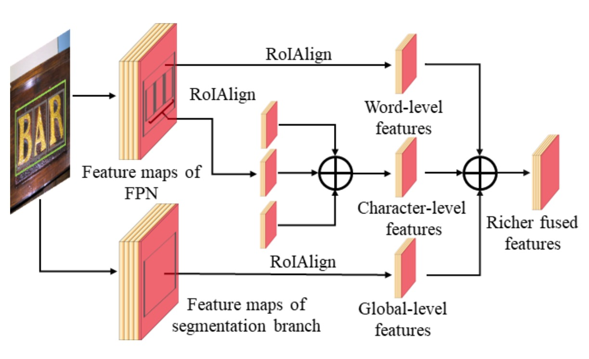
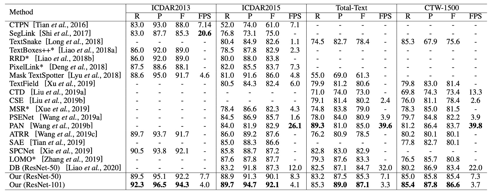

# [20.09] TextFuseNet

## A Beautiful Fusion of Three Feature Types

[**TextFuseNet: Scene Text Detection with Richer Fused Features**](https://www.ijcai.org/proceedings/2020/72)

---

This paper was published in 2020, though the exact month was unclear. However, after checking the project's GitHub repository, we found that the code was uploaded in September 2020.

- [**ying09/TextFuseNet**](https://github.com/ying09/TextFuseNet)

If this information is incorrect, please let us know.

## Problem Definition

The scene text detection problem has largely been framed as a segmentation task. Segmentation tasks are highly susceptible to interference from the background, especially in complex scenes where unexpected objects may occlude the text, significantly reducing the model's performance.

To improve model robustness, the authors of this paper also took a feature fusion approach. They argue that features should include:

1. **Character-level features**: Shapes, sizes, and orientations of characters.
2. **Region-level features**: Contextual and background information of the text.
3. **Image-level features**: Overall characteristics of the entire image.

They proposed a novel model called TextFuseNet, which extracts these three types of features and fuses them together.

## Solution

### Model Architecture

The model might look a bit complicated, but let’s break it down into five parts:

1. **Backbone + Neck**: A standard setup using ResNet-50 as the backbone network and FPN (Feature Pyramid Network) as the neck.
2. **RPN**: The network responsible for generating candidate text regions, employing an RPN (Region Proposal Network) and RoIAlign.
3. **Head 1**: Text region prediction branch that outputs a mask.
4. **Head 2**: Character-level detection branch that outputs bounding boxes.
5. **Head 3**: Character-level segmentation branch that outputs a mask.

---

The first part is quite familiar, so let’s focus on the second part onwards.

:::tip
For those unfamiliar with FPN, you can refer to our [**FPN**](../../feature-fusion/1612-fpn/index.md) introduction.
:::

---

### The Second Part: RPN + RoIAlign

The authors borrowed ideas from Mask R-CNN and Mask TextSpotter, using an RPN to generate text proposals for subsequent detection and segmentation branches. These proposals are refined via semantic segmentation and multi-layer feature extraction for final text detection.

- [**[17.03] Mask R-CNN**](https://arxiv.org/abs/1703.06870)
- [**[19.08] Mask TextSpotter**](https://arxiv.org/abs/1908.08207)

The RPN’s task is to generate preliminary "text candidate regions" based on the feature maps extracted by the FPN. It scans the image with sliding windows and uses convolutional layers to output "anchor boxes," which represent potential text locations. For each candidate region, the RPN predicts the presence of text and refines the location through bounding box regression.

Once the RPN generates text region proposals, RoIAlign is used to extract different features, enabling simultaneous word and character detection.

---

### The Third Part: Text Region Prediction Branch (Semantic Segmentation Branch)

This branch is responsible for extracting global semantic features, such as the overall scene’s background. When text blends with the background or has irregular shapes, the semantic segmentation branch helps improve detection by capturing global context information. Features from the FPN’s output are aligned across different levels and fused through a 1×1 convolution.

---

### The Fourth Part: Character-Level Detection Branch (Detection Branch)

This branch handles the detection of individual words and characters from the text proposals. RoIAlign is employed to accurately align features from candidate regions, eliminating the quantization errors seen in traditional RoIPooling. Then, classification and bounding box regression are performed to precisely locate words and characters. Unlike traditional approaches that detect words or characters separately, TextFuseNet detects both simultaneously.

:::info
RoIAlign was introduced in Mask R-CNN to address quantization errors in RoIPooling.
:::

---

### The Fifth Part: Character-Level Segmentation Branch (Mask Branch)

The mask branch is responsible for instance segmentation of the detected words and characters. This means it doesn’t just detect the location of text but also segments the exact contours of the characters—particularly useful for detecting text with complex or irregular shapes. The mask branch further processes the features from the detection branch and generates fine-grained character segmentation masks through multi-path fusion of character, word, and global features.

### Multi-Path Feature Fusion

The multi-path feature fusion architecture is the key innovation of this model, as it fuses character, word, and global features to improve both detection and segmentation accuracy.

1. **Fusion in the Detection Branch**:

   In the detection branch, TextFuseNet first extracts global and word-level features from text proposals. These features come from different layers of the FPN.

   For each text proposal, RoIAlign extracts global and word-level features from 7×7 feature maps. Then, these features are fused using element-wise summation.

   After fusion, the features are further processed through 3×3 and 1×1 convolution layers, used for classification and bounding box regression.

2. **Fusion in the Mask Branch**:

   In the mask branch, for each word proposal, the character attributes are computed using the formula:

   $$
   C_i = \{c_i | \frac{b_i \cap b_j}{b_j} > T\}
   $$

   Here, $b_i$ and $b_j$ represent the bounding boxes for words and characters, respectively, with a threshold $T$ of 0.8.

   RoIAlign extracts character features from 14×14 feature maps, and these character-level features are fused via element-wise summation. The fused features are further processed by 3×3 and 1×1 convolutions to generate the final character features.

3. **Three-Level Feature Fusion**:

   Finally, character-level, word-level, and global semantic features are fused. RoIAlign extracts corresponding features, which are combined and further refined through convolution layers. These fused and processed features generate richer, more distinctive representations for text instance segmentation.

:::tip
After reviewing this section, we can't help but think—this fusion method is likely quite slow in practice...
:::

### Weak Supervision Learning

A common challenge for models involving character-level detection and segmentation is the lack of annotated data. Like CRAFT, the authors of TextFuseNet used weak supervision learning to address this issue. Readers interested in this method can refer to our previous introduction:

- [**[19.04] CRAFT: Character Region Awareness for Text Detection**](../1904-craft/index.md)

---

First, the authors pre-trained TextFuseNet on a dataset with complete character and word annotations, obtaining a pre-trained model $M$ capable of detecting both characters and words.

Next, they applied model $M$ to a dataset $A$ annotated only at the word level to detect potential character samples. For each image in dataset $A$, the pre-trained model generated a set of character candidates $R$, defined as follows:

$$
R = \{r_0(c_0, s_0, b_0, m_0), r_1(c_1, s_1, b_1, m_1), \cdots , r_i(c_i, s_i, b_i, m_i), \cdots \}
$$

Where $r_i$ represents the $i$-th character candidate, $c_i$ is the predicted character class, $s_i$ is the confidence score, $b_i$ is the character bounding box, and $m_i$ is the character mask.

By filtering character samples based on confidence scores and weakly supervised word-level annotations, they generated additional character-level annotations for training a more robust text detection model.

### Training Datasets

- **SynthText**

  A large-scale synthetic dataset containing about 800,000 images, used for pre-training the model. These images combine natural scenes with randomly generated text in various fonts, sizes, colors, and orientations, closely mimicking real-world scenarios.

- **CTW1500**

  A challenging dataset for curved text detection, consisting of 1,000 training images and 500 test images. Unlike traditional text datasets, CTW1500 includes text instances annotated with 14-point polygons, capable of describing arbitrarily curved text shapes.

- **Total-Text**

  A newly released dataset for curved text detection, comprising horizontal, multi-oriented, and curved text instances. The benchmark includes 1,255 training images and 300 test images.

- **ICDAR 2013**

  A dataset from the Reading Competition, consisting of 229 training images and 233 test images, all in high resolution. English text is annotated with rectangular boxes at the word level.

- **ICDAR 2015**

  A popular text detection dataset containing 1,500 images, with 1,000 for training and the rest for testing. Text regions are annotated using quadrilateral bounding boxes with four vertices.

## Discussion

### Ablation Study

The authors introduced two modules to improve text detection performance in TextFuseNet compared to the original Mask R-CNN:

1. **Multi-Level Feature Representation (MFR)**: This module extracts features at different levels, helping to capture text at various scales more accurately.
2. **Multi-Path Feature Aggregation (MFA)**: This architecture fuses multi-level features to generate richer feature representations, aiding text detection.

To validate the effectiveness of these two modules, the authors conducted an ablation study on the ICDAR 2015 and Total-Text datasets. Three different models were prepared for each dataset:

- **Baseline**: The original Mask R-CNN trained model.
- **MFR**: Mask R-CNN model with Multi-Level Feature Representation (MFR).
- **MFR+MFA**: The complete TextFuseNet model with both MFR and MFA.

ResNet-50 with FPN was used as the backbone network in these models.

---

As shown above, using **MFR** alone significantly improved both precision and recall. On the ICDAR 2015 and Total-Text datasets, the F-measure increased by more than 2% compared to the baseline model.

Moreover, combining **MFR** and **MFA** further boosted performance. On the ICDAR 2015 dataset, the F-measure improved by 4.6%, while on Total-Text, it increased by 4.3% compared to the baseline model. These results confirm that both the Multi-Level Feature Representation and Multi-Path Feature Aggregation modules contribute to better text detection performance.

### Comparison with Other Methods

As shown in the last two columns, TextFuseNet achieves state-of-the-art performance on the CTW-1500 and Total-Text datasets.

On the CTW-1500 dataset, TextFuseNet with a ResNet-50 backbone achieved an F-measure of 85.4%, outperforming the previous best model by 1.7%. When using ResNet-101, performance further improved to 86.6%, surpassing other methods by at least 2.9%.

On the Total-Text dataset, the ResNet-50 version of TextFuseNet already achieved the best results, and the ResNet-101 version further outperformed other methods by at least 2.1%. These experiments demonstrate that TextFuseNet can achieve leading performance in detecting text of arbitrary shapes.

### Visualization

## Conclusion

This paper introduced TextFuseNet, an innovative framework designed for detecting arbitrarily shaped text by combining character-level, word-level, and global semantic features. This multi-level feature fusion approach indeed enhances the model's ability to represent complex text shapes, achieving leading performance on datasets like CTW-1500 and Total-Text.

From the experimental results, TextFuseNet demonstrates strong capabilities in handling intricate text shapes and achieves encouraging results, showcasing the potential of this method.

:::tip
However, it might be too slow to deploy in most practical engineering tasks!
:::
