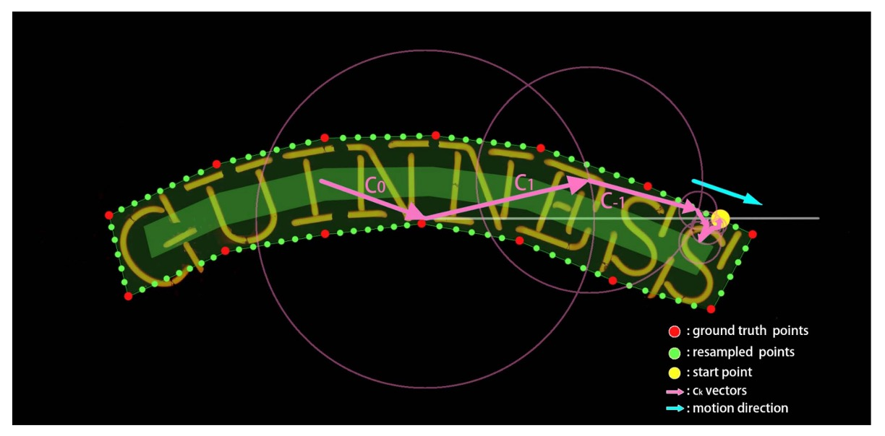
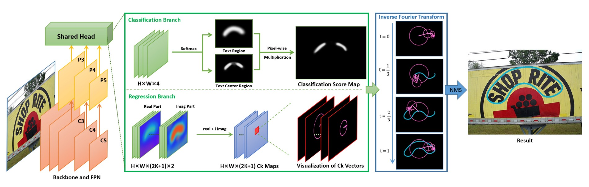
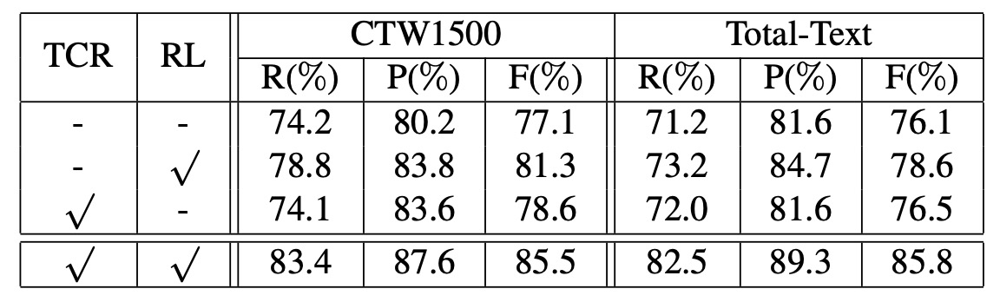

# [21.04] FCENet

## Guidance from Fourier

[**Fourier Contour Embedding for Arbitrary-Shaped Text Detection**](https://arxiv.org/abs/2104.10442)

---

You open this paper expecting to learn some text detection techniques.

But you are suddenly hit by Fourier, and before you know it, you are knocked out cold.

## Fourier Transform

The mathematician Joseph Fourier introduced this mathematical tool in the early 19th century, and it has since made a huge impact, dominating various fields for over a century.

:::tip
Whenever a student feels confused about a problem, they might say:

- **Why not try the Fourier Transform?**

The chances of actually solving the problem may be small, but more often it’s a form of hopeful prayer to the great predecessors...

What if it works?
:::

The core idea of Fourier is quite simple:

- **Any wave can be decomposed into a sum of sine and cosine waves.**

Just like breaking down each note in music, the Fourier transform helps us extract the frequency components from a seemingly chaotic time or spatial signal.

Its applications have long surpassed the fields of mathematics and physics, appearing in engineering, medicine, astronomy, and even in modern deep learning techniques.

However, even if we want to "simply" introduce the Fourier Transform, it would still take up too much space. So, we’ve written a separate article to discuss this topic:

- [**A Brief Introduction to Fourier Transform**](https://docsaid.org/en/blog/fourier-transform)

If you’re still unsure what the Fourier Transform is, feel free to click and check it out.

## Defining the Problem

Text with multiple directional distortions has always been a major challenge for researchers.

Existing methods are mostly based on spatial domain representations, such as pixel masks or contour point sequences, using Cartesian or polar coordinate systems. However, these methods have some drawbacks:

- Mask representations require high computational cost and are highly dependent on large-scale training data.
- Contour point sequence representations have limited modeling ability for highly curved text.

What we need is a concise and generalizable representation of text instances.

Since the problem in the spatial domain is difficult to solve, why not change our approach and look at it from the frequency domain?

And so, Fourier, it’s your time to shine!

## Solving the Problem

### Fourier Contour Embedding

The original term is Fourier Contour Embedding, abbreviated as FCE.

FCE uses a complex-valued function $f : \mathbb{R} \to \mathbb{C}$ to represent a closed "text contour":

$$
f(t) = x(t) + iy(t),
$$

where $i$ is the imaginary unit, and $(x(t), y(t))$ represents the spatial coordinates at time $t$.

Since $f(t)$ is a closed contour, we have $f(t) = f(t + 1)$.

:::tip
**What is a closed contour?**

A closed contour is a geometric shape where the "starting point and the ending point are the same."

When using a parameterized function $f(t)$ to represent a closed contour, the parameter $t$ typically represents the position on the curve, with the range set as $t \in [0, 1]$. Here, $t=0$ and $t=1$ correspond to the same point on the curve, so:

$$
f(0) = f(1).
$$

Because of this property, $f(t)$ is periodic and satisfies:

$$
f(t) = f(t + n), \quad n \in \mathbb{Z}.
$$

In this paper, $t$ is considered as time, and as time $t$ changes, the points move along the closed contour. Therefore, when $t$ increases beyond 1, the curve returns to the starting point, forming a periodic motion.

:::

Through the Inverse Fourier Transformation (IFT), $f(t)$ can be expressed as:

$$
f(t) = \sum_{k=-\infty}^{+\infty} c_k e^{2\pi i k t},
$$

where $c_k$ are the complex Fourier coefficients, representing the initial state of frequency $k$.

Each term $c_k e^{2\pi i k t}$ represents a circular motion of a specific frequency.

- **Low frequencies**: Responsible for the overall shape of the contour.
- **High frequencies**: Responsible for the details of the contour.

Experimental results in this paper show that retaining only the first $K = 5$ lowest frequency components is sufficient to obtain a good approximation of the contour, forming a Fourier signature vector.

In practical applications, since the functional form of the text contour is unknown, the function $f(t)$ must be discretized into $N$ points:

$$
\{f\left(\frac{n}{N}\right)\}, \quad n = 1, \dots, N.
$$

The Fourier coefficients $c_k$ can be computed using the Fourier transform:

$$
c_k = \frac{1}{N} \sum_{n=1}^N f\left(\frac{n}{N}\right) e^{-2\pi i k \frac{n}{N}},
$$

where $c_k = u_k + i v_k$, $u_k$ is the real part, and $v_k$ is the imaginary part.

When $k = 0$, it represents the center of the contour:

$$
c_0 = u_0 + iv_0 = \frac{1}{N} \sum_n f\left(\frac{n}{N}\right),
$$

The final Fourier signature vector is:

$$
[u_{-K}, v_{-K}, \dots, u_0, v_0, \dots, u_K, v_K].
$$

### FCE Sampling Process

<figure style={{"width": "90%"}}>

</figure>

Since different datasets have different numbers of contour points (e.g., CTW1500 has 14 points, Total-Text has between 4 and 8 points), the authors standardize the format through resampling, selecting a fixed number of evenly spaced points along the contour (in the experiment, $N = 400$).

To ensure the stability of the signature vector, the following constraints are applied to the resampling process:

- **Starting point**: Set as the rightmost intersection of the contour with the horizontal line at the contour's center.
- **Sampling direction**: Sampling is done in the clockwise direction.
- **Uniform speed**: The distance between adjacent sampling points is equal.

### Model Architecture

<figure style={{"width": "90%"}}>

</figure>

Putting aside the complex Fourier problems, the design of this paper is actually very simple and clear.

The anchor-free text detection network based on FCE is named FCENet by the authors.

FCENet uses ResNet50 (with Deformable Convolution DCN) as the backbone, and FPN (Feature Pyramid Network) is employed to capture multi-scale features. The feature maps $P_3$, $P_4$, and $P_5$ are responsible for small, medium, and large-scale text, respectively.

The methods used in this part are similar to previous works, so we won't go into details here.

The prediction head consists of two branches:

1. **Classification Branch**

   The upper part of the image above, the Classification Branch, is further divided into two sub-branches:

   - Prediction of the text region (Text Region, TR) mask for each pixel.
   - Prediction of the text center region (Text Center Region, TCR) mask. This branch is designed to improve the prediction quality near the boundaries.

2. **Regression Branch**

   This is the core objective of this paper: predicting the Fourier signature vector for each pixel.

   The calculation of the Fourier signature vector, mentioned in the previous section, is intended to provide the training targets for this branch.

   The model's prediction results will be reconstructed through the Inverse Fourier Transformation (IFT) as shown below:

   

    <figure style={{"width": "70%"}}>
    
    </figure>
    

## Loss Function

The total loss is:

$$
L = L_\text{cls} + \lambda L_\text{reg},
$$

where $\lambda = 1$.

The classification loss $L_\text{cls}$ and regression loss $L_\text{reg}$ are as follows:

1. **Classification Loss**

   $$L_\text{cls} = L_\text{tr} + L_\text{tcr}$$

   Where $L_\text{tr}$ and $L_\text{tcr}$ are the cross-entropy losses for the text region and center region, with a 3:1 negative to positive sample ratio (using OHEM).

2. **Regression Loss**

   To directly optimize the detection quality in the spatial domain, rather than the distance between Fourier signature vectors, the loss is designed as:

   $$
   L_\text{reg} = \frac{1}{N'} \sum_{i \in T} \sum_{n=1}^{N'} w_i l_1\left(F^{-1}\left(\frac{n}{N'}, c_i\right), F^{-1}\left(\frac{n}{N'}, \hat{c}_i\right)\right),
   $$

   Where:

   - $l_1$ is the smooth $L1$ loss.
   - $F^{-1}$ is the Inverse Fourier Transform.
   - $T$ is the set of pixels in the text region.
   - $c_i$ and $\hat{c}_i$ are the true and predicted Fourier signature vectors, respectively.
   - $w_i$ is the weight, with $w_i = 1$ for pixels in the center region, and $w_i = 0.5$ otherwise.
   - The number of sampling points is $N' = 50$, to avoid overfitting.

   ***

   :::tip
   Notice this detail: the authors do not directly compute the distance between the Fourier signature vectors. Instead, they transform them back to the spatial domain before calculating the loss in the spatial domain.

   **Why?**

   Because the Fourier signature vector represents the features of the contour in the frequency domain, not the direct spatial shape. If we calculate the difference between signature vectors directly, it may not accurately reflect the differences in the shape of the contour in space.

   For example, if a low-frequency component has a slight error, it might cause the overall position of the contour to shift, but the difference between the Fourier signature vectors remains small.

   On the other hand, errors in high-frequency components might only affect the fine details of the contour, but can cause a larger difference in the signature vectors.

   The authors have likely performed related experiments to justify this design.
   :::

### Training Datasets

- **1. CTW1500**

  - Contains Chinese and English text, with **text-line level annotations**.
  - Dataset size: 1000 training images, 500 test images.

- **2. Total-Text**

  - Contains multi-scene data, including background interference similar to text and low-contrast text.
  - Annotations are **polygon-level at the word level**.
  - Dataset size: 1255 training images, 300 test images.

- **3. ICDAR2015**

  - A dataset designed for multi-directional street scene text, with **word-level annotations** represented by four vertices.
  - Dataset size: 1000 training images, 500 test images.

## Discussion

### FCE Evaluation

<figure style={{"width": "70%"}}>

</figure>

In theory, any closed and continuous contour can be better fitted by increasing the Fourier order $K$ in FCE.

According to the results shown in the figure above, a small $K$ is sufficient to achieve a satisfactory fit for most arbitrary-shaped text contours, which demonstrates the powerful representational ability of FCE.

When comparing FCE with the latest method for arbitrary-shaped text detection, **TextRay**, the results are as follows:

<figure style={{"width": "70%"}}>

</figure>

For highly curved text, **TextRay** fails to accurately fit the real contours, showing its limitations in modeling highly curved text. In contrast, FCE shows a high degree of accuracy when fitting such text contours.

In terms of efficiency, FCE uses only 22 dimensions to describe the text contour. TextRay uses 44 dimensions, which is twice as many as FCE, but with worse performance. Thus, FCE has a clear advantage in both parameter efficiency and fitting performance.

### Ablation Experiments

<figure style={{"width": "70%"}}>

</figure>

To verify the effectiveness of each component of FCENet, the authors conducted ablation experiments on the CTW1500 and Total-Text datasets. The conclusions are as follows:

- **Text Center Region (TCR) Loss**: The TCR loss in the classification branch significantly improved detection performance.
- **Regression Loss**: The newly designed regression loss in the regression branch effectively optimized the reconstructed text contour, resulting in a significant performance boost.

:::tip
The improvement from the regression loss is very clear and directly proves the effectiveness of the Fourier signature vector. This is a major highlight of the paper.
:::

### Generalization Ability

<figure style={{"width": "70%"}}>

</figure>

To verify the generalization ability of FCE, the authors conducted experiments on the CTW1500 dataset by reducing the training data. They reduced the training data to 50% and 25% of the original size, and compared the results with other methods (such as DRRG, TextRay, ABCNet).

The results showed that other methods experienced a significant drop in performance, while FCENet maintained good accuracy, recall, and F-measure, with accuracy always above 80%, demonstrating its stable performance.

:::tip
For related papers, refer to:

- [**[20.02] ABCNet**](https://arxiv.org/abs/2002.10200)
- [**[20.03] DRRG**](https://arxiv.org/abs/2003.07493)
- [**[20.08] TextRay**](https://arxiv.org/abs/2008.04851)
  :::

### Comparison with Other Methods

- **Ext**: Represents the use of additional training data.
- **†**: Represents the simplified version of FCENet† without DCN.

---

FCENet was compared with other recent methods on the CTW1500 and Total-Text datasets, and the results are as follows:

- **Precision (P) and F-measure (F)**: FCENet achieved the best performance.
- **Recall (R)**: Achieved competitive results.

On the ICDAR2015 dataset, FCENet still achieved competitive results without additional configurations.

FCENet’s network architecture is simple, with efficient post-processing (IFT and NMS). It is easy to implement and practical, and even using a ResNet50 backbone without DCN (similar to the configuration of ABCNet), FCENet achieved competitive performance across multiple datasets.

:::tip
This section also indirectly highlights that DCN is a powerful operator that can effectively enhance the model's performance.
:::

### High-Curvature Text

Finally, the authors constructed a high-curvature text subset on the CTW1500 dataset to evaluate the model's detection ability on high-curvature text.

As shown in the figure above, FCENet performed excellently in terms of detection accuracy and precision on high-curvature text, further improving its representational ability for irregular text instances.

## Conclusion

The elegance of Fourier is beyond question.

The Fourier Contour Embedding method proposed in this paper can accurately represent text contours of any shape, especially excelling in fitting high-curvature text. FCENet, by predicting Fourier signature vectors and performing inverse transformations to reconstruct the text contour, eliminates the need for cumbersome post-processing steps, achieving a balance between accuracy and practicality, making it particularly suitable for detecting complex contours and curved text.

The Fourier method is not only a mathematical tool but also a powerful means of solving practical problems. Through FCE and FCENet, the authors provide an efficient and practical solution for arbitrary-shaped text detection and open up possibilities for future text shape modeling.
