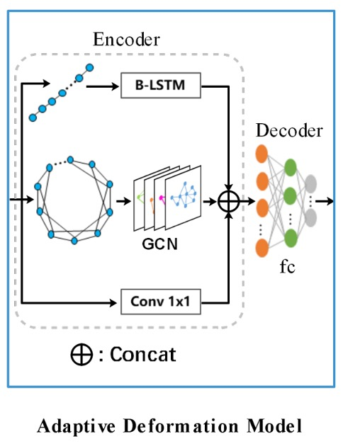
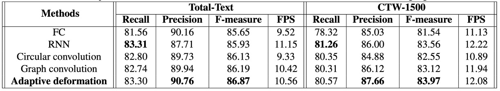
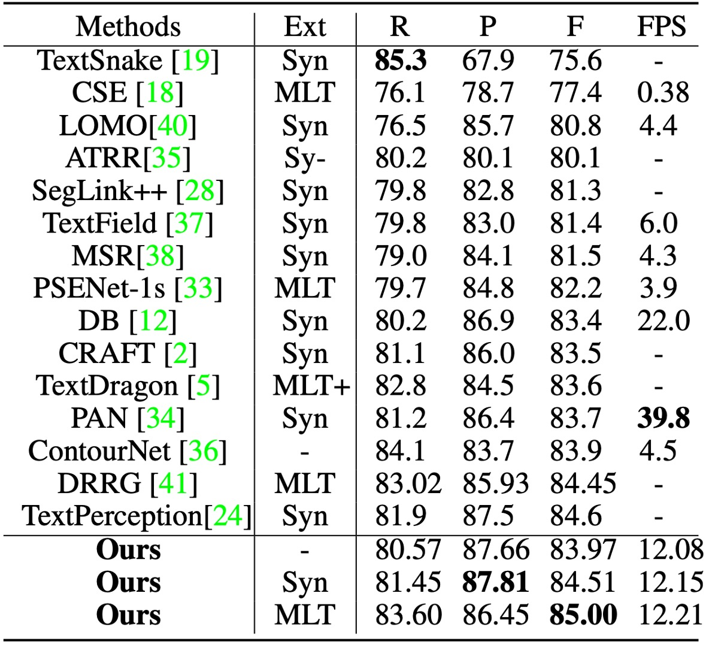

# [21.07] TextBPN

## Try Some GCN!

[**Adaptive Boundary Proposal Network for Arbitrary Shape Text Detection**](https://arxiv.org/abs/2107.12664)

---

This paper introduces several concepts to address the problem of text detection, primarily focusing on two key techniques: LSTM, which is used to capture sequential information about text boundaries, and GCN (Graph Convolutional Networks), used to refine boundary features. While these topics could be discussed in great depth, the assumption is that readers are already familiar with these concepts.

Let's dive directly into the details.

## Problem Definition

We have reviewed several text detection methods, and most of them deal with overlapping text regions by first identifying the "text core" and then expanding outwards to find the text boundaries. These approaches are often slow, or as the paper describes: "complex and inefficient."

To overcome these issues, the authors propose a novel adaptive boundary proposal network for arbitrary-shaped text detection, which directly generates accurate boundaries for text without any post-processing.

## Problem Solution

### Model Architecture

The architecture may seem complex at first glance, so let’s break it down into parts.

### Backbone + Neck

The feature extraction uses a ResNet-50 backbone, and the feature fusion in the neck is done using a U-Net-like architecture through concatenation. The final output from the neck consists of feature maps with 32 channels, retaining the same size as the input image.

### Boundary Proposal Generation

<figure align="center">

</figure>

The boundary proposal generation consists of multiple dilated convolutions, including two 3x3 convolution layers (with different dilation rates) and one 1x1 convolution layer. These layers use shared features extracted from the backbone to generate three outputs: classification map, distance field map, and direction field map.

1. **Classification Map:** A binary map where each pixel represents the confidence of belonging to text (binary classification: text/non-text).

2. **Direction Field Map:** The direction field map $V$ is a 2D unit vector $(\vec{x}, \vec{y})$ that represents the direction of each text pixel pointing to its closest boundary pixel. For each text instance $T$, the unit vector from text pixel $p$ to its nearest boundary pixel $B_p$ is computed as:

   $$
   V_{gt}(p) =
   \begin{cases}
   \frac{\overrightarrow{B_p p}}{\|\overrightarrow{B_p p}\|}, & p \in T \\
   (0, 0), & p \notin T
   \end{cases}
   $$

   where $\|\overrightarrow{B_p p}\|$ is the distance between pixel $p$ and the boundary pixel $B_p$.

3. **Distance Field Map:** The distance field map $D$ normalizes the distance between each text pixel $p$ and its nearest boundary pixel $B_p$. The formula is:

   $$
   D_{gt}(p) =
   \begin{cases}
   \frac{\|\overrightarrow{B_p p}\|}{L}, & p \in T \\
   0, & p \notin T
   \end{cases}
   $$

   where $L$ is the scale of the text instance $T$ defined as:

   $$
   L = \max(D_{gt}(p)), p \in T
   $$

Based on the distance field map $D$, candidate boundary proposals are generated using a fixed threshold $th_d$, but these proposals may include false positives. Therefore, the average confidence of each candidate proposal is computed from the classification map, and proposals with low confidence (below threshold $th_s$) are discarded.

These steps and formulas constitute the boundary proposal generation process, allowing effective text region detection while handling boundary issues between adjacent text instances.

### Adaptive Boundary Deformation

The concept of adaptive boundary deformation builds on past research, including:

- [**[18.03] Efficient Interactive Annotation of Segmentation Datasets with Polygon-RNN++**](https://arxiv.org/abs/1803.09693)
- [**[19.03] Fast Interactive Object Annotation with Curve-GCN**](https://arxiv.org/abs/1903.06874)
- [**[20.01] Deep Snake for Real-Time Instance Segmentation**](https://arxiv.org/abs/2001.01629)

Using these methods, the model refines boundary proposals by predicting control points for each instance. Based on CNN features, the model performs per-vertex offset prediction. Each boundary proposal samples $N$ control points, which form a closed polygon considering both topological and sequential contexts.

For each control point $cp_i = [x_i, y_i]^T$, a feature vector $f_i$ is generated using the 32-dimensional shared features $F_s$ from the CNN backbone and 4-dimensional prior features $F_p$ (such as pixel classification, distance field, and direction field):

$$
f_i = \text{concat}\{F_s(x_i, y_i), F_p(x_i, y_i)\}
$$

---

Once control point predictions are obtained, boundary refinement takes place. This is done using GCN and RNN, as illustrated below:

<figure align="center">

</figure>

The encoder combines GCN and RNN to fully utilize both topological and sequential contexts of the boundary. The formula is:

$$
X' = \text{RNN}(X) \oplus \text{GCN}(X) \oplus \text{Conv1x1}(X)
$$

The RNN uses a bidirectional LSTM (B-LSTM) with a hidden size of 128. The input, for example, could be: [batch size, control point sequence, control point features].

---

The GCN consists of four graph convolution layers with ReLU activation. The formula for the graph convolution layer is:

$$
X_g = \text{ReLU}((X \oplus GX)W)
$$

Where $G = D^{-1/2} \tilde{A} D^{-1/2}$, $\tilde{A} = A + I_N$, with $A$ representing the adjacency matrix and $I_N$ being the identity matrix. $D$ is the degree matrix, and each control point is connected to four neighboring control points to handle contextual information.

---

In addition to the RNN and GCN branches, a 1x1 convolution layer forms a residual connection. The features from all branches are concatenated and passed to the decoder, which predicts the offset for each control point.

Multiple iterations of boundary deformation are performed to refine the initial boundary proposals, progressively improving text detection precision.

:::tip
Here, RNN is used for sequence handling, and GCN for processing information flow between neighboring nodes. Given the advancements in 2021, using transformers for these tasks could be a potential improvement direction in the future.
:::

### Training Datasets

- **SynthText:** A large synthetic dataset with approximately 800,000 images, containing natural scenes mixed with text in random fonts, sizes, colors, and orientations.
- **CTW1500:** A challenging dataset focusing on long curved text, featuring 1,000 training and 500 test images annotated with 14-point polygons to describe arbitrary curve shapes.
- **Total-Text:** A dataset for curved text detection, with 1,255 training and 300 test images, including horizontal, multi-directional, and curved text.
- **MSRA-TD500:** A multilingual dataset with long text lines in arbitrary orientations, featuring 300 training and 200 test images. The HUST-TR400 dataset is used for additional training due to its small size.
- **ICDAR 2017 MLT:** A large-scale multilingual dataset containing 7,200 training, 1,800 validation, and 9,000 test images, covering nine languages.

## Discussion

### Ablation Studies

To verify the effectiveness of the adaptive deformation model, the authors conducted ablation studies on Total-Text and CTW-1500 datasets.

1. **Effectiveness of Adaptive Deformation Model:**

   

   Four encoder variations were compared: Fully Connected Network (FC) + Conv1x1, RNN, Circular Convolution, and GCN.

   The adaptive deformation model achieved the best performance on both datasets, with an F-measure improvement of 0.94% on Total-Text compared to RNN and 0.85% compared to GCN, without significantly increasing detection time.

2. **Impact of Control Point Number (N):**

   

   Different numbers of control points (ranging from 12 to 32) were tested. The F-measure decreased when the number of control points was too large or too small. At 20 control points, the model achieved the best performance on both datasets, so this number was fixed for experiments.

3. **Impact of Iteration Count:**

   

   Performance improved with more iterations but plateaued after three iterations. Considering the balance between speed and performance, three iterations were chosen.

4. **Impact of Prior Information:**

   

The importance of different prior information (e.g., classification map, distance field, direction field) was evaluated. Adding distance and direction fields significantly boosted performance, with F-measure improvements of 5.45% and 1.55%, respectively.

### Results on Curved Text

<figure>

<figcaption>Total-Text Results</figcaption>
</figure>

<figure>

<figcaption>CTW1500 Results</figcaption>
</figure>

---

The short side of images was scaled to 640, with the long side capped at 1024 pixels. The distance field threshold $th_d$ was fixed at 0.3.

On Total-Text, the classification threshold $th_s$ was set at 0.825, and TextBPN achieved an F-measure of 87.37% with SynthText pretraining, which increased to 87.85% with MLT17 pretraining, outperforming other methods.

On CTW-1500, with $th_s = 0.8$, TextBPN achieved an accuracy of 87.81% and an F-measure of 85.0%, significantly surpassing methods like TextSnake and DB.

### Results on MSRA-TD500

On MSRA-TD500, with $th_s = 0.925$, TextBPN achieved an F-measure of 85.57%, outperforming other techniques such as DB and DRRG.

### Visualization Results

## Conclusion

The introduction of GCN and RNN for text detection is indeed a novel strategy. Experimental results demonstrate that this method achieves significant performance improvements on challenging datasets like Total-Text and CTW-1500, particularly in handling irregular and curved text.

Future research could aim to further improve inference speed and flexibility while maintaining detection accuracy, making this method more practical for a wider range of applications.

:::tip
The classification threshold $th_s$ plays a critical role in evaluating the dataset. Improper parameter tuning can significantly degrade the model's performance, potentially causing headaches from an engineering perspective.
:::
