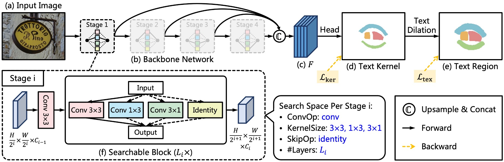
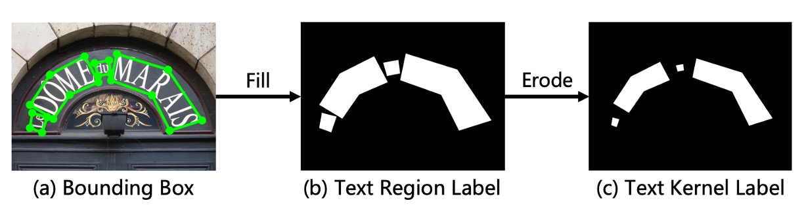
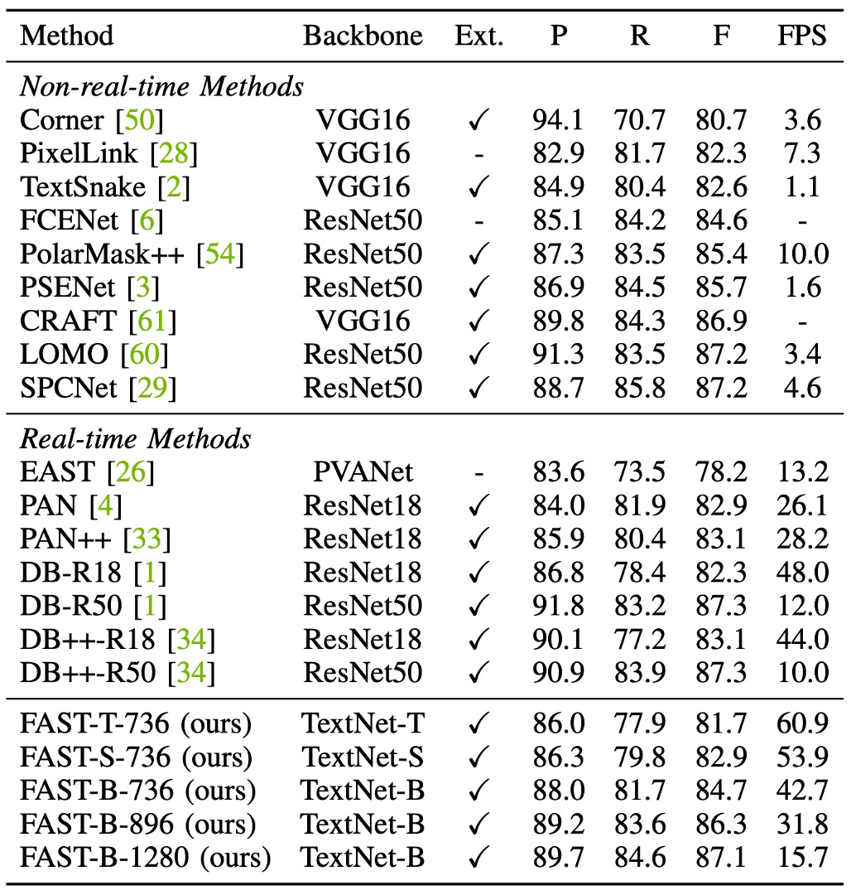
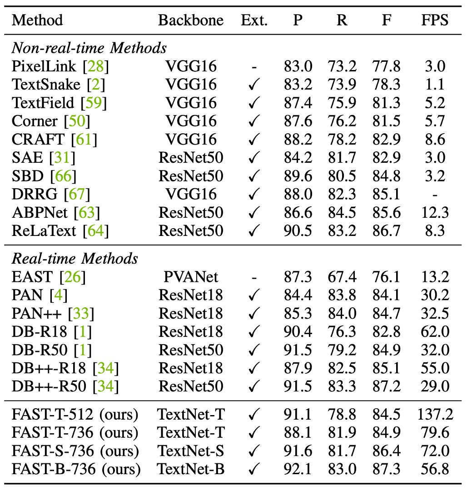

# [21.11] FAST

## Quick as a Flash

[**FAST: Faster Arbitrarily-Shaped Text Detector with Minimalist Kernel Representation**](https://arxiv.org/abs/2111.02394)

---

It’s a common pattern for researchers to critique previous models for inefficiency, only to offer slight improvements themselves. However, this paper seems different. It introduces a fundamentally new architecture, optimizes the post-processing methods, and achieves substantial performance gains. The balance between inference speed and prediction accuracy is well-maintained, making this a solid benchmark for future research in the field.

## Problem Definition

The authors believe that the "post-processing" stage in current text detection methods is highly inefficient.

As shown in the image above, many famous detection methods allocate around 30% of the total time to the post-processing stage, and this is typically handled by the CPU, which cannot run concurrently with GPU resources. This creates a significant performance bottleneck.

Clearly, this needs to be addressed!

---

On the other hand, most popular detection methods use a backbone design based on existing image classification networks, often combined with FPN or U-Net for feature fusion.

However, text often comes in various shapes and is usually long, so this design might not be ideal.

The backbone needs improvement too!

## Solution

### Model Architecture

First, the authors discard the common backbone + neck architecture.

They introduce a new backbone structure named `TextNet`, which we’ll discuss in detail later. Although the neck is discarded, feature fusion is still required. Here, the authors directly use multi-scale feature maps from the backbone, concatenating them at the end.

The prediction head takes these multi-scale feature maps as input and outputs a "text kernel map" with a single channel.

Once the text kernel map is generated, connected component labeling is applied. This concept is derived from the following paper:

- [**[19.08] Optimized Block-Based Algorithms to Label Connected Components on GPUs**](https://www.researchgate.net/publication/335183975_Optimized_Block-Based_Algorithms_to_Label_Connected_Components_on_GPUs)

The implementation is handled via CUDA, allowing GPU-based execution for connected component labeling.

You can find the code for this on FAST's [**GitHub**](https://github.com/czczup/FAST): [**ccl_cuda.cu**](https://github.com/czczup/FAST/tree/main/models/post_processing/ccl)

The logic of the algorithm is illustrated below:

During inference, before the final text instance output, the connected component labeling is applied, followed by `max_pool2d` to perform text dilation.

Because `max_pool2d` is used, overlapping regions are prioritized by the connected component with the highest label.

### Label Generation Strategy

To train the model, we need to generate labels.

Here, the authors use the `Erode` operation to create labels. Since text dilation is applied during the output phase, the labels are generated by performing the `Erode` operation on the dataset’s text annotations.

### TextNet

Finally, let’s dive into the backbone design.

Inspired by ProxylessNAS, the authors create a backbone network specifically tailored for text detection.

- [**[18.12] Proxylessnas: Direct neural architecture search on target task and hardware**](https://arxiv.org/abs/1812.00332)

Each stage of the network consists of a convolutional layer with a stride of 2, followed by multiple searchable blocks, as shown in the image above.

The 3x3 convolution with stride 2 is used for downsampling feature maps. Each searchable block consists of a set of candidate operations, and the final operation is selected through architecture search.

To maximize speed, re-parameterizable convolutions are used as candidate operations, which are fused into a single-branch convolution during inference. The candidate operations are:

- $\text{conv 3x3}$
- $\text{conv 1x3}$
- $\text{conv 3x1}$
- $\text{identity}$

Due to the asymmetry and directional priors of $1 \times 3$ and $3 \times 1$ convolutions, these operations are beneficial for capturing text lines with extreme aspect ratios and rotations. Additionally, the identity operation allows layers to be skipped, controlling network depth and inference speed.

:::tip
A notable detail here is that the architecture actually uses the `RepConvLayer` for the search, not standard convolution layers.

The implementation is written in [**BreadcrumbsFAST/models/utils/nas_utils.py#RepConvLayer**](https://github.com/czczup/FAST/blob/6bdfd251f04f800b5b20117444eee10a770862ad/models/utils/nas_utils.py#L603C7-L603C19)

When input with kernel size [3,3], it constructs a full re-parameterized branch. With kernel size [3,1], it constructs a fixed-direction structure, and so on.

So, although the search architecture is selecting kernel sizes like `3x3`, `3x1`, `1x3`, or `Identity`, the core operation inside is always `RepConvLayer`, which will be re-parameterized during inference.

For more on re-parameterization, check out our earlier article:

- [**[21.01] RepVGG: Make VGG Great Again**](../../reparameterization/2101-repvgg/index.md)

:::

### Loss Function

The loss function for the FAST model is defined as:

$$
L = L_{ker} + \alpha L_{tex}
$$

Where $L_{ker}$ and $L_{tex}$ represent the loss for text kernel regions and text regions, respectively.

As is common, Dice loss is used to supervise the network training. Thus, $L_{ker}$ and $L_{tex}$ are given by:

$$
L_{ker} = 1 - \frac{2 \sum_{x,y} P_{ker}(x, y) G_{ker}(x, y)}{\sum_{x,y} P_{ker}(x, y)^2 + \sum_{x,y} G_{ker}(x, y)^2}
$$

$$
L_{tex} = 1 - \frac{2 \sum_{x,y} P_{tex}(x, y) G_{tex}(x, y)}{\sum_{x,y} P_{tex}(x, y)^2 + \sum_{x,y} G_{tex}(x, y)^2}
$$

Where $P(x, y)$ and $G(x, y)$ represent the predicted and ground truth values at position $(x, y)$.

Additionally, online hard example mining (OHEM) is applied to $L_{tex}$, ignoring easy non-text regions.

$\alpha$ balances the importance of $L_{ker}$ and $L_{tex}$, set to 0.5 in the experiments.

### Training Datasets

- **CTW1500**

  Built by Yuliang et al., CTW1500 is a challenging dataset for long curved text detection. It contains 1000 training images and 500 test images. Unlike traditional datasets (e.g., ICDAR 2015, ICDAR 2017 MLT), CTW1500’s text instances are annotated with 14-point polygons, allowing for precise representation of arbitrary curved text.

- **Total-Text**

  This new dataset features horizontal, multi-directional, and curved text instances. The benchmark includes 1255 training images and 300 test images.

- **MSRA-TD500**

  A multi-language dataset featuring arbitrary direction and long text lines. It includes 300 training images and 200 test images, annotated at the line level. Due to the small size of the training set, images from the HUST-TR400 dataset are added for training.

- **ICDAR 2015**

  ICDAR 2015 is a standard text detection dataset containing 1000 training images and 500 test images. The dataset includes horizontal, multi-oriented, and curved text instances.

- **ICDAR 2017 MLT**

  IC17-MLT is a large-scale multi-language text dataset containing 7200 training images, 1800 validation images, and 9000 test images. The dataset includes full-scene images in nine languages.

## Discussion

### NAS Search Architecture

As shown in the figure, the authors present the architectures for TextNet-T/S/B and make the following observations:

- **Asymmetric convolutions** are a key operation in TextNet, contributing to both higher accuracy and efficiency in detecting text lines.
- **TextNet-T and TextNet-S** stack more layers in the deeper stages (stage-3 and stage-4), while **TextNet-B** prefers stacking in the earlier stages (stage-1 and stage-2).

This suggests that different stacking strategies are required to optimize for specific speed constraints (100, 80, and 60 FPS), challenging the common manual design strategy of stacking most layers in stage-3 for real-time text detection.

### Ablation Study

- **Component Comparison**

  

  In the table above, the authors compare the effect of different components, such as `Pixel Aggregation` in the PAN architecture vs. the proposed `Text Dilation` in this paper.

  For fairness, all models are pre-trained on IC17-MLT and fine-tuned on Total-Text or ICDAR 2015.

  Compared to the ResNet18 baseline with CPU-based post-processing (Pixel Aggregation), **FAST-R18** replaces post-processing with GPU-parallelized text dilation, achieving better efficiency with comparable detection performance.

  Additionally, replacing the ResNet18 backbone with **TextNet-B** further boosts performance and efficiency while reducing parameter size.

- **Kernel Shrinking**

  

  This experiment, based on the **FAST-R18** model, investigates the effect of dilation size $s$ (equal to erosion size).

  The images in Total-Text and ICDAR 2015 datasets are scaled to 640 and 736 pixels on the shorter side.

  From the table, it is evident that if the dilation size is too small, the F-score decreases on both datasets. Empirically, the authors set the dilation size $s$ to 9 by default.

  If the shorter side $S$ changes, the dilation size $s$ should be updated proportionally for optimal performance:

  $$
  s_{\text{new}} = \text{Round}\left(\frac{S_{\text{new}} \times s_{\text{default}}}{S_{\text{default}}}\right)
  $$

  Where $\text{Round}(·)$ denotes rounding to the nearest integer. For example, if the shorter side is fixed at 800 pixels instead of 640 pixels, the dilation size $s$ should be set to 11.

### Curved Text Experiment Results

<figure>

<figcaption>Total-Text Experiment Results</figcaption>
</figure>

---

On the Total-Text dataset, **FAST-T-448** achieves 152.8 FPS with an F-score of 81.6%, outperforming all previous methods. **FAST-S-512** exceeds real-time detector DB++-R18 in terms of F-score by 1.6% (84.9% vs. 83.3%) and is 2.4 times faster.

Compared to PAN++, **FAST-B-640** is 29.2 FPS faster and improves the F-score by 1.1% (86.4% vs. 85.3%).

When increasing the input resolution, **FAST-B-800** achieves the highest F-score of 87.5%, outperforming all real-time detection methods by at least 1.5%, while still maintaining a fast inference speed (46.0 FPS).

---

<figure>

<figcaption>CTW1500 Experiment Results</figcaption>
</figure>

---

**FAST-T-512** achieves 129.1 FPS, at least 2.3 times faster than previous methods, while maintaining a competitive F-score (81.5%).

The highest F-score of 84.2% is achieved by FAST, slightly higher than DB++-R18 (84.2% vs. 83.9%), with a faster speed (66.5 FPS vs. 40.0 FPS).

### ICDAR2015 Experiment Results

<figure>

<figcaption>ICDAR2015 Experiment Results</figcaption>
</figure>

---

The table above shows that the fastest model, **FAST-T-736**, achieves 60.9 FPS while maintaining a competitive F-score of 81.7%.

Compared to PAN++, **FAST-B-896** improves the F-score by 3.2% (86.3% vs. 83.1%) with better efficiency (31.8 FPS vs. 28.2 FPS).

Since ICDAR 2015 contains many small text lines, previous methods often rely on high-resolution images to ensure detection performance.

In this setting, **FAST-B-1280** achieves an F-score of 87.1%, comparable to DB-R50 and DB++-R50 (87.1% vs. 87.3%). Furthermore, it outperforms PSENet by 1.4% (87.1% vs. 85.7%) and is 9.8 times faster.

### MSRA-TD500 Experiment Results

<figure>

<figcaption>MSRA-TD500 Experiment Results</figcaption>
</figure>

---

On the MSRA-TD500 dataset, **FAST-T-736** achieves an F-score of 84.5% at 137.2 FPS, surpassing all previous real-time detectors.

FAST is 4.5 times faster than PAN and 2.2 times faster than DB-R18, while maintaining high detection accuracy. Additionally, **FAST-S-736** reaches an F-score of 86.4%, surpassing DB++-R18 by 1.3% (86.4% vs. 85.1%) and is 17 FPS faster (72.0 FPS vs. 55.0 FPS).

**FAST-B-736** achieves an F-score of 87.3%, slightly higher than DB++-R50, with significantly higher efficiency (56.8 FPS vs. 29.0 FPS).

### Overall Comparison

Finally, the authors provide a comprehensive comparison of FAST with other state-of-the-art text detection methods based on the Total-Text dataset.

Much of this content has been covered earlier, so we’ll leave it for readers to explore.

:::tip
We believe this section is mainly to flex the model’s superiority, offering a convenient comparison for readers.
:::

### Visualization Results

## Conclusion

FAST's core contributions include two key designs: **Minimalist Kernel Representation (MKR)** and a **GPU-based text dilation post-processing technique**. These innovations allow the model to run entirely on the GPU, significantly boosting inference speed, which is critical for real-time applications.

Additionally, the authors designed a search space and reward function specifically for the text detection task and used automatic search techniques to find efficient backbone networks (TextNet). This allowed FAST to perform exceptionally well across several challenging datasets, while also greatly improving inference speed.

This optimal balance between performance and speed makes FAST highly promising for real-world applications.

:::tip
In practice, the TextNet backbone will likely be replaced by larger pre-trained models. The detection head, however, is one of the most effective deployment-ready solutions available.

Fast and effective!
:::
