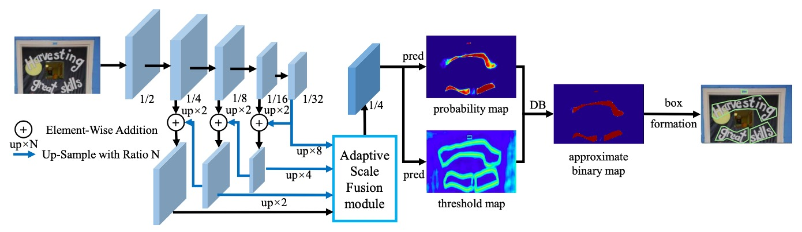
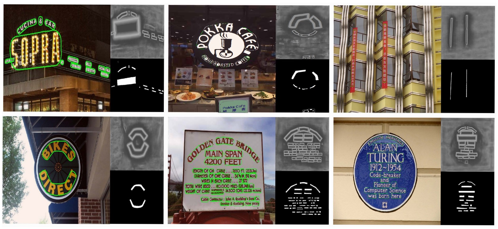

## Adaptive Feature Fusion

[**Real-Time Scene Text Detection with Differentiable Binarization and Adaptive Scale Fusion**](https://arxiv.org/abs/2202.10304)

---

When writing a literature review of the DBNet series, one question we’ve had is whether to refer to it as DB or DBNet. In the first version of the paper, there was no mention of DBNet, so other research papers simply referred to it as DB. However, in this latest paper, the authors explicitly call their model DBNet, so we will honor their naming convention and refer to this series as DBNet.

## Problem Definition

Following up on the previous DBNet paper, the authors recognized room for further improvement in the model. They proposed DBNet++, which builds upon the existing architecture by optimizing the way features are fused.

If you haven’t read the previous paper, we recommend doing so, as many of the repeated details are omitted here.

- [**[19.11] DBNet: Differentiable Binarization**](../1911-dbnet/index.md)

## Problem Solution

### Model Architecture

The overall architecture is almost identical to the first version, so we’ll skip directly to the modifications, specifically the **Adaptive Scale Fusion Module** section highlighted in the diagram.

### Adaptive Scale Fusion

The Adaptive Scale Fusion (ASF) module, as the authors refer to it, is a new module built upon the foundation of DBNet.

In the original design, different feature maps of varying scales were simply concatenated and then passed through a convolution layer for feature fusion before moving on to the prediction branch. The authors, however, realized that this process could be refined. Since features at different scales may have varying importance, the fusion stage should calculate the importance of each position in the image and use this information to determine the fusion degree of the different scale features.

Let’s follow the authors’ process step by step as shown in the image:

1. Input the feature map with dimensions `C x H x W`
2. The following steps describe the **Spatial Attention** part:
   1. Perform spatial average pooling to obtain a feature map with dimensions `1 x H x W`, representing the average importance across channels for each position.
   2. Pass this feature map through a convolution layer and a `Sigmoid` function to enhance its nonlinear representational capacity, expanding it back to `C` channels, with dimensions `C x H x W`.
   3. Add this feature map to the original feature map, obtaining a weighted feature map. After passing through another convolution and `Sigmoid`, convert the values to the range of `0~1` and compress the channels, outputting a `1 x H x W` feature map.
3. Returning to the **Adaptive Scale Fusion** section:
   1. Expand the channel count of the output from the previous step to `C x H x W`.
   2. Perform weighted fusion by multiplying these feature maps with the previously weighted feature map, resulting in the final fused feature map.

:::tip
This concept is quite similar to what we’ve seen before with SENet, the difference being that SENet applies weighting to channels, while here the weighting is applied spatially.

- [**[17.09] SENet: Squeeze and Excitation**](../../lightweight/1709-senet/index.md)

  
  :::

## Discussion

### Comparison with the Original DBNet

The authors conducted ablation experiments on the MSRA-TD500 and CTW1500 datasets, testing modules such as Differentiable Binarization (DB), Deformable Convolution, and Adaptive Scale Fusion (ASF).

Let’s focus on the key points highlighted in red, showing the effect after adding the ASF module.

Adding this module improved both Precision and Recall in most cases, with Recall showing a more significant improvement. This suggests that the ASF module leads to more false positives but also identifies more correct text regions.

Overall, F-measure increased by 2.3% on the MSRA-TD500 dataset and by 1.9% on the CTW1500 dataset, demonstrating the effectiveness of the ASF module.

### Visualization

## Conclusion

Much of the content in this paper is similar to the previous DBNet, so we won’t go over it in great detail again.

The Adaptive Scale Fusion module allows the model to automatically adjust the degree of fusion for features at different scales based on the input, and this design has proven effective in experiments. Although it slightly decreases inference speed, it results in around a 2% overall performance improvement, making it a worthwhile trade-off.
