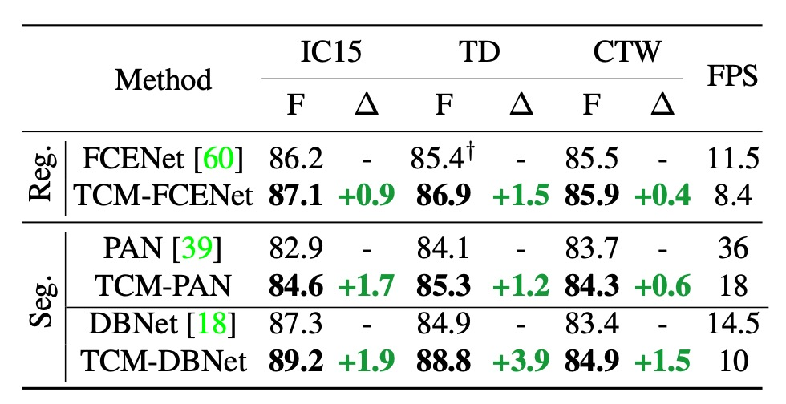
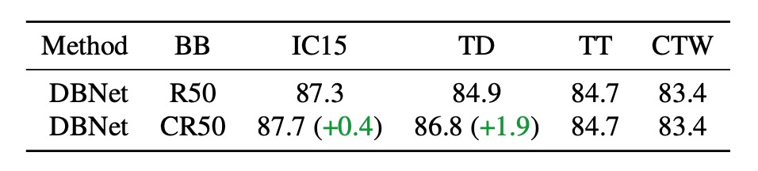
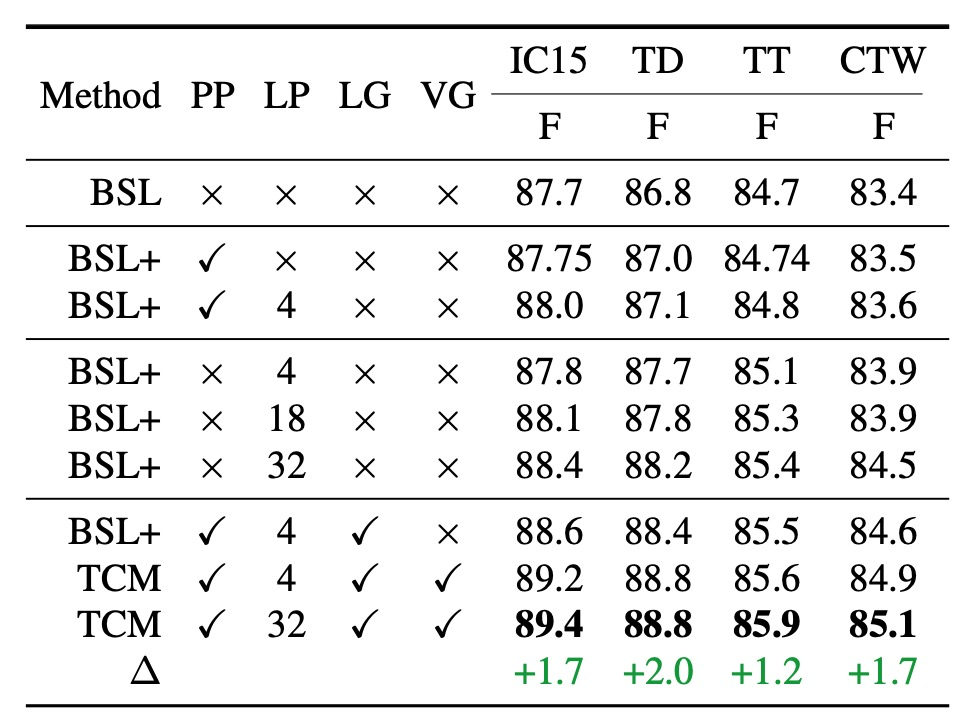
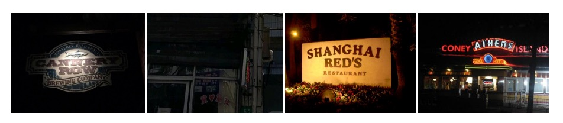

## Some rejoice while others grieve

[**Turning a CLIP Model into a Scene Text Detector**](https://arxiv.org/abs/2302.14338)

---

Contrastive learning has left a deep impression in many fields.

Naturally, researchers in text detection also want to join the wave.

## Defining the Problem

Multimodal applications are very popular, especially after the release of the CLIP model. Its simple concept has attracted researchers like a magnet.

Everyone is trying to apply pre-trained models to their own fields in order to ride the latest trend.

Wait! You said you still don’t know what CLIP is?

:::tip
We’ve already covered CLIP, and for readers who haven't encountered it yet, you can refer to our previous article:

- [**[21.03] CLIP: Breaking the Dimensional Barrier**](../../multimodality/2103-clip/index.md)
  :::

### CLIP

This chapter has been repeated several times, so let's briefly introduce CLIP again.

The diagram below shows the CLIP architecture:

Suppose we have a set of image-text pairs, one of which might be an image of a dog and the text "a cute little dog."

In a training batch, CLIP will receive multiple such pairs. The image encoder might use ResNet or ViT to process the image and extract features, while the text encoder might use Transformer to process the text and extract features.

Then, the model will compare these features to ensure the cosine similarity between correctly matched images and text (for example, the image of the dog and the text "a cute little dog") is maximized, while the cosine similarity between incorrectly matched images and text (for example, the image of the dog and the text "an apple") is minimized.

Finally, the model is trained using 400 million image-text pairs.

### Multimodal Neurons

Shortly after CLIP was released, OpenAI conducted some research on the CLIP model and discovered some interesting phenomena.

:::info
The original paper can be found here:

- [**[21.03] Multimodal Neurons in Artificial Neural Networks**](https://distill.pub/2021/multimodal-neurons/)

This article provides deeper insights into the inner workings of multimodal models and inspires researchers to think further. We highly recommend readers check it out!
:::

In this paper, it was pointed out that CLIP's neurons have specialized functions, such as neurons responsible for processing emotions or those responsible for geographic locations.

One of the figures related to text is shown below. Let’s take a look:

<figure style={{"width": "90%"}}>

</figure>

The far-left image is the original image input, and the model doesn’t show any errors; it correctly recognizes the content of the image.

But from the second image onward, things get interesting.

In the subsequent inputs, text interference is overlaid, such as a block of text saying "ipad" or "pizza." We were surprised to discover that:

- **The model gets misled!**

When text appears in the image, the model prioritizes recognizing the text rather than the image, which is very counterintuitive!

:::tip
Intuitively, we might think the text block is very small, occupying only a "tiny" portion of the image's pixel values. Surely the model shouldn’t be influenced by such a small area, right?
:::

### So What Should We Do?

OpenAI researchers considered this a serious issue because it means the CLIP model is too sensitive to text. In real-world applications, it could be vulnerable to attacks.

Malicious behavior can manipulate the model's recognition results through text interference, leading to incorrect (but advantageous to the attacker) outcomes. Therefore, for OpenAI, the challenge is to overcome text attacks and prevent text from easily influencing the final image recognition results.

But for text detection researchers:

- **This is not a bug, this is a feature!**

It turns out that CLIP is a model inherently friendly to text, which is great news for both text detection and recognition fields!

So, not only should we use it, but we should use it to the fullest!

## Solving the Problem

To effectively leverage the pre-trained knowledge from CLIP, there have been many studies in the past literature, with CoOp being one of the more famous examples.

:::tip
Here are two consecutive papers for readers unfamiliar with CoOp:

- [**[21.09] CoOp: Whispering in the Wind**](../../model-tuning/2109-coop/index.md)
- [**[22.03] CoCoOp: Read the image first**](../../model-tuning/2203-cocoop/index.md)

:::

In simple terms, the image is fed into the image branch of CLIP to extract image features; then, the prompt text is fed into the text branch to extract text features. This method transfers CLIP's knowledge and applies it to text detection tasks.

The image branch doesn’t require much modification, as the image is just an image with little room for changes. However, the text branch is where the real work happens. The task of knowledge transfer, as mentioned earlier, is accomplished through the text branch.

In the CoCoOp study referenced earlier, researchers used image features to generate prompts for the text branch, enhancing its performance through adaptive prompt learning. This technique has been widely applied in subsequent studies.

In this article, the authors also propose a model architecture based on this technique to extract knowledge from CLIP.

### Model Architecture

<figure style={{"width": "90%"}}>

</figure>

The model architecture is named TCM by the authors, which might seem a bit complex, but let's break it down step by step:

First, the authors use CLIP's pre-trained ResNet50 as the image encoder to map the input image $I_0 \in \mathbb{R}^{H \times W \times 3}$ to the embedding vector $I \in \mathbb{R}^{\tilde{H} \times \tilde{W} \times C}$, where:

$$
\tilde{H} = \frac{H}{s}, \quad \tilde{W} = \frac{W}{s}, \quad C = 1024, \quad s = 32
$$

The formula is represented as follows:

$$
I = \text{ImageEncoder}(I_0)
$$

:::tip
The above formula simply describes the process of the image being passed through ResNet and downsampled five times. If the mathematical description here is difficult for you, it might be helpful to review some basic CNN concepts.
:::

### Language Prompt Generator

This is the `Language Prompt Generator` in the diagram above.

In the previous step, we obtained the image features.

Next, we need to activate the knowledge in the text branch. Based on CoOp’s inspiration, we add learnable prompts $\{c_1, \dots, c_n\}$ to the input of the text encoder to enhance the transfer ability of the text embeddings. The formula is as follows:

$$
t_\text{in} = [c_1, \dots, c_n, t_\text{in}^0] \in \mathbb{R}^{(n+1) \times D}
$$

The language prompt generator uses the image features $I$ obtained earlier to generate the prompt $cc$, as shown in the following formula:

$$
cc = \text{LN}(\sigma(\text{LN}(\bar{I})W_1 + b_1))W_2 + b_2 \in \mathbb{R}^D
$$

Where $W_1 \in \mathbb{R}^{C \times C}, W_2 \in \mathbb{R}^{C \times D}, b_1 \in \mathbb{R}^C, b_2 \in \mathbb{R}^D$.

:::tip
This mathematical expression is read as:

1. The image features $I$ are passed through a linear transformation $W_1$, followed by adding bias $b_1$, then through Layer Normalization (LN) and Sigmoid functions.
2. The result is then passed through another linear transformation $W_2$, followed by adding bias $b_2$, and finally producing the prompt $cc$.
   :::

### Text Encoder

The frozen CLIP pre-trained text encoder is used in the paper, and the predefined prompt is set as "Text."

The text encoder embeds the predefined single-class prompt into the continuous vector space, as shown in the formula below:

$$
t_\text{in}^0 = \text{WordEmbedding}(\text{Text}) \in \mathbb{R}^D
$$

Where $D = 512$.

Finally, the prompt and text embeddings are combined to get the final text embedding $t_\text{out}$:

$$
t_\text{out} = \text{TextEncoder}(t_\text{in}) \in \mathbb{R}^C
$$

### Visual Prompt Generator

This refers to the `Visual Prompt` part in the diagram above.

Here, a Transformer cross-attention mechanism is used to learn the visual prompt $\tilde{I}$, which conveys information from the image level to the text instance level, as shown in the formula:

$$
\tilde{I} = \text{TDec}(Q = I, K = t_\text{out}, V = t_\text{out}) \in \mathbb{R}^{\tilde{H} \times \tilde{W} \times C}
$$

The image embedding is then adjusted by the prompt as follows:

$$
\hat{I} = I + \tilde{I}
$$

After this step, the `Locality Embeddings` in the diagram are obtained.

:::tip
The query is the image features $I$, while the keys and values are the text features $t_\text{out}$. This design is meant to enable the image features to "perceive" and "merge" with the text prompt.
:::

### Example - Language Matching

The text embedding $t_\text{out}$ is matched with the adjusted image embedding $\hat{I}$ through dot-product and Sigmoid activation, generating a binary segmentation map $P$:

$$
P = \text{sigmoid}\left(\frac{\hat{I} t_\text{out}^\top}{\tau}\right) \in \mathbb{R}^{\tilde{H} \times \tilde{W} \times 1}
$$

The binary cross-entropy loss (BCE Loss) between the segmentation map and the ground truth $y_{ij}$ is:

$$
L_\text{aux} = \sum_{i=1}^{\tilde{H}} \sum_{j=1}^{\tilde{W}} \left[y_{ij} \log(P_{ij}) + (1-y_{ij}) \log(1-P_{ij})\right]
$$

The total loss function is:

$$
L_\text{total} = L_\text{det} + \lambda L_\text{aux}
$$

Where $\lambda = 1$, and $L_\text{det}$ is the detection loss based on the detection method.

During the inference phase, the output of the detection head is the final result.

### Training Strategy

Experiments were conducted using popular text detection methods, including **DBNet (DB)**, **PAN**, and **FCENet (FCE)**. To maintain consistency in setup, the detectors were trained on both **SynthText** and real datasets. Unless stated otherwise, the backbone uses the pre-trained image encoder ResNet50 from CLIP.

The visual prompt generator consists of 3 layers of Transformer decoders, utilizing 4 attention heads, with a Transformer width of 256 and a feedforward hidden layer dimension set to 1024. The detection head uses the corresponding detection heads from DBNet, PAN, and FCENet to predict the final results.

Evaluation metrics use Intersection over Union (IoU) to determine whether the model correctly detects text regions, and precision, recall, and F1 score are calculated for comparison. To ensure a fair comparison, during training and testing, regions labeled as "do not care" or "###" in all datasets are ignored.

## Discussion

### Integration with Existing Methods

<figure style={{"width": "80%"}}>

</figure>

The authors initially define TCM as a modular model that can be integrated with existing text detection methods. The table above reports the results of combining TCM with three text detection methods on the IC15, TD, and CTW datasets:

- **F1 Score Improvement**: TCM outperforms the original FCENet, PAN, and DBNet on the IC15 dataset by +0.9%, +1.7%, and +1.9%, respectively. Similar stable performance improvements were observed on the TD and CTW datasets.
- **Inference Speed**: On the IC15, TD, and CTW datasets, TCM combined with PAN, FCENet, and DBNet achieved 18 FPS, 8.4 FPS, and 10 FPS, respectively, maintaining high efficiency in the detectors.

:::tip
We believe the impact of inference speed is still significant, and the paper's claim of "maintaining" high efficiency may be somewhat optimistic.
:::

### Pretrained CLIP Backbone

<figure style={{"width": "80%"}}>

</figure>

The first test involved replacing the original backbone network of DBNet with CLIP's pre-trained image encoder, ResNet50, to quantify the impact of the backbone network on performance. In the table above, `CR50` refers to using the CLIP image branch, while `R50` refers to using the original DBNet backbone network.

The results show that simply using CLIP's original pre-trained model does not fully leverage CLIP's vision-language knowledge, with performance being similar to that of the original DBNet backbone.

:::tip
Don't blindly use CLIP.
:::

### Effectiveness of Model Components

<figure style={{"width": "70%"}}>

</figure>

Let's first understand the abbreviations in the table above:

- **BSL**: DBNet Baseline.
- **PP**: Predefined Prompt.
- **LP**: Learnable Prompt.
- **LG**: Language Prompt Generator.
- **VG**: Visual Prompt Generator.
- **TCM**: Full Model Configuration.

---

When using predefined prompts (second row in the table), performance slightly improved across the four datasets (IC15, TD, TT, CTW), with improvements of 0.05%, 0.2%, 0.04%, and 0.1%, respectively, compared to the baseline method.

When combining learnable prompts with predefined prompts (third row), learnable prompts consistently lead to performance improvements.

:::tip
The number of learnable prompts can be freely set. The tests used 4, 18, and 32 different prompts, and the results showed that the more prompts, the better the performance.
:::

Compared to using 4 prompts, when the number was increased to 32, performance significantly improved across datasets. This could be because more learnable prompts better guide the pre-trained text encoder's knowledge, aiding text detection. To simplify later experiments, the default number of learnable prompts was set to 4.

---

The authors also evaluated the performance of the language prompt generator (seventh row in the table).

With the help of the language prompt generator, TCM's performance improved further across the four datasets, particularly on ICDAR2015, indicating that the conditional cues generated by the language prompt generator ensure better generalization across different dataset types.

---

When combining the visual prompt generator with other components, the F1 score was higher across all four datasets compared to the baseline, with the most significant improvements on the IC15 and TD datasets, at 1.7% and 2.0%, respectively.

This clear complementary effect arises because the visual prompt generator can propagate fine-grained visual semantic information from the text features.

Additionally, the local image embeddings generated by the visual prompt generator help guide the model to obtain more accurate text instance-level visual representations, enhancing the instance-language matching capability and producing precise segmentation maps that aid the downstream detection head.

### Ablation Experiment on VG and LG's Generalization Performance

Removing the visual prompt generator (VG) and language prompt generator (LG) from TCM results in a significant drop in generalization performance, further proving the effectiveness of VG and LG.

### Frozen Encoder Experiment

<figure style={{"width": "70%"}}>

</figure>

Generally, when using CLIP, to preserve the original knowledge of the model, we freeze the text encoder and only train the image encoder. Here, the authors adjusted the learning rate factors for the image and text encoders to study the impact of freezing the encoders on performance.

The results show that using a lower learning rate and freezing the text encoder yields the best model performance.

### Increasing Training Data

To further investigate whether TCM can learn additional knowledge that is difficult to acquire just by adding more data, the authors conducted the following experiment:

- **Training Data**: The model was trained using large-scale public datasets, including IC13, IC15, TD, CTW, TT, and MLT17, with a total of 13,784 images.
- **Test Data**: The model was tested on night-time data carefully collected from ArT (326 images). A sample of the night-time data is shown in the image below.
  

The experimental results are shown in the table below:

<figure style={{"width": "70%"}}>

</figure>

Even with the addition of a large amount of training data, existing methods still show limitations when dealing with night-time data that is clearly different from the training set's distribution. TCM, however, performs robustly in this situation, demonstrating irreplaceable generalization ability.

### Increasing Parameter Count

<figure style={{"width": "70%"}}>

</figure>

For a fair comparison, the authors increased the parameter count of DBNet by replacing the backbone with a larger ResNet and conducted experiments on the TD500 dataset:

TCM-DBNet outperformed DBNet, which has a larger parameter count and computational overhead, indicating that TCM offers more efficient performance for scene text detection tasks.

### Impact of Auxiliary Loss

<figure style={{"width": "70%"}}>

</figure>

Finally, the authors compared the results with and without using auxiliary loss on the TD500 dataset:

The results show that models using auxiliary loss performed better. The auxiliary loss, by imposing constraints on the instance-language matching score map, helps improve the model's training performance.

### Cross-Dataset Generalization

<figure style={{"width": "70%"}}>

</figure>

The authors tested the generalization ability of TCM on different datasets. The table above shows the transfer experiment results between real datasets, demonstrating that TCM outperforms baseline methods across different datasets.

## Conclusion

Everyone wants to use CLIP to enhance their models, and this paper serves as an excellent example.

The paper introduces the TCM method, which can directly extract prior knowledge from the CLIP model and apply it to scene text detection without requiring pre-training, establishing a new paradigm for text detection.

Although the performance improvement of TCM in the current experiments is not very significant, the cross-dataset generalization experiments show that pre-trained multimodal models can provide broader knowledge, which helps improve the model's generalization ability.

Overall, TCM offers a valuable direction and idea for future research.
