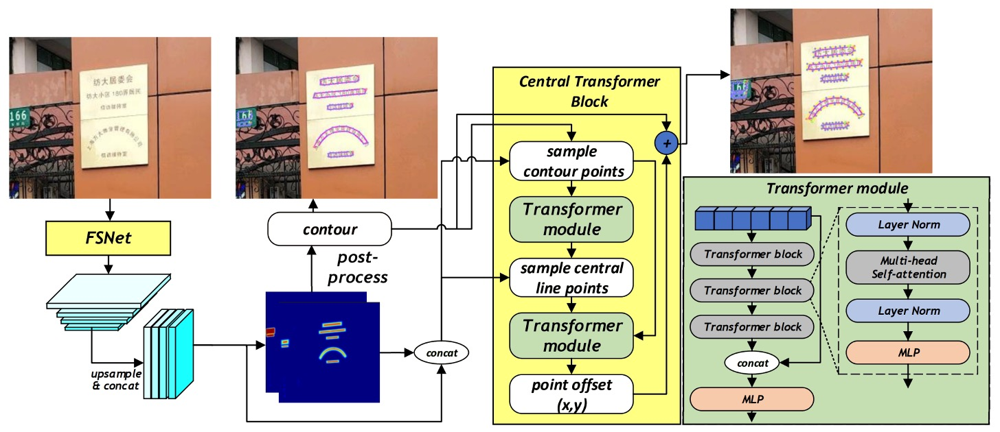
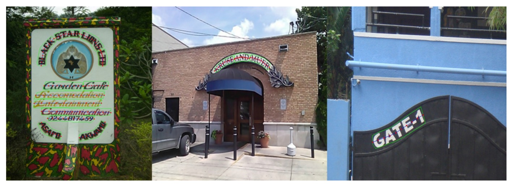

## Multi-scale Shuffle Network

[**MixNet: Toward Accurate Detection of Challenging Scene Text in the Wild**](https://arxiv.org/abs/2308.12817)

---

As the performance on validation datasets approaches saturation, the key to success lies in the accuracy of the final text control points.

Background noise might be a problem that must be addressed.

## Problem Definition

When detecting text in natural scenes, text blocks often appear in arbitrary shapes and orientations. In small and curved text instances, traditional convolutional neural network-based detection methods are easily disturbed by localized noise and variations in image quality, making it difficult to stably and accurately capture the global geometric distribution characteristics of the text.

The authors believe the issue here lies in existing methods focusing on local image features, ignoring the global information about the overall text's geometric distribution. As a result, when facing small, curved text or interference from lighting and background noise, the robustness of detection significantly decreases.

Additionally, in commonly used backbone networks (such as ResNet, VGG, HRNet), when providing high-resolution features, it is difficult to extract clear and easily measurable information due to noise interference, which is especially unfavorable for small text instances.

Therefore, the core problem the authors aim to solve is how to "maintain the intercommunication between high and low-resolution features" to reduce the negative impact of noise interference on high-resolution features.

## Solution

### Model Architecture

<figure style={{"width": "90%"}}>

</figure>

To solve the problem of feature communication, most CNN architectures heavily rely on local convolution operations and lack effective cross-scale feature communication channels, making it difficult to fully utilize the noise suppression ability of low-resolution features.

In this paper, the authors propose a new network structure that combines the Backbone and Neck parts, allowing high- and low-resolution features to interweave and jointly produce more robust, fine, and noise-resistant representations. This structure is called "Feature Shuffle Network," abbreviated as FSNet.

Another part of the system is based on the features generated by FSNet to refine the control points of text instances. This part is called the "Central Transformer Block."

Let’s first look at the structure of FSNet.

### Feature Shuffle Network

<figure style={{"width": "80%"}}>

</figure>

At first glance, this structure may seem a bit complicated, but it is actually based on a simple concept. Let's break it down:

- **Red box part**: This corresponds to the feature extraction part of the Backbone network, which includes several stages of downsampling processes.
- **Blue box part**: This corresponds to the feature extraction part of the Neck network, where the feature shuffle operation is implemented.

The method is to split the feature channels of each resolution, remix them, upsample/downsample, and finally concatenate them into new features.

Through this mixing and reshuffling, the model can more efficiently leverage the advantages of features at different scales, producing more recognizable features for small, curved, and low-quality text. The detailed operation is shown in the figure below:

<figure style={{"width": "40%"}}>

</figure>

In FSNet, two shuffle layers are designed. The first shuffle layer receives input features from two scales, while the second shuffle layer receives input features from three scales.

Taking the second shuffle layer as an example, suppose we have three sets of input features, $F_1, F_2, F_3$, where $F_i$ represents the feature at the $i$th resolution. The shuffle layer splits the channels of each feature into three equal parts, i.e., $F_i$ is divided into $F_{i1}, F_{i2}, F_{i3}$.

Then, based on the resolution index corresponding to each part, the features $F_{i1}, F_{i2}, F_{i3}$ are upsampled or downsampled to a uniform size. Finally, the feature parts from different resolutions and re-scaled at different rates are concatenated into a new feature representation.

In this way, the original single-resolution features are "shuffled" into new features that mix multiple resolution information.

:::tip
It’s quite similar to what we saw in ShuffleNet:

- [**[17.07] ShuffleNet: Channel Shuffling Network**](../../lightweight/1707-shufflenet/index.md)

    

    <figure style={{"width": "80%"}}>
    
    </figure>
    

If you remember, in ShuffleNet, after performing "group convolution," the channels of each group’s feature map are shuffled. Here in MixNet, the idea is modified to shuffle feature maps at different resolutions, with a very similar design philosophy.
:::

### Central Transformer Block

<figure style={{"width": "70%"}}>

</figure>

Let's break down the architecture diagram and isolate the CTBlock part to examine its operation flow:

1. **Contour Points**:

   Initially, CTBlock uses the heatmap generated by FSNet to obtain a rough boundary of each text instance. Then, it samples N evenly spaced points (with N=20 in the experiment) along the boundary as the text contour representative points. The image features of these points, along with the corresponding heatmap values, form a feature sequence that is fed into the first Transformer module.

2. **Central Points**:

   After the first Transformer module, a feature point sequence representing the central line of the text region is obtained (the number of central line points is fixed at C=10). Similarly, the image features corresponding to these central line points and their heatmaps form another feature sequence.

3. **Transformer Encoder-Decoder**:

   The Transformer used in CTBlock adopts an encoder-decoder structure. The Encoder contains multiple transformer blocks, each with multi-head self-attention and MLP, allowing the feature sequence to learn the overall geometric distribution of the text contour and central line points through global attention mechanisms. The Decoder consists of a simple MLP that predicts the vertex offset for each contour point based on the features extracted by the encoder, thus generating more accurate final text contours.

The correspondence between contour and central points is shown in the figure below:

<figure style={{"width": "90%"}}>

</figure>

:::tip
Please note that the Transformer output is the "Offset," not the direct contour point positions. This design allows the model to more easily learn the subtle changes in the contour points and is more easily scalable to text of various shapes.

Thus, in the figure above, you will see that the model output must be added to the original contour points to obtain the final contour point positions.
:::

### Implementation Details

- **Backbone:** FSNet
- **Pre-training:** The model is trained for 5 epochs on the SynthText dataset using the Adam optimizer, with a fixed learning rate of 0.001.
- **Fine-tuning:** The model is trained for 600 epochs on Total-Text, ArT, and other datasets.
- **Training Environment:** Python3, PyTorch 1.10.2, RTX-3090 GPU
- **Input Image Size:** 640 × 640
- **Data Augmentation:** Random rotation (−30° to 30°), random cropping, random flipping, color jittering

## Discussion

### Effectiveness of FSNet

The main focus of this paper is FSNet, so let’s first see if FSNet actually works.

<figure style={{"width": "90%"}}>

</figure>

The authors first classify the text into small, medium, and large categories based on size and compare the detection performance of FSNet with other commonly used backbone networks (such as ResNet50) on a noise-free dataset.

The results show that FSNet achieves significant improvement in detecting "small and medium" text. This improvement is mainly attributed to the exchange mechanism between high- and low-resolution features in the FSNet architecture, which reduces the noise interference in high-resolution features, allowing the model to better capture the contours and shape features of small text.

In addition, to validate FSNet's robustness against noise, the authors add specific ratios of impulse noise to the test data and compare the detection performance of FSNet and ResNet50 under noise-free, 5% noise, and 10% noise conditions.

Although noise degrades the performance of all models, FSNet still demonstrates better robustness. In the noise-free case, FSNet's F1-score is 2.1% higher than ResNet50, and under 5% and 10% noise, the improvement reaches 4.5% and 6.0%, respectively.

Finally, for generalization improvement, the authors replace the backbone network in existing text detection methods with FSNet, including DB, PAN, and FAST architectures, with results shown in the table below:

<figure style={{"width": "60%"}}>

</figure>

After replacing the original backbone networks of these methods with FSNet, both DB and PAN's F1-scores increased by about 1.5%, and FAST's increased by about 1.8%. This result shows that FSNet not only improves recognition ability independently but also effectively enhances the detection performance of various existing methods when used as a backbone network.

:::tip
If you're interested in the other network architectures mentioned above, you can refer to our previous articles:

- [**[19.08] PAN: Pixel Aggregation Strategy**](../1908-pan/index.md)
- [**[19.11] DBNet: Differentiable Binarization Function**](../1911-dbnet/index.md)
- [**[21.11] FAST: Quick as a Flash**](../2111-fast/index.md)
  :::

### Ablation Study

<figure style={{"width": "60%"}}>

</figure>

Next, the authors validate the effectiveness of each design. Here, we see the results of an ablation study using the Total-Text dataset, with ResNet50 as the baseline model for comparison.

The results show that FSNet achieves a 2.1% improvement in F1-score. Furthermore, after introducing the central line features in CTBlock, there is an additional improvement of 0.5%.

### Comparison with Other Methods

<figure style={{"width": "60%"}}>

</figure>

The table above shows the comparison results for multi-directional text detection on the MSRA-TD500 dataset. It can be seen that MixNet achieves an F1-score of 89.4%, which is 2.1% higher than other methods, confirming its superior performance in multi-language and multi-directional text detection scenarios.

<figure style={{"width": "60%"}}>

</figure>

Next, we look at the comparison for arbitrary-shaped text detection on the Total-Text dataset, as shown in the table above.

MixNet achieves an F1-score of 90.5% on Total-Text, 1.5% higher than TextFuseNet.

### Visualization Results

<figure style={{"width": "90%"}}>

</figure>

## Conclusion

The MixNet architecture proposed in this paper, with FSNet and the CTBlock modules as the core, successfully solves the issue of high-resolution features being easily affected by noise during the traditional multi-scale feature fusion process. It also significantly improves the detection accuracy for small, curved, and low-quality text.

The experimental results also confirm that FSNet can be easily integrated into different architectures and effectively improve their overall detection performance.

:::tip
The implementation of this paper is not particularly difficult, but after adding FSNet, the inference speed slows down by about 30%. When applying it, we still need to consider the balance between speed and accuracy.
:::
